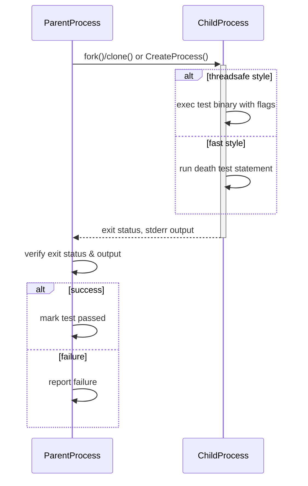

# Death Tests

GoogleTest provides a specialized mechanism known as **death tests** to ensure your program correctly handles fatal error scenarios by terminating as expected. These tests validate conditions where the code is supposed to crash or exit prematurely, such as assertion failures or explicit calls to `exit()`.

Effective death testing is crucial for verifying robustness in the face of invalid inputs, internal consistency checks, or catastrophic failures.

---

## What Are Death Tests?

Death tests confirm that a particular piece of code causes the process to *terminate*—meaning it either crashes or explicitly calls exit.

Unlike normal tests, which check return values or state changes, death tests validate that unsafe or invalid operations properly kill the program to prevent undefined behavior or corruption.

---

## Key Concepts

- **Death test statement:** The code snippet expected to terminate.
- **Exit status predicate:** Defines what exit code or signal is acceptable.
- **Output matcher:** Validates that the program writes expected text (usually to `stderr`) before termination.
- **Child process:** Death tests execute the statement in a separate process to isolate failure.

---

## How Death Tests Work Internally

When running a death test macro, GoogleTest:

1. Verifies that only a single thread is active, warning otherwise since forking with multiple threads is unsafe.
2. Forks or spawns a child process.
3. Runs the death test code in the child.
4. Waits for the child's termination.
5. Checks if the child died as expected—matching exit status and error output.

Two distinct execution styles exist, controlled by the `--gtest_death_test_style` flag:

- **`"fast"` style:** The child process immediately executes the death test after forking.
- **`"threadsafe"` style:** The child process *re-executes* the entire test binary with special flags that run only the targeted death test, improving stability in multi-threaded environments.

By default, GoogleTest uses the `fast` style, but `threadsafe` is recommended in complex threaded scenarios.

---

## Writing Death Tests

To write death tests in your test suite, use the following macros:

### ASSERT_DEATH(statement, matcher)

Assert that `statement` causes the program to terminate with a nonzero exit status, and that any data written to `stderr` matches the regular expression or matcher `matcher`.

If the test fails, the current test aborts immediately.

```cpp
ASSERT_DEATH(server.SendMessage(56, "Hello"), "Invalid port number");
```

### EXPECT_DEATH(statement, matcher)

Like `ASSERT_DEATH`, but the test continues if the assertion fails.

```cpp
for (int i = 0; i < 5; i++) {
  EXPECT_DEATH(server.ProcessRequest(i), "Invalid request .* in ProcessRequest()")
      << "Failed to die on request " << i;
}
```

### ASSERT_EXIT(statement, predicate, matcher)

Verify that `statement` causes an exit satisfying `predicate` (a function or functor checking the child's exit status) and that the `stderr` output matches `matcher`.

```cpp
ASSERT_EXIT(server.ExitNow(), testing::ExitedWithCode(0), "Exiting");
```

### EXPECT_EXIT(statement, predicate, matcher)

Like `ASSERT_EXIT` but non-fatal failure on mismatch.

### EXPECT_DEATH_IF_SUPPORTED and ASSERT_DEATH_IF_SUPPORTED

Macros that only execute death tests if death tests are supported on the platform, otherwise generate a warning.

### EXPECT_DEBUG_DEATH and ASSERT_DEBUG_DEATH

Macros like the death test macros, but assertions apply only in debug mode (`NDEBUG` not defined). In release mode, statements execute normally without causing failures.

---

## Exit Status Predicates

GoogleTest provides convenient predicates to check the exit status:

- **`ExitedWithCode(exit_code)`**
  Checks that the program exited normally with the given code.

- **`KilledBySignal(signal_number)`** (POSIX only)
  Checks that the program was terminated by a specific signal.

Use these in `ASSERT_EXIT` or `EXPECT_EXIT`:

```cpp
EXPECT_EXIT(KillProcess(), testing::KilledBySignal(SIGKILL), "Sending unblockable signal");
```

---

## Output Matcher

The final argument to death test macros is used to match the output generated by the child process on `stderr`. It accepts:

- A string interpreted as a regular expression (using POSIX extended regex on Unix, or a simplified regex syntax on Windows/macOS).
- A GoogleTest matcher for `const std::string&` (e.g., `ContainsRegex`, custom matchers).

**Supported Regex Syntax:**

On Windows, macOS, and others, the regex syntax supported is a limited subset of POSIX extended regex. Supported constructs include:

| Expression | Meaning                                   |
|------------|-------------------------------------------|
| `c`        | Matches literal character `c`             |
| `\d`      | Matches decimal digit                      |
| `\D`      | Matches non-digit                          |
| `.`        | Matches any character except `\n`        |
| `A?`       | Matches zero or one occurrences of `A`   |
| `A*`       | Matches zero or more occurrences of `A`  |
| `A+`       | Matches one or more occurrences of `A`   |
| `^`        | Matches start of string                    |
| `$`        | Matches end of string                      |
| `xy`       | Matches `x` followed by `y`               |

Unsupported features include unions (`x|y`), grouping `()`, bracket expressions `[]`, and repetition counts `{m,n}`.

---

## Practical Examples

```cpp
// Assert that calling Foo with bad input crashes with an error mention.
TEST(MyDeathTest, InvalidInput) {
  ASSERT_DEATH(Foo(-1), "Invalid argument");
}

// Expect the program terminates with exit code 0 and outputs "Success".
TEST(MyDeathTest, NormalExit) {
  EXPECT_EXIT(NormalExit(), testing::ExitedWithCode(0), "Success");
}

// Check a signal-based death.
TEST(MyDeathTest, TerminatedBySignal) {
  EXPECT_EXIT(KillProcess(), testing::KilledBySignal(SIGKILL), "Trying to kill");
}
```

---

## Important Guidelines and Best Practices

### Test Suite Naming

Name test suites containing death tests with the suffix `DeathTest` to ensure they run before other tests. This practice helps mitigate issues caused by multi-threading and fork interactions.

```cpp
class FooDeathTest : public testing::Test { ... };

TEST_F(FooDeathTest, CrashesOnInvalidInput) { ... }
```

### Threading Considerations

Forking in multi-threaded environments can cause deadlocks or hangs. GoogleTest warns if multiple threads are detected when a death test is run.

Use `--gtest_death_test_style=threadsafe` for improved reliability on multi-threaded applications.

### Statement Restrictions

Avoid `return` statements or exceptions inside the death test statement. If these occur, the death test will fail as it expects abrupt termination.

Don't use other GoogleTest fatal assertions (`ASSERT_*`) inside death test statements because if the assertion aborts via return, the death test may incorrectly report a failure.

### Side Effects are Local

Any in-memory side effects in the death test happen only in the child process and do not affect the parent.

If you need to verify side effects, consider alternative test approaches.

### Memory and Leak Checks

Avoid explicitly releasing or deleting memory within death test statements to prevent false leak reports because the child process terminates unexpectedly.

---

## Advanced Control

### Setting the Death Test Style

You can programmatically control the death test style globally or per-test:

```cpp
int main(int argc, char** argv) {
  testing::InitGoogleTest(&argc, argv);
  GTEST_FLAG_SET(death_test_style, "threadsafe");
  return RUN_ALL_TESTS();
}

TEST(MyDeathTest, SomeTest) {
  GTEST_FLAG_SET(death_test_style, "fast");
  ASSERT_DEATH(Foo(), "error");
}
```

### Handling Unsupported Platforms

If the platform does not support death tests, GoogleTest provides `EXPECT_DEATH_IF_SUPPORTED` and `ASSERT_DEATH_IF_SUPPORTED` which gracefully bypass death testing.

---

## Troubleshooting Death Tests

- **Test hangs:** Usually caused by multi-threading at the time of forking. Try reducing thread count or switch to `threadsafe` mode.
- **Unexpected pass:** Ensure the death test statement actually triggers fatal termination.
- **Regex match failure:** Confirm the error output matches the regex/matcher provided exactly, using the supported regex syntax.
- **Multiple death tests on one line:** This causes compilation errors; place each death test macro on a separate line.

Refer to the [Death Tests and Threads](https://github.com/google/googletest/blob/main/docs/advanced.md#death-tests-and-threads) and [Common Pitfalls](https://github.com/google/googletest/blob/main/docs/faq.md#My-death-test-hangs) sections for more guidance.

---

## Minimal Mermaid Diagram of Death Test Workflow



---

## Additional Resources

- [Assertions Reference - Death Assertions](https://github.com/google/googletest/blob/main/docs/reference/assertions.md#death)
- [Advanced Topics - Death Tests](https://github.com/google/googletest/blob/main/docs/advanced.md#death-tests)
- [GoogleTest Primer](https://github.com/google/googletest/blob/main/docs/primer.md)

---

## Summary

Death tests in GoogleTest validate that certain code paths terminate the program as expected due to conditions like fatal errors or explicit exits. Using the provided macros, users can specify statements that should cause termination, assert on the exit status or signal, and verify error output via regex or matchers. With configurable styles (fast or threadsafe), GoogleTest offers robust handling across platforms and threading models, accompanied by pragmatic guidance for writing, debugging, and maintaining death tests effectively.
