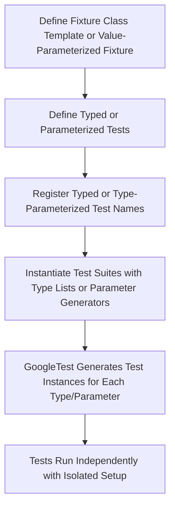

# Parameterized & Typed Tests

GoogleTest empowers you to write scalable, reusable tests by enabling parameterization over values and types. This chapter walks you through the systematic use of value-parameterized tests, typed tests, and type-parameterized tests, focusing on improving test coverage and code maintainability without duplication.

---

## Value-Parameterized Tests

Value-parameterized tests let you run the same test logic with different data inputs, simplifying testing across multiple values. This approach is invaluable when verifying that your code behaves correctly with a variety of inputs.

### Defining Value-Parameterized Tests

1. **Create a Test Fixture**

Derive your fixture from `testing::TestWithParam<T>` where `T` is the type of parameter values you want to test. This fixture provides the infrastructure to access test parameters.

```cpp
class FooTest : public testing::TestWithParam<std::string> {
  // Additional fixture setup here.
};
```

2. **Write Test Cases Using `TEST_P` Macro**

Define test cases using the `TEST_P` macro. Access the parameter for each test instance via the `GetParam()` method:

```cpp
TEST_P(FooTest, HandlesVariousInputs) {
  std::string param = GetParam();
  EXPECT_TRUE(ValidateInput(param));
}
```

3. **Instantiate the Test Suite With Parameters**

Use `INSTANTIATE_TEST_SUITE_P` macro to generate test instances for your test fixture with the specified parameter list. You can use built-in parameter generators or custom ranges.

```cpp
INSTANTIATE_TEST_SUITE_P(
    StringInputs,
    FooTest,
    testing::Values("alpha", "beta", "gamma")
);
```

#### Available Parameter Generators

- `Values(v1, v2, ..., vN)`: Enumerate explicit values.
- `ValuesIn(container)`: Use an existing container or array.
- `Range(begin, end[, step])`: Generate a sequence of values.
- `Bool()`: Generate `false` and `true` values.
- `Combine(g1, g2, ..., gN)`: Cartesian product of multiple generators.
- `ConvertGenerator<T>(gen[, func])`: Converts generated parameters to a different type using static cast or a supplied function.

### Customizing Parameter Names

You can provide a function or functor to generate meaningful custom test names based on parameters, improving test output readability:

```cpp
INSTANTIATE_TEST_SUITE_P(
    CustomNames, FooTest, testing::Values("x", "y"),
    [](const testing::TestParamInfo<std::string>& info) {
      // Replace non-alphanumeric chars and return a string.
      std::string name = info.param;
      for (char& c : name) {
        if (!isalnum(c)) c = '_';
      }
      return name;
    });
```

### Best Practices & Tips

- Instantiate *all* tests in a suite to avoid unintentionally skipped tests.
- Use `GTEST_ALLOW_UNINSTANTIATED_PARAMETERIZED_TEST` to suppress errors for uninstantiated suites.
- Access test parameters via `GetParam()` exclusively inside `TEST_P` bodies.

---

## Typed Tests

Typed tests allow repetitive testing of the same test logic on a list of types. This is especially useful when multiple types conform to the same interface or concept.

### Defining Typed Tests

1. **Define a Fixture Template Class**

Your fixture class should be template-parameterized over a type, inheriting `testing::Test`:

```cpp
template <typename T>
class TypedTestFixture : public testing::Test {
 public:
  // Members and utilities using T
  using List = std::list<T>;
  static T shared_value_;
  T value_;
};

// Define static members outside the class
template <typename T>
T TypedTestFixture<T>::shared_value_ = T();
```

2. **Associate the Type List and Register with `TYPED_TEST_SUITE`**

Specify which types the test suite will run against:

```cpp
using MyTypes = testing::Types<int, double, std::string>;
TYPED_TEST_SUITE(TypedTestFixture, MyTypes);
```

3. **Define Typed Tests with `TYPED_TEST`**

Inside the test body, access the type parameter with the special name `TypeParam`:

```cpp
TYPED_TEST(TypedTestFixture, HasDefaultConstructor) {
  TypeParam instance = this->value_;
  EXPECT_TRUE(std::is_default_constructible<TypeParam>::value);
}
```

### Optional: Custom Type Names

Provide a `NameGenerator` class with a `GetName<T>(int index)` method to customize test names when printed:

```cpp
class MyTypeNames {
 public:
  template <typename T>
  static std::string GetName(int) {
    if constexpr (std::is_same_v<T, int>) return "Int";
    if constexpr (std::is_same_v<T, double>) return "Double";
    if constexpr (std::is_same_v<T, std::string>) return "String";
    return "Unknown";
  }
};

TYPED_TEST_SUITE(TypedTestFixture, MyTypes, MyTypeNames);
```

---

## Type-Parameterized Tests

Type-parameterized tests let you define *abstract* test suites without specifying the types upfront, then instantiate them later with different type sets. This improves reusability across libraries and modules.

### How to Define Type-Parameterized Tests

1. **Define the Fixture Template Class**

Similar to typed tests, define a template fixture class:

```cpp
template <typename T>
class AbstractTypeParamTest : public testing::Test {
 protected:
  void SomeHelper() { ... }
};
```

2. **Declare the Test Suite as Parameterized with `TYPED_TEST_SUITE_P`**

```cpp
TYPED_TEST_SUITE_P(AbstractTypeParamTest);
```

3. **Define Tests Using `TYPED_TEST_P`**

Inside test bodies, use `TypeParam` as the type parameter:

```cpp
TYPED_TEST_P(AbstractTypeParamTest, TestA) {
  TypeParam value{};
  EXPECT_TRUE(IsValid(value));
}

TYPED_TEST_P(AbstractTypeParamTest, TestB) {
  // Additional tests
}
```

4. **Register the Tests in the Suite**

You must register the names of all the tests you defined:

```cpp
REGISTER_TYPED_TEST_SUITE_P(AbstractTypeParamTest, TestA, TestB);
```

5. **Instantiate the Test Suite with Types**

Finally, instantiate with desired types using:

```cpp
using MyTypes = testing::Types<int, double>;
INSTANTIATE_TYPED_TEST_SUITE_P(MyInstantiation, AbstractTypeParamTest, MyTypes);
```

Multiple instantiations with different prefixes and type sets can be used in the same code.

### Benefits

- Defines abstract test patterns separate from specific types.
- Allows multiple independent instantiations if different modules want to specify their own type lists.
- Avoids redundancy when you want to enforce interface contracts across various implementations.

---

## Practical Example

```cpp
// Value-parameterized test example
class ValueParamTest : public testing::TestWithParam<MyType> {};

TEST_P(ValueParamTest, CanHandleStrings) {
  MyType value = GetParam();
  EXPECT_FALSE(value.value().empty());
}

INSTANTIATE_TEST_SUITE_P(
    MyInstantiation, ValueParamTest,
    testing::Values(MyType("one"), MyType("two"), MyType("long string...")));


// Typed test example
template <typename T>
class TypedTest : public testing::Test {};

using MyTypes = testing::Types<int, double>;
TYPED_TEST_SUITE(TypedTest, MyTypes);

TYPED_TEST(TypedTest, SupportsDefaultConstruction) {
  TypeParam value{};
  (void)value;  // Just test default construction
}


// Type-parameterized test example
template <typename T>
class TypeParamTest : public testing::Test {};

TYPED_TEST_SUITE_P(TypeParamTest);

TYPED_TEST_P(TypeParamTest, TestA) {
  TypeParam value{};
  EXPECT_TRUE(SomeCheck(value));
}

TYPED_TEST_P(TypeParamTest, TestB) {
  ...
}

REGISTER_TYPED_TEST_SUITE_P(TypeParamTest, TestA, TestB);

using MyTypes = testing::Types<int, double>;
INSTANTIATE_TYPED_TEST_SUITE_P(My, TypeParamTest, MyTypes);
```

---

## Troubleshooting & Common Pitfalls

- Make sure your value-parameter type is copyable.
- Parameters passed to `INSTANTIATE_TEST_SUITE_P` are evaluated during `InitGoogleTest()`.
- Every `TEST_P` must have a corresponding instantiation, or mark with `GTEST_ALLOW_UNINSTANTIATED_PARAMETERIZED_TEST` to silence warnings.
- For typed tests, always define and instantiate all type information consistently; mismatches cause runtime errors.
- Type-parameterized test definitions and instantiations must be separated into header and source files when reused across translation units.

---

## Visual Overview of Parameterized Test Generation Flow



---

## Additional Resources

- [GoogleTest Primer](primer.md) — For foundational knowledge
- [Value-Parameterized Tests](advanced.md#value-parameterized-tests)
- [Typed Tests](advanced.md#typed-tests)
- [Type-Parameterized Tests](advanced.md#type-parameterized-tests)
- [Testing Reference: TEST_P, TYPED_TEST, REGISTER_TYPED_TEST_SUITE_P](reference/testing.md)

---

## Summary
Use value-parameterized tests to run test logic with multiple explicit or ranged data inputs. Typed tests let you repeat tests across known type lists while type-parameterized tests enable reusable test patterns instantiated with varied type lists separately. This approach dramatically reduces boilerplate and prevents duplicated test code, leading to more thorough and maintainable test suites.
