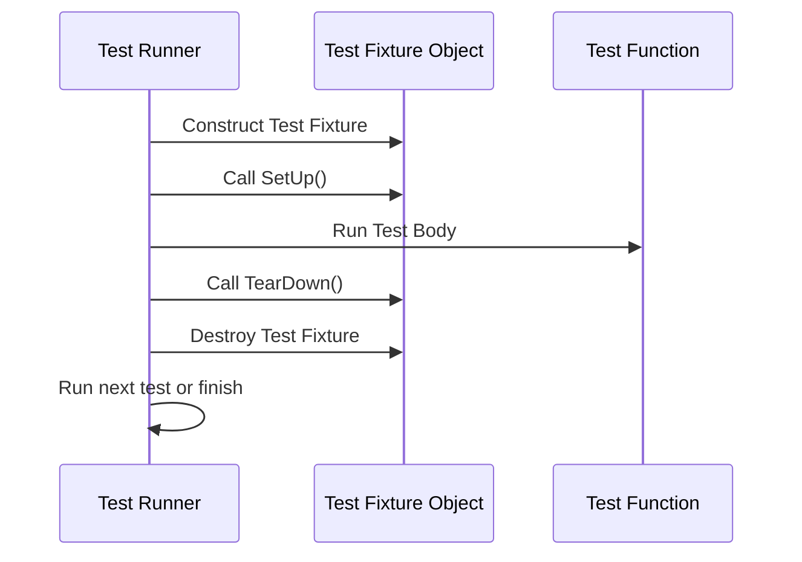

# Test Structure & Lifecycle

This page outlines the canonical methods and macros for writing test cases, organizing tests into suites, leveraging test fixtures, and managing setup and teardown routines in GoogleTest. It details test discovery, execution, and reporting mechanisms, empowering users to structure tests for robustness and readability.

---

## 1. Defining Tests

### TEST Macro

Use the `TEST(TestSuiteName, TestName)` macro to define an individual test. This macro:

- Declares a test named `TestName` within the suite `TestSuiteName`.
- Contains the test code inside a void function.
- Requires both arguments to be valid C++ identifiers without underscores (`_`).
- Supports having the same test name in different suites.

Example:
```cpp
TEST(FactorialTest, HandlesZeroInput) {
  EXPECT_EQ(Factorial(0), 1);
}

TEST(FactorialTest, HandlesPositiveInput) {
  EXPECT_EQ(Factorial(1), 1);
  EXPECT_EQ(Factorial(2), 2);
}
```

### TEST_F Macro

Use `TEST_F(TestFixtureName, TestName)` to define a test which uses a **test fixture**.

- `TestFixtureName` must be a class derived from `testing::Test`.
- Test fixture members and helper methods can be used in the test body.
- Naming convention: test suite name is the same as the fixture class name.

Example:
```cpp
class QueueTest : public testing::Test {
 protected:
  // Shared test data
  Queue<int> q0_, q1_, q2_;

  QueueTest() {
    q1_.Enqueue(1);
    q2_.Enqueue(2);
    q2_.Enqueue(3);
  }
};

TEST_F(QueueTest, IsEmptyInitially) {
  EXPECT_EQ(q0_.size(), 0);
}

TEST_F(QueueTest, DequeueWorks) {
  int* n = q1_.Dequeue();
  ASSERT_NE(n, nullptr);
  EXPECT_EQ(*n, 1);
  delete n;
}
```

### TEST_P Macro

Use `TEST_P(TestFixtureName, TestName)` to define **value-parameterized tests**.

- The fixture must inherit from both `testing::Test` and `testing::WithParamInterface<T>`.
- Access parameters using `GetParam()` inside tests.
- Requires instantiation through `INSTANTIATE_TEST_SUITE_P` to supply parameter values.

Example:
```cpp
class MyParamTest : public testing::TestWithParam<int> {};

TEST_P(MyParamTest, IsEven) {
  int n = GetParam();
  EXPECT_EQ(n % 2, 0);
}

INSTANTIATE_TEST_SUITE_P(EvenValues, MyParamTest,
                         testing::Values(2, 4, 6, 8));
```

## 2. Test Suites and Organization

- **Test Suite**: A container grouping logically related tests.
- Tests are run per suite, and tests within the same suite share the same fixture class if used.
- Suites do not allow underscores in their names.
- Test names within a suite must also avoid underscores to prevent naming conflicts.

## 3. Test Fixtures

Test fixtures allow sharing setup and teardown code and objects across multiple tests.

Steps to create a fixture:

1. Derive a class from `testing::Test`.
2. Place shared data members and helper functions in this class.
3. Override `SetUp()` and `TearDown()` methods for per-test initialization and cleanup.
4. Use `TEST_F` to hook tests to the fixture.

Example:
```cpp
class DatabaseTest : public testing::Test {
 protected:
  void SetUp() override {
    // Connect to database
  }

  void TearDown() override {
    // Disconnect
  }

  Database db_;
};

TEST_F(DatabaseTest, InsertWorks) {
  EXPECT_TRUE(db_.Insert("record"));
}
```

### Notes on SetUp and TearDown

- `SetUp()` is called immediately after the test fixture's constructor.
- `TearDown()` is called just before the destructor.
- GoogleTest creates a fresh instance of the test fixture for each test.

## 4. Test Discovery and Execution

- Tests registered with `TEST` or `TEST_F` macros are automatically discovered.
- Calling `RUN_ALL_TESTS()` runs all registered tests.
- `RUN_ALL_TESTS()` returns `0` if all tests pass, else `1`.
- Always call `testing::InitGoogleTest(&argc, argv);` before `RUN_ALL_TESTS()` to parse flags.

Example main function:

```cpp
int main(int argc, char **argv) {
  testing::InitGoogleTest(&argc, argv);
  return RUN_ALL_TESTS();
}
```

## 5. Test Naming Conventions

- Avoid underscores in test suite and test names to prevent ambiguous symbol names.
- Full test name = `TestSuiteName.TestName`.
- Use descriptive and unique test names to ease debugging.

## 6. Lifecycle of a Test

Each test follows this lifecycle:

1. GoogleTest constructs the test fixture object.
2. Calls its `SetUp()` method.
3. Executes the test body.
4. Calls `TearDown()`.
5. Destroys the test fixture object.

If any assertion in the test fails fatally (with `ASSERT_` macros), the test aborts immediately.

## 7. Getting Information about Tests Programmatically

GoogleTest provides the following classes for introspection:

- `testing::UnitTest`: Singleton representing the entire test program.
- `testing::TestSuite`: Represents a test suite.
- `testing::TestInfo`: Represents individual test information.

Example:
```cpp
const testing::TestInfo* info = testing::UnitTest::GetInstance()->current_test_info();
if (info != nullptr) {
  std::cout << "Currently running test: "
            << info->test_suite_name() << "." << info->name() << std::endl;
}
```

## 8. Using Scoped Traces for Better Failure Messages

To add additional contextual information within subroutines or loops, use `SCOPED_TRACE(message);` or `testing::ScopedTrace`.

Example:

```cpp
void Helper(int n) {
  SCOPED_TRACE("Helper called with n=" + std::to_string(n));
  EXPECT_TRUE(SomeCheck(n));
}

TEST(MyTest, Example) {
  for (int i = 0; i < 5; ++i) {
    Helper(i);
  }
}
```

Failures inside `Helper()` will now include trace information about the iteration.

## 9. Skipping Tests

Tests can be skipped at runtime with `GTEST_SKIP();`. This can be used inside test bodies or setup methods.

```cpp
TEST(MyTest, SkipExample) {
  GTEST_SKIP() << "Skipping test because of unmet prerequisites";
  // Test code here will not run.
}
```

## Troubleshooting Common Issues

- Ensure test fixture classes have a default constructor.
- Avoid fatal assertions (e.g., `ASSERT_*`) in constructors/destructors.
- Don't ignore the return value of `RUN_ALL_TESTS()`.
- Avoid underscores in test suite and test names.

---

## Visualizing Test Lifecycle



## Additional References

- [GoogleTest Primer](primer.md) — Beginner-friendly introduction.
- [GoogleTest Advanced Topics](advanced.md) — For deeper test fixture and advanced usage.
- [Testing Reference](reference/testing.md) — Macro and class references.
- [gMock for Dummies](gmock_for_dummies.md) — Introduces mocking for tests.

---

<Source url="https://github.com/google/googletest" paths={[{"path": "docs/reference/testing.md", "range": "1-350"}]} />
