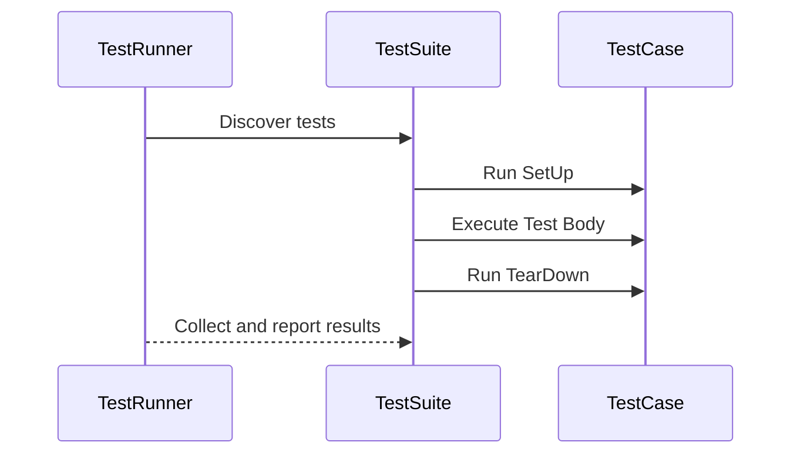

# Test Structure & Execution API

This page documents the key macros and functions provided by GoogleTest that allow you to structure, organize, and execute test suites and individual test cases. It covers fundamental test-defining macros such as `TEST`, `TEST_F`, and `TEST_P`, along with test fixtures and parameterization techniques including typed tests. The page provides clear patterns for test discovery and organization to help you write scalable, maintainable, and expressive tests.

---

## 1. Overview of Test Macros

GoogleTest provides several primary macros to define tests. These macros not only register tests automatically so they are discovered by the test runner, but also provide syntactic clarity and integration with test fixtures.

### 1.1 `TEST` Macro

Defines a simple, standalone test without any shared setup/teardown. It takes two parameters: the *test suite name* and the *test name*.

```cpp
TEST(TestSuiteName, TestName) {
  // Your test code here
  EXPECT_EQ(1, 1);
}
```

- Each test defined by `TEST` is independent.
- The test suite name groups related tests.
- Multiple tests can share the same test suite name.

### 1.2 `TEST_F` Macro: Tests with Fixtures

`TEST_F` allows tests to share the same test fixture, set up common objects, and reuse code.

```cpp
class MyFixture : public ::testing::Test {
 protected:
  void SetUp() override {
    // Common setup code
  }
  void TearDown() override {
    // Common cleanup code
  }
  int shared_value = 42;
};

TEST_F(MyFixture, Test1) {
  EXPECT_EQ(shared_value, 42);
}
```

- The fixture class inherits from `::testing::Test`.
- `SetUp` and `TearDown` methods run before and after each test in the suite.
- Use member variables for state shared among tests.

### 1.3 `TEST_P`: Parameterized Tests

`TEST_P` allows you to write a test logic once and run it against multiple parameters.

```cpp
class MyParamTest : public ::testing::TestWithParam<int> {};

TEST_P(MyParamTest, WorksForAllParams) {
  int param = GetParam();
  EXPECT_GT(param, 0);
}

INSTANTIATE_TEST_SUITE_P(MyGroup, MyParamTest, ::testing::Values(1, 2, 3));
```

- Instantiate your parameterized tests for each value or range.
- Supports complex types, not just primitives.

### 1.4 Typed and Type-Parameterized Tests

GoogleTest supports typed test suites, where the test is defined once but runs for multiple types. This is essential for generic code testing.

```cpp
template <typename T>
class TypedTestFixture : public ::testing::Test {
  // Fixture for typed tests
};

typedef ::testing::Types<int, double, std::string> MyTypes;
TYPED_TEST_SUITE(TypedTestFixture, MyTypes);

TYPED_TEST(TypedTestFixture, TestWorksForAllTypes) {
  TypeParam value = TypeParam();
  EXPECT_TRUE(true);
}
```

- Typed tests require defining the fixture as a class template.
- Use `TYPED_TEST_SUITE` and `TYPED_TEST` for setup and test methods.

## 2. Test Discovery and Organization

GoogleTest automatically discovers tests defined by `TEST`-family macros and registers them with the framework. Tests are grouped by suite names, which can be hierarchical if needed.

Organizing your tests into suites helps:

- Run specific groups of tests easily
- Control setup and teardown scope
- Share resources among related tests

Use descriptive and meaningful suite names that reflect the component or feature being tested.

## 3. Test Fixture Setup and Teardown

The `SetUp()` and `TearDown()` methods provide fine-grained control over preparing test environments.

- Called before and after **each** test case.
- Can allocate and deallocate resources
- Can set common state for all tests

Example:

```cpp
class DatabaseTest : public ::testing::Test {
 protected:
  void SetUp() override {
    db_.Connect("test_db");
  }

  void TearDown() override {
    db_.Disconnect();
  }

  Database db_;
};
```

## 4. Parameterized and Typed Tests: Broader Coverage

### 4.1 Parameterized Tests Usage

Value-parameterized tests run the same test logic against different inputs.

- Write a test fixture inheriting from `TestWithParam<T>`.
- Use `GetParam()` to access the parameter in tests.
- Instantiate using `INSTANTIATE_TEST_SUITE_P`.

Example:

```cpp
class MathTest : public ::testing::TestWithParam<int> {};

TEST_P(MathTest, IsPositive) {
  int value = GetParam();
  EXPECT_GT(value, 0);
}

INSTANTIATE_TEST_SUITE_P(PositiveValues, MathTest, ::testing::Values(1, 5, 10));
```

### 4.2 Typed Tests Usage

Typed tests are great for testing templates or generic classes across types.

- Define a template fixture.
- Define a type list.
- Register test suite with types.
- Implement test methods with `TYPED_TEST`.

Example:

```cpp
template <typename T>
class ContainerTest : public ::testing::Test {};

typedef ::testing::Types<std::vector<int>, std::list<int>> Containers;
TYPED_TEST_SUITE(ContainerTest, Containers);

TYPED_TEST(ContainerTest, CanAddElements) {
  TypeParam container;
  container.push_back(1);
  EXPECT_EQ(1u, container.size());
}
```

## 5. Common Patterns in Test Discovery

- **Suite and test names must be unique.** Duplicate names may result in ambiguous test runs.
- **Fixture inheritance must be from `::testing::Test`.**
- **Tests are registered statically during program initialization.**
- Tests can be filtered and run selectively using command-line flags.

## 6. Best Practices and Pitfalls

- Avoid overly large test fixtures; keep state minimal to reduce inter-test dependencies.
- Use parameterized tests to remove duplicated code and increase coverage.
- Named test suites should reflect logical grouping to ease discovery.
- Test fixtures must have virtual destructors if you further subclass.
- Do not perform expensive or global state mutations in `SetUp()` without resets.

## 7. Troubleshooting Common Issues

- Tests not discovered: Confirm macros are used correctly; ensure links against gtest are correct.
- Duplicate test failures: Use unique suite and test names.
- Unexpected test execution order: Use `InSequence` or other profiling if order matters.
- Parameterization not working: Ensure `INSTANTIATE_TEST_SUITE_P` is called.

## 8. Additional Resources

For a deeper dive into mock-based testing and test assertions, check out:

- [GoogleMock Cheat Sheet](gmock_cheat_sheet.md)
- [Mocking Reference](reference/mocking.md)
- [gMock Cookbook](gmock_cook_book.md)
- [gMock for Dummies](gmock_for_dummies.md)
- [Matchers Reference](api-reference/matchers-actions/matchers-reference)

---

# Diagram: Test Execution Flow



---

# Code Example: Using `TEST`, `TEST_F`, and Parameterized Tests

```cpp
#include <gtest/gtest.h>

// Simple test using TEST
TEST(ArithmeticTest, AdditionWorks) {
  EXPECT_EQ(2 + 2, 4);
}

// Test fixture
class StackTest : public ::testing::Test {
 protected:
  void SetUp() override {
    stack_.push(42);
  }

  std::stack<int> stack_;
};

// Use TEST_F to run tests sharing fixture
TEST_F(StackTest, IsNotEmptyAfterPush) {
  EXPECT_FALSE(stack_.empty());
}

// Parameterized test example
class IsEvenTest : public ::testing::TestWithParam<int> {};

TEST_P(IsEvenTest, ReturnsTrueForEvenNumbers) {
  int value = GetParam();
  EXPECT_EQ((value % 2), 0);
}

INSTANTIATE_TEST_SUITE_P(EvenNumbers, IsEvenTest, ::testing::Values(2, 4, 6, 8));
```

---

{/* Links to related docs for deeper understanding */}

## Related Documentation

- [GoogleTest Primer](../docs/primer.md) for introductory test writing
- [Mocking Basics](../guides/core-workflows/mocking-basics) for using mocks
- [Matchers Reference](../api-reference/matchers-actions/matchers-reference) for expressive assertions
- [Parameterized Tests](../guides/real-world-scenarios/parameterized-and-typed-tests) for enhanced coverage

## Navigation

Visit the [API Reference main page](../api-reference/core-testing) for more related tests and utilities.

---