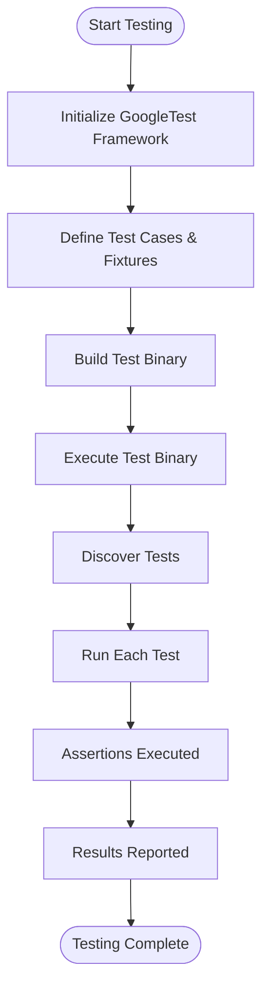

# Test Macros and Structure

This page explains the user-facing macros used for defining test cases, organizing tests, and controlling test execution within GoogleTest. It highlights typical workflows for setting up and running tests in projects, providing examples suitable for both beginners and experienced users seeking efficient test structuring.

---

## 1. Introduction to Test Macros

GoogleTest provides several powerful macros to structure your tests effectively. These macros allow you to define individual tests, group related tests, manage test fixtures, and control test execution environments. Understanding and leveraging these macros lets you build readable, maintainable, and comprehensive test suites.

### 1.1 Why Use Test Macros?

- **Simplify test definition:** Easily declare tests with minimal syntax.
- **Organize tests logically:** Group tests by functionality or feature.
- **Reuse setup/teardown code:** Using fixtures to reduce duplication.
- **Control test behavior:** Enable or disable tests dynamically.

---

## 2. Core Test Macros

### 2.1 TEST

Defines a basic test function.

```cpp
TEST(TestCaseName, TestName) {
  // Test code here
  EXPECT_EQ(1, 1);
}
```

- `TestCaseName` groups related tests.
- `TestName` is the unique name of the test within the group.
- Runs the contained assertions when executed.

### 2.2 TEST_F

Defines a test using a **test fixture** — a reusable setup and teardown class.

```cpp
class MyFixture : public ::testing::Test {
 protected:
  void SetUp() override { /* setup code */ }
  void TearDown() override { /* cleanup code */ }
};

TEST_F(MyFixture, TestName) {
  // The test runs with MyFixture setup
  ASSERT_TRUE(condition);
}
```

- Enables sharing common configuration across multiple tests.
- Fixture class can contain helpers and common data.

### 2.3 TEST_P and INSTANTIATE_TEST_SUITE_P

Supports parameterized tests.

```cpp
class MyParamTest : public ::testing::TestWithParam<int> {};

TEST_P(MyParamTest, HandlesParameters) {
  int param = GetParam();
  EXPECT_GT(param, 0);
}

INSTANTIATE_TEST_SUITE_P(
  PositiveNumbers, MyParamTest,
  ::testing::Values(1, 2, 3));
```

- Runs the same test logic with multiple inputs.
- Helps validate edge cases or variants efficiently.

### 2.4 DISABLED_

Prefix a test (or suite) name with `DISABLED_` to prevent it from running.

```cpp
TEST(MyTest, DISABLED_NotReady) {
  // This test will not run
}
```

Useful during development to temporarily skip failing or incomplete tests without removing them.

---

## 3. Typical Workflow for Setting Up and Running Tests

### Step 1: Include the Required Header

```cpp
#include <gtest/gtest.h>
```

This brings in all necessary GoogleTest core functionality.

### Step 2: Define Test Cases

Use `TEST` or `TEST_F` depending on whether you need shared setup.

### Step 3: Write Assertions

Use rich assertion macros from GoogleTest to verify test conditions, such as `EXPECT_EQ`, `ASSERT_TRUE`.

### Step 4: Build and Link

Compile your test binary linking against GoogleTest libraries.

### Step 5: Run Tests

Execute your test binary. GoogleTest automatically discovers and runs all defined tests.

```bash
./my_test_binary
```

### Step 6: Analyze Results

Observe detailed reports on passing, failing, and skipped tests.

---

## 4. Examples

### 4.1 A Simple Test Example

```cpp
#include <gtest/gtest.h>

TEST(MathTest, SimpleAddition) {
  int result = 1 + 1;
  EXPECT_EQ(result, 2);
}
```

This defines a test named `SimpleAddition` in the `MathTest` group that checks basic addition.

### 4.2 Using Test Fixtures

```cpp
class DatabaseTest : public ::testing::Test {
 protected:
  void SetUp() override {
    db.Connect();
  }
  void TearDown() override {
    db.Disconnect();
  }

  Database db;
};

TEST_F(DatabaseTest, InsertData) {
  EXPECT_TRUE(db.Insert("row1"));
}

TEST_F(DatabaseTest, QueryData) {
  db.Insert("row2");
  EXPECT_EQ(db.Query("row2"), "row2");
}
```

Both tests share the setup and teardown code, reconnecting the database for each test.

---

## 5. Practical Tips and Best Practices

- **Prefer TEST_F over TEST when you have shared setup or teardown logic.** This improves maintainability and reduces code duplication.
- **Use descriptive test and case names** to clearly communicate the intent of each test.
- **Avoid overly strict expectations on calls unless necessary** to keep tests resilient to internal changes.
- **Use DISABLED_ prefix to temporarily disable flaky or incomplete tests instead of commenting out code.**
- **Consider parameterized tests (TEST_P) for testing functions or classes with various input combinations.**
- **Structure your tests hierarchically using suites and fixtures to mirror your product’s logical components.**
- **Keep tests independent**; avoid dependencies or ordering requirements between tests except when explicitly using sequencing constructs.

---

## 6. Troubleshooting Common Issues

### Issue: Test Not Running
- Check that the test function is named correctly (`TEST` or `TEST_F` macro).
- Verify the test binary is correctly linked against GoogleTest.
- Ensure you are not accidentally disabling tests with the `DISABLED_` prefix.
- Use verbose flags (`--gtest_verbose=info`) to diagnose test discovery.

### Issue: Unexpected Test Failures
- Confirm your assertions are valid and reflect correct expected behavior.
- Use GoogleTest's rich assertion messages for debugging.
- Check setup and teardown methods for side effects or shared states.

### Issue: Slow Test Execution
- Modularize tests and avoid global/shared state that forces sequential execution.
- Use mocks and stubs to replace expensive dependencies.

---

## 7. Additional Resources and Next Steps

To deepen your understanding and extend your testing capabilities:

- Explore the [Assertions Reference](/api-reference/core-unit-testing/assertions) for the full set of assertions.
- Review [Death Tests and Parameterized Testing](/api-reference/core-unit-testing/death-and-param-tests) for advanced test types.
- Visit the [GoogleMock at a Glance](/overview/core-concepts-and-terminology/googlemock-intro) page to learn about mocking tests.
- Consult the [Getting Started Guides](/getting-started) for installation and setup assistance.

---

## Diagram: Typical Test Execution Workflow



---

This structure ensures users understand the foundational macros for effective test writing, organizing, and running, anchored in practical workflows, usage examples, and helpful tips to avoid common issues.

<Check>
Ensure all provided macro usage examples adhere strictly to GoogleTest syntax.
Confirm that user intent to write, organize, and control tests is addressed.
Cross-check included references align with broader documentation structure.
</Check>
