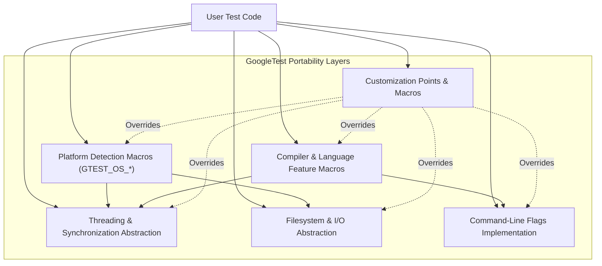

# Platforms and Portability

## Overview

GoogleTest and GoogleMock are designed with portability as a core principle. This documentation page explains how the framework abstracts platform and compiler differences to provide a consistent user experience across environments. It also details important macros and customization points that help tailor the framework to specific platforms or toolchains.

Users of GoogleTest and GoogleMock can focus on writing robust C++ tests without worrying about the underlying OS, compiler, or build system nuances. This portability enables seamless integration in diverse environments including Linux, Windows, macOS, embedded systems, and more.

## Platform Support and Detection

GoogleTest employs a comprehensive suite of platform detection macros, automatically defined at compile time. These macros inform the framework which platform it is being compiled on, enabling conditional compilation and platform-specific optimizations.

Some of the most common platform macros include:

| Macro                  | Description                      |
|------------------------|--------------------------------|
| `GTEST_OS_WINDOWS`     | Windows desktop or servers      |
| `GTEST_OS_LINUX`       | Linux                          |
| `GTEST_OS_MAC`         | macOS                          |
| `GTEST_OS_IOS`         | Apple's iOS platform            |
| `GTEST_OS_ANDROID`     | Android                       |
| `GTEST_OS_CYGWIN`      | Cygwin (Unix layer on Windows) |
| `GTEST_OS_FREEBSD`     | FreeBSD                       |
| `GTEST_OS_SOLARIS`     | Solaris                      |

These macros allow the framework to adjust for differences in APIs, threading models, file systems, and compiler attributes.

### Platform Detection Details

Platform detection is centralized in `gtest-port-arch.h`. This file sets platform macros based on predefined compiler identifiers and system headers.

#### Example:

```cpp
#ifdef _WIN32
#define GTEST_OS_WINDOWS 1
#elif defined(__linux__)
#define GTEST_OS_LINUX 1
// ...
#endif
```

This approach ensures that the correct platform macros are available throughout the project during compilation.

## Compiler and Language Features

GoogleTest sets additional macros based on compiler capabilities, such as exceptions support, RTTI availability, and C++ language standard version.

Key macros influencing behavior include:

- `GTEST_HAS_EXCEPTIONS` — Indicates if C++ exceptions are enabled.
- `GTEST_HAS_RTTI` — Checks if runtime type information is available.
- `GTEST_INTERNAL_CPLUSPLUS_LANG` — Determines the C++ language standard version (e.g., C++17 or newer required).

GoogleTest requires at least C++17 to compile; this prerequisite is enforced via a static error if not met.

## Threading and Synchronization

The framework adapts to the threading support and synchronization primitives available on the target platform through macros:

- `GTEST_HAS_PTHREAD` — Indicates POSIX pthread support.
- `GTEST_IS_THREADSAFE` — Indicates whether thread safety features are enabled.

On platforms lacking native threading support, GoogleTest provides dummy implementations of mutexes and thread-local storage to maintain API consistency.

## Filesystem and I/O Portability

GoogleTest abstracts file and directory operations with wrapper functions in the `posix` namespace. These wrappers adapt functionality for Windows and POSIX-like platforms and handle platform-specific limitations gracefully, especially on embedded or constrained systems.

Examples:

- `posix::FOpen` — Portable wrapper for file opening.
- `posix::Stat` — File metadata access.
- `posix::ChDir` — Change directory.

These wrappers assure consistent behavior for test output, temporary directory usage, and log file management.

## Command-Line Flags and Environment Variables

The framework’s command-line flag parsing adapts based on availability of Abseil flags or the native implementation.

Macros such as:

- `GTEST_DEFINE_bool_`
- `GTEST_DECLARE_bool_`

help define and declare flags that are mapped either to Abseil’s flag system or GoogleTest’s internal flag variables depending on compilation settings.

## Synchronization Primitives and Thread Local Storage

GoogleTest implements mutexes and thread-local storage differently based on platform and compiler feature detection:

- On Windows, mutexes use critical sections.
- On pthread-supported systems, mutexes use `pthread_mutex_t`.
- For thread-local variables, template classes adapt to platform-specific implementations.

This flexibility ensures tests and internal GoogleTest operations run reliably without race conditions or thread-safety issues.

## Customization Points

To address unique platform needs or user preferences, GoogleTest allows customization by providing macros and hooks:

- Custom macro definitions to override platform detection or feature availability.
- Injection points for replacing certain behaviors (e.g., by defining `GTEST_OS_STACK_TRACE_GETTER_` override).
- Flag macro customization, allowing users to define or disable specific command-line flags.

These are detailed in the `custom/` directory and accompanying documentation.

## Example Usage: Conditional Compilation Based on Platform

You can write portable tests or extensions that adapt to the detected platform:

```cpp
#if GTEST_OS_WINDOWS
  // Windows-specific code
#elif GTEST_OS_LINUX
  // Linux-specific code
#else
  #error Unsupported platform
#endif
```

This pattern leverages GoogleTest macros to maintain a single codebase supporting multiple environments.

## Practical Tips and Best Practices

- **Verify platform macros** during compilation by checking build logs or using preprocessor introspection for debugging.
- Use `GTEST_IS_THREADSAFE` to conditionally enable multithreading in your tests or extensions.
- Avoid relying on undocumented internal macros; instead, use the public API and documented customization points.
- When targeting embedded or niche platforms, carefully check the availability of file system and threading capabilities and adapt accordingly.
- To suppress warnings or enhance compatibility, take advantage of provided macros such as `GTEST_DISABLE_MSC_WARNINGS_PUSH_`.

## Troubleshooting Portability Issues

If you encounter problems related to platform support:

1. Confirm your compiler and system meet the minimum requirements (C++17, proper runtime).
2. Review the platform detection macros in the source ({gtest-port-arch.h}) and confirm they reflect your environment correctly.
3. For missing threading support or undefined behaviors, check the availability of pthreads or Windows synchronization.
4. Consider defining custom macros or providing a `custom/` override for unsupported features.

## Diagram: Platform Abstraction Overview



## Related Documentation

See also:

- [Platform Support and Build Integration](../../overview/architecture-integration/platform-and-tool-integration)
- [Customization Points](googlemock/include/gtest/internal/custom/README.md)
- [GoogleTest Primer](docs/primer.md)
- [Installation Methods](getting-started/setup-basics/installation-methods)

<Source url="https://github.com/google/googletest" branch="main" paths={[{"path": "googletest/include/gtest/internal/gtest-port-arch.h", "range": "1-125"},{"path": "googletest/include/gtest/internal/gtest-port.h", "range": "1-643"},{"path": "googlemock/include/gmock/internal/gmock-port.h", "range": "1-122"}]} />

---

