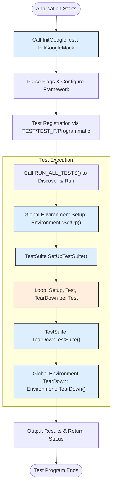

# Framework Integration & Configuration

GoogleTest and GoogleMock provide core API hooks essential for initializing the testing framework and integrating it smoothly into diverse build and runtime environments. This page focuses on understanding the main entry points for typical and embedded setups, configuring runtime behavior—especially for testing, mocking, and environment control—and best practices for integrating with external systems and continuous integration (CI) workflows.

---

## 1. Framework Initialization

Initialization is the foundational step to prepare GoogleTest for discovering and running your tests correctly. It involves parsing command-line flags, setting up internal state, and configuring behaviors that influence test execution.

### InitGoogleTest

The recommended entry point for any test program that uses GoogleTest is:

```cpp
void testing::InitGoogleTest(int* argc, char** argv);
```

- **Purpose:** Parses GoogleTest-specific command-line flags (e.g., test filters, output formats, repeat counts) and removes them from `argv`.
- **Usage:** Must be called before running any tests, typically before `RUN_ALL_TESTS()` in your `main()`.
- **Variants:** Supports `char** argv`, `wchar_t** argv` (for Windows `UNICODE` builds), and a no-argument version for embedded platforms.

#### Example Usage:

```cpp
int main(int argc, char** argv) {
  testing::InitGoogleTest(&argc, argv);
  return RUN_ALL_TESTS();
}
```

### InitGoogleMock

For projects using GoogleMock, call `InitGoogleMock()` instead of `InitGoogleTest()`. It initializes both GoogleMock and GoogleTest.

```cpp
void testing::InitGoogleMock(int* argc, char** argv);
```

Example:

```cpp
int main(int argc, char** argv) {
  testing::InitGoogleMock(&argc, argv);
  return RUN_ALL_TESTS();
}
```

>**Tip:** Calls to initialization functions process framework flags, which control behaviors such as verbosity, failure handling, and output formats. Passing unrecognized flags has no adverse effect; these are simply ignored or kept in `argv`.

---

## 2. Main Entry Points in Typical and Embedded Environments

GoogleTest is commonly used in desktop/server environments, but also supports embedded systems with special entry points.

### Typical Environments (Linux, Windows, Mac)

- A conventional `main(int argc, char** argv)` function is used.
- `InitGoogleTest()` or `InitGoogleMock()` is called before `RUN_ALL_TESTS()`.
- The test runner returns the test execution status code (0 if all pass, 1 otherwise).

Example:

```cpp
int main(int argc, char** argv) {
  testing::InitGoogleTest(&argc, argv);
  return RUN_ALL_TESTS();
}
```

### Embedded and Arduino Platforms

- GoogleTest supports running on constrained or embedded platforms like ESP8266, ESP32, and NRF52.
- On these platforms, a `setup()` function initializes Google Mock and prepares the environment.
- Tests are run in the `loop()` function, maintaining compatibility with Arduino framework styles.

Source snippet from `gmock_main.cc`:

```cpp
void setup() {
  testing::InitGoogleMock();
}

void loop() {
  RUN_ALL_TESTS();
}
```

> **Note:** This embedded entry point abstracts the C++ `main()` paradigm to fit embedded system constraints by splitting initialization and test run logic across functions managed by the platform runtime.

---

## 3. Configuring Test and Mock Behavior at Runtime

Fine-tuning test execution behavior and mock object interactions at runtime enables robust test suites tailored to your development needs.

### GoogleTest Flags

GoogleTest uses a rich set of flags that can be set via command-line or environment variables.

#### Common Flags:

| Flag                     | Purpose                                                                   | Example                         |
|--------------------------|---------------------------------------------------------------------------|--------------------------------|
| `--gtest_filter`          | Runs only tests matching a filter pattern                                 | `--gtest_filter=FooTest.*`     |
| `--gtest_repeat`          | Repeats the entire test suite multiple times                             | `--gtest_repeat=100`            |
| `--gtest_shuffle`         | Randomizes the order of tests                                              | `--gtest_shuffle`              |
| `--gtest_break_on_failure`| Breaks into debugger when failure occurs                                  | `--gtest_break_on_failure`     |
| `--gtest_color`           | Enables colored output (`yes`, `no`, `auto`)                              | `--gtest_color=yes`            |
| `--gtest_output`          | Generates reports; supports `xml:` or `json:` output                      | `--gtest_output=xml:report.xml`|

> **Best Practice:** Always call `InitGoogleTest()` after your program parses flags to initialize these behaviors correctly.

### GoogleMock Flags

GoogleMock has its own flags that control mocking behaviors:

- `--gmock_verbose` — Sets verbosity of mock output (e.g., `info`, `warning`, `error`).
- `--gmock_default_mock_behavior` — Sets default behavior for mocks (nice, strict, naggy).

These flags are processed by `InitGoogleMock()`.

### Programmatic Configuration

Besides flags, configurations such as mock object behaviors or test enabling may be changed at runtime:

- Use `Mock::AllowLeak()` to suppress leak warnings for specific mock objects.
- Use `GTEST_SKIP()` macro to dynamically skip tests during execution.

```cpp
TEST(Foo, SkipExample) {
  if (!IsInstalled()) {
    GTEST_SKIP() << "Feature not installed";
  }
  // Test body...
}
```

---

## 4. Integrating with External Systems and CI

GoogleTest and GoogleMock are designed for smooth integration into build systems and continuous integration pipelines.

### Integrating with Build Systems

- GoogleTest provides CMake support and guidance for Bazel integration.
- You can embed GoogleTest and GoogleMock source code directly or link against prebuilt libraries.
- Use `add_test()` in CMake to automate test execution.

### Continuous Integration

- GoogleTest supports test filtering, output to XML and JSON reports suitable for CI test runners.
- Use `--gtest_output=xml:` or `--gtest_output=json:` to produce detailed reports.
- Environment variables can be set inside CI scripts to customize runs without altering test code.
- Test sharding is supported by setting `GTEST_TOTAL_SHARDS` and `GTEST_SHARD_INDEX` environment variables to distribute tests across multiple machines.

### Best Practices

- Always check the exit status of your test binary (`RUN_ALL_TESTS()` return code) to determine pass/fail status in automation.
- Use the `--gtest_fail_fast` flag to abort test runs early on failure when appropriate.
- Combine `--gtest_filter` with `--gtest_repeat` to isolate flaky tests.

---

## 5. Advanced Runtime Control and Best Practices

### Registering Tests Programmatically

For dynamic test generation use `testing::RegisterTest()`. This allows:

- Registering tests whose parameters or existence aren’t fixed at compile time.
- Integration with data-driven workflows.

Example excerpt:

```cpp
void RegisterMyTests(const std::vector<int>& values) {
  for (int v : values) {
    testing::RegisterTest(
      "MyFixture", ("Test" + std::to_string(v)).c_str(), nullptr,
      std::to_string(v).c_str(), __FILE__, __LINE__,
      [=]() -> MyFixture* { return new MyTest(v); });
  }
}
```

### Scoped Tracing with SCOPED_TRACE

When testing complex code with many function calls, add contextual information to assertion failures using `SCOPED_TRACE()`:

```cpp
SCOPED_TRACE("Iteration " + std::to_string(i));
EXPECT_EQ(foo.Bar(i), expected_value);
```

This helps identify which call led to failure in bulk test runs.

### Managing Shared Resources

Use `SetUpTestSuite()` and `TearDownTestSuite()` for expensive or shared resources to be prepared once per test suite and cleaned up after all tests run.

```cpp
class FooTest : public testing::Test {
 protected:
  static void SetUpTestSuite() {
    shared_resource_ = new Resource();
  }
  static void TearDownTestSuite() {
    delete shared_resource_;
    shared_resource_ = nullptr;
  }
  static Resource* shared_resource_;
};
Resource* FooTest::shared_resource_ = nullptr;
```

### Error Handling and Failures

- Fatal failures (`ASSERT_*`) abort current functions only; use `ASSERT_NO_FATAL_FAILURE()` macros to check subroutine failures correctly.
- Skipped tests via `GTEST_SKIP()` provide clearer test results management.

---

## 6. Summary Diagram: Integration Flow



---

## 7. Troubleshooting Common Issues

- **Initialization errors:** Ensure `InitGoogleTest()` is called exactly once per test program before any test runs.
- **Flags not respected:** Make sure your `argv` ends with NULL as expected; call initialization with proper `argc` and `argv`.
- **Tests not discovered:** Confirm that tests are registered using the macros (`TEST`, `TEST_F`) or via `RegisterTest()` before test execution.
- **Memory leaks:** Use `Mock::AllowLeak()` to suppress false positives, especially in death tests.
- **Skipped tests unexpectedly:** Check usage of `GTEST_SKIP()` and review filtering flags.

---

## 8. Additional Resources & Links

- [GoogleTest Primer](https://github.com/google/googletest/blob/main/docs/primer.md)
- [Running Tests Documentation](https://github.com/google/googletest/blob/main/docs/getting-started/first-test-and-validation/running-tests.md)
- [Integration with CI/CD Pipelines](https://github.com/google/googletest/blob/main/guides/integration-and-advanced/ci-integration.mdx)
- [Parameterized and Typed Tests](https://github.com/google/googletest/blob/main/api-reference/gtest-core-api/parameterized-and-typed-tests.md)
- [Mocking Basics](https://github.com/google/googletest/blob/main/guides/real-world-workflows/mocking-basics.mdx)

---

This page empowers developers to initialize GoogleTest correctly, handle complex scenarios—including embedded setups and runtime test configurations—and integrate testing deeply into their build and CI infrastructure for reliable, flexible, and efficient test execution.