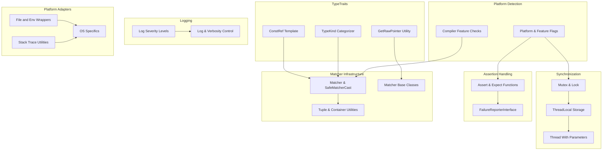

# Internal Utilities & Portability APIs

This reference page details the low-level utilities and portability abstractions in GoogleTest and GoogleMock. These internal utilities enable extension and porting of the framework to new platforms, managing platform flags, internal type traits, and extension hooks. This documentation focuses on the user-facing capabilities and contracts these utilities provide to advanced users and integrators.

---

## Overview

GoogleTest and GoogleMock rely on a set of internal utilities designed to facilitate cross-platform compatibility and to provide a foundation for advanced features such as custom test matchers, mock behaviors, reporting, and resource management. These utilities handle low-level concerns such as environment detection, thread synchronization, type traits, platform-specific workarounds, and assertion reporting.

Advanced users extending GoogleTest or integrating it deeply into complex build environments or new platforms will benefit from understanding these utilities and portability APIs.

---

## Environment and Platform Detection

- **Platform Macros:** Define symbols such as `GTEST_OS_WINDOWS`, `GTEST_OS_LINUX`, `GTEST_OS_MAC`, etc., with values 1 or 0 to indicate platform presence.
- **Feature Macros:** Describe the availability of features like exceptions support (`GTEST_HAS_EXCEPTIONS`), POSIX regex support (`GTEST_HAS_POSIX_RE`), thread safety, RTTI, and wide string support.
- **Compiler Requirements:** Enforce C++17 minimum, with additional checks for specific compilers and compiler versions.

> These macros are auto-detected but can be overridden when necessary in build configurations to resolve platform or compiler-specific issues.

---

## Synchronization Primitives

GoogleTest provides synchronization abstractions to accommodate multi-threaded test execution and internal thread-safe operations:

- **Mutex and MutexLock:** Wrap native synchronization mechanisms such as pthreads mutexes or Windows critical sections.
- **ThreadLocal:** Per-thread storage abstraction to maintain thread-specific data safely across platforms.
- **ThreadWithParam:** Utility for launching threads with parameters for testing GoogleTest's own multi-threading constructs.

These facilities prevent races and provide safe internals for concurrent test scenarios.

---

## Internal Type Traits and Utilities

Templates and utilities for type analysis and manipulation enable clean, type-safe API extensions:

- **TypeKind Enum:** Categorizes types into bool, integer, floating-point, or other: used internally to enforce safe matcher conversions.
- **ConstRef & ImplicitCast_ Templates:** Support reference collapsing and safe conversions aiding internal trait management.
- **GetRawPointer:** Extracts a raw pointer from smart pointers or returns raw pointers directly, assisting matchers that operate on pointer-like types.

These support advanced mocking and matching techniques without overcomplicating user code.

---

## Assertion and Failure Reporting Helpers

Internal helpers wrap the construction and reporting of assertion failures:

- **Assert and Expect Functions:** Internal functions enforce assertion truth with fatal or non-fatal failure reporting, independent of external logging components.
- **FailureReporterInterface:** Interface allowing pluggable failure-reporting behaviors.

This layer sits beneath the user-facing assertion macros, ensuring stable and consistent failure management.

---

## Matcher Internals and Conversion

To support GoogleMock's powerful and type-safe matcher framework, several internal classes and templates aide matcher implementation:

- **MatcherCast and SafeMatcherCast:** Templates for explicit safe and lossless casting between matchers of different argument types.
  These enforce contravariant conversions ensuring matcher invocations remain sound.
- **MatcherBaseImpl and MatcherInterface:** Core base classes for developing custom matchers and handling polymorphism.
- **Tuple and Container Utilities:** Enable handling tuples, native arrays, STL containers, and native pointer types uniformly within matchers.

These abstractions allow for defining polymorphic and composite matchers that can be safely composed.

---

## Logging and Verbosity Control

GoogleMock internally controls logging verbosity and filtering to regulate diagnostic messages:

- **Log Severity Levels:** "info", "warning", and "error" controls permitting users to choose the detail level printed.
- **LogIsVisible and Log Functions:** Conditionals and output mechanisms that honor the `--gmock_verbose` flag and manage stack trace details with adjustable depth.

By adjusting verbosity, users can get deeply diagnostic outputs during debugging or quiet logs for testing normal runs.

---

## String and Container Print Utilities

Specialized printers and comparators for:

- Formatting strings with UTF-8 conversions
- Printing native and smart pointers with context
- Showing container contents and detailed diffs for mismatches

These utilities enhance test failure reporting by producing clear and readable diagnostic messages.

---

## Platform Specific Adaptations

Portable solutions across supported platforms include:

- Wrappers for file I/O, environment variables, and OS calls
- Safe handling of platform-specific warnings and exceptions
- Portable stack trace capture and demangling

These abstractions ensure GoogleTest/GoogleMock behavior remains consistent regardless of whether it runs on Windows, Linux, or macOS.

---

## Best Practices

- **Do Not Use These APIs Directly:** These internals are meant for framework maintainers and implementers extending GoogleTest/GoogleMock; application-level test code should rely on documented higher-level APIs.
- **Always Use Macros and Templates as Designed:** Proper usage of matchers, actions, and mocking macros prevents subtle bugs in tests or mock objects.
- **Handle Platform Differences at Build Time:** Prefer delegation to these utilities to manage OS and platform behavior reliably.

---

## Example: Defining a Custom Matcher with Internal Helpers

Here is a minimal example showing how internal utilities facilitate writing a custom polymorphic matcher.

```cpp
#include <gmock/gmock.h>

class EvenMatcher {
 public:
  using is_gtest_matcher = void;

  template <typename T>
  bool MatchAndExplain(T x, std::ostream* /*listener*/) const {
    return (x % 2) == 0;
  }

  void DescribeTo(std::ostream* os) const { *os << "is even"; }
  void DescribeNegationTo(std::ostream* os) const { *os << "is odd"; }
};

::testing::PolymorphicMatcher<EvenMatcher> IsEven() {
  return ::testing::MakePolymorphicMatcher(EvenMatcher());
}

// Usage in tests:
// EXPECT_THAT(value, IsEven());
```

This example shows basic integration with the internal matcher interface, which benefits from the utilities described above.

---

## Troubleshooting

- **Compilation Issues:** Confirm compiler supports at least C++17. Older compilers or missing platform flags cause build errors.
- **Threading Errors:** Ensure mock objects are used per thread rules; mutating mocks in multiple threads simultaneously causes undefined behavior.
- **Linking and Runtime Failures:** Use provided platform macros and environment variables properly; fix build/link warnings related to environment detection.
- **Assertion Failures:** If internal assertion utilities fail or cause unexpected outputs, verify test macro usage and flag settings.

Refer to [Troubleshooting Common Setup Issues](/getting-started/first-experience/common-setup-issues) for additional guidance.

---

## References

For further understanding and practical use, this documentation complements:
- [Mocking Methods & Objects](/api-reference/mocking-apis/mocking-methods)
- [Defining Expectations & Behaviors](/api-reference/mocking-apis/defining-expectations)
- [Writing Custom Assertions and Matchers](/gtest-guides/intermediate-patterns/assertions-matchers)
- [Core Concepts & Terminology](/overview/core-architecture-concepts/core-concepts)

Also, consult the [GoogleTest Primer](/overview/getting-started/introduction) for foundational concepts and [gMock Cookbook](docs/gmock_cook_book.md) for practical recipes.

---

## Visual Overview



This diagram shows the logical grouping of internal utilities and how they relate.

---

## Practical Tips

- Always keep an eye on platform macros especially when porting.
- Use thread-local storage for thread-specific data in threading scenarios.
- Avoid manipulating GoogleTest internals unless absolutely necessary.
- Use the provided APIs to extend mocking and matching behavior smoothly.
- Control verbosity via `--gmock_verbose=` and stack trace depth for easy debug.

---

For detailed examples and further extensions, visit the respective guide pages and the source code in the GoogleTest repository.

<Source url="https://github.com/google/googletest" paths={[{"path": "googlemock/include/gmock/internal/gmock-port.h", "range": "1-139"},{"path": "googletest/include/gtest/internal/gtest-port.h", "range": "1-711"},{"path": "googlemock/include/gmock/internal/gmock-internal-utils.h", "range": "1-300"},{"path": "googlemock/include/gmock/gmock-matchers.h", "range": "1-796"},{"path": "googletest/src/gtest.cc", "range": "1-1800"}]} />
