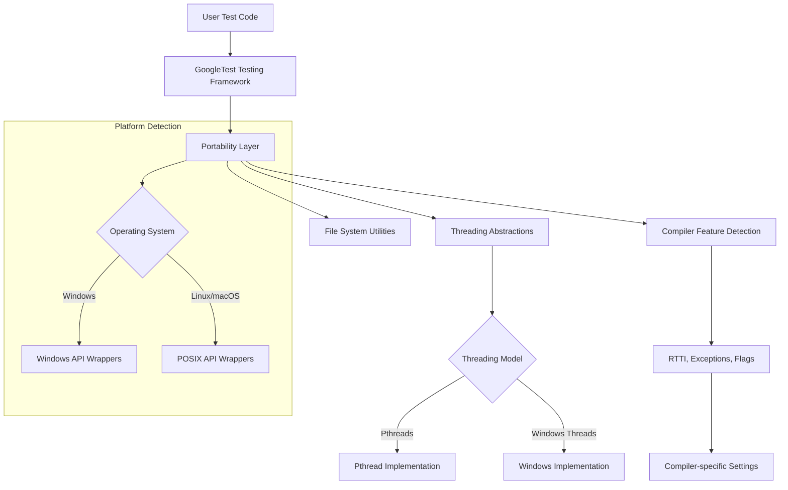

# Platform and Portability Utilities

GoogleTest and GoogleMock provide robust platform and portability utilities designed to abstract away operating system and compiler details. These utilities deliver reliable cross-platform compatibility by managing compiler feature detection, platform-specific capabilities, and threading support behind a consistent API surface.

This page documents key macros, compiler feature checks, flag management utilities, synchronization primitives, threading abstractions, and filesystem helpers that enable portable test development across diverse environments.

---

## Overview of Portability Utilities

The portability layer is the backbone of GoogleTest and GoogleMock's ability to support multiple platforms including Linux, Windows (Desktop, MinGW, Mobile, etc.), macOS, and several embedded systems.

Key objectives include:

- Abstracting platform-specific details such as file system operations, threading models, and OS detection.
- Managing compiler differences, such as support for RTTI, exceptions, and C++17 features.
- Providing synchronization primitives like mutexes and thread-local storage in a platform-consistent manner.
- Detecting and adapting to availability of POSIX APIs and standard C++ features.

Through these utilities, tests and mocks remain portable and reliable without requiring manual adaptation for each platform or compiler.

---

## Platform and Compiler Detection Macros

GoogleTest exposes a comprehensive set of macros automatically detecting the compilation environment. These macros enable conditional compilation based on platform capabilities.

### Platform Macros

- `GTEST_OS_WINDOWS`, `GTEST_OS_MAC`, `GTEST_OS_LINUX`, `GTEST_OS_CYGWIN`, and others specify the target operating system.
- Embedded and mobile variants like `GTEST_OS_WINDOWS_MOBILE`, `GTEST_OS_IOS`, and `GTEST_OS_NACL` are also detected.

These macros are **always defined to `1` if active, or undefined**, never to `0`.

### Compiler Feature Macros

- `GTEST_HAS_RTTI`, `GTEST_HAS_EXCEPTIONS`, `GTEST_HAS_PTHREAD`, `GTEST_HAS_CLONE` indicate availability of language/runtime features.
- Compiler version detection (e.g., MSVC version) informs on support status.

### Example Usage

```c++
#ifdef GTEST_OS_WINDOWS
  // Windows-specific code here.
#endif

#if GTEST_HAS_EXCEPTIONS
  try { /* exception-throwing code */ } catch (...) { /* handler */ }
#endif
```

---

## Synchronization and Threading Support

Reliable multithreaded test execution requires abstractions of synchronization primitives that work uniformly across supported platforms.

### Mutex and Lock

- `Mutex` and `MutexLock` classes are provided for locking primitives.
- On Windows, they wrap native `CRITICAL_SECTION`s and on POSIX platforms, pthread mutexes.
- When threading is unsupported or disabled, these classes become no-ops to allow single-threaded testing with minimal overhead.

### Thread-Local Storage

- `ThreadLocal<T>` templates provide thread-local variable storage.
- Implemented using OS-native TLS or pthread TLS as appropriate.
- Ensures each thread accesses its own instance of a variable without data races.

### Thread Helpers

- Helper classes such as `ThreadWithParam<T>` support simple thread creation and joining.
- Internally uses pthreads on POSIX or Windows Threads on Windows.

### Thread Safety Considerations

GoogleTest defines `GTEST_IS_THREADSAFE` as `1` when threading support exists. Otherwise, threading primitives degrade to dummy implementations.

---

## Command-Line Flags and Environment Variables

GoogleTest and GoogleMock use flag utilities to define, access, and manage command-line flags with a consistent interface.

- **Macros** like `GTEST_DEFINE_bool_`, `GTEST_DECLARE_int32_`, and their gMock equivalents simplify defining typed global flags.
- Flags can be accessed or mutated via `GTEST_FLAG_GET(flag_name)` and `GTEST_FLAG_SET(flag_name, value)`.
- Integration with Abseil flags supported when available for advanced flag parsing.

Example:

```c++
GTEST_DEFINE_bool_(some_flag, true, "Description of some_flag");
if (GTEST_FLAG_GET(some_flag)) {
  // behavior modified by flag
}
```

---

## File System and POSIX Porting

GoogleTest abstracts file system operations and POSIX functions to mitigate platform discrepancies.

- File status and directory checks via `Stat()`, `RmDir()`, and `IsDir()` wrappers.
- File descriptor operations like `FOpen()`, `FReopen()`, `FDOpen()`, `FClose()` handle Unicode paths on Windows transparently.
- Compatibility wrappers for `isatty()` and `stricmp()` (`StrCaseCmp()`) provide consistent behavior.

These abstractions enable writing tests that interact with files and directories without manual platform-specific coding.

---

## Compiler Flags and Build Configuration Utilities

To ensure consistent builds across compilers and platforms, a set of macros and functions manage compiler and linker flags.

- `fix_default_compiler_settings_()`: Adjusts default flags (e.g., disables shared CRT on static builds for MSVC).
- `config_compiler_and_linker()`: Configures flags such as warning levels (`-Wall`, `/W4`), exception handling, RTTI, threading macros.

These are primarily used internally during build setup but can be referenced when deeper custom build integration is needed.


---

## Common Portability Macros and API Highlights

### Character Utilities

Functions like `IsAlpha()`, `IsDigit()`, `IsSpace()`, and conversions `ToLower()`, `ToUpper()` are provided as safe, platform-independent character utilities.

### Path Separator Constants

- `GTEST_PATH_SEP_` is defined as `\` on Windows and `/` on POSIX for path construction.

### Logging Macros

- `GTEST_LOG_(severity)` provides uniform logging with severity levels such as `GTEST_INFO`, `GTEST_WARNING`, and `GTEST_FATAL`.

### Error and Condition Checks

- `GTEST_CHECK_` macro performs fatal assertions that abort test execution on fatal failure.
- `GTEST_CHECK_POSIX_SUCCESS_` ensures POSIX calls succeed, simplifying error handling.

---

## Practical Tips and Best Practices

- **Use Provided Macros:** Always use the documented macros like `GTEST_OS_WINDOWS` and `GTEST_HAS_EXCEPTIONS` to guard platform- or feature-specific code.
- **Prefer `ThreadLocal<T>` over Platform-Specific TLS:** This ensures portability and consistent lifecycle management.
- **Link Pthread on Supported Platforms:** Set `-DGTEST_HAS_PTHREAD=1` and link pthread on Linux/macOS to enable threading safely.
- **Adjust Compiler Flags via CMake Functions:** Utilize `config_compiler_and_linker()` when customizing build flags in complex setups.

---

## Troubleshooting Common Issues

### Unsupported Platform or Missing Feature

If the platform is unrecognized or features are misdetected, manually define macros like `GTEST_OS_LINUX` or `GTEST_HAS_EXCEPTIONS` in your build system to correct.

### Threading Issues

- On Windows, ensure you are not mixing MinGW with pthread threading flags.
- On POSIX, missing pthread library link errors indicate that pthreads are not linked. Add `-lpthread` or the equivalent.

### File Operation Failures

- Unicode path failures on Windows typically mean the build system or code is not using the provided `FOpen()` wrapper.

---

## Example: Platform-Dependent Test Behavior

```c++
#include "gtest/internal/gtest-port.h"

TEST(SampleTest, PlatformSpecific) {
#if GTEST_OS_WINDOWS
  // Windows-specific assertions
  EXPECT_TRUE(IsAlpha('A'));
#elif GTEST_OS_LINUX
  // Linux-specific assertions
  EXPECT_TRUE(GTEST_HAS_PTHREAD);
#else
  // Fallback for other platforms
  GTEST_LOG_(WARNING) << "Unknown platform.";
#endif
}
```

This approach ensures that the test code adapts its behavior based on the compile-time detected platform.

---

## Visual Representation of Portability Layer



This diagram illustrates how the portability utilities sit between the user test code and platform-specific implementations, handling OS detection, threading, and compiler feature abstraction.

---

## Related Documentation

- [System Architecture](../../overview/architecture-and-core-concepts/system-architecture) - Understand overall architecture including portability layer positioning.
- [Core Concepts and Terminology](../../overview/architecture-and-core-concepts/core-concepts-and-terminology) - Foundational terms used throughout GoogleTest.
- [Setup and Installation - Prerequisites](../../getting-started/setup-overview/prerequisites) - See supported compilers and platforms prerequisites.
- [Build System Integration](../../guides/integration-and-best-practices/build-system-integration) - Guidance on integrating portable builds in CMake or Bazel.
- [Troubleshooting Common Issues](../../getting-started/first-steps/troubleshooting) - Fix build or runtime problems related to portability.

---

## Source Code Reference

You can explore the implementation of these utilities in the core internal headers:

- [`gtest/internal/gtest-port.h`](https://github.com/google/googletest/blob/main/googletest/include/gtest/internal/gtest-port.h)
- [`gtest/internal/gtest-port-arch.h`](https://github.com/google/googletest/blob/main/googletest/include/gtest/internal/gtest-port-arch.h)
- [`gmock/internal/gmock-port.h`](https://github.com/google/googletest/blob/main/googlemock/include/gmock/internal/gmock-port.h)

These files define the macros, classes, and functions discussed on this page.

---

By leveraging the Platform and Portability Utilities detailed here, you can ensure your tests are robust, maintainable, and consistent across all supported environments, freeing you to focus on writing expressive and effective tests.