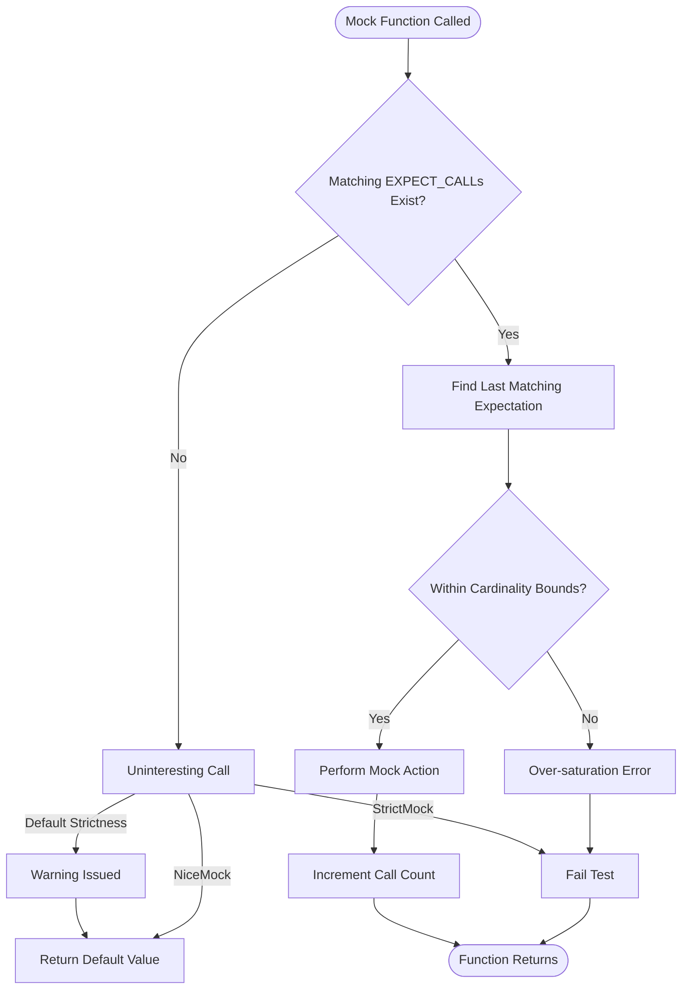

# Cardinalities and Strictness

This documentation explains how to set expectations on the number of times mock functions are called in GoogleMock using cardinalities, and how to adjust the strictness level of mock objects with wrappers such as `NiceMock`, `NaggyMock`, and `StrictMock`. Understanding these features lets you precisely control and verify interactions between your tests and mock objects, ensuring robust and maintainable test suites.

---

## 1. Understanding Cardinalities: Defining Call Count Expectations

Cardinality classes specify how many times a mock method is expected to be called. This abstraction allows you to express codelike English intent in your tests, such as "called at least twice" or "called exactly once".

### Built-in Cardinalities

GoogleMock provides several built-in cardinalities you can use with the `.Times()` clause in `EXPECT_CALL` statements to control call count expectations.

| Cardinality             | Meaning                                                        | Usage Example                      |
|------------------------|----------------------------------------------------------------|----------------------------------|
| `Exactly(n)`           | The method must be called exactly `n` times.                  | `.Times(Exactly(3))`              |
| `AtLeast(n)`           | The method must be called at least `n` times.                 | `.Times(AtLeast(2))`              |
| `AtMost(n)`            | The method must be called at most `n` times.                  | `.Times(AtMost(5))`               |
| `Between(m, n)`        | The method must be called between `m` and `n` times inclusive.| `.Times(Between(2, 4))`           |
| `AnyNumber()`          | The method can be called any number of times (0 or more).     | `.Times(AnyNumber())`             |
| `0`                    | The method must never be called (synonymous with `Exactly(0)`).| `.Times(0)`                      |

### Inferred Cardinalities

When `.Times()` is omitted, GoogleMock uses the following inference rules for cardinality based on the actions specified:

- No `WillOnce()` or `WillRepeatedly()`: inferred as `Exactly(1)`.
- N `WillOnce()` without `WillRepeatedly()`: inferred as `Exactly(N)` calls.
- N `WillOnce()` with `WillRepeatedly()`: inferred as `AtLeast(N)` calls.

### Specifying Cardinalities in Code

```cpp
using ::testing::AtLeast;
using ::testing::Exactly;
using ::testing::Between;
using ::testing::AnyNumber;

// Expect method Foo() exactly 3 times
EXPECT_CALL(mock_obj, Foo()).Times(Exactly(3));

// Expect bar() at least once
EXPECT_CALL(mock_obj, Bar(_)).Times(AtLeast(1));

// Expect baz() called between 2 and 4 times
EXPECT_CALL(mock_obj, Baz()).Times(Between(2, 4));

// Expect qux() can be called any number of times
EXPECT_CALL(mock_obj, Qux(_)).Times(AnyNumber());

// Expect never to call Eek()
EXPECT_CALL(mock_obj, Eek()).Times(0);
```

### Cardinality Behavior and Verification

Each cardinality provides methods to check if a call count satisfies or saturates the expectation:

- `IsSatisfiedByCallCount(call_count)`: returns `true` if the call count meets the cardinality.
- `IsSaturatedByCallCount(call_count)`: returns `true` if the call count reaches the maximum expected calls.
- `IsOverSaturatedByCallCount(call_count)`: `true` if the call count exceeds the upper bound.

GoogleMock verifies these constraints automatically during test execution and reports errors if expectations are violated.

### Human-readable Descriptions

Cardinalities can describe themselves in human-readable text, such as "called twice", "called at most once", or "called between 3 and 5 times", facilitating clear failure messages during verification.

---

## 2. Adjusting Mock Object Strictness: NiceMock, NaggyMock, and StrictMock

Beyond setting call count expectations, GoogleMock allows you to adjust how strictly uninteresting calls (calls to mock methods without expectations) are handled through mock object wrappers.

### Default Behavior: NaggyMock

By default, mock objects behave like **NaggyMocks**. This means:

- Uninteresting calls generate warnings, alerting you to calls with no expectation.
- The test still continues without failure.

This default helps catch potentially missing expectations without breaking tests immediately.

### NiceMock

`NiceMock<T>` wraps a mock type to suppress warnings on uninteresting calls. Use this when:

- You want a quiet test output ignoring calls to methods without expectations.
- Your test doesn’t care about some method calls and you want to suppress noise.

Usage example:

```cpp
using ::testing::NiceMock;

NiceMock<MockFoo> nice_mock;
EXPECT_CALL(nice_mock, ExpectedMethod());
```

This treats uninteresting calls as normal but logs no warnings.

### StrictMock

`StrictMock<T>` treats uninteresting calls as errors, causing test failures. Use this when:

- You want to ensure no unexpected calls go unnoticed.
- You prefer all mock method calls to be explicitly expected.

Usage example:

```cpp
using ::testing::StrictMock;

StrictMock<MockFoo> strict_mock;
EXPECT_CALL(strict_mock, ExpectedMethod());
```

If any mock method without an expectation is called, the test will fail.

### Summary Table

| Wrapper Mock    | Behavior on Uninteresting Calls | When to Use                             |
|-----------------|---------------------------------|---------------------------------------|
| Default (Naggy) | Warn only                       | General development; alert but not strict |
| NiceMock        | Silent                         | Suppress uninteresting call warnings  |
| StrictMock      | Failure                        | Enforce strict expectation adherence  |

### Caveats and Best Practices

- `NiceMock` and `StrictMock` only affect uninteresting calls, not unexpected calls (calls matching an expectation but with wrong arguments).
- They only affect mock methods defined directly via `MOCK_METHOD` in the mock class.
- Avoid combining or nesting these wrappers (e.g., `NiceMock<StrictMock<MockFoo>>` is unsupported).
- Make sure mock destructors are virtual for proper behavior.

---

## 3. Using Cardinalities and Strictness in Test Workflows

Combining cardinalities and strictness controls ensures your tests are precise and reliable:

### Typical Workflow Example

1. Use cardinalities to express call count expectations explicitly.

2. Wrap mock objects with `NiceMock` to silence unimportant warnings, or with `StrictMock` to enforce maximum rigor.

3. Use `EXPECT_CALL` to set specific interaction expectations, specifying cardinalities like `.Times(AtLeast(1))`.

4. Use `ON_CALL` for default behaviors without expectations.

### Example Scenario

```cpp
using ::testing::NiceMock;
using ::testing::AtLeast;

class MockDatabase {
 public:
  MOCK_METHOD(bool, Connect, (), ());
  MOCK_METHOD(bool, Query, (const std::string&), ());
};

TEST(ServiceTest, ConnectsAndQueries) {
  NiceMock<MockDatabase> mock_db;

  // Expect Connect to be called exactly once
  EXPECT_CALL(mock_db, Connect()).Times(Exactly(1));

  // Query can be called any number of times
  EXPECT_CALL(mock_db, Query(_)).Times(AnyNumber());

  Service s(&mock_db);
  s.Initialize();
  s.PerformQueries();
}
```

### Tips

- Use `Times(0)` to disallow a specific call.
- Use `RetiresOnSaturation()` if you want expectations to become inactive after satisfying their call count (see the gMock Cookbook).
- Remember that expectation order matters; later expectations override earlier ones when multiple match.

---

## 4. Troubleshooting Common Issues

### Unexpected Call Failures

If your test fails due to unexpected calls:

- Verify that you have set all necessary `EXPECT_CALL`s.
- Make sure arguments in `EXPECT_CALL` match actual call arguments.
- Use `NiceMock` to suppress warnings during test development.

### Cardinality Violations

- **Too few calls:** The actual call count was lower than the minimum expected.
- **Too many calls:** The actual call count exceeded the maximum.

GoogleMock will provide descriptive error messages with call counts and expectation descriptions.

### Uninteresting Call Warnings

- If you get warnings about uninteresting calls, consider if you want to add explicit expectations or suppress with `NiceMock`.

### Retiring Expectations

- If you encounter sticky expectations (matching calls beyond the cardinality), use `.RetiresOnSaturation()` to retire them automatically.

---

## 5. Further Reading and Related Documentation

- [gMock Cookbook](https://google.github.io/googletest/gmock_cook_book.html) - Recipes on writing mocks and expectations including cardinality control.
- [gMock Cheat Sheet](https://google.github.io/googletest/gmock_cheat_sheet.html) - Quick reference including cardinalities and mock object wrappers.
- [GoogleMock Mocking Reference](../docs/reference/mocking.md) - In-depth reference on macros, classes, and detailed usage.

---

## 6. Diagram: Cardinality Flow in Mock Calls



---

## 7. Summary

GoogleMock's cardinalities allow for flexible and expressive expectations on how often mock methods are called, aiding precise verification of interactions. Wrappers like `NiceMock` and `StrictMock` adjust the tolerance for uninteresting calls, helping to balance test verbosity and strictness. Mastery of these tools results in more robust, maintainable tests with clear failure reporting.
