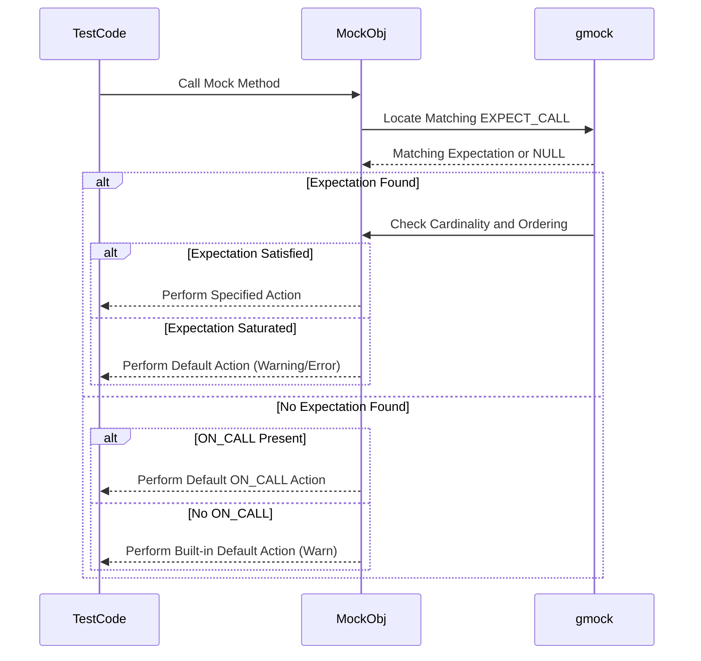

# Expectations, Actions, and Call Sequencing

GoogleMock empowers you to precisely specify and verify how mock objects are expected to behave and interact during testing. This page details how to construct expectations using `EXPECT_CALL`, set default behaviors with `ON_CALL`, control the call sequencing, and define call cardinalities. Through practical examples and advanced usage scenarios, you will learn to create robust, expressive tests that verify interactions accurately.

---

## 1. Setting Expectations with `EXPECT_CALL`

`EXPECT_CALL` is the core mechanism to define an expectation on a mock method. It specifies:

- **Which mock method** will be called
- **What arguments** are expected
- **How many times** it should be invoked (cardinality)
- **What it should do** on invocation (actions)
- **Ordering constraints** (sequences, partial ordering)

### Basic Usage

```cpp
EXPECT_CALL(mock_object, Method(arg_matchers...))
    .Times(cardinality)
    .WillOnce(action)
    .WillRepeatedly(action);
```

If you omit `.Times()`, GoogleMock infers it based on action clauses:

- No `WillOnce` or `WillRepeatedly`: defaults to `Times(1)`
- `n` `WillOnce()` and no `WillRepeatedly`: `Times(n)`
- `n` `WillOnce()` and a `WillRepeatedly()`: `Times(AtLeast(n))`

### Argument Matching

Arguments in `EXPECT_CALL` are matched using [GoogleMock matchers](reference/matchers.md). You can specify exact values, `_` wildcard, or complex predicates. For example:

```cpp
EXPECT_CALL(turtle, GoTo(50, _));  // X coordinate must be 50, Y can be anything.
EXPECT_CALL(turtle, Forward(Gt(100))); // Forward must be called with value > 100.
```

### Example

```cpp
using ::testing::Return;

MockTurtle turtle;
EXPECT_CALL(turtle, GetX())
    .Times(3)
    .WillOnce(Return(100))
    .WillOnce(Return(150))
    .WillRepeatedly(Return(200));

// The first call returns 100, second 150, subsequent calls 200.
EXPECT_EQ(100, turtle.GetX());
EXPECT_EQ(150, turtle.GetX());
EXPECT_EQ(200, turtle.GetX());
```

---

## 2. Setting Default Behaviors with `ON_CALL`

Sometimes you need to specify how a mock method should behave by default, without imposing an expectation it must be called. This is done via `ON_CALL`.

`ON_CALL` specifies default actions that run whenever a mock method is called without a matching `EXPECT_CALL`.

Example:

```cpp
ON_CALL(mock_object, Method(_))
    .WillByDefault(Return(default_value));
```

Unlike `EXPECT_CALL`, `ON_CALL` does *not* fail if the method is never called.

### Common Workflow

1. Create mock objects.
2. Use `ON_CALL` to specify common default behaviors.
3. Use `EXPECT_CALL` to specify test-specific expectations.

Use `ON_CALL` especially in test fixture setup to centralize default mock behavior.

---

## 3. Call Cardinalities: Controlling Call Counts

The number of expected calls to a mock method is specified by cardinalities, restricting how many times a method may or must be invoked.

### Built-in Cardinalities

| Cardinality         | Description                                   |
|---------------------|-----------------------------------------------|
| `AnyNumber()`       | Called any number of times (including zero).  |
| `AtLeast(n)`        | Called at least *n* times.                      |
| `AtMost(n)`         | Called at most *n* times.                       |
| `Between(m, n)`     | Called between *m* and *n* times inclusive.   |
| `Exactly(n)` or `n` | Called exactly *n* times.                       |

### Setting Cardinalities

```cpp
EXPECT_CALL(mock, Method())
    .Times(AtLeast(2));
EXPECT_CALL(mock, Method()).Times(3);
```

If you do not specify `.Times()`, GoogleMock infers it from `.WillOnce()` and `.WillRepeatedly()` clauses.

### Sample Usage

```cpp
EXPECT_CALL(turtle, PenDown()).Times(3);  // Expect exactly 3 calls.
EXPECT_CALL(turtle, Forward(_)).Times(AnyNumber()); // Allow any number.
```

### Custom Cardinalities

You can implement custom cardinalities by subclassing the `CardinalityInterface`. See [Writing New Cardinalities](reference/mocking.md#writing-new-cardinalities).

---

## 4. Controlling Call Order and Sequences

GoogleMock lets you verify not only *what* calls happen but *when* they happen in relation to others.

### 4.1. `Sequence` Objects

A `Sequence` establishes a total order on expectations. Expectations assigned to the same sequence must be invoked in the order defined.

```cpp
Sequence s;
EXPECT_CALL(mock, Foo(1)).InSequence(s);
EXPECT_CALL(mock, Foo(2)).InSequence(s);
```

`Foo(1)` must be called before `Foo(2)`.

### 4.2. `InSequence` RAII Helper

To sequence all expectations within a scope without naming a sequence:

```cpp
{
  InSequence seq;
  EXPECT_CALL(mock, A());
  EXPECT_CALL(mock, B());
}
// A() must be called before B().
```

### 4.3 Partial Ordering with `After`

The `.After()` clause specifies that an expectation can only be matched after one or more other expectations have been satisfied.

```cpp
Expectation e1 = EXPECT_CALL(mock, Init());
EXPECT_CALL(mock, Process()).After(e1);
```

`Process()` must be called after `Init()`.

You can specify up to five prerequisites or sets of expectations.

### 4.4 Multiple Sequences: Expressing DAGs

You can assign multiple sequences to an expectation to impose partial orders, allowing complex ordering constraints with only a few sequences.

```cpp
Sequence s1, s2;
EXPECT_CALL(mock, A()).InSequence(s1);
EXPECT_CALL(mock, B()).InSequence(s2);
EXPECT_CALL(mock, C()).InSequence(s1, s2);
```

This means `C()` can only be called after both sequences advance past their earlier expectations.

### 4.5 Retirement of Expectations

Expectations in a sequence retire (become inactive) once a subsequent expectation in the sequence has been satisfied. Retiring prevents the expectation from continuing to match calls.

Explicit `.RetiresOnSaturation()` can be used to retire an expectation as soon as its call limit is reached.

---

## 5. Specifying Mock Method Behavior (Actions)

You can specify what happens when a mock method is invoked via action clauses: `.WillOnce()` to define actions for specific calls, and `.WillRepeatedly()` to define a fallback for subsequent calls.

### 5.1. Specifying Actions

```cpp
EXPECT_CALL(mock, Method())
    .WillOnce(Return(1))
    .WillOnce(Return(2))
    .WillRepeatedly(Return(3));
```

The first call returns 1, second 2, all subsequent calls 3.

### 5.2. Built-in Actions

- `Return(value)`: Return a copy of `value`.
- `ReturnRef(variable)`: Return a reference to a variable.
- `Invoke(function_or_lambda)`: Call a function or lambda.
- `DoAll(action1, action2, ..., actionN)`: Perform a series of actions sequentially.
- `SetArgPointee<N>(value)`: Set the value pointed by argument N.

### 5.3. Combining Actions

You can combine multiple actions using `DoAll()`. The return value of the last action is used.

```cpp
EXPECT_CALL(mock, Method(_))
    .WillOnce(DoAll(SetArgPointee<0>(42), Return(true)));
```

### 5.4. Lambda and Functor Support

You can use lambdas or functor objects compatible with the mock method signature:

```cpp
EXPECT_CALL(mock, Method(_)).WillOnce([](int x) { return x * 2; });
```

### 5.5. Default Actions

If no action is specified for an `EXPECT_CALL`, GoogleMock performs a default action:
- Returns zero or default-constructed value for return types.
- Does nothing for `void` methods.

You can override these defaults with `ON_CALL` or `EXPECT_CALL` actions.

---

## 6. Managing Uninteresting and Unexpected Calls

GoogleMock differentiates:

- **Uninteresting calls:** calls to mock methods without any expectations set.
- **Unexpected calls:** calls to mock methods with expectations, but arguments do not match any.

#### Default Behavior

- Uninteresting calls generate warnings but do not fail tests.
- Unexpected calls cause test failures.

### Nice, Naggy, and Strict Mocks

- **NaggyMock (default):** Warn on uninteresting calls.
- **NiceMock:** Suppress warnings on uninteresting calls.
- **StrictMock:** Fail on uninteresting calls.

Use these wrappers to control default call handling:

```cpp
NiceMock<MockFoo> nice_mock;
NaggyMock<MockFoo> naggy_mock;
StrictMock<MockFoo> strict_mock;
```

---

## 7. Best Practices and Common Pitfalls

- Set `EXPECT_CALL` *before* exercising the code under test to ensure proper verification.
- Use `ON_CALL` for default behaviors when you do not need to verify a call.
- Avoid over-specifying arguments; use wildcards (`_`) or matchers to specify only necessary constraints.
- For flaky tests, reduce brittle ordering constraints unless you require strict sequences.
- Use `.RetiresOnSaturation()` to make expectations non-sticky and avoid failures from repeated calls beyond the expectation.
- When mocking overloaded methods, fully specify argument lists to avoid ambiguity.

---

## 8. Troubleshooting

### 8.1. Expectation Not Met

- Check if `EXPECT_CALL` was set before the mock method was invoked.
- Verify arguments match the specified matchers.

### 8.2. Unexpected Mock Function Call

- Ensure all calls are covered by an `EXPECT_CALL` or `ON_CALL` with appropriate matchers.
- Confirm mock strictness levels if you want uninteresting calls to fail or warn.

### 8.3. Actions Ran Out Warning

- Occurs when all `WillOnce()` actions are consumed but method is called more times.
- Add `WillRepeatedly()` clause or increase `.Times()` count.

### 8.4. Leaked Mocks Warning

- GoogleMock verifies expectations upon mock object destruction.
- If a mock object is leaked (not deleted), this verification is skipped, triggering a test warning or failure on exit.
- Use `testing::Mock::AllowLeak(&mock_obj);` to suppress if intentional.

---

## 9. Illustrative Example

```cpp
#include <gmock/gmock.h>
using ::testing::AtLeast;
using ::testing::Return;
using ::testing::Sequence;

class MockFoo {
public:
  MOCK_METHOD(int, Bar, (int x), ());
};

TEST(FooTest, Example) {
  MockFoo mock;
  Sequence seq;

  EXPECT_CALL(mock, Bar(5)).InSequence(seq).WillOnce(Return(10));
  EXPECT_CALL(mock, Bar(6)).InSequence(seq).WillRepeatedly(Return(20));

  // The following call sequence must happen in order.
  EXPECT_EQ(10, mock.Bar(5));
  EXPECT_EQ(20, mock.Bar(6));
  EXPECT_EQ(20, mock.Bar(6));

  // Calling Bar with 5 again would be unexpected and cause failure.
}
```

---

## 10. Additional Resources

- **Matchers Reference:** [reference/matchers.md](reference/matchers.md)
- **Actions Reference:** [reference/actions.md](reference/actions.md)
- **gMock Cookbook:** [docs/gmock_cook_book.md](docs/gmock_cook_book.md)
- **Mocking Reference:** [docs/reference/mocking.md](docs/reference/mocking.md)
- **gMock for Dummies:** [docs/gmock_for_dummies.md](docs/gmock_for_dummies.md)

Explore these to deepen your understanding of expectations, matchers, actions, and advanced mock usage.

---

## Diagram: Mock Call Evaluation Flow


