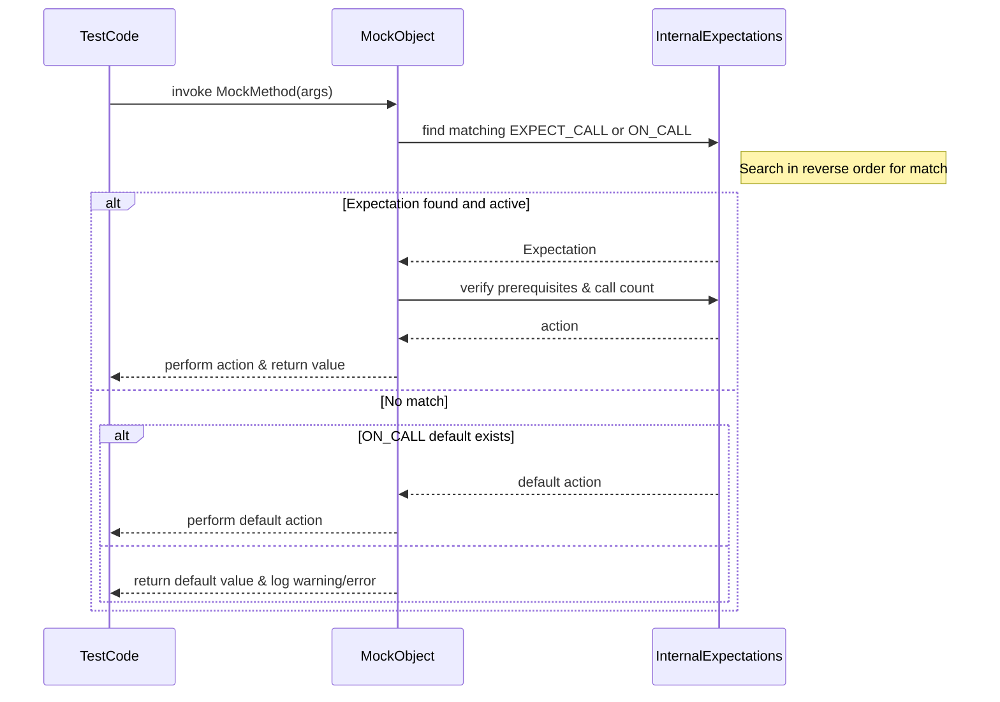

# Expectation Setting and Verification

This page details the core APIs and macros provided by GoogleMock for expressing and verifying expectations on mock objects. It covers how to use `ON_CALL` and `EXPECT_CALL` to set default behaviors and strict expectations, including advanced techniques for managing call sequences and argument matching. Practical usage scenarios, call ordering, and verification workflows are included to guide users in crafting precise and maintainable mock interactions.

---

## Overview

GoogleMock allows users to specify **expectations** and **default behaviors** on mock methods through two primary macros:

- **`ON_CALL(mock_object, Method(matchers))`**: Defines the *default action* for calls matching the given argument matchers. It configures how the mock should behave but does not assert that the call must actually happen.

- **`EXPECT_CALL(mock_object, Method(matchers))`**: Establishes an *expectation* that the mock method will be called with arguments matching the given matchers. It also specifies the behavior when that call occurs and provides ways to precisely verify call count, order, and argument properties.

Proper use of these APIs strikes a balance between specifying behavior and constraining tests to the necessary aspects of the code contract — avoiding brittle over-specification while ensuring correctness.

---

## ON_CALL: Specifying Default Behavior

### Purpose

`ON_CALL` expresses how a mock method should *normally* behave when called. Unlike `EXPECT_CALL`, it does **not** impose any constraint or expectation on whether or how many times the method is called.

### Syntax

```cpp
ON_CALL(mock_object, Method(matchers))  // matchers optional for non-overloaded
    .With(multi_arg_matcher)             // optional
    .WillByDefault(action);              // required
```

- `.With(...)` restricts the default action to calls whose **entire argument tuple** matches the multi-argument matcher.
- `.WillByDefault(...)` specifies the action performed when matching calls happen.

### Key Points
- Use `ON_CALL` to set up default behaviors shared across many tests.
- It avoids unnecessary constraints that would cause brittleness.
- The default actions specified by `ON_CALL` are overridden by matching `EXPECT_CALL` clauses.

### Example

```cpp
using ::testing::Return;

ON_CALL(mock_turtle, GetX())
    .WillByDefault(Return(10));

ON_CALL(mock_turtle, GoTo(_, _))
    .WillByDefault(Return());  // void method handled gracefully
```

---

## EXPECT_CALL: Setting Expectations and Verifications

### Purpose

`EXPECT_CALL` both specifies *how* a mock should behave when a matching call occurs and *verifies* that the call actually happens according to specified rules (arguments, call count, call order).

### Basic Syntax

```cpp
EXPECT_CALL(mock_object, Method(matchers))  // matchers optional for non-overloaded
    .With(multi_arg_matcher)                  // at most once
    .Times(cardinality)                       // at most once
    .InSequence(sequences...)                 // zero or more times
    .After(expectations...)                   // zero or more times
    .WillOnce(action)                         // zero or more times
    .WillRepeatedly(action)                   // at most once
    .RetiresOnSaturation();                   // at most once
```

### Explanation of Clauses

- `.With(multi_arg_matcher)` restricts matching to calls whose *complete tuple* of arguments matches.
- `.Times(cardinality)` specifies how many calls are expected — examples include `Exactly(n)`, `AtLeast(n)`, `AnyNumber()`, or a simple integer literal.
- `.InSequence(...)` defines sequences that enforce *strict call order*.
- `.After(...)` specifies that this call must come *after* other expectations (supports partial orders).
- `.WillOnce(action)` and `.WillRepeatedly(action)` define what the mock should do for one or many calls.
- `.RetiresOnSaturation()` causes the expectation to become inactive once saturated, important for composability and sequences.

### Cardinality Inference

If `.Times(...)` is omitted, GoogleMock infers it based on `.WillOnce()` and `.WillRepeatedly()`:

- No `WillOnce` or `WillRepeatedly` => `Times(1)`
- *n* times `WillOnce`, no `WillRepeatedly` => `Times(n)`
- *n* times `WillOnce` with one `WillRepeatedly` => `Times(AtLeast(n))`

### Example

```cpp
using ::testing::Return; 
using ::testing::_;
using ::testing::InSequence;
using ::testing::Exactly;

{
  InSequence s;

  EXPECT_CALL(mock_turtle, PenDown())
      .Times(Exactly(1));
  EXPECT_CALL(mock_turtle, Forward(100))
      .Times(Exactly(1));
  EXPECT_CALL(mock_turtle, PenUp())
      .Times(Exactly(1));
}
```

### Advanced Ordering

To impose specific sequences or partial orders on calls:

- Use an `InSequence` object to group expectations that must occur sequentially.
- Use `Sequence` objects and `.InSequence(seq1, seq2, ...)` for partial order DAGs.
- Use `.After(expectation_or_expectation_set)` to express that an expectation depends on prior expectations finishing.

### Sticky Expectations and Retirement

By default, expectations remain *sticky* — they stay active even after reaching the expected call count. Any further calls beyond the limit cause errors.

To avoid this and allow new expectations to take over, use `.RetiresOnSaturation()` which marks the expectation as inactive once saturated.

### Expected vs. Uninteresting Calls

- **Expected calls**: calls which match an `EXPECT_CALL` and obey all constraints.
- **Uninteresting calls**: calls with no matching `EXPECT_CALL`. By default, these cause warnings.
- Use `NiceMock<T>` to suppress warnings for uninteresting calls.
- Use `StrictMock<T>` to treat uninteresting calls as errors.

---

## Working with Argument Matching

Users specify argument expectations inside `EXPECT_CALL` and `ON_CALL` using:

- Concrete values (e.g., `100`, equivalent to `Eq(100)` matcher).
- Wildcard matcher `_` to accept any argument.
- Other builtin and custom matchers for flexible matching.
- `.With(...)` clause for complex combined argument checks.

---

## Typical User Workflow

<Steps>
<Step title="Define Mock Class">
Create a mock class with `MOCK_METHOD(...)` for methods you want to mock.
</Step>
<Step title="Set Default Behavior">
Use `ON_CALL` to define usual behaviors for mock methods without imposing call count constraints.
</Step>
<Step title="Set Expectations">
Use `EXPECT_CALL` to specify which calls must happen, with what arguments, how many times, and in what order.
</Step>
<Step title="Exercise Code Under Test">
Run code that exercises the mock; mismatches cause immediate test failures.
</Step>
<Step title="Verify Expectations">
GoogleMock verifies all expectations on mock destruction, or you can invoke `Mock::VerifyAndClearExpectations(m)` explicitly.
</Step>
</Steps>

---

## Practical Tips & Best Practices

- Use `ON_CALL` for general default behavior; reserve `EXPECT_CALL` for verifying critical interactions.
- Avoid over-specifying arguments unless necessary to keep tests maintainable.
- When specifying call sequences, use `InSequence` or explicit `Sequence` + `After` clauses.
- Actions specified in `WillOnce` and `WillRepeatedly` drive mock behavior; define them clearly.
- Remember to add `.RetiresOnSaturation()` for ordered calls or when chaining multiple expectations to prevent sticky failures.
- Use `NiceMock` to silence warnings about uninteresting calls if those calls are truly unimportant.
- Avoid setting expectations (`EXPECT_CALL`) after the code under test has invoked the mock.
- Always set expectations before exercising mocks; this is essential for reliable test execution.

---

## Troubleshooting Common Scenarios

<AccordionGroup title="Common Verification Issues">
<Accordion title="Unexpected Call Failures">
Occurs when a call with given arguments has no matching `EXPECT_CALL` or when the matching expectation is already saturated.

**Solution:** Double-check argument matchers, expand `EXPECT_CALL`s to include missed patterns, or add catch-all expectations with `_` matcher.
</Accordion>
<Accordion title="Uninteresting Call Warnings">
These happen when a method is called without any `EXPECT_CALL` specifying interest.

**Solution:** If calls are truly meaningless for the test, use `NiceMock` or add `EXPECT_CALL(...).Times(AnyNumber())`. Avoid adding unnecessary `EXPECT_CALL`s as it reduces test resilience.
</Accordion>
<Accordion title="Call Order Violations">
When calls occur out-of-sequence where `.InSequence()` or `.After()` clauses are used.

**Solution:** Adjust call order logic, or relax ordering constraints if order isn't critical.
</Accordion>
</AccordionGroup>

---

## Advanced Features

### Managing Complex Orders with `Sequence` and `After`

Divide expectations into `Sequence` objects and specify expectations' belonging sequences via `.InSequence(s1, s2, ...)`. Combine with `.After()` to express partial orders beyond strict linear sequences, allowing flexibility in call ordering.

Example:

```cpp
using ::testing::Sequence;
using ::testing::Expectation; 

Sequence s1, s2;

EXPECT_CALL(foo, A())
    .InSequence(s1, s2);
EXPECT_CALL(bar, B())
    .InSequence(s1);
EXPECT_CALL(bar, C())
    .InSequence(s2);
EXPECT_CALL(foo, D())
    .InSequence(s2);
```

Interprets the ordering A before B and C, and C before D, but B and C relative order is unspecified.

### Forcing Early Verification

If a mock object is dynamically allocated and its destruction is uncertain, use:

```cpp
Mock::VerifyAndClearExpectations(&mock_object);
```

This forces verification and clears expectations immediately.

---

## Summary

Mastering `ON_CALL` and `EXPECT_CALL` is essential to harnessing the power of GoogleMock. These macros empower you to define both flexible default behaviors and precise, verifiable expectations, managing cardinalities, sequences, and argument matchers to shape test intent. Use sequences and `After` to control call order, and balance sticky expectations with retirement policies to avoid brittle tests.

### Related Documentation

- [gMock Cookbook](https://github.com/google/googletest/blob/main/docs/gmock_cook_book.md): Practical recipes for using gMock
- [Mocking Reference](https://github.com/google/googletest/blob/main/docs/reference/mocking.md): Detailed API and feature explanation
- [Matchers Reference](https://github.com/google/googletest/blob/main/docs/api-reference/gtest-core/matchers-reference.md): Argument matching
- [Actions and Cardinalities](https://github.com/google/googletest/blob/main/docs/api-reference/gmock-api/actions-and-cardinalities.md): Customizing mock behaviors
- [Strict, Nice, and Naggy Mocking Modes](https://github.com/google/googletest/blob/main/docs/api-reference/gmock-api/strictness-and-mock-behavior.md): Handling uninteresting calls

### Next Steps

- Practice defining expectations with realistic scenarios
- Explore Call Order control with sequences
- Learn advanced matching and custom actions
- Review best practices to avoid overly brittle tests

---

## Diagram: Call Expectation and Verification Flow



---