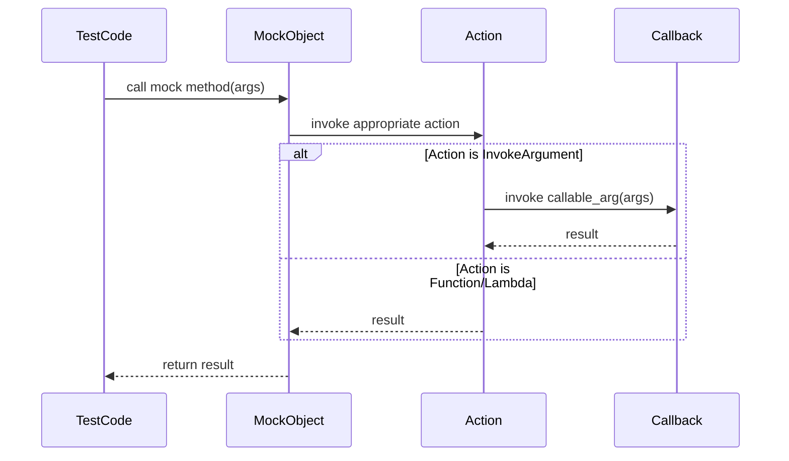

# Advanced Actions and Customization

GoogleMock offers powerful mechanisms to create flexible, parameterized actions, enabling sophisticated mocking scenarios beyond simple predefined behaviors. This page guides you through advanced techniques including variadic actions, defining custom behaviors, and extending the mocking framework using user-defined actions and utilities.

---

## Understanding and Creating Flexible Actions

Actions in gMock control what a mock method does when called. While basic actions like `Return()` or `Invoke()` cover many cases, advanced testing often requires parameterized or composite actions that react dynamically to inputs or maintain internal state.

### Variadic Actions

Sometimes you want an action that can accept a varying number of template parameters not known until use time, beyond what `ACTION()` or `ACTION_P*()` macros support. GoogleMock provides `ACTION_TEMPLATE` for this purpose.

#### Defining an ACTION_TEMPLATE

The `ACTION_TEMPLATE` macro lets you write an action that takes explicit template parameters and regular value parameters, allowing great flexibility for complex mocking behaviors.

```cpp
ACTION_TEMPLATE(DuplicateArg,
                HAS_2_TEMPLATE_PARAMS(int, k, typename, T),
                AND_1_VALUE_PARAMS(output)) {
  *output = T(::std::get<k>(args));
}
```

This example creates an action `DuplicateArg` that copies the `k`-th argument of the call as type `T` to the provided output pointer. It can be used like this:

```cpp
int n;
EXPECT_CALL(mock, Foo(_, _))
    .WillOnce(DuplicateArg<1, unsigned char>(&n));
```

This level of parameterization is essential for dynamic action creation and reusability.

### Key Notes on Variadic Actions

- Template parameters (`k` and `T` above) allow compile-time customization.
- Value parameters (`output`) configure run-time behavior.
- The expanded macro handles up to 10 template and value parameters.


## Customizing Action Behavior with Lambdas and Callables

Beyond macros, GoogleMock shines with its support for using arbitrary callables — functions, lambdas, functors — as mock method actions.

### Using Lambdas or Function Objects as Actions

You can directly specify a lambda to define complex behavior at the call site, including capturing variables or managing internal state.

```cpp
EXPECT_CALL(mock, Compute(_, _))
    .WillOnce([](int x, int y) { return x + y; });
```

This approach allows:

- Immediate, inline custom behavior without separate action definitions.
- Using captures for contextual data and state.
- Support for move-only types via `WillOnce` semantics.

### Using `Invoke` for Reusing Callables

If you have an existing function or method, you can use `Invoke()` to delegate the mock method call:

```cpp
int Add(int x, int y) { return x + y; }
EXPECT_CALL(mock, Compute(_, _))
    .WillOnce(Invoke(&Add));
```

Or invoke a member method:

```cpp
class Helper {
 public:
  bool IsPositive(int x) { return x > 0; }
};
Helper helper;
EXPECT_CALL(mock, Check(_))
    .WillOnce(Invoke(&helper, &Helper::IsPositive));
```


## Composite Actions and Sequencing of Effects

Realistic mocks often require performing multiple actions sequentially when a method is called, such as setting output arguments or deleting resources, combined with returning a value.

### Using `DoAll()` to Compose Multiple Actions

`DoAll(a1, a2, ..., an)` performs each sub-action in order, returning the result of the last one.

```cpp
EXPECT_CALL(mock, Process(_))
    .WillOnce(DoAll(
        SetArgPointee<0>(42),  // Side effect: set output arg
        Return(true)));       // Return value
```

**Important:** The last action must produce the correct function return type.

### Ignoring an Action Result

If you want to use an action that returns a value in a place where a `void` is expected (such as in `DoAll()` but not as the last action), wrap it with `IgnoreResult()`:

```cpp
EXPECT_CALL(mock, DoSomething())
    .WillOnce(DoAll(IgnoreResult(Invoke(SomeFunc)), Return()));
```


## Extending GoogleMock with User-Defined Actions

For highly specialized behaviors not covered by built-in or macro-defined actions, you can implement your own action classes.

### Writing New Monomorphic Actions

To create an action for a specific function signature `F`, implement `testing::ActionInterface<F>`.

Example:

```cpp
template <typename F>
class ActionInterface { ... };

template <>
class IncrementArgAction : public ActionInterface<int(int*)> {
 public:
  int Perform(const std::tuple<int*>& args) override {
    int* p = std::get<0>(args);
    return ++(*p);
  }
};

Action<int(int*)> IncrementArg() {
  return MakeAction(new IncrementArgAction);
}

// Usage:
EXPECT_CALL(mock, Baz(_)).WillOnce(IncrementArg());
```

This technique gives fine-grained control with full type safety but requires more code.

### Writing New Polymorphic Actions

To support multiple function signatures, implement a class with a templated `Perform()` method and wrap it using `MakePolymorphicAction()`:

```cpp
class ReturnSecondArgumentAction {
 public:
  template <typename R, typename Args>
  R Perform(const Args& args) const {
    return std::get<1>(args);
  }
};

PolymorphicAction<ReturnSecondArgumentAction> ReturnSecondArgument() {
  return MakePolymorphicAction(ReturnSecondArgumentAction());
}
```

Now `ReturnSecondArgument()` can be used for mock methods with any compatible signature.

## Using `InvokeArgument` to Call Callable Arguments

If your mock method takes a callback or functor pointer as an argument and you want to invoke it:

```cpp
EXPECT_CALL(mock, DoThis(_, _))
    .WillOnce(InvokeArgument<1>(5));
```

This calls the second argument (0-based) as a callable, passing `5` to it.

### Important Tips:

- Pass arguments by value unless references are explicitly wrapped using `std::ref()`.
- The callable can be a function pointer, functor, or callback.

## Best Practices for Advanced Actions

- Use `ON_CALL` to specify default behaviors without setting strict expectations.
- Use `EXPECT_CALL` when you want to assert that calls happen with specific parameters and frequencies.
- For sequences of calls, use `InSequence` or the `.After()` clause for partial ordering.
- Avoid overly strict expectations to reduce brittle tests.
- Use lambdas and custom actions to keep tests clear and expressive.
- Share complex reusable actions or matchers using variables.

## Troubleshooting Common Issues

- **Too many or too few `WillOnce()` actions**: GoogleMock warns if the action sequence doesn’t match the call count.
- **Memory or lifecycle issues**: Prefer delegating real behavior or fakes in combination with mocks.
- **Confusing overloads**: Use parameterless expectations or select overloads explicitly using `Const()` or typed matchers.

## Summary Diagram of Advanced Action Flow



---

## Additional Resources

- [gMock Cookbook – Using Actions](gmock_cook_book.md#UsingActions)
- [Actions Reference](reference/actions.md)
- [Mocking Reference – EXPECT_CALL and ON_CALL](reference/mocking.md#EXPECT_CALL)
- [gMock for Dummies](gmock_for_dummies.md)


---

## Practical Example: Combining Custom Action and Invocation

```cpp
class MockProcessor {
 public:
  MOCK_METHOD(bool, Process, (int input, std::function<void(int)> callback), ());
};

TEST(ProcessorTest, InvokesCallbackWithTransformedValue) {
  MockProcessor mock;

  EXPECT_CALL(mock, Process(_, _))
      .WillOnce(InvokeArgument<1>(42));  // Invoke callback with 42

  bool called = false;
  std::function<void(int)> callback = [&](int val) {
    EXPECT_EQ(val, 42);
    called = true;
  };

  mock.Process(10, callback);
  EXPECT_TRUE(called);
}
```

This test demonstrates how to invoke a callable argument passed to a mock method using `InvokeArgument` within a custom action flow.

---