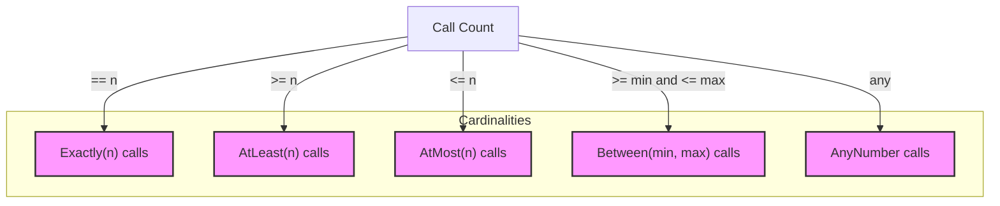

# Call Expectations & Cardinalities

This documentation focuses on the core concepts and APIs of *cardinalities* in GoogleMock, which allow you to control and assert how many times mock methods are expected to be called during your tests. It explains how to specify expected call counts, supports advanced cardinalities and user-defined ones, and demonstrates best practices along with troubleshooting tips.

---

## Overview of Cardinalities

Cardinalities describe the number of times a mock method is expected to be called. Rather than just exact counts, GoogleMock offers flexible, _fuzzy_ cardinalities such as "at least", "at most", and "between", letting you express expectations naturally.

At the core, a cardinality is an immutable object defining the valid call count range for a particular mock expectation. It answers questions like:

- Has the expected number of calls been satisfied?
- Has the maximum allowed calls been reached (saturated)?
- Has the call count exceeded the allowed number (over-saturated)?

### Built-in Cardinalities Provided

GoogleMock provides a collection of ready-to-use cardinalities in the [`testing`](https://github.com/google/googletest/tree/main/googlemock/include/gmock) namespace:

- `Exactly(n)`: Expect exactly _n_ calls.
- `AtLeast(n)`: Expect at least _n_ calls.
- `AtMost(n)`: Expect at most _n_ calls.
- `Between(min, max)`: Expect between _min_ and _max_ calls inclusive.
- `AnyNumber()`: Expect any number of calls (including none).

### Defining Expectations Using Cardinalities

The cardinalities are typically specified within mocking expectations using `.Times()`.

```cpp
using ::testing::Exactly;
using ::testing::AtLeast;
using ::testing::AtMost;
using ::testing::Between;
using ::testing::AnyNumber;

EXPECT_CALL(mock_object, Method())
    .Times(Exactly(3));    // Exactly 3 calls expected

EXPECT_CALL(mock_object, OtherMethod())
    .Times(AtLeast(1));   // One or more calls expected

EXPECT_CALL(mock_object, AnotherMethod())
    .Times(AtMost(5));    // Up to 5 calls allowed

EXPECT_CALL(mock_object, RareMethod())
    .Times(Between(2, 4)); // Between 2 and 4 calls expected

EXPECT_CALL(mock_object, FrequentMethod())
    .Times(AnyNumber());  // Any number of calls allowed
```

### Cardinality Behavior in Mocking

GoogleMock matches calls against the last matching expectation (newest override older) and applies cardinalities to verify whether calls meet the expected frequencies. It reports failures when too few or too many calls occur.

Multiple expectations on the same mock method are "sticky": they remain active and do not automatically retire unless explicitly specified.

## Understanding Cardinality API and Implementation

Behind the scene, a `Cardinality` is a lightweight copyable object that delegates to an implementation inheriting from `CardinalityInterface`. The interface exposes:

- `IsSatisfiedByCallCount(int call_count)`: Returns true if call_count is within the allowed range.
- `IsSaturatedByCallCount(int call_count)`: Returns true if call_count has reached or exceeded the upper bound.
- `IsOverSaturatedByCallCount(int call_count)`: Returns true if call_count exceeds the maximum allowed.
- `ConservativeLowerBound()`: Returns the minimum expected calls.
- `ConservativeUpperBound()`: Returns the maximum expected calls.
- `DescribeTo(std::ostream*)`: Writes a textual description.

Users don't usually deal with these details unless writing custom cardinalities.

## Detailed Explanation of Built-in Cardinalities

### Exactly(n)

Specifies an expectation that a method must be called exactly _n_ times.

- `IsSatisfiedByCallCount` returns `true` only if the call count equals `n`.
- `IsSaturatedByCallCount` is true if the call count is equal to or greater than `n`.
- Example:

```cpp
EXPECT_CALL(mock_obj, Func())
    .Times(Exactly(3));
```

Meaning the method should be called exactly three times; calls fewer than or greater than 3 will fail.

### AtLeast(n)

Specifies an expectation that the method is called *at least* _n_ times.

- `IsSatisfiedByCallCount` returns `true` if call count >= _n_.
- `IsSaturatedByCallCount` returns `false` until call count exceeds `INT_MAX` (never saturates practically).
- Useful for ensuring a minimum number of calls while not limiting the maximum.

Example:

```cpp
EXPECT_CALL(mock_obj, Func())
    .Times(AtLeast(2));
```

The method must be called twice or more times.

### AtMost(n)

Specifies an expectation that the method is called *at most* _n_ times.

- `IsSatisfiedByCallCount` returns `true` if call count <= _n_.
- `IsSaturatedByCallCount` returns `true` if call count == _n_.
- If called more than _n_ times, it's an over-saturation error.

Example:

```cpp
EXPECT_CALL(mock_obj, Func())
    .Times(AtMost(5));
```

The method can be called from 0 up to 5 times inclusively.

### Between(min, max)

Specifies an expectation that the method is called between _min_ and _max_ times inclusively.

- `IsSatisfiedByCallCount` is true if `min <= call_count <= max`.
- `IsSaturatedByCallCount` is true once call count reaches `max`.
- Validates that `0 <= min <= max`.

Example:

```cpp
EXPECT_CALL(mock_obj, Func())
    .Times(Between(2, 4));
```

The method is expected between 2 and 4 times.

### AnyNumber()

Allows any number of calls, including none.

- `IsSatisfiedByCallCount` always returns true.
- `IsSaturatedByCallCount` always return false (never saturates).

Example:

```cpp
EXPECT_CALL(mock_obj, Func())
    .Times(AnyNumber());
```

This is a catch-all for expected calls without limit.

## Custom Cardinalities

You can implement your own cardinalities by subclassing `CardinalityInterface` and overriding:

- `IsSatisfiedByCallCount` - returns true if the call count satisfies your criteria.
- `IsSaturatedByCallCount` - returns true if the call count saturates the expected range.
- `DescribeTo` - provides a human-readable description of the cardinality.

Then use `MakeCardinality()` to produce a `Cardinality` object usable in `.Times()`.

Example: Expect call count to be even number of times

```cpp
class EvenCardinality : public testing::CardinalityInterface {
 public:
  bool IsSatisfiedByCallCount(int call_count) const override {
    return (call_count % 2) == 0;
  }

  bool IsSaturatedByCallCount(int /* call_count */) const override {
    return false;  // Never saturates
  }

  void DescribeTo(std::ostream* os) const override {
    *os << "called even number of times";
  }
};

EXPECT_CALL(mock_obj, Method())
    .Times(testing::MakeCardinality(new EvenCardinality()));
```

## Examples of Cardinalities in Use

```cpp
class MockService {
 public:
  MOCK_METHOD(void, Process, (int data));
};

TEST(ServiceTest, AtLeastOnceCall) {
  MockService mock;
  EXPECT_CALL(mock, Process(42))
      .Times(testing::AtLeast(1));

  mock.Process(42);  // Passes
}

TEST(ServiceTest, ExactlyTwoCalls) {
  MockService mock;
  EXPECT_CALL(mock, Process(17))
      .Times(testing::Exactly(2));

  mock.Process(17);
  mock.Process(17);  // Passes
}

TEST(ServiceTest, BetweenCalls) {
  MockService mock;
  EXPECT_CALL(mock, Process(testing::_))
      .Times(testing::Between(1, 3));

  mock.Process(1);
  mock.Process(2);
  mock.Process(3); // Passes
}
```

## Troubleshooting Tips

- **Cardinality violations:** If your test fails indicating calls are "called more times than expected" or "fewer times than expected", check that your expectations' `.Times()` cardinality matches the code behavior.
- **Sticky expectations:** Expectations remain active even after upper bound by default. Use `.RetiresOnSaturation()` to retire them automatically after saturation to avoid unexpected matches.
- **Zero times expectation:** To assert a mock method is NOT called, set `.Times(Exactly(0))`.
- **Unclear failure messages:** Run your tests with `--gmock_verbose=info` to get detailed traces of calls and matched expectations.

## Summary

This page documented cardinalities in GoogleMock, which control and assert the expected number of calls for mock methods. You'll use these cardinalities in your `EXPECT_CALL(...).Times()` clauses to customize how strict or loose your call count expectations are.

Proper use of cardinalities lets you capture realistic interaction contracts with your mocks, improving test clarity and reliability.

---

## Related Links and Further Reading

- [Mocking Reference](./mocking.md) - Learn how to set expectations on mock calls.
- [gMock Cookbook](../guides/core-testing-workflows/test-doubles-with-googlemock.mdx) - Practical recipes using mocks.
- [Matchers Reference](reference/matchers.md) - Detailed info about argument matchers.
- [Actions Reference](reference/actions.md) - Customize mock behaviors.
- [Defining & Using Mocks](./mocking-api.mdx) - Overview of mock creation and usage.

---

## Diagram: Cardinalities and Call Count Relationship



---

## Best Practices

- Use `.Times(AnyNumber())` for methods you don't care about to suppress uninteresting call warnings.
- Prefer `AtLeast` or `Between` when flexibility is expected in the number of calls.
- Use `.RetiresOnSaturation()` for expectations representing sequenced steps to avoid sticky matches.
- Combine cardinalities with call sequencing (`InSequence`, `After`) for complex interaction verification.

<Tip>
Before setting overly strict or exact cardinalities, consider whether your test truly needs it. Overly strict timing or call count requirements can make tests brittle and hamper refactoring.
</Tip>

<Tip>
If an expectation is violated because of too few or too many calls, increase verbosity (`--gmock_verbose=info`) to trace actual calls and identify mismatches.
</Tip>

---

# Appendix: Cardinality Factory Function Usage

```cpp
using ::testing::AtLeast;
using ::testing::AtMost;
using ::testing::Between;
using ::testing::Exactly;
using ::testing::AnyNumber;

// For example:
EXPECT_CALL(mock_obj, Method())
    .Times(AtLeast(1));

EXPECT_CALL(mock_obj, Method())
    .Times(Exactly(3));

EXPECT_CALL(mock_obj, Method())
    .Times(Between(2, 5));

EXPECT_CALL(mock_obj, Method())
    .Times(AnyNumber());  // Accept any number of calls
```

# Reference: Cardinality Interface Declaration

```cpp
class CardinalityInterface {
 public:
  virtual ~CardinalityInterface() = default;

  virtual int ConservativeLowerBound() const { return 0; }
  virtual int ConservativeUpperBound() const { return INT_MAX; }

  virtual bool IsSatisfiedByCallCount(int call_count) const = 0;
  virtual bool IsSaturatedByCallCount(int call_count) const = 0;

  virtual void DescribeTo(std::ostream* os) const = 0;
};
```

Full API details can be found in `gmock/gmock-cardinalities.h`.

---

# Troubleshooting Common Issues

<AccordionGroup title="Common Issues and Solutions">
<Accordion title="I get errors about too many or too few calls">
Ensure that your `.Times()` cardinality matches the actual number of calls. Check for unintended extra calls or missing calls.

Use `.RetiresOnSaturation()` if you want an expectation to stop matching once fully satisfied.
</Accordion>
<Accordion title="Uninteresting call warnings appear unexpectedly">
If your mock method is called but no expectation is set, you'll get warnings by default.

Add `.Times(AnyNumber())` or use `NiceMock` to suppress these warnings if calls are legitimate but uninteresting.
</Accordion>
<Accordion title="How to expect that a method is never called?">
Use `.Times(Exactly(0))`.

Example:

```cpp
EXPECT_CALL(mock_obj, Method()).Times(0);
```
</Accordion>
</AccordionGroup>

---

# Further Exploration

Explore advanced call ordering techniques in the [Call Sequencing and Thread Safety](https://www.google.com/api-reference/gmock-apis/call-sequencing-threading) documentation.

---

_Last update: June 2024_

---

## External Links

- [GoogleMock GitHub Repository](https://github.com/google/googletest/tree/main/googlemock)
- [GoogleMock API Reference Main](https://github.com/google/googletest/blob/main/docs/reference/gmock-apis/mocking-api.md)
- [GoogleTest Official Documentation](https://github.com/google/googletest)
