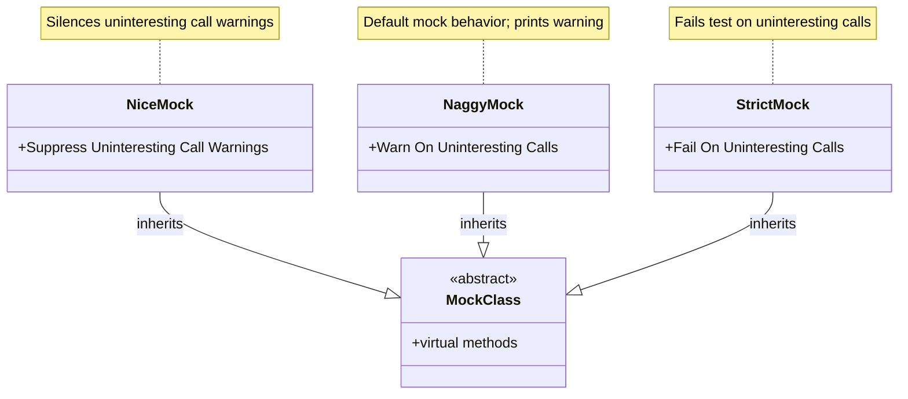

# Nice, Naggy, and Strict Mocks

GoogleMock offers a powerful way to control how mock objects respond to **uninteresting calls** — calls to mock methods that have no explicit expectations set. This page details the behavior modifier templates available to customize mock objects’ response to such calls: **NiceMock**, **NaggyMock**, and **StrictMock**.

These modifiers address common needs in test design: whether to silence, warn, or fail on uninteresting calls — helping you balance test maintainability and strictness.

---

## Understanding Uninteresting Calls

In GoogleMock, an *uninteresting call* is a call to a mock method that has **no matching EXPECT_CALL**. By default, the framework warns about these, as they might reveal oversights or unintended behaviors:

- You may have missed setting an expectation.
- Your code might be calling unexpected methods.

However, these warnings can clutter test output or be too strict depending on your testing strategy, which is why GoogleMock provides three distinct mock wrappers with tailored behaviors.

---

## Mock Behavior Modifiers

GoogleMock defines three class templates which wrap your mock classes and modify handling of uninteresting calls. Each template inherits from your mock class and modifies its behavior:

### 1. NiceMock<T>

- **Suppresses warnings** for uninteresting calls.
- Uninteresting calls proceed silently, returning default values.
- Ideal for tests where extraneous calls are benign and you want clean test output.
- Maintains normal error handling for **unexpected calls** (calls with arguments that do not match any EXPECT_CALL).

Example:

```cpp
using ::testing::NiceMock;

class MockFoo {
 public:
  MOCK_METHOD(void, DoSomething, ());
};

TEST(SomeTest, UsesNiceMock) {
  NiceMock<MockFoo> mock;
  EXPECT_CALL(mock, DoSomething());
  mock.DoSomething();    // OK
  mock.AnotherMethod();  // No warning, call ignored.
}
```

### 2. NaggyMock<T>

- The **default behavior** for raw mocks.
- Prints a **warning** message to stdout for each uninteresting call.
- Helps you spot calls that lack explicit expectations.
- Useful during test writing and debugging phases where missing EXPECT_CALLs should be flagged.

Usage is identical to NiceMock but differs in strictness:

```cpp
using ::testing::NaggyMock;

NaggyMock<MockFoo> naggy;
naggy.SomeMethod();  // Prints warning about uninteresting call.
```

Note: Currently, `MockFoo` (raw mock class) behaves like `NaggyMock<MockFoo>` by default. This may change to `NiceMock<MockFoo>` in the future.

### 3. StrictMock<T>

- Treats **all uninteresting calls as test failures (errors)**.
- Any uninteresting invocation fails the test immediately.
- Ensures no unexpected or unspecified interaction occurs.
- Suitable for tests aiming for maximal interaction correctness enforcement.

Example:

```cpp
using ::testing::StrictMock;

StrictMock<MockFoo> strict_mock;
EXPECT_CALL(strict_mock, DoSomething());
strict_mock.DoSomething();    // OK
strict_mock.OtherCall();      // Test fails immediately.
```

---

## Using the Mock Modifiers

Since these templates subclass your original mock class, you can:

- Use them anywhere your original mock is used.
- Pass constructor arguments transparently to your mock's constructor.
- Avoid changing your test logic except the mock wrapper used.

Example with constructor arguments:

```cpp
class MockBar {
 public:
  explicit MockBar(const std::string& name) {}
  MOCK_METHOD(void, Something, ());
};

NiceMock<MockBar> nice_mock("hello");
nice_mock.Something();
```

---

## Key Details and Limitations

- These behavior modifiers **only affect mock methods defined directly by the MOCK_METHOD macro in the mocked class T**. Mock methods inherited from base classes may not respect the modifier.
  - Nesting wrappers, e.g. `NiceMock<StrictMock<MockFoo>>`, is **not supported**.

- The wrappers ensure registration and deregistration of their strictness level around construction and destruction of the underlying mock, so the strictness level is consistent over the object’s lifetime.

- Currently, mock objects are by default **Naggy**. Plans exist to switch the default to **Nice** for better test maintainability.

- If your mock class does not have a virtual destructor, some of these modifiers may not work correctly.

---

## Practical Recommendations

- **Use `NiceMock` by default.** It silences noise while still enforcing expected calls.
- Use **`NaggyMock`** if you want active warning during test development.
- Reserve **`StrictMock`** for cases where you want to catch every unanticipated interaction.

When refactoring code, prefer `NiceMock` to reduce test maintenance overhead caused by incidental interactions. For troubleshooting or tightening tests, switch temporarily to `NaggyMock` or `StrictMock`.

---

## Troubleshooting

### Why do I get warnings about uninteresting calls?

- You are using a Naggy or raw mock.
- You can silence these with `NiceMock` if these calls are okay.
- Or add explicit expectations with `EXPECT_CALL(...).Times(AnyNumber())` if you want to keep Naggy behavior but acknowledge the calls.

### Unexpected failures with StrictMock

- Some code paths invoke mock methods without expectations.
- Either add explicit expectations or use `NiceMock` to relax.

### Why doesn't `NiceMock` silence all calls?

- The mock method is inherited from a base class, and GoogleMock may not be able to intercept uninteresting calls.
- Define mock methods directly in your mock class.

### I get errors when combining NiceMock, NaggyMock, and StrictMock

- Nesting or mixing these wrappers is disallowed.
- Choose a single modifier per mock object.

---

## Internal Usage Notes

GoogleMock internally uses lightweight RAII classes:

- `internal::NiceMockImpl` — registers allowance of uninteresting calls.
- `internal::NaggyMockImpl` — registers warnings on uninteresting calls.
- `internal::StrictMockImpl` — registers failures on uninteresting calls.

These register/deregister call reactions by a pointer derived from the mock object pointer, ensuring strictness level consistency and proper cleanup.

---

## Summary

| Modifier        | Suppresses Warnings | Prints Warnings | Fails On Uninteresting |
|-----------------|---------------------|----------------|------------------------|
| NiceMock<T>     | ✓                   |                |                        |
| NaggyMock<T>    |                     | ✓              |                        |
| StrictMock<T>   |                     |                | ✓                      |

---

## Additional Examples

```cpp
#include <gmock/gmock.h>
using ::testing::NiceMock;
using ::testing::NaggyMock;
using ::testing::StrictMock;

class MockFoo {
 public:
  MOCK_METHOD(void, FooMethod, ());
  MOCK_METHOD(int, BarMethod, (int));
  // ...
};

void TestNiceMock() {
  NiceMock<MockFoo> nice_mock;

  // No warning on uninteresting calls
  nice_mock.BarMethod(42);  // silent

  EXPECT_CALL(nice_mock, FooMethod());
  nice_mock.FooMethod();    // expected
}

void TestNaggyMock() {
  NaggyMock<MockFoo> naggy_mock;

  // Warning printed on uninteresting calls
  naggy_mock.BarMethod(42);  // warning to stdout

  EXPECT_CALL(naggy_mock, FooMethod());
  naggy_mock.FooMethod();    // expected
}

void TestStrictMock() {
  StrictMock<MockFoo> strict_mock;

  EXPECT_CALL(strict_mock, FooMethod());
  strict_mock.FooMethod();   // expected

  strict_mock.BarMethod(42);  // TEST FAILURE: uninteresting call
}
```

---

## References

- [Understanding Uninteresting vs Unexpected Calls](https://google.github.io/googletest/gmock_cook_book.html#uninteresting-vs-unexpected)
- [gMock Cookbook: The Nice, the Strict, and the Naggy](https://google.github.io/googletest/gmock_cook_book.html#NiceStrictNaggy)
- [`MOCK_METHOD` Macro Documentation](../reference/mocking.md#MOCK_METHOD)
- [`EXPECT_CALL` Macro Documentation](../reference/mocking.md#EXPECT_CALL)

---

## See Also

- [GoogleMock for Dummies](https://google.github.io/googletest/gmock_for_dummies.html)
- [gMock Cookbook](https://google.github.io/googletest/gmock_cook_book.html)
- [Mocking Reference](../reference/mocking.md)
- [Matchers Reference](../gmock-apis/matchers-reference.md)
- [Actions Reference](../gmock-apis/actions-reference.md)

---

## Diagram: Mock Behavior Modifier Relationships


