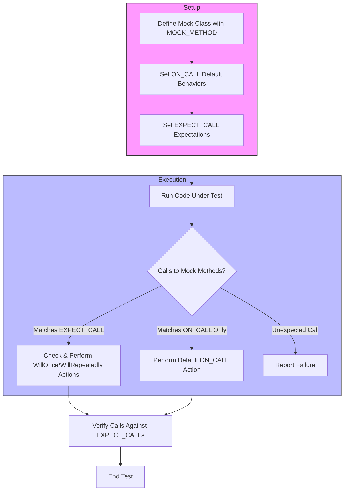

# Expectations and Behavior Specification

This page details how to specify expectations and define behaviors for mock objects in GoogleMock. It explains the usage of `EXPECT_CALL` and `ON_CALL` macros for setting up mock methods, including argument matching, call count specification, call sequencing, and dictating return values or actions. Presented are practical examples and advanced usage patterns to help you author precise, maintainable mock expectations.

---

## Setting Expectations with `EXPECT_CALL`

The `EXPECT_CALL` macro is your primary tool to specify that a mock method is expected to be called under specific conditions during the test. It lets you control what arguments the method should receive, how many times it will be called, the order of calls, and what it should do when invoked.

### Basic Syntax

```cpp
EXPECT_CALL(mock_object, Method(matchers))
    .Times(cardinality)
    .WillOnce(action)
    .WillRepeatedly(action);
```

- `mock_object`: Your mock instance.
- `Method`: The method name you expect to be called.
- `matchers`: Matchers specifying expected argument values or conditions.
- `Times`: How many times the call is expected (optional).
- `WillOnce` / `WillRepeatedly`: Specify behaviors on call invocations.

You may also omit matchers for methods that are not overloaded and want to accept any argument.

### Argument Matchers

Matchers specify constraints on the arguments passed to the mock method. They can express precise, partial, or wildcard expectations. Use `_` to match any value.

Examples:

```cpp
using ::testing::_;
using ::testing::Eq;

// Expect Forward(100) exactly once
EXPECT_CALL(turtle, Forward(100));

// Expect GoTo with x=50 and any y
EXPECT_CALL(turtle, GoTo(50, _));

// Expect Describe called with any arguments
EXPECT_CALL(foo, Describe);
```

### Cardinalities with `.Times()`

The `.Times()` clause sets how many times the mock method is expected to be called:

| Cardinality  | Description                         |
|--------------|-----------------------------------|
| AnyNumber()  | Any number of times allowed        |
| AtLeast(n)   | Called at least *n* times           |
| AtMost(n)    | Called at most *n* times            |
| Between(m,n) | Called between *m* and *n* times    |
| Exactly(n)   | Called exactly *n* times (default) |

If you omit `.Times()`, gMock infers it based on the presence of `.WillOnce()` and `.WillRepeatedly()` clauses.

### Defining Return Behavior with `.WillOnce()` and `.WillRepeatedly()`

These clauses specify what happens when the mock method is called.

- `.WillOnce(action)`: Defines the behavior for a single call; multiple `WillOnce` clauses define behaviors for consecutive calls.
- `.WillRepeatedly(action)`: Defines behavior for any subsequent calls after all `WillOnce` actions are exhausted.

Example:

```cpp
using ::testing::Return;
EXPECT_CALL(turtle, GetX())
    .WillOnce(Return(10))
    .WillOnce(Return(20))
    .WillRepeatedly(Return(30));
```

This means `GetX()` returns 10 on first call, 20 on second, and 30 on all subsequent calls.

### Ordering Calls

To control the order in which mock methods are called, use sequences and ordering clauses.

- `InSequence(sequence1, sequence2, ...)`: Ensures expectations occur in order within specified sequences.
- `.After(expectation_or_expectation_set...)`: Specifies that this expectation must occur after the listed expectations.

Example with sequences:

```cpp
using ::testing::Sequence;
Sequence s1, s2;
EXPECT_CALL(mock, FirstMethod()).InSequence(s1, s2);
EXPECT_CALL(mock, SecondMethod()).InSequence(s1);
EXPECT_CALL(mock, ThirdMethod()).InSequence(s2);
```

This means `FirstMethod()` must happen before both `SecondMethod()` and `ThirdMethod()`, and the sequence orders are enforced.

### Using `.With()` for Multi-Argument Matchers

The `.With(matcher)` clause allows you to specify constraints on the entire argument tuple rather than individual arguments, enabling conditions like "first argument less than second".

Example:

```cpp
EXPECT_CALL(mock, SetPosition(_, _))
    .With(Lt());  // Expects first argument < second argument
```

`.With()` must be the first clause if used.

### `.RetiresOnSaturation()` Clause

Prevents an expectation from matching any further calls once its call count limit is reached.

This is useful when multiple overlapping expectations exist, to avoid upper bound violations.

---

## Defining Default Behavior with `ON_CALL`

`ON_CALL` provides a way to specify what a mock method will do when called without enforcing that it *must* be called.

### Syntax

```cpp
ON_CALL(mock_object, Method(matchers))
    .With(multi_argument_matcher)  // Optional
    .WillByDefault(action);
```

This does not set call expectations but defines default actions taken when the method is called with matching arguments.

Example:

```cpp
using ::testing::Return;
ON_CALL(turtle, GetX()).WillByDefault(Return(10));
```

This means if no behavior or expectation was specifically set for `GetX()`, calling it returns 10.

### `.With()` Clause

Similar to `EXPECT_CALL`, `.With()` filters which argument tuples the default action applies to.

### Overriding Default Behavior

Explicit `EXPECT_CALL`s take precedence over `ON_CALL` default behaviors. If `EXPECT_CALL` specifies behavior, it overrides the default action set by `ON_CALL` for matching arguments.

---

## Mock Classes and Macros for Expectations

GoogleMock defines key macros and classes related to expectations:

### The `MOCK_METHOD` Macro

Used inside the public section of a mock class to define a mock method that can have expectations set on it.

Example:

```cpp
class MockTurtle : public Turtle {
 public:
  MOCK_METHOD(void, PenUp, (), (override));
  MOCK_METHOD(int, GetX, (), (const, override));
};
```

### The `EXPECT_CALL` Macro

Used in tests to specify an expectation on a mock method before the code under test is exercised.

Example:

```cpp
EXPECT_CALL(mock_turtle, PenDown()).Times(AtLeast(1));
```

### The `ON_CALL` Macro

Used to define default behaviors that do not set expectations.

### `NiceMock`, `NaggyMock`, and `StrictMock`

These templates wrap mock classes to control behavior on uninteresting calls:

- `NiceMock`: suppresses warnings on uninteresting calls.
- `NaggyMock`: prints warnings on uninteresting calls (default).
- `StrictMock`: treats uninteresting calls as errors.

---

## Practical Usage Patterns

### Typical Mocking Workflow

1. Define or include a mock class with mocked methods using `MOCK_METHOD`.
2. Set default behaviors using `ON_CALL` in the test fixture or setup.
3. Set expectations with `EXPECT_CALL` before exercising code.
4. Run the code under test.
5. Verify that expectations were met (happens automatically when mocks are destroyed or you can call `Mock::VerifyAndClearExpectations`).

### Controlling Call Order Example

```cpp
using ::testing::InSequence;
using ::testing::_;

{
  InSequence s;
  EXPECT_CALL(mock, Init());
  EXPECT_CALL(mock, Start());
  EXPECT_CALL(mock, Stop());
}

// The code must call Init(), then Start(), then Stop(), in order.
```

### Dealing with Overloaded Methods

Use matching signatures and qualifiers in `MOCK_METHOD`. Use the `Const()` wrapper to disambiguate const overloads:

```cpp
EXPECT_CALL(Const(mock), GetBar());
```

### Returning Values or Invoking Actions

You can use built-in actions like `Return()`, `ReturnRef()`, or custom lambdas:

```cpp
EXPECT_CALL(mock, Foo(_))
    .WillOnce(Return(42))
    .WillRepeatedly([](int x) { return x * 2; });
```

### Setting Expectations Without Specifying Arguments

If argument matching is irrelevant, omit arguments for non-overloaded methods:

```cpp
EXPECT_CALL(mock, Foo).Times(2);
```

---

## Troubleshooting Common Expectation Issues

### Understanding Uninteresting vs Unexpected Calls

- **Uninteresting call**: No expectations (`EXPECT_CALL`) set on this method. Not an error but may cause warnings.
- **Unexpected call**: Arguments do not match any existing expectation. Always an error.

### Failing Test Due to Call Count Mismatch

If the actual calls differ from expected (`Times`) count, you’ll get a failure with detailed diagnostics.

### Using `.RetiresOnSaturation()` to Avoid Sticky Expectations

By default, expectations stay active after saturation causing conflicts if the same expectation would be matched again. Use `.RetiresOnSaturation()` to prevent this.

### Setting Default Actions to Avoid Warnings

Use `ON_CALL` or `EXPECT_CALL(...).WillRepeatedly(...)` to define behavior for calls without explicit expectations.

### Verifying and Clearing Expectations Explicitly

You can force verification before mock destruction:

```cpp
ASSERT_TRUE(Mock::VerifyAndClearExpectations(&mock));
```

Avoid setting new expectations after verification, as behavior is undefined.

---

## Summary Diagram



---

## Additional Resources

- [gMock for Dummies](https://google.github.io/googletest/gmock_for_dummies.html) — Beginner friendly introduction
- [gMock Cookbook](https://google.github.io/googletest/gmock_cook_book.html) — Detailed recipes and best practices
- [Mocking Reference](reference/mocking.md) — API reference for `MOCK_METHOD`, `EXPECT_CALL`, `ON_CALL`
- [Matchers Reference](reference/matchers.md) — Complete list of argument matchers
- [Actions Reference](reference/actions.md) — Built-in actions to use with mocks

---

## Tips

- Always set `EXPECT_CALL` before calling the code under test to avoid undefined behavior.
- Use `.RetiresOnSaturation()` when the same expectation might be matched multiple times but should only be active for a limited number of calls.
- For complex argument constraints, use advanced matchers or the `.With()` clause.
- Use sequences and `.After()` to enforce call order in tests.
- To suppress warnings on uninteresting calls, use `NiceMock` or define catch-all expectations with `.Times(AnyNumber())`.
