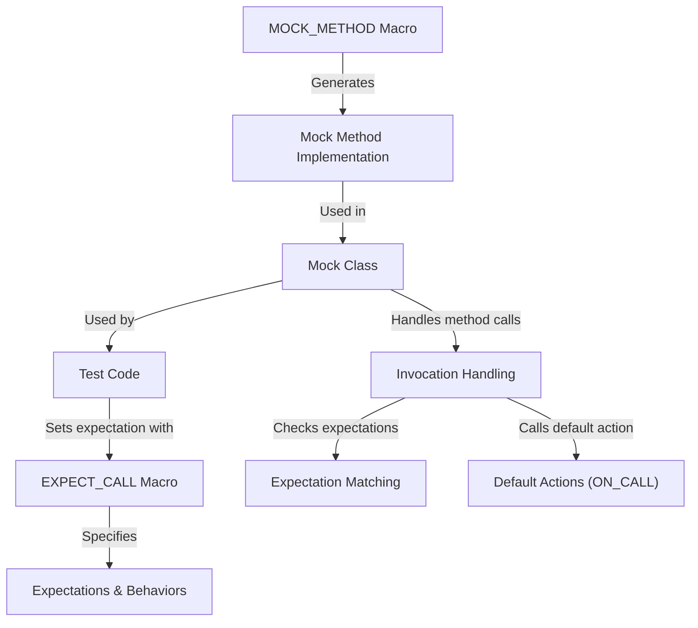

# Mock Object Definition and Usage

This documentation provides comprehensive guidance on defining and using mock classes in GoogleMock (gMock). It covers the APIs and recommended macros you need to create mock objects, declare mock methods, and integrate mocks effectively in your C++ unit tests. You’ll find detailed explanations of the `MOCK_METHOD` macro, handling function signatures (including overloaded and templated methods), and best practices to ensure readable, maintainable mock code.

---

## Contents

- [Defining Mock Methods with `MOCK_METHOD`](#defining-mock-methods-with-mock_method)
- [Using `EXPECT_CALL` to Set Expectations](#using-expect_call-to-set-expectations)
- [Handling Overloaded and Templated Methods](#handling-overloaded-and-templated-methods)
- [Mocking Non-Virtual Methods](#mocking-non-virtual-methods)
- [Best Practices for Mock Class Definitions](#best-practices-for-mock-class-definitions)

---

## Defining Mock Methods with `MOCK_METHOD`

The fundamental way to define a mock method inside your mock class is with the `MOCK_METHOD` macro:

```cpp
MOCK_METHOD(return_type, method_name, (args...), (specifiers...));
```

- *return_type* is the return type of the method you want to mock.
- *method_name* is the name of the method.
- *args...* is the argument type list enclosed in parentheses.
- *specifiers...* are optional qualifiers like `const`, `override`, `noexcept`, calling convention, or reference qualifiers.

### Examples

```cpp
class MockTurtle : public Turtle {
 public:
  MOCK_METHOD(void, PenUp, (), (override));
  MOCK_METHOD(void, PenDown, (), (override));
  MOCK_METHOD(void, Forward, (int distance), (override));
  MOCK_METHOD(void, Turn, (int degrees), (override));
  MOCK_METHOD(void, GoTo, (int x, int y), (override));
  MOCK_METHOD(int, GetX, (), (const, override));
  MOCK_METHOD(int, GetY, (), (const, override));
};
```

This automatically generates all necessary method definitions and mocking logic.

### Handling Commas in Types

If your return type or argument types contain commas (e.g., templates like `std::pair<int, int>`), you must wrap the type in extra parentheses or use type aliases to ensure `MOCK_METHOD` parses correctly:

```cpp
class MockFoo {
 public:
  // Using parentheses:
  MOCK_METHOD((std::pair<int, int>), GetPair, ());
  MOCK_METHOD(bool, CheckMap, ((std::map<int, double>), bool));

  // Or using aliases:
  using BoolAndInt = std::pair<int, int>;
  using MapIntDouble = std::map<int, double>;

  MOCK_METHOD(BoolAndInt, GetPair, ());
  MOCK_METHOD(bool, CheckMap, (MapIntDouble, bool));
};
```

### Specifiers

- `const`: Mock method is const-qualified.
- `override`: Marks the method as overriding a virtual base.
- `noexcept`: Indicates noexcept.
- `Calltype(...)`: Specifies calling convention (e.g., Windows-specific).
- `ref(...)`: Adds reference qualifiers (e.g., `ref(&)` or `ref(&&)`).

Include appropriate specifiers to match the overridden method’s signature.

---

## Using `EXPECT_CALL` to Set Expectations

Once you’ve defined mock methods, set expectations using the `EXPECT_CALL` macro to specify expected calls, arguments, call count, ordering, and behaviors.

```cpp
EXPECT_CALL(mock_object, Method(matchers...))
    .With(multi_argument_matcher)  // Optional
    .Times(cardinality)            // Optional
    .InSequence(sequences...)      // Optional
    .After(expectations...)        // Optional
    .WillOnce(action)              // Optional
    .WillRepeatedly(action)        // Optional
    .RetiresOnSaturation();        // Optional
```

Refer to the detailed [Expectations and Call Control](https://google.github.io/googletest/reference/mocking.html#EXPECT_CALL) documentation for the semantics of these clauses.

---

## Handling Overloaded and Templated Methods

When mocking overloaded methods, the `MOCK_METHOD` macro requires you to distinguish among the overloads by their argument types. Define each overload explicitly:

```cpp
class MockFoo : public Foo {
  MOCK_METHOD(int, Add, (Element x), (override));
  MOCK_METHOD(int, Add, (int times, Element x), (override));

  MOCK_METHOD(Bar&, GetBar, (), (override));
  MOCK_METHOD(const Bar&, GetBar, (), (const, override));
};
```

For templated classes:

```cpp
template <typename Elem>
class MockStack : public StackInterface<Elem> {
 public:
  MOCK_METHOD(int, GetSize, (), (const, override));
  MOCK_METHOD(void, Push, (const Elem& x), (override));
};
```

### Selecting Overloads in Expectations

- Use `Const(mock)` wrapper to specify expectations on const methods.
- Use typed matchers or the `Matcher<T>` cast to disambiguate argument matcher types.

### Note on Access Level

Declare all `MOCK_METHOD` macros in the `public:` section, regardless of original access specifiers.

---

## Mocking Non-Virtual Methods

You can mock non-virtual methods for high-performance dependency injection. Define a mock class unrelated to the real class but with matching methods:

```cpp
class MockPacketStream {
 public:
  MOCK_METHOD(const Packet*, GetPacket, (size_t packet_number), (const));
  MOCK_METHOD(size_t, NumberOfPackets, (), (const));
};
```

Use template-based or compile-time polymorphism to inject these mocks.

---

## Best Practices for Mock Class Definitions

- Always put `MOCK_METHOD` declarations in the `public:` section.
- Use `override` to catch signature mismatches.
- Wrap types containing commas in parentheses or use `using` aliases.
- Distinguish overloaded methods explicitly.
- Avoid mocking incomplete types unless printers are defined.
- For methods with move-only arguments, use `MOCK_METHOD` as usual and specify actions with lambdas if needed.
- Define constructors and destructors out of line (`.cc`) for compilation speed improvements if necessary.

---

## Example: Simplified Mock Class

```cpp
#include <gmock/gmock.h>

class MockTurtle : public Turtle {
 public:
  MOCK_METHOD(void, PenUp, (), (override));
  MOCK_METHOD(void, PenDown, (), (override));
  MOCK_METHOD(void, Forward, (int distance), (override));
  MOCK_METHOD(int, GetX, (), (const, override));
};
```

---

For detailed usage scenarios and advanced features like sequences, cardinalities, and default actions, refer to the linked documentation below.

---

## Additional References

- [Mocking Reference (EXPECT_CALL and ON_CALL)](https://google.github.io/googletest/reference/mocking.html)
- [gMock for Dummies - Beginner Friendly Guide](https://google.github.io/googletest/gmock_for_dummies.html)
- [gMock Cookbook - Recipes and Patterns](https://google.github.io/googletest/gmock_cook_book.html)
- [Matchers and Actions API](https://google.github.io/googletest/reference/matchers.html)

---

<SummaryDiagram>
