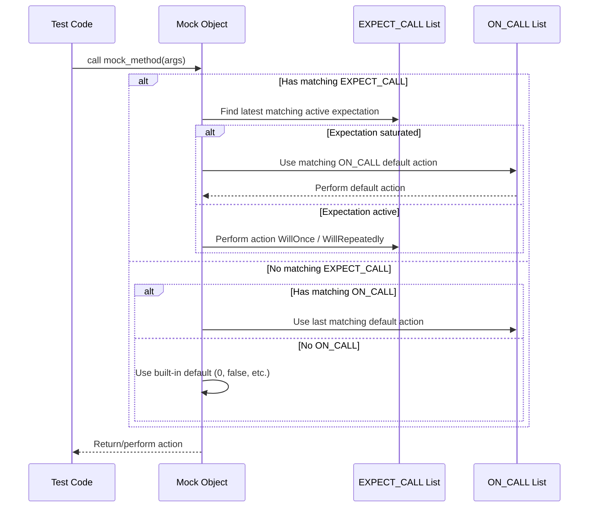

# Expectations, Actions & Sequences

This documentation explains how you specify interactions and behaviors of mock methods using GoogleMock. Learn how to set expectations, configure default actions, and control the order of calls using sequences. Key macros such as `ON_CALL` and `EXPECT_CALL`, along with supporting utilities, are detailed here to enable precise and expressive mock setups.

---

## Overview

Mocking lets you define *what* calls you expect on an object during a test, *how often* those calls happen, *what arguments* they receive, *what they do* (return values or side effects), and *in which order* calls must occur.

GoogleMock provides two core macros for this:

- **`ON_CALL`**: Specifies the *default behavior* of a mock method when called. Does not assert calls are made.
- **`EXPECT_CALL`**: Specifies *explicit expectations* on mock method calls, including argument matchers, call counts, actions, and order.

These macros, combined with clauses like `.Times()`, `.WillOnce()`, `.WillRepeatedly()`, `.InSequence()`, and `.After()`, provide a domain-specific language (DSL) for rich interaction-based testing.

---

## 1. Setting Expectations with `EXPECT_CALL`

The `EXPECT_CALL` macro is used to declare the interactions you *expect* your code under test to have with the mock object. It establishes:

- Which mock method is expected to be called.
- What arguments it should receive (using matchers).
- How many times to call it (cardinality).
- What the call should do (return values or actions).
- The order of calls relative to other expectations.

### Syntax

```cpp
EXPECT_CALL(mock_object, MethodName(matchers...))
    .With(multi_argument_matcher)  // Optional, restricts arguments as a tuple
    .Times(cardinality)            // Optional, how many calls expected
    .InSequence(sequences...)      // Optional, sequences for ordering
    .After(expectations...)        // Optional, call ordering relative to others
    .WillOnce(action)              // Optional, defines action for a single call
    .WillRepeatedly(action)        // Optional, defines action for all subsequent calls
    .RetiresOnSaturation();        // Optional, retires expectation after fulfilled
```

- The `mock_object` is the instance of your mock.
- `MethodName` is the mocked method.
- `matchers...` are argument constraints (e.g., `_, Eq(5)`, or specific values).

### Key Clauses Explained

- **`Times(cardinality)`**: Defines *how many times* the method is expected to be called. Cardinalities include:
  - `Exactly(n)`, `AtLeast(n)`, `AtMost(n)`, `Between(m, n)`, `AnyNumber()`.
  - Omitting `Times()` makes gMock infer cardinality from actions set.

- **`WillOnce(action)` and `WillRepeatedly(action)`**: Describe what happens when the mock method is called.
  - `WillOnce()` actions are performed in call order.
  - `WillRepeatedly()` action handles all calls after all `WillOnce()` actions are used.
  - If no action is specified, a built-in default or `ON_CALL`'s default action applies.

- **`InSequence(sequences...)`**: Assigns this expectation to one or more sequences, imposing a strict order of calls within those sequences.

- **`After(expectations...)`**: Ensures this call only occurs after specified expectations have been satisfied.

- **`RetiresOnSaturation()`**: Automatically retires the expectation when the expected number of calls is reached, so subsequent calls do not match it anymore.

### Examples

```cpp
using ::testing::Return;
using ::testing::_;
using ::testing::AtLeast;

EXPECT_CALL(turtle, GetX())
    .Times(5)
    .WillOnce(Return(100))
    .WillOnce(Return(150))
    .WillRepeatedly(Return(200));

EXPECT_CALL(turtle, GoTo(50, _))
    .Times(AtLeast(1));

Sequence s;
EXPECT_CALL(turtle, PenDown()).InSequence(s);
EXPECT_CALL(turtle, Forward(100)).InSequence(s);
EXPECT_CALL(turtle, PenUp()).InSequence(s);
```

### Matchers for Arguments

- Use concrete values or general matchers (`_` for any value, `Ge(5)` for >=5, etc.).
- If you want to match the argument tuple as a whole, use `.With()` clause with a multi-argument matcher.

### Important Rules

- `EXPECT_CALL`s must be set *before* the mock methods are called.
- If multiple expectations match a call, the most recent registered (last defined) matching expectation is chosen.
- Overly strict expectations can cause brittle tests; prefer specifying only needed arguments and correct cardinality.

---

## 2. Setting Default Behaviors with `ON_CALL`

While `EXPECT_CALL` sets mandatory expectations, `ON_CALL` defines how a mock method *should behave* when called, without requiring the call to happen.

### Syntax

```cpp
ON_CALL(mock_object, MethodName(matchers...))
    .With(multi_argument_matcher)  // Optional
    .WillByDefault(action);         // Required
```

- `ON_CALL` lets you specify default actions for method calls matching given arguments.
- If no `ON_CALL` matches, the default built-in behavior applies (e.g., return 0, false, default-constructed value).
- `ON_CALL` can be defined multiple times; later ones override earlier ones if matching.

### Usage Pattern

You typically use `ON_CALL` in test fixtures or mock constructors to set up common default behaviors shared by tests.

```cpp
ON_CALL(foo, Bar(_)).WillByDefault(Return(true));
```

### Difference from `EXPECT_CALL`

- `EXPECT_CALL` sets *required* calls and verifies number and order.
- `ON_CALL` only sets *default* behavior; calls may or may not happen.

### Example

```cpp
#include <gmock/gmock.h>

class MockTurtle : public Turtle {
 public:
  MOCK_METHOD(int, GetX, (), (const, override));
  MOCK_METHOD(void, PenDown, (), (override));
  // ...
};

TEST(PainterTest, DefaultPenDown) {
  MockTurtle turtle;
  ON_CALL(turtle, PenDown()).WillByDefault(::testing::Return());
  // No EXPECT_CALL on PenDown, so no checks on call count
  // But behavior is defined if PenDown() is called.

  Painter painter(&turtle);
  painter.Draw();  // will use PenDown if it calls it
}
```

---

## 3. Controlling Call Order with Sequences

GoogleMock supports verifying that method calls occur in a specified order using sequences.

### Using the `Sequence` class

Create `Sequence` objects to represent partial ordering constraints, and attach expectations using `.InSequence()`:

```cpp
Sequence s1, s2;
EXPECT_CALL(foo, Reset())      .InSequence(s1, s2);
EXPECT_CALL(foo, GetSize())    .InSequence(s1);
EXPECT_CALL(foo, Describe())   .InSequence(s2);
```

This means:

- `Reset()` must be called before `GetSize()` (because both are in `s1`).
- `Reset()` must be called before `Describe()` (because both are in `s2`).
- `GetSize()` and `Describe()` can be called in any order relative to each other.

### Using `InSequence` helper

For simple sequential ordering within a scope, `InSequence` helps:

```cpp
using ::testing::InSequence;
{
  InSequence seq;
  EXPECT_CALL(mock, Foo());
  EXPECT_CALL(mock, Bar());
  EXPECT_CALL(mock, Baz());
}
```

All expectations inside the block are enforced in order: first `Foo()`, then `Bar()`, then `Baz()`.

### Using `.After()` to define custom partial order

Alternatively, specify dependencies explicitly with `.After()`:

```cpp
Expectation e1 = EXPECT_CALL(foo, Init());
EXPECT_CALL(foo, Run()).After(e1);
```

This requires `Init()` to be called before `Run()`. `.After()` can accept multiple expectations or sets, allowing arbitrary DAGs of call order constraints.

---

## 4. Actions: Defining What Mock Methods Do

Actions dictate the behavior of mock methods when invoked.

### Built-in and Custom Actions

- Use pre-defined actions like `Return(value)`, `ReturnRef(var)`, `Invoke(func)`, `SetArgPointee<N>(value)`, `DoAll()`.
- Create custom actions through lambdas or function objects compatible with the mock method signature.

### Action Composition

- `.WillOnce(action)` defines behavior for one call.
- `.WillRepeatedly(action)` defines behavior for all subsequent calls after `.WillOnce` actions are exhausted.
- Omit `Times()` to have gMock infer call counts from the number of `.WillOnce` clauses.

### Example

```cpp
EXPECT_CALL(foo, GetX())
    .Times(3)
    .WillOnce(Return(3))
    .WillOnce(Return(5))
    .WillRepeatedly(Return(7));
```

- Returns 3 on first call, 5 on second, 7 on all further calls.

---

## 5. Practical Tips & Best Practices

- **Use `ON_CALL` for default behaviors**, so tests don’t over-specify interactions.
- **Use `EXPECT_CALL` to assert exactly what interactions must occur**, capturing key calls.
- **Add sequences only when call order matters.** Over-constraining order can cause brittle tests.
- **Leverage `.RetiresOnSaturation()`** to have expectations auto-retire when fulfilled, improving test flexibility.
- **Beware of sticky expectations;** use `.RetiresOnSaturation()` or sequences to prevent unexpected upper-bound violations.
- When writing multiple expectations on the same method, place more general expectations first and more specific ones later, since newer expectations override older matching ones.

### Troubleshooting Common Scenarios

- **Unexpected calls:** Occur when a call doesn’t match any `EXPECT_CALL`. These result in test failures with detailed messages.
- **Uninteresting calls:** Calls to methods without `EXPECT_CALL` produce warnings unless suppressed via `NiceMock` or adding catch-all `EXPECT_CALL(...).Times(AnyNumber())`.
- **Call order failures:** Check sequences and `.After()` constraints; out-of-order calls trigger error messages.
- **Too many or too few calls:** Ensure `.Times()` matches actual call counts or rely on action count inference.

---

## 6. Advanced Usage

- Combine multiple sequences for complex partial order constraints on method calls.
- Use `With()` clause in `EXPECT_CALL` to match whole argument tuples for sophisticated argument validation.
- Use `IGNORE_RESULT()` and other actions to tailor action effects, especially in void-returning mocks.

---

## 7. Sample Code Snippet

```cpp
#include <gmock/gmock.h>
using ::testing::Return;
using ::testing::_;
using ::testing::Sequence;

class MockTurtle : public Turtle {
 public:
  MOCK_METHOD(void, PenDown, (), (override));
  MOCK_METHOD(void, PenUp, (), (override));
  MOCK_METHOD(void, Forward, (int distance), (override));
  MOCK_METHOD(int, GetX, (), (const, override));
};

TEST(PaintTest, DrawsLineInOrder) {
  MockTurtle turtle;
  Sequence s;

  EXPECT_CALL(turtle, PenDown()).InSequence(s);
  EXPECT_CALL(turtle, Forward(100)).InSequence(s);
  EXPECT_CALL(turtle, PenUp()).InSequence(s);

  ON_CALL(turtle, GetX()).WillByDefault(Return(42));

  // Code under test uses turtle here...
}
```

---

## Additional Resources

- [gMock for Dummies](https://google.github.io/googletest/gmock_for_dummies.html): Beginner-friendly introduction.
- [gMock Cookbook](https://google.github.io/googletest/gmock_cook_book.html): Recipes for advanced usage.
- [Mocking Reference](reference/mocking.md): Comprehensive API details.
- [Matchers Reference](reference/matchers.md): Argument matchers explained.
- [Actions Reference](reference/actions.md): Built-in actions and how to define custom ones.

---

## Mermaid Diagram: Mock Call Matching Flow



---

This page centers on empowering you to precisely specify expectations on mocks, define behaviors, and enforce call sequences, which form the backbone of reliable interaction-based testing with GoogleMock.