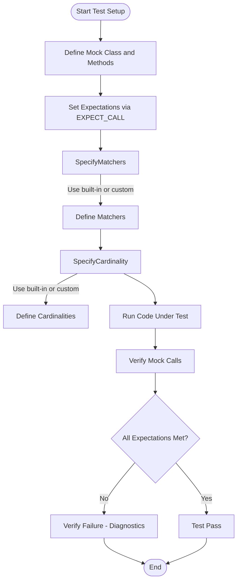

# Matchers & Cardinalities

Explore the powerful and expressive matcher API for argument validation in GoogleMock, along with the rich cardinality concepts used to specify expectations on call counts. This documentation guides you through the use of built-in matchers, how to compose your own, and explains cardinalities that verify how many times a mocked method is invoked. Additionally, you'll find practical advice for defining custom matchers and cardinalities to tailor expectations precisely to your testing needs.

---

## 1. Introduction to Matchers and Cardinalities

When writing tests with GoogleMock, verifying function calls means checking not only that a function was invoked, but also validating the arguments passed and how often it was called. This is accomplished by two core concepts:

- **Matchers**: Predicates that express conditions on function arguments, enabling precise verification of values passed.
- **Cardinalities**: Constraints defining the expected number of times a function should be called.

Together, they allow the declaration of detailed expectations in an intuitive and readable manner.


## 2. The Matcher API: Checking Argument Values

Matchers act like predicates, judging whether a function argument meets specified criteria. They can be:

- **Literal values**, which are treated as equality matchers.
- **Predefined matchers** from GoogleMock such as `_` (wildcard), `Eq()`, `Ge()`, `Lt()`, `Not()`, `AllOf()`, and many more.
- **Composite matchers**, composed from simpler matchers to define complex conditions.

### 2.1 Basic Usage

Use matchers inside `EXPECT_CALL` or `ON_CALL` macros to specify what arguments you expect. For example:

```cpp
using ::testing::_;
using ::testing::Eq;
using ::testing::Gt;

EXPECT_CALL(mock_object, DoSomething(Eq(5), Gt(10)));  
// Expects DoSomething() with first argument equal to 5 and second argument greater than 10.

EXPECT_CALL(mock_object, DoSomething(_, _));
// Matches any arguments.
```

### 2.2 Default and Wildcard Matchers

If you omit argument matchers or leave the argument list out entirely for a non-overloaded method, it defaults to matching any arguments (using the wildcard matcher `_`).

### 2.3 Combining and Composing Matchers

Matchers can be combined with logical operators:

- `AllOf(m1, m2, ...)` - all conditions must be true.
- `AnyOf(m1, m2, ...)` - any condition must be true.
- `Not(m)` - negates matcher.

For example:

```cpp
EXPECT_CALL(mock_object, Process(AllOf(Gt(0), Lt(100))));
// Expects Process() with an argument between 1 and 99 inclusive.
```

### 2.4 Advanced Matchers

Use `Field()`, `Property()`, and `Pointee()` to match members, properties, or pointer contents of objects:

```cpp
EXPECT_CALL(mock_object, Foo(Field(&MyClass::value, Eq(10))));
EXPECT_CALL(mock_object, Bar(Pointee(Gt(5))));
```

### 2.5 Creating Custom Matchers

GoogleMock provides flexible macros like `MATCHER`, `MATCHER_P`, and the interface approach for defining new matchers with detailed match conditions and descriptive failure messages.

```cpp
MATCHER(IsDivisibleBy3, "is divisible by 3") {
  return (arg % 3) == 0;
}

EXPECT_CALL(mock_object, Func(IsDivisibleBy3()));
```

## 3. Cardinalities: Specifying Call Count Expectations

Cardinalities configure how many times a mocked method call is expected to occur.

### 3.1 Built-in Cardinalities

All types are in the `testing` namespace and can be used in the `.Times()` clause of `EXPECT_CALL`:

| Cardinality         | Description                                                       |
|---------------------|-------------------------------------------------------------------|
| `AnyNumber()`       | The method may be called any number of times (including zero).    |
| `AtLeast(n)`        | Method must be called *at least* *n* times.                       |
| `AtMost(n)`         | Method must be called *at most* *n* times.                        |
| `Between(m, n)`     | Call count must be between *m* and *n* inclusive.                 |
| `Exactly(n)` or `n` | Call count must be exactly *n*. Special case: `Exactly(0)` means never called. |

### 3.2 Usage Examples

```cpp
using ::testing::AtLeast;
using ::testing::Exactly;

EXPECT_CALL(mock_object, Method()).Times(AtLeast(2));
EXPECT_CALL(mock_object, Method(5)).Times(Exactly(1));
```

### 3.3 Inferred Cardinalities

If `.Times()` is omitted in `EXPECT_CALL()`, GoogleMock infers the cardinality based on provided actions (`WillOnce`, `WillRepeatedly`):

- No action clauses → `Times(1)`
- *n* actions with `WillOnce` only → `Times(n)`
- *n* actions with `WillOnce` and one `WillRepeatedly` → `Times(AtLeast(n))`

### 3.4 Describing Cardinalities

GoogleMock explains expectations clearly, such as "called at least twice" or "called between 2 and 5 times" in test failures.

### 3.5 Custom Cardinalities

You can define new cardinalities for specialized count conditions by implementing the `CardinalityInterface`:

```cpp
class EvenNumberCardinality : public CardinalityInterface {
 public:
  bool IsSatisfiedByCallCount(int call_count) const override {
    return call_count % 2 == 0;
  }
  bool IsSaturatedByCallCount(int /*call_count*/) const override {
    return false;
  }
  void DescribeTo(std::ostream* os) const override {
    *os << "called even number of times";
  }
};

Cardinality EvenNumber() { 
  return Cardinality(new EvenNumberCardinality());
}

EXPECT_CALL(mock_object, Method()).Times(EvenNumber());
```

## 4. Using Matchers and Cardinalities Together

`EXPECT_CALL` combines matchers and cardinalities for precise expectations:

```cpp
EXPECT_CALL(mock_object, Process(Eq(5)))
    .Times(Exactly(3))
    .WillOnce(Return(true))
    .WillRepeatedly(Return(false));
```

This expects `Process(5)` exactly 3 times with specified return values.

## 5. Best Practices & Tips

- **Use wildcards (`_`)** when argument values are unimportant to avoid brittle tests.
- **Prefer descriptive matchers** to capture intent (e.g., `Ge(0)` rather than literal constants).
- **Use `RetiresOnSaturation()`** to make expectations retire after reaching their maximum calls, preventing over-saturation errors.
- **Define sequences or use `After()`** to specify call order constraints.
- **Keep tests robust by avoiding over-specification** which leads to fragility.

## 6. Troubleshooting Common Issues

### 6.1 Expectation Over-saturation

You specified a maximum call count but the mock is called more times:

- Solution: use `.RetiresOnSaturation()` to deactivate an expectation after the allowed calls.

### 6.2 Matcher Misuse

Error messages indicating no match found can be due to incorrect or overly strict argument matchers:

- Solution: loosen matchers using wildcard `_` or more general predicates.

### 6.3 Ambiguous Overloaded Method Expectations

For overloaded methods, you must specify argument types or provide explicit disambiguation.

- Use `Const()` wrapper or specify argument matchers with type annotations.

## 7. Example Usage

```cpp
#include <gmock/gmock.h>
using ::testing::AtLeast;
using ::testing::_; 
using ::testing::Return;
using ::testing::Exactly;

class MockTurtle {
 public:
  MOCK_METHOD(void, PenDown, (), ());
  MOCK_METHOD(void, Forward, (int distance), ());
  MOCK_METHOD(int, GetX, (), (const));
};

void Paint(MockTurtle* turtle) {
  turtle->PenDown();
  turtle->Forward(100);
  turtle->Forward(50);
}

TEST(PaintTest, DrawsLine) {
  MockTurtle turtle;

  EXPECT_CALL(turtle, PenDown()).Times(Exactly(1));
  EXPECT_CALL(turtle, Forward(_)).Times(AtLeast(1));
  EXPECT_CALL(turtle, GetX()).WillRepeatedly(Return(42));

  Paint(&turtle);
}
```

## 8. Additional Resources

- [Mocking Reference](../reference/mocking.md) — Detailed API for mock expectations and matchers.
- [gMock Cookbook](../gmock_cook_book.md) — Recipes for writing custom matchers and behaviors.
- [Matchers Reference](matchers.md) — Comprehensive list of built-in matchers.
- [Mock Methods & Classes](mock-methods-and-classes.md) — How to define mocks suitable for use with matchers.

---

## Mermaid Diagram: Matchers and Cardinalities Workflow


