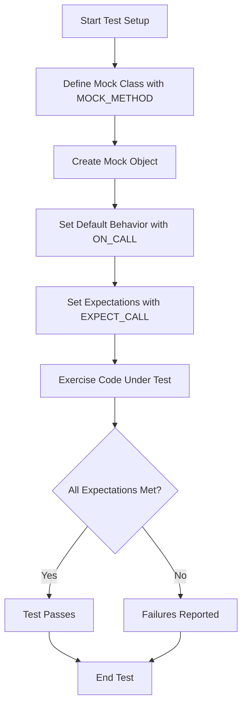

# Mock Methods & Classes

This page illustrates how to define and use mocks within GoogleMock, focusing on the `MOCK_METHOD` macro, creation of mock classes including those templated or with complex signatures, and the use of mock strictness modes (`NiceMock`, `NaggyMock`, `StrictMock`). It also offers practical usage patterns and best practices for dealing with various method types and mocking scenarios in C++.

---

## Defining Mock Classes with `MOCK_METHOD`

At the heart of creating mock classes in GoogleMock is the `MOCK_METHOD` macro. It allows you to declare mock versions of virtual methods in an interface or a base class so that you can later set expectations and behaviors on them.

### Basic Syntax

```cpp
MOCK_METHOD(ReturnType, MethodName, (Args...), (Qualifiers));
```

- **ReturnType**: The return type of the method.
- **MethodName**: The exact name of the method being mocked.
- **Args...**: The types of the method's parameters, enclosed in parentheses.
- **Qualifiers**: Optional C++ method specifiers such as `const`, `override`, `noexcept`, or special calling conventions.

### Key Guidelines

- The mock method declaration must appear in the `public:` section of your mock class, regardless of the access level of the base method.
- For methods overriding a `const` method, be sure to include `(const, override)` in the qualifiers.
- If your method has complex argument types containing commas (e.g., `std::pair<bool, int>`), wrap those argument types in extra parentheses to avoid parsing errors, or use type aliases.

### Example

Given the interface:

```cpp
class Foo {
 public:
  virtual ~Foo();  // Must be virtual to mock
  virtual int GetSize() const = 0;
  virtual std::string Describe(const char* name) = 0;
  virtual bool Process(Bar elem, int count) = 0;
};
```

Mock it like this:

```cpp
#include <gmock/gmock.h>

class MockFoo : public Foo {
 public:
  MOCK_METHOD(int, GetSize, (), (const, override));
  MOCK_METHOD(std::string, Describe, (const char* name), (override));
  MOCK_METHOD(bool, Process, (Bar elem, int count), (override));
};
```

This makes `MockFoo` a concrete class whose methods can be programmatically controlled in your tests.

---

## Mocking Overloaded and Template Methods

### Overloaded Methods

Mock each overload individually by precisely matching its signature:

```cpp
class Foo {
 public:
  virtual int Add(int x);
  virtual int Add(double x, int y);
};

class MockFoo : public Foo {
 public:
  MOCK_METHOD(int, Add, (int x), (override));
  MOCK_METHOD(int, Add, (double x, int y), (override));
};
```

If you omit some overloads, you may hide base class methods accidentally. To mitigate this, you can use the `using` declaration:

```cpp
class MockFoo : public Foo {
 public:
  using Foo::Add;  // Bring base class overloads into scope
  MOCK_METHOD(int, Add, (int x), (override));
};
```

### Template Classes

Mock class templates just like regular classes, specifying method mocks inside the template definition:

```cpp
template <typename Elem>
class StackInterface {
 public:
  virtual ~StackInterface();
  virtual void Push(const Elem& x) = 0;
  virtual int GetSize() const = 0;
};

template <typename Elem>
class MockStack : public StackInterface<Elem> {
 public:
  MOCK_METHOD(void, Push, (const Elem& x), (override));
  MOCK_METHOD(int, GetSize, (), (const, override));
};
```

---

## Handling Non-Virtual Methods and Free Functions

### Mocking Non-Virtual Methods

Standard GoogleMock mocks require virtual methods, but you can mock non-virtual methods for use in high-performance dependency injection by defining a mock class unrelated to the real one but matching method signatures:

```cpp
class ConcretePacketStream {
 public:
  void AppendPacket(Packet* p);
  const Packet* GetPacket(size_t n) const;
  size_t NumberOfPackets() const;
};

class MockPacketStream {
 public:
  MOCK_METHOD(const Packet*, GetPacket, (size_t), (const));
  MOCK_METHOD(size_t, NumberOfPackets, (), (const));
};
```

Use templates to select between real and mock implementations at compile time.

### Mocking Free Functions

Free functions cannot be mocked directly. The recommended approach is to wrap them behind an abstract interface:

```cpp
class FileInterface {
 public:
  virtual bool Open(const char* path, const char* mode) = 0;
};

class File : public FileInterface {
 public:
  bool Open(const char* path, const char* mode) override {
    return OpenFile(path, mode);  // Calls the real free function
  }
};
```

Mock the interface for testing. This practice enhances flexibility and testability.

---

## Using Strictness Modes for Mocks

GoogleMock offers template wrappers for controlling the handling of uninteresting calls:

- **NaggyMock<T>** — Default behavior: warns on uninteresting calls.
- **NiceMock<T>** — Suppresses warnings for uninteresting calls, making tests less noisy.
- **StrictMock<T>** — Treats uninteresting calls as errors, enforcing strict call discipline.

### Usage

```cpp
using ::testing::NiceMock;
using ::testing::NaggyMock;
using ::testing::StrictMock;

NiceMock<MockFoo> nice_foo;      // Ignores uninteresting calls
NaggyMock<MockFoo> naggy_foo;    // Warns on uninteresting calls
StrictMock<MockFoo> strict_foo;  // Fails on uninteresting calls
```

You can use constructor arguments to forward to the underlying mock:

```cpp
NiceMock<MockFoo> nice_foo(5, "arg");
```

**Important Notes:**

- Strictness wrappers only affect mock methods defined **directly** with `MOCK_METHOD` in the mocked class, not inherited ones.
- Nesting strictness wrappers is not supported.
- Virtual destructors in your mock classes are essential for proper strictness behavior.

### Recommendation

- Use `NiceMock` by default for maintainable, less brittle tests.
- Use `NaggyMock` during test development to detect unexpected calls somewhat noisily.
- Use `StrictMock` only when you want to enforce strict calling contracts.

---

## Typical Mock Usage Workflow

1. Include GoogleMock headers and bring the `testing` namespace symbols into scope.
2. Define your mock classes by inheriting from the interfaces you want to mock and add `MOCK_METHOD` declarations.
3. Instantiate mock objects in your tests.
4. Set up default behaviors with `ON_CALL`.
5. Specify your expectations with `EXPECT_CALL`, including calls, argument matchers, behaviors, and cardinalities.
6. Exercise the code under test using the mock objects.
7. When your mocks go out of scope, GoogleMock automatically verifies that all expectations were met.

### Example

```cpp
using ::testing::Return;

class MockFoo : public Foo {
 public:
  MOCK_METHOD(int, GetSize, (), (const, override));
  MOCK_METHOD(std::string, Describe, (int type), (override));
};

TEST(FooTest, Example) {
  MockFoo mock;

  ON_CALL(mock, GetSize()).WillByDefault(Return(5));
  EXPECT_CALL(mock, Describe(42)).Times(2).WillRepeatedly(Return("Answer"));

  // Exercise code that uses mock ...

  EXPECT_EQ("Answer", mock.Describe(42));
  EXPECT_EQ(mock.GetSize(), 5);
}
```

---

## Best Practices and Tips

- Always ensure mock classes have virtual destructors.
- Use `override` in `MOCK_METHOD` macros to catch signature mismatches with base classes.
- Wrap complex argument or return types with parentheses or use type aliases to work around macro limitations.
- Avoid mocking concrete classes directly; prefer coding to interfaces.
- Use default actions (`ON_CALL`) liberally to specify common behaviors shared across tests.
- Specify expectations (`EXPECT_CALL`) sparingly to verify important interactions.
- Utilize the strictness modes to control verbosity and strictness in mock call handling.
- Use `NiceMock` for less noisy tests and `StrictMock` when precise interaction verification is necessary.
- When mocking overloaded functions, consider either mocking all overloads or bring some into scope via `using` declarations.
- For methods involving move-only types like `std::unique_ptr`, mock as usual but use lambdas or `WillOnce` appropriately for returning such types.

---

For advanced scenarios, such as delegating calls to fakes, real objects, or parent classes, and for detailed management of actions, expectations, matchers, and sequences, please consult the specialized recipes in the [gMock Cookbook](https://google.github.io/googletest/gmock_cook_book.html).

---

## References & Further Reading

- [gMock Cookbook](https://google.github.io/googletest/gmock_cook_book.html): Practical recipes on mocking patterns and advanced usage.
- [Mocking Reference](https://google.github.io/googletest/reference/mocking.html): Detailed API specification.
- [gMock for Dummies](https://google.github.io/googletest/gmock_for_dummies.html): Beginner-friendly introduction.
- [Matchers Reference](https://google.github.io/googletest/reference/matchers.html): Available argument matchers.
- [Actions Reference](https://google.github.io/googletest/reference/actions.html): Built-in mock actions.

---

## Summary Diagram: Mocking Workflow


