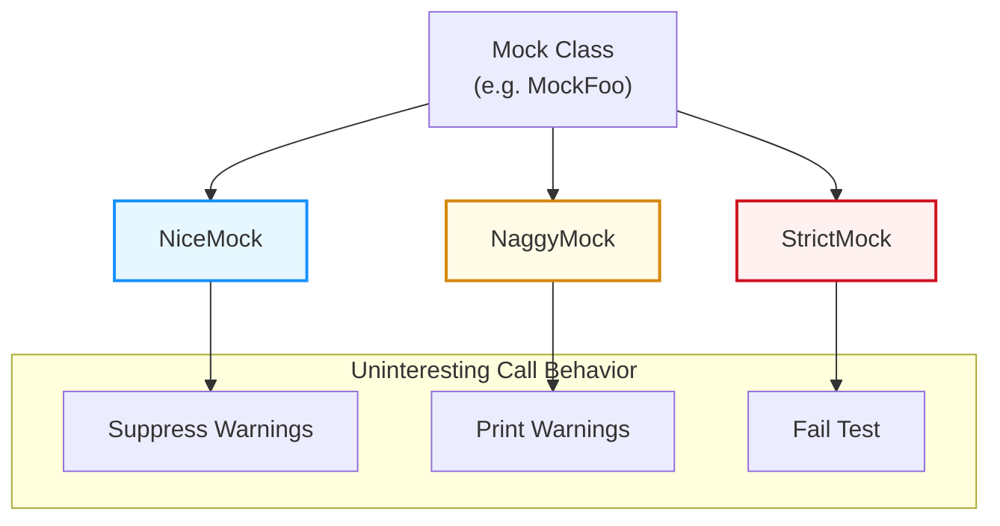

# Strictness Modes & Behaviors

GoogleMock offers flexible control over how mock objects respond to calls that have no explicit expectations defined. This page explains the different mock strictness modes—`NiceMock`, `NaggyMock`, and `StrictMock`—and guides you on when and how to apply them in your tests to manage _uninteresting calls_ effectively.

---

## Understanding Uninteresting Calls

When a mock method is called but there are no matching `EXPECT_CALL` expectations (i.e., the test hasn’t explicitly declared interest in that call), this is called an **uninteresting call**. How these calls are handled can affect your test output:

- Sometimes you want to ignore these calls quietly.
- Other times you want to be notified when uninteresting calls happen.
- Or you may want the test to fail immediately if an unexpected call occurs.

GoogleMock provides three strictness modes to control this behavior:

| Mode       | Behavior on Uninteresting Calls                                 | Default?
|------------|-----------------------------------------------------------------|----------
| `NiceMock` | Silences warnings; allows calls without complaints.             | Planned to become default.
| `NaggyMock`| Prints warnings but allows calls to proceed.                    | Current default.
| `StrictMock`| Fails the test when uninteresting calls occur.                  | Opt-in only.


---

## Using Strictness Mode Wrappers

These modes are applied by wrapping your mock class with a template:

```cpp
using ::testing::NiceMock;
using ::testing::NaggyMock;
using ::testing::StrictMock;

// Assuming MockFoo is your mock class:
NiceMock<MockFoo> nice_mock_instance;      // Allows uninteresting calls silently
NaggyMock<MockFoo> naggy_mock_instance;    // Warns on uninteresting calls
StrictMock<MockFoo> strict_mock_instance;  // Fails on uninteresting calls
```

Because these wrappers are subclasses of your mock class, you can use them anywhere the raw mock class is accepted.

### Construction

These wrappers "inherit" all constructors of the wrapped mock class, so you can forward any constructor arguments as usual:

```cpp
NiceMock<MockFoo> nice_mock(5, "arg");  // Calls MockFoo(5, "arg")
StrictMock<MockFoo> strict_mock("config");
```

### Limitations

- Strictness wrappers only affect methods defined **directly** in the mock class via `MOCK_METHOD` macros. Mock methods inherited from base classes may not respect the strictness modifier.
- Nesting wrappers (e.g., `NiceMock<StrictMock<MockFoo>>`) is unsupported and will cause static assertions.
- Destructors of mocked classes should be virtual for proper behavior.

---

## When to Use Each Mode

| Mode       | When to Use                                                | Effect on Test Results                  |
|------------|------------------------------------------------------------|---------------------------------------|
| `NiceMock` | When you don't care about uninteresting calls or wish to suppress distracting warnings during test development. | Does not cause test failures on uninteresting calls. |
| `NaggyMock`| While developing or debugging tests to get warnings about possible unexpected usage. Default for new mocks.      | Warnings generated, but tests continue.            |
| `StrictMock`| When you want the highest rigor, ensuring every call is expected and verified.                                  | Tests fail on uninteresting calls.                 |

**Best Practice:** Generally prefer `NiceMock` for stable tests to reduce noise and maintenance. Use `NaggyMock` while refining tests and `StrictMock` when strict verification is essential.

---

## Example

```cpp
#include <gmock/gmock.h>

class Foo {
 public:
  virtual ~Foo() = default;
  virtual void DoSomething() = 0;
  virtual int Calculate(int x) = 0;
};

class MockFoo : public Foo {
 public:
  MOCK_METHOD(void, DoSomething, (), (override));
  MOCK_METHOD(int, Calculate, (int x), (override));
};

using ::testing::NiceMock;
using ::testing::StrictMock;
using ::testing::NaggyMock;

TEST(ExampleTest, NiceMockDoesNotWarnOnUninterestingCalls) {
  NiceMock<MockFoo> mock;

  EXPECT_CALL(mock, DoSomething());

  mock.DoSomething();        // Expected call, OK
  mock.Calculate(42);        // Uninteresting call, no warnings
}

TEST(ExampleTest, StrictMockFailsOnUninterestingCalls) {
  StrictMock<MockFoo> mock;

  EXPECT_CALL(mock, DoSomething());

  mock.DoSomething();        // Expected call, OK
  mock.Calculate(42);        // Uninteresting call, test fails
}

TEST(ExampleTest, NaggyMockWarnsOnUninterestingCalls) {
  NaggyMock<MockFoo> mock;

  EXPECT_CALL(mock, DoSomething());

  mock.DoSomething();        // Expected call, OK
  mock.Calculate(42);        // Uninteresting call, warning printed
}
```

---

## Internals Overview (Optional)

Under the hood, when a mock object is created, GoogleMock registers a reaction mode for that instance:

- `NiceMock` calls `Mock::AllowUninterestingCalls()`, which suppresses warnings.
- `NaggyMock` calls `Mock::WarnUninterestingCalls()`, which logs a warning.
- `StrictMock` calls `Mock::FailUninterestingCalls()`, which triggers errors.

These behaviors are tied to the mock object's lifecycle, ensuring consistent handling until destruction.

---

## Troubleshooting and Tips

<AccordionGroup title="Common Questions & Tips">
<Accordion title="Why do I still see warnings for uninteresting calls on some methods?">
These wrappers only affect methods declared with `MOCK_METHOD` directly within your mock class. If your mock inherits methods with expectations from base classes, you may still see default behavior on those calls.
</Accordion>
<Accordion title="Can I nest NiceMock, NaggyMock, and StrictMock?">
No. Nesting strictness mode wrappers is unsupported and will trigger a compile-time assertion.
</Accordion>
<Accordion title="What happens if I don't specify any strictness wrapper?">
Currently, mocks behave as `NaggyMock` by default, which means uninteresting calls print warnings but don’t fail. This default may change to `NiceMock` in the future.
</Accordion>
<Accordion title="How can I suppress uninteresting call warnings for specific methods?">
Use `EXPECT_CALL(mock, Method(_)).Times(AnyNumber())` on specific methods to explicitly allow any number of calls, which suppresses warnings on those methods.
</Accordion>
<Accordion title="What if I want all uninteresting calls to be errors?">
Wrap your mock with `StrictMock`. It will cause test failures whenever uninteresting calls occur, helping catch unexpected behavior.
</Accordion>
</AccordionGroup>

---

## See Also

- [Mock Methods & Classes](https://github.com/google/googletest/blob/main/api-reference/gmock-mocking-framework/mock-methods-and-classes.mdx) — For defining mocks.
- [Expectations, Actions & Sequences](https://github.com/google/googletest/blob/main/api-reference/gmock-mocking-framework/expectations-actions-and-sequences.mdx) — For controlling call expectations and behavior.
- [Matchers & Cardinalities](https://github.com/google/googletest/blob/main/api-reference/gmock-mocking-framework/matchers-and-cardinalities.mdx) — For argument matching and call count controls.
- [gMock Cookbook: The Nice, the Strict, and the Naggy](https://github.com/google/googletest/blob/main/docs/gmock_cook_book.md#NiceStrictNaggy) — A practical guide on strictness modes.

---

## References

- Source code: [gmock-nice-strict.h](https://github.com/google/googletest/blob/main/googlemock/include/gmock/gmock-nice-strict.h)
- Tests and usage examples: [gmock-nice-strict_test.cc](https://github.com/google/googletest/blob/main/googlemock/test/gmock-nice-strict_test.cc)

---

## Summary Diagram


