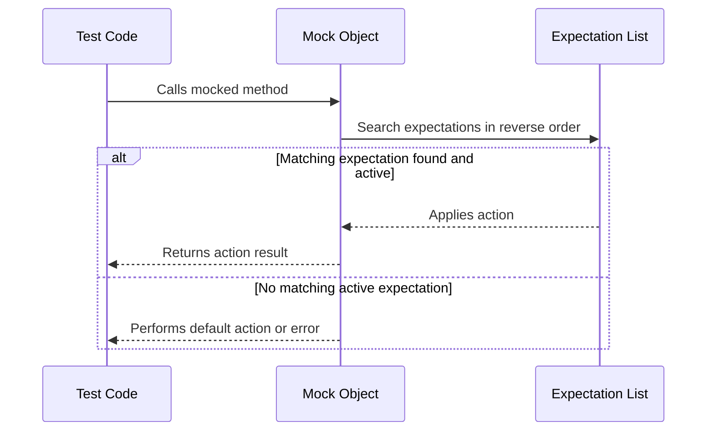

# Actions & Cardinalities

This page explains how to use **actions** and **cardinalities** within GoogleMock to control the behavior and invocation constraints of mock methods. Understanding these concepts enables you to precisely define how mocked methods respond when called and specify how many times they are allowed or expected to be invoked, empowering advanced contract verification in tests.

---

## 1. Introduction to Actions and Cardinalities

When creating mock objects with GoogleMock, merely defining the mock method is insufficient. You need to specify:

- What the method should do when called (the *action*), such as returning a value, invoking a callback, or performing side effects.
- How many times the method is expected or allowed to be called (the *cardinality*), enabling verification of interaction patterns.

This page documents **built-in and custom actions**, explains how to configure method responses, and details cardinality constraints for mock invocations.

---

## 2. Actions: Controlling Method Responses

### 2.1 Overview

An *action* defines what happens when a mock method is invoked. It governs the return value, side effects, or other behaviors the mock should simulate at call time.

- Actions can be built-in (e.g., `Return()`, `ReturnRef()`, `Invoke()`, `DoAll()`) or custom.
- Actions are specified in `EXPECT_CALL` or `ON_CALL` using `.WillOnce()`, `.WillRepeatedly()`, or `.WillByDefault()`.


### 2.2 Using Actions in Expectations

```cpp
using ::testing::Return;
...
EXPECT_CALL(mock_object, MockMethod(args...))
    .WillOnce(Return(value))           // Action for one call
    .WillRepeatedly(Return(other_value)); // Action for subsequent calls
```

Steps:

1. Call `EXPECT_CALL` to set expectation on the mock method.
2. Chain `.WillOnce(action)` one or more times to specify sequential behaviors for each call.
3. Optionally, use `.WillRepeatedly(action)` to specify the default action after `.WillOnce()` actions are exhausted.

Example:

```cpp
EXPECT_CALL(my_mock, GetValue())
    .WillOnce(Return(10))
    .WillOnce(Return(20))
    .WillRepeatedly(Return(100));

// Calls return 10, 20, then 100 for subsequent calls.
```

### 2.3 ON_CALL vs EXPECT_CALL

- `ON_CALL` sets the **default behavior** but does not impose expectations on call count or order.
- `EXPECT_CALL` sets both behavior and call count expectations.

Example:

```cpp
ON_CALL(my_mock, Foo(_))
    .WillByDefault(Return(true));

EXPECT_CALL(my_mock, Foo(42))
    .Times(1)
    .WillOnce(Return(false));
```

Calls matching `Foo(42)` will follow the `EXPECT_CALL`; all others follow `ON_CALL`.

### 2.4 Common Built-in Actions

- `Return(value)`: Returns a copy of `value`.
- `ReturnRef(variable)`: Returns a reference to `variable`.
- `ReturnPointee(pointer)`: Returns the value pointed to by `pointer` at call time.
- `Invoke(function)`: Calls an arbitrary callable with the mock method arguments.
- `SetArgPointee<N>(value)`: Sets the N-th argument pointed-to value.
- `DoAll(action_1, ..., action_n)`: Performs a sequence of actions; last action's return value used.

Use these to model realistic or complex behaviors.

### 2.5 Tips for Using Actions

- Chain multiple `.WillOnce()` actions to specify stepwise behavior.
- Use `.RetiresOnSaturation()` to make expectations retire as soon as they are saturated (see Cardinalities section).
- Beware that `Return(value)` copies the value at the time the expectation is set. Use lambdas or `ReturnPointee()` for dynamic behavior.

---

## 3. Cardinalities: Specifying Call Count Constraints

### 3.1 Purpose

Cardinalities control **how many times** a mock method is expected or allowed to be called, helping verify that the code interacts with mocks in the intended way.

They are normally specified via `.Times()` on an `EXPECT_CALL` statement or inferred based on actions provided.

### 3.2 Built-in Cardinalities

GoogleMock provides several ready-to-use cardinalities in the `::testing` namespace:

| Cardinality             | Meaning                                 |
| ----------------------- | --------------------------------------- |
| `AnyNumber()`           | Method may be called any number of times (zero or more). |
| `AtLeast(n)`            | Method is called at least _n_ times.   |
| `AtMost(n)`             | Method is called at most _n_ times.    |
| `Between(m, n)`         | Method called between _m_ and _n_ times (inclusive). |
| `Exactly(n)` or numeric | Method called exactly _n_ times. If _n_ is 0, the call should never happen. |

These cardinalities are constructed via factory functions:

```cpp
EXPECT_CALL(mock, Foo())
    .Times(AtLeast(2))
    .WillRepeatedly(Return(true));
```

### 3.3 Default Cardinality Inference

If `.Times()` is omitted, GoogleMock infers the cardinality from actions:

- No `.WillOnce()` or `.WillRepeatedly()`: cardinality = `Times(1)`.
- *n* `.WillOnce()` and no `.WillRepeatedly()`: cardinality = `Times(n)`.
- *n* `.WillOnce()` and one `.WillRepeatedly()`: cardinality = `Times(AtLeast(n))`.

### 3.4 Custom Cardinalities

For advanced users, GoogleMock allows creating custom cardinalities by implementing the `CardinalityInterface`.

Example custom cardinality that accepts an even number of calls only:

```cpp
class EvenNumberCardinality : public CardinalityInterface {
 public:
  bool IsSatisfiedByCallCount(int call_count) const override {
    return call_count % 2 == 0;
  }
  bool IsSaturatedByCallCount(int) const override { return false; }
  void DescribeTo(::std::ostream* os) const override {
    *os << "called even number of times";
  }
};

Cardinality EvenNumber() {
  return Cardinality(new EvenNumberCardinality);
}
```

Usage:

```cpp
EXPECT_CALL(mock, Func()).Times(EvenNumber());
```

### 3.5 Interpreting Cardinality States

- **Satisfied:** The number of calls received satisfies the cardinality range.
- **Saturated:** The upper bound of calls allowed has been reached.
- **Over-saturated:** The call count exceeds the upper bound.

Failures occur on calls exceeding the upper bound or if expected calls were not made when the mock is verified.

### 3.6 Human-Friendly Descriptions

GoogleMock provides descriptive text for cardinalities and actual calls to help decode failures. Examples:

- "called once"
- "called at least twice"
- "called between 3 and 5 times"
- "never called"

---

## 4. Integrating Actions and Cardinalities in Expectations

### 4.1 Typical Usage Flow

1. **Declare Mock** with `MOCK_METHOD`.
2. **Set Default Behavior** using `ON_CALL(mock, method(args))` + `.WillByDefault(action);`
3. **Set Expectations** with `EXPECT_CALL(mock, method(args))` + `.Times(cardinality)` + `.WillOnce()/WillRepeatedly(action)` etc.
4. **Exercise Tested Code**
5. **Verify** expectations on destruction or explicitly using `Mock::VerifyAndClearExpectations(&mock);`

### 4.2 Example

```cpp
class MockDatabase {
 public:
  MOCK_METHOD(bool, Connect, (), (override));
};

MockDatabase mock_db;

ON_CALL(mock_db, Connect()).WillByDefault(Return(true));

EXPECT_CALL(mock_db, Connect())
    .Times(Exactly(1))
    .WillOnce(Return(true));

// Code under test calls mock_db.Connect()
```

### 4.3 Using `.RetiresOnSaturation()`

Use `.RetiresOnSaturation()` on expectations with an upper bounded cardinality to make the expectation **retire** (become inactive) once saturated. This helps when multiple expectations exist and you want later expectations to take precedence after the first saturates.

Example:

```cpp
EXPECT_CALL(mock, Foo(7))
  .Times(2)
  .RetiresOnSaturation();
EXPECT_CALL(mock, Foo(_))
  .Times(AnyNumber());
```

The first two calls to `Foo(7)` match the first expectation; subsequent calls fall back to the second.

---

## 5. Common Pitfalls and Best Practices

- **Set expectations before exercising code.** `EXPECT_CALL` must appear before mock method invocations; late expectations result in undefined behavior.
- **Use `.Times(0)` to assert calls never happen.**
- **Prefer `ON_CALL` for default behaviors and `EXPECT_CALL` for verification.**
- **Use `.RetiresOnSaturation()` to avoid saturation errors when expectations should be used in sequence.**
- **Avoid over-specification.** Use matchers like `_` to avoid brittle tests.
- **Use sequences or `After` clause for ordering expectations.**
- **Beware of side effects in actions; `WillOnce` actions can accept move-only types, but `WillRepeatedly` require copyable actions.**
- **Control verbosity with `--gmock_verbose` to debug expectation matching issues.**

---

## 6. References & Further Reading

- [Mocking Reference](../reference/mocking.md) — Comprehensive guide to `EXPECT_CALL`, `ON_CALL`, actions, and cardinalities.
- [gMock for Dummies](docs/gmock_for_dummies.md) — Beginner-friendly tutorial including cardinalities and actions.
- [gMock Cookbook](docs/gmock_cook_book.md) — Recipes for advanced mocking patterns.
- [Matchers Reference](reference/matchers.md) — All available argument matchers.
- [Actions Reference](actions.md) — Full list of built-in actions.

---

### Code Snippet: Cardinality Usage Example
```cpp
EXPECT_CALL(mockObject, SomeMethod(_))
    .Times(Between(2, 4))         // Expect between 2 and 4 calls
    .WillOnce(Return(1))          // Return 1 first call
    .WillOnce(Return(2))          // Return 2 second call
    .WillRepeatedly(Return(3));  // Return 3 for subsequent calls
```

### Code Snippet: Action Usage with ON_CALL
```cpp
ON_CALL(mockObject, Compute(_))
  .WillByDefault([](int x) { return x * 2; });
```

### Code Snippet: Using RetiresOnSaturation
```cpp
EXPECT_CALL(mockObject, Save(_))
    .Times(2)
    .RetiresOnSaturation();
EXPECT_CALL(mockObject, Save(_))  // Fallback expectation
    .Times(AnyNumber());
```

---

### Diagram: Expectation Processing Flow


---

This completes the detailed documentation for the **Actions & Cardinalities** page in the GoogleMock API Reference.

---