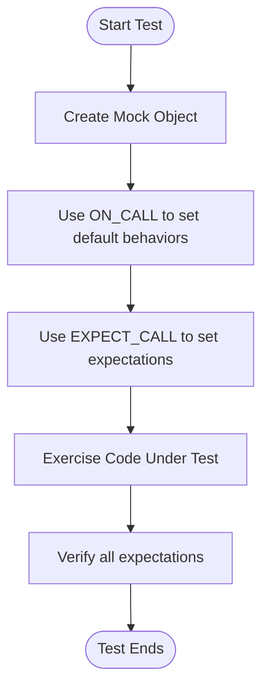

# Creating & Using Mocks

GoogleMock (gMock) enables you to create mock classes and mock methods effortlessly, allowing precise control and verification over object interactions in C++ tests. This page guides you through defining mock classes, using essential macros like `MOCK_METHOD`, setting expectations on mock behavior, and integrating mocks seamlessly with GoogleTest.

---

## Understanding Mock Objects

A **mock object** is a test double that mimics an interface but allows you to specify and verify how its methods are called at runtime. Unlike fakes (which have working but simplified implementations), mocks are programmed with expectations about interactions, such as which methods are called, how often, with what arguments, and what they return.

This capability is invaluable for *interaction-based testing*, enabling tests that are fast, reliable, and expressive.

## Defining Mock Classes with `MOCK_METHOD`

Mock classes are ordinary C++ classes derived from the interface you want to mock. The key tool is the `MOCK_METHOD` macro, which generates mock definitions for virtual methods automatically.

### Basic Usage

Given an interface class with virtual methods (all of which must be virtual, including the destructor), you define a mock class by inheriting from it and writing `MOCK_METHOD` for each virtual method you want to mock.

Example:

```cpp
#include <gmock/gmock.h>  // Brings in gMock.

class Turtle {
 public:
  virtual ~Turtle() {}
  virtual void PenUp() = 0;
  virtual void PenDown() = 0;
  virtual void Forward(int distance) = 0;
  virtual void Turn(int degrees) = 0;
  virtual void GoTo(int x, int y) = 0;
  virtual int GetX() const = 0;
  virtual int GetY() const = 0;
};

class MockTurtle : public Turtle {
 public:
  MOCK_METHOD(void, PenUp, (), (override));
  MOCK_METHOD(void, PenDown, (), (override));
  MOCK_METHOD(void, Forward, (int distance), (override));
  MOCK_METHOD(void, Turn, (int degrees), (override));
  MOCK_METHOD(void, GoTo, (int x, int y), (override));
  MOCK_METHOD(int, GetX, (), (const, override));
  MOCK_METHOD(int, GetY, (), (const, override));
};
```

### Notes & Best Practices

- Always place `MOCK_METHOD` declarations in the `public:` section, regardless of the original method's access level.
- To mock **const** methods, add `(const)` to the macro's last parameter list.
- Add `(override)` to signify overriding virtual methods; while optional, it is strongly recommended.
- If method signatures contain commas (e.g., template types), wrap the entire argument or return type in parentheses or use a type alias to avoid macro parsing issues.

### Mocking Overloaded Methods

You can mock overloaded methods by providing the full signature with parameters. If omitting parameters, the compiler may not find the correct overload.

Example:

```cpp
MOCK_METHOD(int, Add, (int x), (override));
MOCK_METHOD(int, Add, (double x), (override));
```

If you mock only some overloads and want to avoid hiding others, use `using Base::MethodName;` to bring the remaining overloads into scope.

### Mocking Class Templates

Templates can be mocked similarly. Each instantiation of the mock template corresponds with the template interface:

```cpp
template <typename T>
class MockStack : public StackInterface<T> {
 public:
  MOCK_METHOD(int, GetSize, (), (const, override));
  MOCK_METHOD(void, Push, (const T& element), (override));
};
```

## Using Mocks in Tests

### Typical Workflow

1. **Import necessary symbols** from the `testing` namespace, such as `EXPECT_CALL`, `ON_CALL`, and matchers.
2. **Create mock objects:** Instantiate your mocks as local variables or class members.
3. **Set default behaviors** with `ON_CALL` when you want to specify fallback behavior without expecting method calls.
4. **Set expectations** using `EXPECT_CALL` before exercising the code.
5. **Exercise** the code under test by passing or using the mock objects.
6. **Verification** happens automatically when the mock objects are destructed.

### Example

```cpp
#include <gmock/gmock.h>
#include <gtest/gtest.h>

using ::testing::_;            // Matches any argument.
using ::testing::AtLeast;
using ::testing::Return;

TEST(PainterTest, DrawsCircle) {
  MockTurtle turtle;

  // Expect PenDown to be called at least once.
  EXPECT_CALL(turtle, PenDown()).Times(AtLeast(1));

  Painter painter(&turtle);  // Assuming Painter depends on Turtle via interface

  EXPECT_TRUE(painter.DrawCircle(0, 0, 10));
}
```

If `PenDown()` is not called as expected, the test will fail immediately with a clear message showing where and why.

### Tips

- Expectations **must** be set before the mock method is invoked.
- Use the wildcard matcher `_` to indicate arguments you do not care about.
- Use **matchers** to add fine-grained constraints (see [Matchers Reference](../googletest-core-api/matchers-api)).
- Avoid overly strict expectations to reduce brittleness.

### Setting Default Behaviors Using `ON_CALL`

Use `ON_CALL()` to specify default mock method behavior when you do not want to require that the method is called.

Example:

```cpp
ON_CALL(turtle, GetX()).WillByDefault(Return(42));
```

This means if `GetX()` is called but has no explicit `EXPECT_CALL`, it will return 42.

## Setting Expectations with `EXPECT_CALL`

The core way to specify how mocks should behave includes:

```cpp
EXPECT_CALL(mock_obj, Method(matchers...))
    .With(multi_arg_matcher)  // Optional, at most once
    .Times(cardinality)       // Optional, at most once
    .InSequence(sequences...) // Optional
    .After(expectations...)   // Optional
    .WillOnce(action)         // Zero or more
    .WillRepeatedly(action)   // At most once
    .RetiresOnSaturation();   // At most once
```

- `.With()` restricts calls based on all arguments as a tuple.
- `.Times()` specifies how many times a method should be called.
- `.InSequence()` enforces call order within sequences.
- `.After()` enforces dependencies on other expectations.
- `.WillOnce()` and `.WillRepeatedly()` specify the behavior of the method calls.
- `.RetiresOnSaturation()` deactivates the expectation once fully matched.

### Cardinalities

Use cardinalities to specify call counts:

| Cardinality       | Meaning                                  |
|-------------------|------------------------------------------|
| `AnyNumber()`     | Any number of calls                       |
| `AtLeast(n)`      | At least `n` calls                        |
| `AtMost(n)`       | At most `n` calls                         |
| `Between(m, n)`   | Between `m` and `n` calls inclusive       |
| `Exactly(n)` or `n`| Exactly `n` calls; `0` means function should never be called |

If `Times()` is omitted, gMock infers it from the presence of `.WillOnce` and `.WillRepeatedly` clauses.

### Actions

Actions control what a mock method does when called. Examples include:

- `Return(value)`: return a value.
- `DoDefault()`: perform the default action.
- `Invoke(callable)`: call a function or lambda.
- `SetArgPointee<N>(value)`: set an output parameter.
- `Throw(exception)`: throw an exception.

Actions are chained with `.WillOnce()` and `.WillRepeatedly()`.

## Ordering Calls

By default, gMock does not enforce call order. To require strict order, use sequences or the `InSequence` helper.

Example:

```cpp
using ::testing::InSequence;
...
{
  InSequence seq;
  EXPECT_CALL(mock, Method1());
  EXPECT_CALL(mock, Method2());
}
```

This enforces that `Method1()` is called before `Method2()`.

To express partial orders or more complex ordering constraints, use `.After()` clauses.

## Retiring Expectations

Use `.RetiresOnSaturation()` when an expectation should become inactive after its call count limit is reached, allowing subsequent calls to match other expectations.

Example:

```cpp
EXPECT_CALL(mock, Foo(7))
    .Times(2)
    .RetiresOnSaturation();
```

After two calls with argument `7`, this expectation is retired; future calls can match other expectations.

## Mock Types: Nice, Naggy, and Strict

- **NaggyMock** (default): issues warnings on uninteresting calls (methods called without expectations).
- **NiceMock**: suppresses warnings on uninteresting calls.
- **StrictMock**: fails tests on uninteresting calls.

Use these to control how strict your tests should be about unexpected mock interactions.

## Managing Mock Lifetimes

Mocks verify the satisfaction of expectations upon destruction. To force verification earlier, use:

```cpp
::testing::Mock::VerifyAndClearExpectations(&mock_obj);
```

To allow a mock to be leaked without triggering warnings, use:

```cpp
::testing::Mock::AllowLeak(&mock_obj);
```

## Tips and Troubleshooting

- Ensure all virtual methods you want to mock have virtual destructors to avoid resource leaks.
- Set expectations *before* exercising the code that calls the mock methods.
- Use `--gmock_verbose=info` to enable detailed tracing of mock calls and expectation matching.
- Avoid over-specifying expectations for flexibility and maintenance ease.
- Use `NiceMock` to reduce noisy warnings during test development.

## Summary Diagram of Typical Mock Usage



## Further Learning and References

- [GoogleTest Mocking Reference](reference/mocking.md)
- [gMock for Dummies Tutorial](https://google.github.io/googletest/gmock_for_dummies.html)
- [Effective Mocking with GoogleMock Guide](guides/advanced-features-and-patterns/effective-mocking.mdx)
- [gMock Cookbook](docs/gmock_cook_book.md)
- [Matchers API Reference](api-reference/googletest-core-api/matchers-api.mdx)
- [Actions Reference](docs/reference/actions.md)

<Source url="https://github.com/google/googletest" branch="main" paths='[{"path": "googlemock/include/gmock/gmock-spec-builders.h", "range": "1-661"},{"path": "docs/gmock_for_dummies.md", "range": "1-336"},{"path": "docs/gmock_cook_book.md", "range": "1-627"},{"path": "docs/reference/mocking.md", "range": "1-240"}]' />