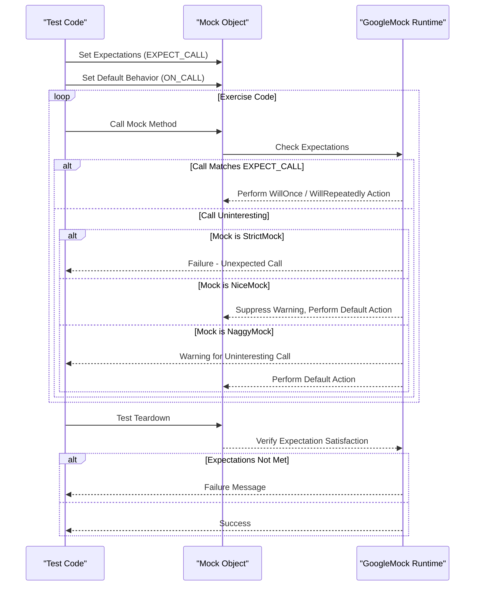

# Advanced Mocking Techniques

This page dives deep into fine-tuning mock objects in GoogleMock with advanced techniques involving `NiceMock`, `StrictMock`, and sophisticated expectation management. It guides you on handling edge cases, multi-threaded scenarios, and creating custom mock behaviors that best suit real-world complex testing needs.

---

## Understanding Strictness Modes: NiceMock, StrictMock, and NaggyMock

In GoogleMock, mock objects can behave differently when unexpectedly called. This behavior is controlled by wrapping mocks with one of three templates:

- **`NiceMock<T>`**: Suppresses warnings on calls to mock methods with no explicit expectations.
- **`StrictMock<T>`**: Treats any call to a mock method without a matching expectation as a test failure.
- **`NaggyMock<T>`** (default for `Mock<T>`): Prints warnings for uninteresting calls but does not fail the test.


### When to Use Each Mode

- Use `NiceMock` when you want to ignore unimportant calls and avoid noisy warnings.
- Use `StrictMock` when you want to enforce that your code calls *only* the methods you expect.
- Use `NaggyMock` during development or debugging to get warnings about potential unexpected calls.

```cpp
using ::testing::NiceMock;
using ::testing::StrictMock;

TEST(MyTest, ExampleNiceMock) {
  NiceMock<MockFoo> mock_foo;
  EXPECT_CALL(mock_foo, DoThis());
  ... // Calls to other methods do not produce warnings
}

TEST(MyTest, ExampleStrictMock) {
  StrictMock<MockFoo> mock_foo;
  EXPECT_CALL(mock_foo, DoThis());
  ... // Calls to other methods cause test failure
}
```

**Important Notes:**

- The strictness wrappers only affect *uninteresting* calls — calls to methods without any expectations.
- Strictness wrappers work **only** with mock methods defined **directly** in the mock class via `MOCK_METHOD` macros.
- Wrapping a mock with `NiceMock` or `StrictMock` preserves the mock's constructors.


## Fine-Grained Expectation Control

Advanced use cases often require nuanced management of method call expectations and behaviors.

### Using `ON_CALL` vs `EXPECT_CALL`

- `ON_CALL` defines **default behaviors** without imposing any call-count expectations.
- `EXPECT_CALL` defines **expectations** about how many times and in what order a method should be called.

**Best practice:** Use `ON_CALL` to set up fallback or baseline behavior, and `EXPECT_CALL` only to specify what you need to verify explicitly.

```cpp
ON_CALL(mock_foo, GetSize()).WillByDefault(Return(1));
EXPECT_CALL(mock_foo, Process(_, _)).Times(3).WillRepeatedly(Return(true));
```


### Controlling Call Order and Sequencing

GoogleMock allows strict ordering of expectations with:

- `InSequence` blocks that enforce expectations appear in the documented order:

```cpp
using ::testing::InSequence;
{
  InSequence seq;
  EXPECT_CALL(mock_foo, Step1());
  EXPECT_CALL(mock_foo, Step2());
}
```

- Partial or DAG ordering with the `.After()` clause permitting complex call orders.


### Retiring Expectations

By default, expectations are "sticky" and remain active even after being saturated.
Use `.RetiresOnSaturation()` to deactivate an expectation after it hits its upper call limit.

```cpp
EXPECT_CALL(mock_foo, Compute(10))
    .Times(2)
    .RetiresOnSaturation();
```

This lets other matching expectations catch calls made after the saturated expectation.


## Handling Edge Cases

### Mocking Methods With Commas in Signatures

Types with commas (e.g., `std::pair<bool, int>`) must be wrapped with extra parentheses or aliased.

```cpp
MOCK_METHOD((std::pair<bool, int>), GetPair, ());
using BoolIntPair = std::pair<bool, int>;
MOCK_METHOD(BoolIntPair, GetPair, ());
```

### Mocking Private or Protected Methods

Always declare mock methods in the `public:` section of the mock class, even if overriding protected or private virtual methods.
This permits expectations and actions to reference them.

```cpp
class MockFoo : public Foo {
 public:
  MOCK_METHOD(void, Resume, (), (override));  // even if protected in Foo
  MOCK_METHOD(int, GetTimeout, (), (override));  // even if private in Foo
};
```

### Mocking Overloaded Methods

Mock all overloaded variants explicitly to avoid hiding base class methods. Use `using Base::Method` to prevent hiding if some overloads aren't mocked.

```cpp
MOCK_METHOD(int, Add, (int x), (override));
MOCK_METHOD(int, Add, (int count, int x), (override));
using Base::Add;  // keep other overloads visible
```


### Delegating Calls to Fakes or Real Objects

You may want mocks to delegate behavior to an existing fake or real implementation for default behavior.

```cpp
class MockFoo : public Foo {
 public:
  MOCK_METHOD(bool, DoThis, (int n), (override));

  void DelegateToFake() {
    ON_CALL(*this, DoThis).WillByDefault([this](int n) {
        return fake_.DoThis(n);
    });
  }

 private:
  FakeFoo fake_;
};
```

This preserves real behavior while verifying call interactions.


### Mocking Non-Virtual Methods

gMock can mock non-virtual methods by defining an unrelated mock class with matching signatures, and templating code to accept either real or mock classes.


## Multi-Threaded Mocking

GoogleMock supports mocks used in multi-threaded tests:

- Setup (`EXPECT_CALL` / `ON_CALL`) and teardown must be done without concurrent access.
- Actual mock function calls and actions are thread-safe and happen in the caller's thread.
- Ordering and synchronization of actions across threads must be managed by your code.


## Custom Behaviors with Actions and Matchers

You can fine-tune mock behavior using custom actions, composing multiple actions, and precise matching:

- Use built-in and custom matchers to specify argument constraints.
- Chain multiple actions with `DoAll()`.
- Use `Invoke()`, lambdas, or functors for advanced behavior on calls.

Example of differentiating behavior based on argument values:

```cpp
EXPECT_CALL(foo, DoThis(_))
    .WillRepeatedly(Return('b'));
EXPECT_CALL(foo, DoThis(Lt(5)))
    .WillRepeatedly(Return('a'));
```


## Troubleshooting Tips

- If you see "Uninteresting mock function call" warnings, consider using `NiceMock` or adding `EXPECT_CALL(...).Times(AnyNumber())`.
- To enforce strictness, wrap mocks in `StrictMock`.
- Use `--gmock_verbose=info` to trace all mock interactions during debugging.
- Be careful when setting expectations on overloaded methods — specify all variants you use or bring in base overloads with `using`.
- For complex argument matching failures, save arguments with `SaveArg` for separate verification.


## Summary Diagram: Strictness and Expectation Flow




---

## Practical Recommendations

- Favor `NiceMock` for most tests to reduce noisy logs.
- Use `StrictMock` selectively when verifying the exact set of calls matters.
- Use `.RetiresOnSaturation()` liberally to avoid sticky expectation pitfalls.
- Sequence calls clearly when order matters; otherwise, avoid over-constraining.
- Avoid over-specifying arguments — match only what is important.
- Use delegation patterns for complex behavior reuse.
- Run tests with increased verbosity when debugging unexpected behaviors.


---

For thorough understanding, reference complementary pages:
- [gMock Cookbook](docs/gmock_cook_book.md) — provides recipes and detailed examples.
- [Mocking Reference](docs/reference/mocking.md).
- [Actions Reference](docs/reference/actions.md).
- [gMock Cheat Sheet](docs/gmock_cheat_sheet.md) — for quick syntax reminders.

---

Explore these demos and samples in the GoogleTest source repository for real-world applications of these advanced mocking techniques.


