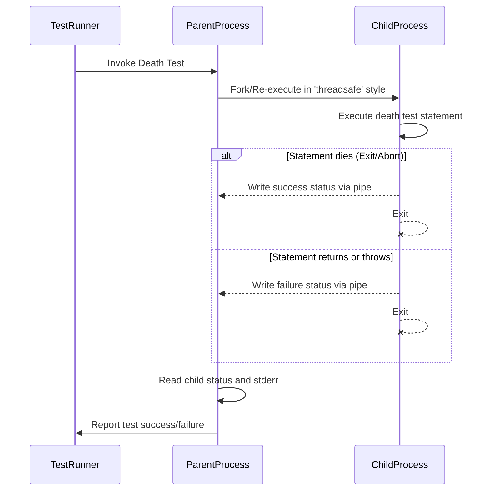

# Death Tests

GoogleTest's **Death Tests** API enables you to *verify that your code causes the process to terminate properly*, typically due to failing assertions, fatal errors, or explicit termination calls. Death tests ensure that critical failures happen as expected and that your program handles invalid or dangerous states by exiting cleanly, producing appropriate error messages.

This documentation guides you through the specialized API for writing death tests, demonstrating usage patterns, detailing the underlying mechanics, explaining caveats, and highlighting best practices for creating robust and maintainable death tests.

---

## What Are Death Tests?

Death tests validate that a *specific statement causes the program to die*—i.e., terminate the process either by calling `exit()`, `_Exit()`, aborting, or receiving fatal signals—and produce expected error messages.

Unlike normal assertions which test program logic, death tests check *guarantees around abnormal termination* due to unrecoverable conditions.

Death tests are essential for:

- Testing precondition checks that abort on invalid input
- Verifying fatal failure handling (like `FAIL()`, `ASSERT_*` failures that abort)
- Confirming error paths that kill the process

## Key Features

- Runs death test statements **in a separate child process**, ensuring isolation
- Supports matching expected error message output (using regex or matchers)
- Provides flexible predicates to verify process exit codes or signals
- Offers two styles of death tests optimizing for speed (`fast`) or thread safety (`threadsafe`)

---

## Writing a Death Test

You write death tests using the macros `ASSERT_DEATH` and `EXPECT_DEATH`. These macros run the given statement in a child process and verify the process terminates with a non-zero exit status *and* the stderr output matches an expected pattern.

### Basic Example

```cpp
TEST(FooDeathTest, CausesFatalError) {
  ASSERT_DEATH(
      { Foo(42); },          // statement that must cause termination
      "Invalid input"      // regex or matcher for stderr message
  );
}
```

In this example, calling `Foo(42)` is expected to make the program terminate with an error message containing "Invalid input".

### Using `EXPECT_DEATH`

Use `EXPECT_DEATH` to continue running subsequent tests on failure:

```cpp
TEST(FooDeathTest, DiesCorrectly) {
  EXPECT_DEATH(DoSomethingDangerous(), "fatal error occurred");
  EXPECT_DEATH(CauseCrash(), ".*");
}
```

### Using `ASSERT_DEATH`

Use `ASSERT_DEATH` to abort the current test immediately if the death test fails:

```cpp
TEST(FooDeathTest, CrucialFailure) {
  ASSERT_DEATH(TriggerAbort(), "Abort");
  // No further code will execute if death test fails
}
```

### Using `EXPECT_EXIT` and `ASSERT_EXIT`

If you want fine-grained control over the expected *exit status*, use these macros with a custom **predicate**:

```cpp
EXPECT_EXIT(ProcessQuit(), testing::ExitedWithCode(0), "Success");
EXPECT_EXIT(KillWithSignal(), testing::KilledBySignal(SIGKILL), "Kill signal received");
```

`ExitedWithCode` and `KilledBySignal` are included predicates you can use.

---

## Death Test Assertions Reference

| Macro               | Description                                                                         |
|---------------------|-------------------------------------------------------------------------------------|
| `ASSERT_DEATH()`     | Checks the statement causes death and matching stderr; aborts on failure.          |
| `EXPECT_DEATH()`     | Same as `ASSERT_DEATH` but allows test to continue after failure.                   |
| `ASSERT_EXIT()`      | Checks the statement causes exit matching predicate and stderr; aborts on failure. |
| `EXPECT_EXIT()`      | Same as `ASSERT_EXIT` but allows test to continue after failure.                   |
| `EXPECT_DEATH_IF_SUPPORTED()` <br> `ASSERT_DEATH_IF_SUPPORTED()` | Run death tests if platform supports; else, no-op with warning.        |
| `EXPECT_DEBUG_DEATH()` <br> `ASSERT_DEBUG_DEATH()` | Runs death tests only in debug builds (`NDEBUG` controls).                  |

> Note: The statement can be a compound statement (block). Streaming a message into the macros for custom failure info is supported.

---

## Understanding the Parameters

- **statement**: Any valid C++ statement that is expected to cause termination. Compound statements `{ ... }` are commonly used to bundle multiple lines.
- **matcher**: A regex string or a GoogleTest matcher that will be matched against the `stderr` output from the child process.
- **predicate**: A function or functor accepting an integer (exit status) and returning `bool`. Use pre-existing predicates like `ExitedWithCode()` or `KilledBySignal()`.

---

## Death Test Styles

GoogleTest supports **two styles** of running death tests, which you can control via the `--gtest_death_test_style` flag or programmatically:

1. **Fast style** (default on some platforms)
   - Child process is spawned using `fork()`.
   - Test statement executes immediately after fork.
   - Faster but less thread safe.

2. **Threadsafe style** (recommended for multithreaded tests)
   - Child process re-executes the whole test binary with flags to run the specific death test.
   - Safer in the presence of threads.
   - Slightly slower due to re-exec.

Example of setting style programmatically:

```cpp
GTEST_FLAG_SET(death_test_style, "threadsafe");
```

Or in your test binary's `main`:

```cpp
int main(int argc, char** argv) {
  testing::InitGoogleTest(&argc, argv);
  GTEST_FLAG_SET(death_test_style, "fast");
  return RUN_ALL_TESTS();
}
```

---

## Common Usage Patterns

### Using Death Tests in Parameterized Tests

Death tests can be combined with value-parameterized tests to verify failures across multiple inputs:

```cpp
class FailingParamTest : public testing::TestWithParam<int> {};

TEST_P(FailingParamTest, Fails) {
  EXPECT_DEATH(ProcessInput(GetParam()), "expected failure");
}

INSTANTIATE_TEST_SUITE_P(ParamGroup, FailingParamTest, testing::Values(2, 4));
```

### Using SCOPED_TRACE to Add Diagnostic Context

If you have assertions inside subroutines whose failures may be hard to trace, use `SCOPED_TRACE` to add context:

```cpp
void CheckValue(int n) {
  SCOPED_TRACE("Checking value = " + std::to_string(n));
  EXPECT_EQ(n, 1);
}

TEST(MyTest, TracedFailures) {
  for (int i = 0; i < 3; ++i) {
    CheckValue(i);
  }
}
```

Without `SCOPED_TRACE`, the error messages would lack which loop iteration caused the failure.

---

## Important Caveats & Best Practices

- **Avoid side effects in death test statements**: The death test runs in a different process; side-effects are not visible in the parent.

- **Avoid multiple death tests on the same line**: Compiling multiple `EXPECT_DEATH` on the same source line leads to errors.

- **Be aware that memory leaks in death tests may cause heap checker failures**, because the child process exits abruptly.

- **Regular expressions for message matching are limited**: On POSIX, POSIX extended regex is supported; on Windows and Mac, a simplified regex syntax applies. Avoid unsupported features like unions (`x|y`), grouping, and repetitions.

- **Be cautious with threads when running death tests**: Make sure death tests run when only one thread is active or prefer `threadsafe` style.

- **Name test suites containing death tests with the suffix `DeathTest`** to run them before other tests and reduce thread-related issues.

---

## How Death Tests Work Internally

To give context about the sophisticated mechanics behind your death tests:

- GoogleTest spawns a **sub-process** where the death test statement runs.
- For **fast style**, the child runs the statement immediately after fork.
- For **threadsafe style**, the child process re-executes the test executable with flags targeting the specific death test.
- Parent waits for the child to exit, captures `stderr` output to match against the expectation, and verifies the exit code.
- Special pipes are used for communicating status between parent and child.
- On Windows and Fuchsia platforms, platform-specific spawn and communication techniques are used.

This architecture ensures isolation, testing correctness, and better reliability.

---

## Advanced Usage

### Expecting Specific Exit Codes and Signals

You can check exactly how the process exited using predicates:

- `testing::ExitedWithCode(int exit_code)` checks for the exit code.
- `testing::KilledBySignal(int signal_num)` (POSIX only) tests if the process was terminated by a specific signal.

Example:

```cpp
EXPECT_EXIT(MyProgram(), testing::ExitedWithCode(0), "Success");
EXPECT_EXIT(MyProgram(), testing::KilledBySignal(SIGKILL), "Killed");
```

### Conditional Death Test Macros

Currently, death tests are not supported on all platforms. To conditionally include death tests depending on support, use:

- `EXPECT_DEATH_IF_SUPPORTED(statement, matcher)`
- `ASSERT_DEATH_IF_SUPPORTED(statement, matcher)`

These macros behave like the regular death test macros when supported, otherwise they log warnings but do not fail.

### Debug Mode Death Tests

`EXPECT_DEBUG_DEATH` and `ASSERT_DEBUG_DEATH` behave like regular death tests only when compiled in debug mode (i.e., when `NDEBUG` is not defined). In release mode, they only run the statement normally.

Usage is identical to `EXPECT_DEATH`.

### Writing Helper Functions That Die

You can write helper functions that cause termination and test them:

```cpp
void FunctionThatDies() { FAIL() << "Forced failure"; }

TEST(MyDeathTest, DiesInHelper) {
  ASSERT_DEATH(FunctionThatDies(), "Forced failure");
}
```

---

## Troubleshooting Death Tests

- **Death tests hang or time out**: Usually because multiple threads exist when fork/clone is called. Use `threadsafe` style or refactor tests to avoid threading issues.

- **Unexpected failure messages or no match**: Check regular expression syntax and message output carefully. Use a broad pattern if unsure (e.g., `".*"`).

- **Multiple death tests fail on the same line compile failure**: Separate on different lines.

- **Death test fails due to memory leaks**: Minimize memory allocations or temporarily disable heap checks.

- **Test doesn’t die as expected**: Verify the tested statement indeed causes termination, and that no exceptions or early returns break the death path.

- **Using death tests in parameterized tests shows only parameter values without test suite**: This is expected behavior to aid diagnostics; use meaningful instantiation names.

---

## Examples

### Simple Death Test

```cpp
TEST(FooDeathTest, DiesOnNullPointer) {
  EXPECT_DEATH({ Foo(nullptr); }, "Null pointer");
}
```

### Using ASSERT_EXIT With Exit Code Check

```cpp
TEST(FooDeathTest, ExitsSuccessfully) {
  ASSERT_EXIT(RunAndExit(), testing::ExitedWithCode(0), "Success");
}
```

### Parameterized Death Test

```cpp
class ParamDeathTest : public testing::TestWithParam<int> {};

TEST_P(ParamDeathTest, FailsWithBadInput) {
  ASSERT_DEATH(Process(GetParam()), "Invalid input");
}

INSTANTIATE_TEST_SUITE_P(BadInputs, ParamDeathTest, testing::Values(-1, 0, 100));
```

### SCOPED_TRACE to Add Diagnostic Context

```cpp
void SubCheck(int n) {
  SCOPED_TRACE(testing::Message() << "n=" << n);
  EXPECT_EQ(1, n);
}

TEST(MyDeathTest, ChecksWithTrace) {
  for (int i = 0; i < 3; ++i) {
    ASSERT_DEATH(SubCheck(i), "Expected failure");
  }
}
```

---

## Additional Resources

- [Assertions Reference - Death Assertions](reference/assertions.md#death)
- [Advanced GoogleTest Topics - Death Tests](docs/advanced.md#death-tests)
- [GoogleTest Primer](docs/primer.md)
- [Writing Custom Matchers](guides/advanced-features-and-patterns/writing-custom-matchers-and-actions.md)
- Regular Expression Syntax in Death Tests: see [docs/advanced.md#regular-expression-syntax](docs/advanced.md#regular-expression-syntax)

---

## Summary

Death tests ensure that your code terminates correctly when encountering unrecoverable errors by forking or spawning child processes to isolate failure conditions. Use `ASSERT_DEATH` and `EXPECT_DEATH` macros to verify termination and error output, and use `ASSERT_EXIT` and `EXPECT_EXIT` for finer control over exit status. Prefer the `threadsafe` style in multithreaded environments.

Consider using `SCOPED_TRACE` to enhance failure messages and employ parameterized death tests to validate error handling across multiple inputs. Pay attention to platform-specific caveats and regex limitations, and leverage conditional death macros for platform portability.

---

<section class="mermaid">

</section>

---

Your journey to mastering death tests ensures robust verification of critical failure paths, protecting your software from silently continuing in corrupted states.
