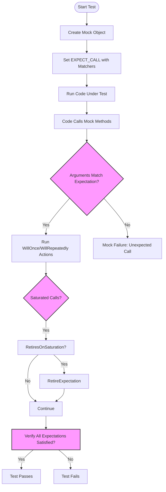

# Matchers API

This reference page details the expressive matchers available in GoogleTest, designed to facilitate readable, maintainable assertions. Matchers help you specify expectations on values or mock method arguments, allowing precise and flexible verification in your tests.

---

## Overview

Matchers are predicates that describe properties or constraints of values. They can be used with:

- `EXPECT_THAT(value, matcher)` to assert that a value satisfies a matcher.
- `EXPECT_CALL(mock_object, method(matchers...))` to set expectations on mock method arguments.

GoogleTest provides many standard matchers and supports composing them to build complex assertions.

---

## Types of Matchers

### Simple Matchers

Matchers like `Eq(value)`, `Ne(value)`, `Lt(value)`, `Le(value)`, `Gt(value)`, and `Ge(value)` check for equality and order relations. For example:

```cpp
EXPECT_THAT(x, Eq(42));           // x == 42
EXPECT_THAT(x, Gt(5));            // x > 5
EXPECT_CALL(mock, Foo(Le(10)));  // Expect Foo() called with argument <= 10
```

### Wildcard Matchers

- `_` matches any value of any type.
- `A<T>()` or `An<T>()` matches any value of type `T`.

```cpp
EXPECT_CALL(mock, Foo(_));       // Foo() called with any argument
EXPECT_THAT(value, A<int>());    // value is any int
```

### Pointer Matchers

- `IsNull()` matches any null raw or smart pointer.
- `NotNull()` matches any non-null pointer.
- `Pointee(matcher)` matches a pointer whose pointee matches `matcher`.

```cpp
EXPECT_THAT(ptr, IsNull());
EXPECT_CALL(mock, Bar(Pointee(Gt(0))));
```

### String Matchers

- `StrEq(str)` — case-sensitive string equality
- `StrNe(str)` — case-sensitive string inequality
- `StrCaseEq(str)` — case-insensitive string equality
- `StrCaseNe(str)` — case-insensitive string inequality
- `HasSubstr(substring)` — contains substring
- `StartsWith(prefix)` — string starts with prefix
- `EndsWith(suffix)` — string ends with suffix

```cpp
EXPECT_THAT(name, StartsWith("John"));
EXPECT_CALL(mock, Say(StrCaseEq("hello")));
```

### Container Matchers

Matchers for STL containers allow expressive matching of sequences and sets:

- `ElementsAre(elem_matchers...)` — matches container with elements matching in order
- `UnorderedElementsAre(elem_matchers...)` — matches container with elements matching in any order
- `ElementsAreArray(array_or_container)` and `UnorderedElementsAreArray(...)` — match arrays or container slices
- `Contains(matcher)` — matches containers containing at least one element matching `matcher`
- `Each(matcher)` — matches containers where all elements satisfy `matcher`
- `SizeIs(matcher)` — the container's size matches `matcher`

Example:

```cpp
EXPECT_CALL(mock, DoSomething(ElementsAre(1, Gt(5), _)));
EXPECT_THAT(vec, UnorderedElementsAre(1, 2, 3));
EXPECT_THAT(map, Contains(Key(Ge(10))));
```

### Pair and Key Matchers

- `Key(matcher)` matches an `std::pair` whose key (`.first`) matches `matcher`.
- `Pair(first_matcher, second_matcher)` matches a pair with fields individually matched.

Usage:

```cpp
EXPECT_THAT(map, Contains(Pair(42, "foo")));
EXPECT_THAT(map, Contains(Key(Gt(10))));
```

### Compound Matchers

GoogleTest allows composing matchers:

- `AllOf(m1, m2, ...)` — matches if all sub-matchers match
- `AnyOf(m1, m2, ...)` — matches if any sub-matcher matches
- `Not(matcher)` — matches if matcher does not match

Example:

```cpp
EXPECT_THAT(value, AllOf(Gt(0), Lt(10)));
EXPECT_CALL(mock, Foo(Not(Eq(42))));
```

### Matchers for Objects' Members

- `Field(&Type::member, matcher)` matches an object whose member matches given matcher
- `Property(&Type::getter, matcher)` matches an object whose getter method returns a value matching matcher

```cpp
EXPECT_THAT(foo, Field(&Foo::bar, Ge(3)));
EXPECT_THAT(foo, Property(&Foo::Name, StartsWith("John")));
```

---

## Using Matchers

Matchers provide rich capabilities for checking values or mock method parameters. Here’s the typical use:

1. **Match exact values or properties:** Use simple matchers like `Eq()`, `Gt()`, `Ne()`, or wildcards `_` when argument values don’t matter.

2. **Compose matchers for complex conditions:** Combine matchers using `AllOf()`, `AnyOf()`, `Not()`, etc.

3. **Match container contents:** Use `ElementsAre()`, `Contains()`, and related matchers for collections.

4. **Use matchers in expectations:** Set expectations on mock methods using `EXPECT_CALL(mock, Method(matcher1, matcher2))`.

5. **Check values in assertions:** Assert on values using `EXPECT_THAT(value, matcher)`.

---

## Writing Custom Matchers

### Defining Simple Matchers with `MATCHER` Macros

You can define a custom matcher using the `MATCHER` or parameterized `MATCHER_P` macros.

Example: Check for even numbers

```cpp
MATCHER(IsEven, "Checks if number is even") {
  return (arg % 2) == 0;
}

EXPECT_THAT(n, IsEven());
EXPECT_CALL(mock, Foo(IsEven()));
```

Macro parameters:
- `arg` refers to the value being matched
- `negation` is `true` when describing the matcher’s negation for messages

### Parameterized Matchers

Create matchers with parameters using `MATCHER_P`, `MATCHER_P2`, ..., up to `MATCHER_P10`:

```cpp
MATCHER_P(IsDivisibleBy, divisor, "") {
  return (arg % divisor) == 0;
}

EXPECT_THAT(x, IsDivisibleBy(7));
```

### Best Practices

- Provide meaningful descriptions using the description string or streaming to the result listener.
- Ensure matchers are pure and side-effect free.
- Use `MatchAndExplain()` to provide helpful diagnostics on failures.

---

## Composability and Advanced Usage

### Multi-Argument Matching

Use `.With(matcher)` with `EXPECT_CALL` to apply a matcher to all method arguments as a tuple:

```cpp
using ::testing::_;
using ::testing::Lt;
EXPECT_CALL(mock, SetPosition(_, _)).With(Lt());  // First argument less than second
```

### Safe Casting of Matchers

Use `SafeMatcherCast<T>(m)` to safely cast a matcher to a different type `T`, typically when argument types differ but are compatible.

Example:

```cpp
EXPECT_CALL(mock, DoThis(SafeMatcherCast<Derived*>(base_class_matcher)));
```

### Using Matcher Factories

GoogleTest provides many built-in matcher creation functions (e.g., `Eq()`, `Contains()`, `Key()`, `Pair()`). Use these factories to construct matchers at the call site.

---

## Common Pitfalls and Troubleshooting

- **Over-specifying expectations:** Avoid precise argument matching where unnecessary; use wildcards to reduce test brittleness.
- **Using stale references:** When matching with references wrapped in `Ref(x)`, ensure that the reference remains valid throughout the test.
- **Retiring expectations:** Use `.RetiresOnSaturation()` if you want an expectation to become inactive after its expected invocation count is reached.
- **Remember the sticky nature of expectations:** By default, expectations remain active even after saturation, possibly causing unexpected failures.

---

## Examples

```cpp
#include <gmock/gmock.h>
using ::testing::Eq;
using ::testing::Gt;
using ::testing::Not;
using ::testing::ElementsAre;
using ::testing::_;

// Mock class
class MockDatabase {
 public:
  MOCK_METHOD(bool, Connect, (const std::string& uri), (override));
  MOCK_METHOD(int, GetRecordCount, (), (const, override));
};

TEST(DatabaseTest, ConnectAndCheckRecords) {
  MockDatabase mock;

  EXPECT_CALL(mock, Connect(Eq("localhost")))
      .Times(1)
      .WillOnce(::testing::Return(true));

  ON_CALL(mock, GetRecordCount()).WillByDefault(::testing::Return(42));

  ASSERT_TRUE(mock.Connect("localhost"));
  EXPECT_THAT(mock.GetRecordCount(), Gt(0));
}

// Custom matcher example
MATCHER(IsPositive, "Checks if number is positive") {
  return arg > 0;
}

TEST(CustomMatcherTest, UsesCustomMatcher) {
  int value = 10;
  EXPECT_THAT(value, IsPositive());
}

// Composite matcher
TEST(CompositeMatcherTest, CombinesMatchers) {
  int x = 7;
  EXPECT_THAT(x, AllOf(Gt(0), Lt(10)));
}

// Container matcher
TEST(ContainerMatcherTest, ChecksElementsInContainer) {
  std::vector<int> v = {1, 2, 3};
  EXPECT_THAT(v, ElementsAre(1, 2, 3));
  EXPECT_THAT(v, Not(ElementsAre(3, 2, 1)));
}
```

---

## References

- [Matchers Reference (Complete list of built-in matchers)](/api-reference/googletest-core-api/matchers-api)
- [Effective Mocking with GoogleMock - Guide](https://google.github.io/googletest/gmock_cook_book.html)
- [Writing Custom Matchers and Actions - Guide](https://google.github.io/googletest/gmock_cook_book.html#CustomMatchers)
- [gMock for Dummies - Getting Started with Mocks](https://google.github.io/googletest/gmock_for_dummies.html)

---

## Tips

- Use matchers to write expressive and clear tests that describe expected behavior rather than implementation details.
- Avoid over-constraining expectations to prevent brittle tests.
- Create reusable composite matchers to simplify complex assertions.
- For mocking, combine matchers with `EXPECT_CALL` to control and verify how mocks are called.

---

## Troubleshooting

<AccordionGroup title="Common Issues and Solutions">
<Accordion title="Unexpected Mock Function Call Failure">
This happens when a mock function is called with arguments that don't match any active expectation.
- Check if `EXPECT_CALL` statements cover all expected argument combinations.
- Use more general matchers (e.g., `_`) if appropriate.
</Accordion>
<Accordion title="Uninteresting Call Warnings">
These warnings appear when a mock method is called without any `EXPECT_CALL` set for it.
- Use `NiceMock` to suppress these warnings for methods you don't care about.
- Set catch-all expectations using `EXPECT_CALL(mock, Method(_)).Times(AnyNumber())` if needed.
</Accordion>
<Accordion title="Matching Move-Only Types Issues">
Mocking methods with move-only arguments is supported. For older gMock versions, delegate calls to mock methods taking raw pointers.
- Prefer lambdas or callable objects in `WillOnce`/`WillRepeatedly` for move-only returns.
</Accordion>
</AccordionGroup>

---

## Mermaid Diagram: Matcher Usage Flow


