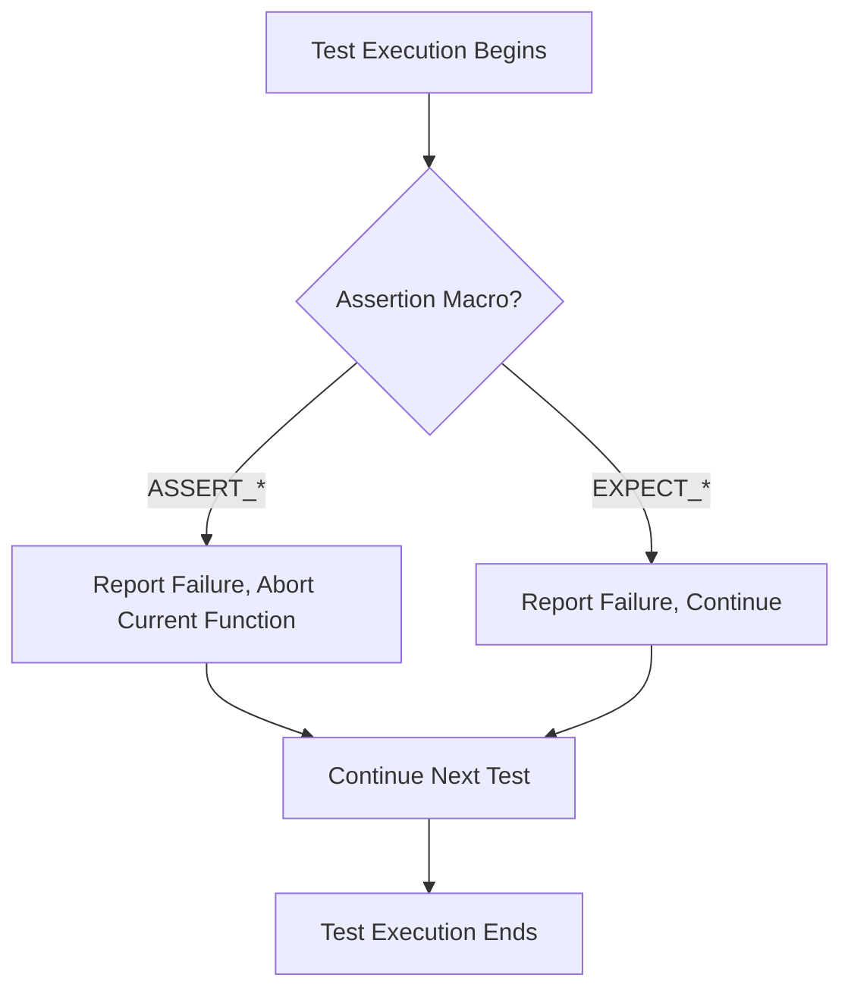

# Assertion Macros

This reference documents all built-in assertion macros provided by GoogleTest, detailing their usage, distinctions between fatal and non-fatal failures, predicate assertions, user-defined assertions, and practical examples. These macros enable you to verify program correctness with clear, actionable feedback when assertions fail.

---

## 1. Assertion Overview

GoogleTest assertion macros check program conditions during tests and report failures when conditions aren't met. They fall into two categories based on failure severity:

- **Fatal Failures (`ASSERT_*`)**: Abort the current function immediately when they fail, stopping further test execution within that function.
- **Non-Fatal Failures (`EXPECT_*`)**: Report failure but allow the current function to continue execution.

Use `ASSERT_*` when continuing the test after failure makes no sense, and `EXPECT_*` when you want to collect multiple errors before aborting.

All assertion macros support streaming a custom failure message with the `<<` operator to provide detailed context.

---

## 2. Basic Assertion Macros

### 2.1 Explicit Success and Failure

These macros generate explicit success or failure regardless of a particular condition.

- **`SUCCEED()`**: Marks an explicit success within a test.

  ```cpp
  SUCCEED();
  SUCCEED() << "This test succeeded.";
  ```

- **`FAIL()`**: Generates a fatal failure that aborts the current function.

  ```cpp
  if (!ready) {
    FAIL() << "Setup failed, aborting test.";
  }
  ```

- **`ADD_FAILURE()`**: Generates a non-fatal failure, allowing the test to continue.

  ```cpp
  if (condition_unexpected) {
    ADD_FAILURE() << "Got unexpected condition.";
  }
  ```

- **`ADD_FAILURE_AT(file, line)`**: Generates a non-fatal failure at a specific file and line number.

  ```cpp
  ADD_FAILURE_AT("my_file.cc", 42) << "Incorrect argument.";
  ```

### 2.2 Boolean Condition Assertions

Used to verify conditions expected to be true or false.

| Macro         | Description                      |
|---------------|----------------------------------|
| `EXPECT_TRUE(condition)`  | Checks that `condition` is true; continues on failure |
| `ASSERT_TRUE(condition)`  | Checks that `condition` is true; aborts on failure    |
| `EXPECT_FALSE(condition)` | Checks that `condition` is false; continues on failure|
| `ASSERT_FALSE(condition)` | Checks that `condition` is false; aborts on failure   |

Example:

```cpp
EXPECT_TRUE(is_ready) << "Ready flag was false.";
ASSERT_FALSE(has_error) << "Unexpected error occurred.";
```

### 2.3 Binary Comparison Assertions

These verify relationships between two values. When an assertion fails, values are printed if possible.

| Macro         | Meaning                                      |
|---------------|----------------------------------------------|
| `EXPECT_EQ(val1, val2)` | `val1 == val2`                               |
| `ASSERT_EQ(val1, val2)` | `val1 == val2`, aborts on failure            |
| `EXPECT_NE(val1, val2)` |  `val1 != val2`                              |
| `ASSERT_NE(val1, val2)` |  `val1 != val2` aborts on failure             |
| `EXPECT_LT(val1, val2)` |  `val1 < val2`                               |
| `ASSERT_LT(val1, val2)` |  `val1 < val2`, aborts on failure             |
| `EXPECT_LE(val1, val2)` |  `val1 <= val2`                              |
| `ASSERT_LE(val1, val2)` |  `val1 <= val2`, aborts on failure             |
| `EXPECT_GT(val1, val2)` |  `val1 > val2`                               |
| `ASSERT_GT(val1, val2)` |  `val1 > val2`, aborts on failure             |
| `EXPECT_GE(val1, val2)` |  `val1 >= val2`                              |
| `ASSERT_GE(val1, val2)` |  `val1 >= val2`, aborts on failure             |

**C String comparisons note:** When you want to compare C strings by content, use `EXPECT_STREQ` or `EXPECT_STRNE`. Using `EXPECT_EQ` on pointers compares addresses, not content.

Example:

```cpp
EXPECT_EQ(result.size(), expected_size) << "Size mismatch.";
ASSERT_LT(score, max_score) << "Score too high.";
```

### 2.4 String Comparisons

Special macros exist for comparing C strings (including wide strings). These macros compare the contents rather than addresses.

| Macro           | Description                                  |
|-----------------|----------------------------------------------|
| `EXPECT_STREQ(str1, str2)` | Strings equal                            |
| `ASSERT_STREQ(str1, str2)` | Strings equal, aborts on failure         |
| `EXPECT_STRNE(str1, str2)` | Strings not equal                          |
| `ASSERT_STRNE(str1, str2)` | Strings not equal, aborts on failure       |
| `EXPECT_STRCASEEQ(str1, str2)` | Case-insensitive string equality        |
| `ASSERT_STRCASEEQ(str1, str2)` | Case-insensitive string equality aborting |
| `EXPECT_STRCASENE(str1, str2)` | Case-insensitive string inequality      |
| `ASSERT_STRCASENE(str1, str2)` | Case-insensitive string inequality aborting |

Example:

```cpp
EXPECT_STREQ(expected.c_str(), result.c_str()) << "Strings do not match.";
ASSERT_STRCASEEQ("hello", user_input) << "Input case mismatch.";
```

### 2.5 Floating-Point Comparisons

Due to rounding errors, special assertions compare floating-point values approximately.

| Macro               | Description                                         |
|---------------------|-----------------------------------------------------|
| `EXPECT_FLOAT_EQ(val1, val2)`   | Compares `float`s within 4 ULPs                  |
| `ASSERT_FLOAT_EQ(val1, val2)`   | Same as above; aborts on failure                   |
| `EXPECT_DOUBLE_EQ(val1, val2)`  | Compares `double`s within 4 ULPs                 |
| `ASSERT_DOUBLE_EQ(val1, val2)`  | Same as above; aborts on failure                   |
| `EXPECT_NEAR(val1, val2, abs_error)` | Checks difference ≤ `abs_error`                  |
| `ASSERT_NEAR(val1, val2, abs_error)` | Same as above; aborts on failure               |

Example:

```cpp
EXPECT_NEAR(calculated_pi, 3.14159, 1e-5) << "Pi calculation off.";
ASSERT_DOUBLE_EQ(expected_val, actual_val) << "Values differ.";
```

### 2.6 Exception Assertions

Verify that code throws or does not throw exceptions (requires exception support).

| Macro             | Description                             |
|-------------------|-----------------------------------------|
| `EXPECT_THROW(statement, exception_type)`  | Expects exception of given type   |
| `ASSERT_THROW(statement, exception_type)`  | Same as above; aborts on failure 
| `EXPECT_ANY_THROW(statement)`              | Expects any exception             |
| `ASSERT_ANY_THROW(statement)`              | Same as above; aborts on failure |
| `EXPECT_NO_THROW(statement)`               | Expects no exception             |
| `ASSERT_NO_THROW(statement)`               | Same as above; aborts on failure |

Example:

```cpp
EXPECT_THROW(func_that_throws(), std::runtime_error);
ASSERT_NO_THROW(func_that_does_not_throw());
```

### 2.7 Predicate Assertions

When you want to use custom predicates for more descriptive failure messages or difficult-to-express checks, use predicate assertions. They evaluate the predicate and print argument values on failure.

- **Basic predicates (return `bool`)**

  ```cpp
  EXPECT_PRED1(predicate, arg1);
  EXPECT_PRED2(predicate, arg1, arg2);
  // ... up to 5 arguments
  ```

- **Predicate Formatters (return `AssertionResult`)**

  Allows more control over failure message formatting.

  ```cpp
  EXPECT_PRED_FORMAT1(predicate_formatter, arg1);
  EXPECT_PRED_FORMAT2(predicate_formatter, arg1, arg2);
  // ... up to 5 arguments
  ```

Example with a predicate:

```cpp
bool IsPositive(int n) { return n > 0; }
EXPECT_PRED1(IsPositive, value);
```

Example with predicate-formatter:

```cpp
testing::AssertionResult IsEven(const char* expr, int n) {
  if (n % 2 == 0) return testing::AssertionSuccess();
  return testing::AssertionFailure() << expr << " evaluates to odd number " << n;
}
EXPECT_PRED_FORMAT1(IsEven, value);
```

### 2.8 Windows HRESULT Assertions

Specialized for Windows, these check HRESULTs for success or failure and report human-readable messages.

| Macro                    | Description                        |
|--------------------------|----------------------------------|
| `EXPECT_HRESULT_SUCCEEDED(expr)` | Checks `expr` is a success HRESULT  |
| `ASSERT_HRESULT_SUCCEEDED(expr)` | As above, aborts on failure           |
| `EXPECT_HRESULT_FAILED(expr)`    | Checks `expr` is a failure HRESULT |
| `ASSERT_HRESULT_FAILED(expr)`    | As above, aborts on failure           |

Example:

```cpp
CComPtr<IShellDispatch2> shell;
ASSERT_HRESULT_SUCCEEDED(shell.CoCreateInstance(L"Shell.Application"));
```

---

## 3. Usage Best Practices and Tips

### 3.1 Fatal vs Non-Fatal Assert Usage

- Use `ASSERT_*` macros when failure means continuing the test is pointless or dangerous (e.g., accessing invalid pointers).
- Use `EXPECT_*` macros when the test should continue to find multiple failures.

### 3.2 Streaming Custom Failure Messages

Add detailed context to help debugging failures:

```cpp
EXPECT_EQ(actual, expected) << "Expected value at index " << i << " differs.";
```

Avoid complex expressions inside message streams to prevent side effects.

### 3.3 Assertion in Void-Returning Functions

Fatal assertions can only be used inside functions returning `void`. Using them in functions with return types produces compile errors. For non-void functions, use non-fatal assertions or restructure the code.

### 3.4 Using Predicate Assertions for Complex Condition Checks

Prefer predicate or predicate-format assertions over `EXPECT_TRUE` with a complex condition for better error output and single evaluation.

### 3.5 Checking for Failures in Helper Functions

Use `HasFatalFailure()` to check if any previous fatal failure occurred before proceeding.

Example:

```cpp
void Helper() {
  ASSERT_TRUE(Init());
}

TEST(MyTest, Example) {
  Helper();
  if (testing::Test::HasFatalFailure()) return;
  ...
}
```

### 3.6 Skipping Tests at Runtime

Use `GTEST_SKIP()` macro to skip tests dynamically based on runtime conditions, optionally streaming messages.

---

## 4. Practical Examples

### 4.1 Basic Assert and Expect

```cpp
TEST(FactorialTest, BasicAssertions) {
  // Use ASSERT_* when preconditions must prevent test continuation.
  ASSERT_EQ(Factorial(0), 1) << "Factorial of 0 should be 1.";

  // Use EXPECT_* to report errors but continue testing.
  EXPECT_EQ(Factorial(1), 1);
  EXPECT_EQ(Factorial(2), 2);
}
```

### 4.2 String Assertion

```cpp
const char* result = GetString();
EXPECT_STREQ("expected", result) << "Unexpected string content.";
```

### 4.3 Predicate Assertion Using a Custom Predicate

```cpp
bool IsEven(int number) { return number % 2 == 0; }

TEST(MyTest, IsEvenCheck) {
  int val = 3;
  EXPECT_PRED1(IsEven, val) << "Value is not even.";
}
```

### 4.4 Predicate-Formatter for Detailed Failure Messages

```cpp
testing::AssertionResult IsPositive(const char* expr, int val) {
  if (val > 0) return testing::AssertionSuccess();
  return testing::AssertionFailure() << expr << " evaluates to non-positive value: " << val;
}

TEST(MyTest, PositiveCheck) {
  int val = -1;
  EXPECT_PRED_FORMAT1(IsPositive, val);
}
```

### 4.5 Exception Assertion

```cpp
void ThrowsRuntimeError() { throw std::runtime_error("fail"); }

TEST(ExceptionTest, Throws) {
  EXPECT_THROW(ThrowsRuntimeError(), std::runtime_error);
  ASSERT_ANY_THROW(ThrowsRuntimeError());
}
```

---

## 5. Troubleshooting Common Issues

- **Fatal assertions in non-void functions cause compilation errors**: Switch to `EXPECT_*` or refactor the function to return `void`.

- **Using `EXPECT_EQ` with C strings compares pointers, not contents**: Use `EXPECT_STREQ` for string content comparison.

- **Fatal assertions inside constructors/destructors do not abort tests as expected**: Use `SetUp()`/`TearDown()` methods and place fatal assertions there.

- **Predicate assertion arguments executed multiple times**: Ensure your predicate functions do not evaluate arguments more than once; predicate assertions guarantee single evaluation.

- **No tests executed due to filters**: Verify your `--gtest_filter` is correct and not excluding all tests.

---

## 6. References and Next Steps

- [GoogleTest Primer](https://google.github.io/googletest/primer.html) — Getting started with GoogleTest.
- [Assertions Reference](reference/assertions.md) — Full details on assertion macros.
- [Core Assertions & Best Practices Guide](guides/getting-started/core-assertions-best-practices.md) — Practical assertion usage tips.
- [Custom Assertions and Matchers](api-reference/googletest-core-apis/custom-assertions-and-matchers.md) — Extending GoogleTest with your own assertions.
- [Parameterized and Typed Tests](api-reference/googletest-core-apis/parameterized-and-typed-tests.md) — Writing tests using parameters and different types.
- [Mocking Reference](docs/reference/mocking.md) — For integrating assertions with gMock mocks.

---

## 7. Summary

This document thoroughly covers GoogleTest’s assertion macros, explaining when and how to use fatal vs non-fatal assertions, string and floating-point comparisons, exception checks, and predicate assertions for complex conditions. It presents best practices for assertion placement, custom failure messages, and handling runtime test skipping. Comprehensive examples illustrate macro usage, and troubleshooting guidance addresses common pitfalls encountered when writing assertions.

---

## 8. Diagram: Assertion Macro Flow



---

For deeper insights on writing custom predicates and using matchers, consult the Custom Assertions and Matchers documentation. To understand how assertion failures propagate and how to structure test code around them, the Advanced guide and Core Assertions & Best Practices are highly recommended.
