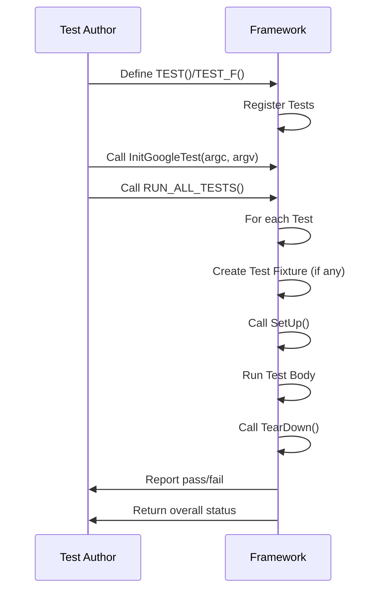

# Test Definition and Lifecycle

GoogleTest provides a powerful and intuitive API to define, register, and run tests in C++. This guide covers the core concepts centered around the fundamental macros `TEST` and `TEST_F`, explains the test life cycle, and illustrates how GoogleTest reports results to help you write robust unit tests.

---

## 1. Defining Tests

### 1.1 The `TEST` Macro

The `TEST` macro is the simplest way to define an individual test case. It takes two arguments:

- **TestSuiteName**: The group name for related tests.
- **TestName**: The specific test name within the suite.

```cpp
TEST(TestSuiteName, TestName) {
  // Test code goes here
}
```

This defines a new test function that GoogleTest will automatically discover and execute.

### 1.2 The `TEST_F` Macro

When multiple tests share common setup and teardown code or common data, a *test fixture* class can be used. This fixture is created by deriving from `testing::Test`.

```cpp
class MyFixture : public testing::Test {
 protected:
  void SetUp() override {
    // Code here runs before each test
  }

  void TearDown() override {
    // Code here runs after each test
  }

  // Shared test members
  int common_data_;
};
```

Using the fixture, define multiple tests that share the setup:

```cpp
TEST_F(MyFixture, Test1) {
  // Uses common_data_
}

TEST_F(MyFixture, Test2) {
  // Also uses common_data_
}
```

The first argument to `TEST_F` is the fixture class name, and the second is the test name.

### 1.3 Test Naming Conventions

- Both suite and test names must be valid C++ identifiers without underscores.
- Tests in different suites can share test names.
- The full test name combines suite and test names.

### 1.4 Advanced Test Definitions

GoogleTest also supports typed, value-parameterized, and type-parameterized tests with special macros (`TYPED_TEST`, `TEST_P`) for more advanced scenarios. See the [Parameterized and Typed Tests](../api-reference/googletest-core-apis/parameterized-and-typed-tests) documentation for details.

---

## 2. Test Lifecycle

Understanding the lifecycle of GoogleTest tests is essential to structure your tests effectively.

### 2.1 Test Registration

- Tests defined with `TEST` or `TEST_F` are automatically registered with the framework.
- No manual registration or main function wiring is needed if linking with `gtest_main`.

### 2.2 Test Execution

- GoogleTest runs each test independently.
- For `TEST_F`, a new fixture object is created per test, and `SetUp()` and `TearDown()` are called accordingly.
- Tests should not depend on other tests and should be isolated.

### 2.3 Assertions

- Use `EXPECT_` macros for non-fatal checks that allow tests to continue.
- Use `ASSERT_` macros for fatal checks that abort the current test on failure.
- Assertions produce detailed failure reports with file, line, and error message.

### 2.4 Test Results

- Tests succeed if no fatal or non-fatal assertion fails.
- Failures include assertion failures and unexpected exceptions.
- Summary reports show the number of tests run, succeeded, and failed.

---

## 3. Running Tests

### 3.1 Initialization

Before running tests, initialize GoogleTest with:

```cpp
int main(int argc, char** argv) {
  testing::InitGoogleTest(&argc, argv);
  return RUN_ALL_TESTS();
}
```

- `InitGoogleTest` parses command-line flags and prepares the framework.
- `RUN_ALL_TESTS` runs all registered tests and returns 0 if all succeed.

### 3.2 Test Filtering and Control

- Control which tests run via command-line flags (e.g., `--gtest_filter`).
- You can also configure flag-based filtering for disabling or enabling tests.

---

## 4. Additional APIs

### 4.1 Scoped Setup and Teardown

- Override `SetUpTestSuite()` and `TearDownTestSuite()` static methods in the fixture for suite-wide setup/teardown.

### 4.2 Friend Tests

- Use `FRIEND_TEST(TestSuiteName, TestName);` to allow tests access to private members.

### 4.3 Test Properties

- Use `RecordProperty(key, value)` to log custom properties for tests.

### 4.4 Test Events Listeners

- For advanced observers, subclass `TestEventListener` to trace test execution.

---

## 5. Practical Example

```cpp
#include <gtest/gtest.h>

// Simple function to test
int Add(int a, int b) {
  return a + b;
}

// A basic test
TEST(AdditionTest, SumIsCorrect) {
  EXPECT_EQ(Add(1, 2), 3);
}

// Using a fixture
class MathTest : public testing::Test {
 protected:
  void SetUp() override {
    x = 3;
    y = 4;
  }

  int x, y;
};

TEST_F(MathTest, SumWithFixture) {
  EXPECT_EQ(Add(x, y), 7);
}

int main(int argc, char** argv) {
  testing::InitGoogleTest(&argc, argv);
  return RUN_ALL_TESTS();
}
```

This example demonstrates tests with and without fixtures, initialization, and running.

---

## 6. Troubleshooting Common Issues

- Ensure that `InitGoogleTest()` is called before `RUN_ALL_TESTS()`.
- Tests are auto-registered; no manual registration needed.
- Use `ASSERT_` vs `EXPECT_` appropriately to avoid premature termination or false successes.
- Fixture objects are instantiated afresh per test; do not share state unintentionally.

---

## 7. Summary Diagram



---

# See Also

- [Assertions Reference](../api-reference/googletest-core-apis/assertions-reference)
- [Mocking Reference](../docs/reference/mocking.md)
- [Value-Parameterized Tests](../guides/parameterization-and-patterns/value-parameterized-tests)
- [Typed Tests](../guides/parameterization-and-patterns/type-parameterized-tests)
- [gMock Cookbook](../docs/gmock_cook_book.md)
- [GoogleTest Primer](../docs/primer.md)

---

For more advanced topics like parameterized, typed, and death tests, see the corresponding documentation sections.

---

_No implementation details are exposed. The document focuses on user intent: define, register, run, and report on tests using GoogleTest core APIs._
