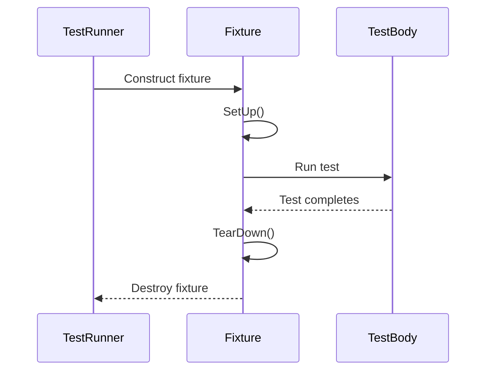

# Test Macros and Lifecycles

GoogleTest provides a rich set of macros to define tests, organize them into suites, manage test fixtures, and control the lifetime of test resources. This page explains these primary macros, details the test lifecycle, and presents best practices to help you write clear, robust, and maintainable tests.

---

## Overview of Test Macros

GoogleTest offers several high-level macros to declare tests and test suites:

| Macro          | Purpose                                                                                      |
|----------------|----------------------------------------------------------------------------------------------|
| `TEST`         | Defines a simple test without test fixture.                                                  |
| `TEST_F`       | Defines a test that uses a test fixture (shared setup/teardown).                             |
| `TEST_P`       | Defines a value-parameterized test.                                                         |
| `INSTANTIATE_TEST_SUITE_P` | Instantiates a parameterized test suite with specific parameter sets.                  |
| `TYPED_TEST_SUITE` / `TYPED_TEST` | Defines typed tests with various type parameters for generic test logic.          |

### `TEST` Macro

`TEST(TestSuiteName, TestName)` defines an individual test case named `TestName` within the suite named `TestSuiteName`:

```cpp
TEST(FactorialTest, HandlesZeroInput) {
  EXPECT_EQ(Factorial(0), 1);
}
```

- Both `TestSuiteName` and `TestName` must be valid C++ identifiers and should **not contain underscores** to avoid name collisions.
- Tests defined with `TEST` have no shared setup or teardown.

### `TEST_F` Macro

For tests requiring common set-up and tear-down, use `TEST_F` with a test fixture class derived from `testing::Test`:

```cpp
class QueueTest : public ::testing::Test {
 protected:
  QueueTest() {
    // Setup code shared for all tests
  }

  void SetUp() override {
    // Optional additional per-test setup
  }

  Queue<int> q_;
};

TEST_F(QueueTest, IsInitiallyEmpty) {
  EXPECT_EQ(q_.size(), 0);
}
```

- A fresh fixture object is constructed for each test.
- `SetUp()` is called before each test.
- `TearDown()` can be overridden to free resources after each test.

### `TEST_P` and `INSTANTIATE_TEST_SUITE_P` Macros for Parameterized Tests

GoogleTest supports writing *value-parameterized* tests that run the same logic with different parameters:

```cpp
class FooTest : public testing::TestWithParam<int> {};

TEST_P(FooTest, DoesBlah) {
  EXPECT_TRUE(Foo(GetParam()));
}

INSTANTIATE_TEST_SUITE_P(MyInstantiation, FooTest, testing::Values(1, 2, 3));
```

- `TEST_P` defines the parameterized test logic.
- `INSTANTIATE_TEST_SUITE_P` generates concrete test instances with chosen parameters.

You can generate parameters from ranges, containers, booleans, or even Cartesian products of multiple generators. This allows thorough and flexible testing without code duplication.

### Typed Tests

Typed tests allow you to write a test once and run it on multiple types:

```cpp
template <typename T>
class MyTypedTest : public testing::Test {
  // ...
};

using MyTypes = ::testing::Types<int, double>;
TYPED_TEST_SUITE(MyTypedTest, MyTypes);

TYPED_TEST(MyTypedTest, DoesBlah) {
  TypeParam value{};
  EXPECT_TRUE(SomePredicate(value));
}
```

---

## Test Lifecycle and Resource Management

Understanding the GoogleTest lifecycle is essential for effective use of test fixtures and shared resources.

### Test Fixture Object Management

For each test defined with `TEST_F` or `TEST_P`, GoogleTest:

1. Constructs a new fixture object.
2. Calls `SetUp()` for per-test initialization.
3. Runs the test body.
4. Calls `TearDown()` for per-test cleanup.
5. Destroys the fixture object.

This process guarantees test isolation — no state leaks between tests.

### Per-Test-Suite Setup and Teardown

When tests share expensive resources, GoogleTest allows defining public static methods:

- `static void SetUpTestSuite()` — called **once** before the first test in the suite.
- `static void TearDownTestSuite()` — called **once** after the last test in the suite.

Example:

```cpp
class FooTest : public testing::Test {
 public:
  static void SetUpTestSuite() {
    shared_resource_ = new Resource();
  }

  static void TearDownTestSuite() {
    delete shared_resource_;
    shared_resource_ = nullptr;
  }

 protected:
  static Resource* shared_resource_;
};

Resource* FooTest::shared_resource_ = nullptr;
```

### Global Test Environment

For setup/teardown across the entire test program, derive a class from `testing::Environment`:

```cpp
class MyEnvironment : public testing::Environment {
 public:
  void SetUp() override {
    // global setup
  }

  void TearDown() override {
    // global cleanup
  }
};

int main(int argc, char** argv) {
  testing::InitGoogleTest(&argc, argv);
  testing::AddGlobalTestEnvironment(new MyEnvironment);
  return RUN_ALL_TESTS();
}
```

### Important Lifecycle Notes

- The setup methods (`SetUpTestSuite`, `SetUp`) are called fresh for each test iteration.
- The test order is undefined. Tests must not depend on other tests running first or last.
- If your test fixture is subclassed, `SetUpTestSuite` may be called multiple times, so guard resource allocation if needed.

---

## Best Practices for Writing Tests

### Naming Tests

- Avoid underscores (`_`) in test suite and test names to prevent name collisions.
- Follow C++ identifier naming conventions.

### Assertions

- Use `EXPECT_*` macros to continue tests after failures and gather multiple issues in one run.
- Use `ASSERT_*` macros when further test execution depends on the assertion.
- Stream custom failure messages to assertions to clarify failures.

### Fixture Usage

- Put shared, expensive resource setup/teardown in `SetUpTestSuite` and `TearDownTestSuite`.
- Use `SetUp` and `TearDown` for per-test initialization.
- Constructor and destructor should not contain assertions that can fail. Use `SetUp` and `TearDown` instead.

### Parameterized Tests

- Use parameterized tests to write once and test many cases.
- Use `INSTANTIATE_TEST_SUITE_P` with appropriate parameter generators.
- Provide custom name generators if needed for clarity in test reports.

### Typed Tests

- Use typed tests to verify template or generic code across multiple types.
- Register and instantiate typed tests properly to cover all desired types.

### Event Listeners and Test Execution Hooks

- Extend testing behavior by adding custom event listeners if necessary (see event listener API).

---

## Sample Usage

```cpp
// Simple test:
TEST(MathTest, Addition) {
  EXPECT_EQ(2 + 2, 4);
}

// Using a fixture:
class QueueTest : public testing::Test {
 protected:
  Queue<int> queue_;

  void SetUp() override {
    queue_.Enqueue(1);
  }
};

TEST_F(QueueTest, DequeueReturnsQueuedElement) {
  int* val = queue_.Dequeue();
  ASSERT_NE(val, nullptr);
  EXPECT_EQ(*val, 1);
  delete val;
}

// Parameterized test:
class FactorialTest : public testing::TestWithParam<int> {};

TEST_P(FactorialTest, HandlesVariousInputs) {
  int n = GetParam();
  EXPECT_GE(Factorial(n), 1);
}

INSTANTIATE_TEST_SUITE_P(Inputs, FactorialTest, testing::Values(0, 1, 2, 3, 4));

// Typed test:
template <typename T>
class NumericTest : public testing::Test {
 public:
  T value_{};
};

using NumericTypes = testing::Types<int, double, float>;
TYPED_TEST_SUITE(NumericTest, NumericTypes);

TYPED_TEST(NumericTest, DefaultValueIsZero) {
  EXPECT_EQ(this->value_, TypeParam{});
}
```

---

## Troubleshooting & Common Pitfalls

- **Test names with underscores cause conflicts:** Always avoid underscores in `TestSuiteName` and `TestName` (see FAQ).
- **Assertions in constructors/destructors cause compilation errors:** Use `SetUp()`/`TearDown()` instead.
- **Mixing TEST() and TEST_F() with the same test suite name:** GoogleTest requires consistent fixture usage per suite.
- **Tests not running or discovered:** Verify naming conventions and proper fixture definitions.
- **Skipping tests unintentionally:** Check if `GTEST_SKIP()` is called in `SetUp()` or test bodies.

---

## See Also

- [GoogleTest Primer](../primer.md) - Introductory guide on writing tests.
- [Assertions Reference](../reference/assertions.md) - Comprehensive assertion macros.
- [Value and Type-Parameterized Tests](../reference/testing.md#TEST_P) - Advanced parameterized testing.
- [FAQ: Naming and Common Issues](../../faq.md) - Troubleshooting naming and test discovery issues.
- [Event Listener API](../reference/testing.md#TestEventListener) - For advanced test event handling.

---

## Diagram: Test Fixture and Test Lifecycle



This sequence reiterates that each test runs with a unique fixture instance, ensuring test isolation and repeatability.

---

With these tools and practices, GoogleTest empowers you to organize your tests efficiently, write expressive and reliable assertions, and manage complex testing scenarios with ease.