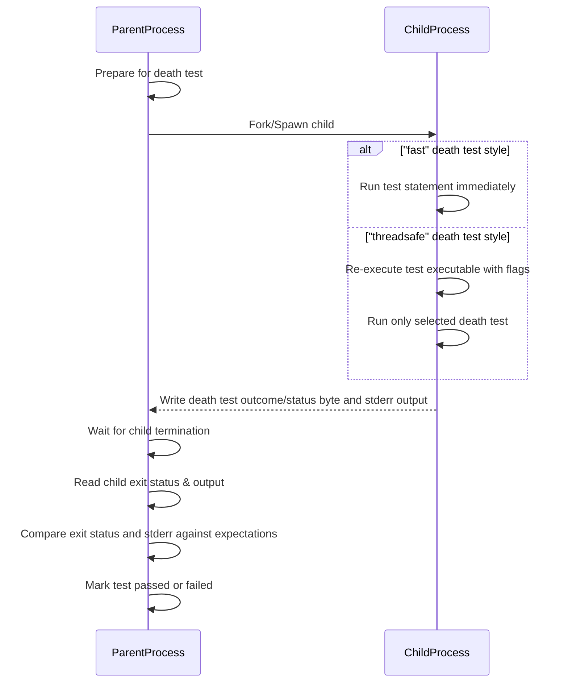

# Death Test API Reference

GoogleTest’s death test facilities empower you to validate how your code handles fatal error conditions and terminates as expected. This page details the macros, underlying mechanisms, configuration flags, and best practices for writing robust death tests. Whether you are verifying assertions, process exits, or signal handling, understanding these constructs will ensure your tests correctly identify violations of critical invariants.

---

## 1. Introduction to Death Tests

Death tests allow you to write tests that ensure your code exits or aborts under specified failure conditions. They are essential for verifying:

- Assertions that enforce system invariants
- Expected program termination behavior (e.g., calls to `_Exit()`, `abort()`, signal-induced termination)
- Correct error messages emitted on failure

These tests are indispensable for validating that your program fails fast and predictably in critical error scenarios, preventing undefined or unsafe states.

### What Death Tests Check

1. **Does the tested code terminate?** The core intent is that the code must cause the process to die.
2. **Is the exit status as expected?** For `ASSERT_EXIT` or `EXPECT_EXIT`, a predicate verifies the exit code or signal.
3. **Is the output on stderr correct?** The error message production matches the user-provided matcher.

Death tests do not consider exceptions as death. Instead, they confirm abnormal termination, not merely exception throwing.

---

## 2. Death Test Macros and Predicates

GoogleTest provides specialized macros to express expectations about your program's death behavior:

| Macro                      | Description                                                     |
|----------------------------|-----------------------------------------------------------------|
| `ASSERT_DEATH(statement, matcher)` | Fails fatally if *statement* does not terminate with a matching error output.                   |
| `EXPECT_DEATH(statement, matcher)` | Non-fatal failure if check fails, allowing subsequent tests to continue.                      |
| `ASSERT_EXIT(statement, predicate, matcher)` | Fatal failure if *statement* doesn't exit with a status satisfying *predicate* and matching *matcher*. |
| `EXPECT_EXIT(statement, predicate, matcher)` | Same as `ASSERT_EXIT` but non-fatal.                              |
| `EXPECT_DEATH_IF_SUPPORTED` / `ASSERT_DEATH_IF_SUPPORTED`| Executes death tests only when platform support exists, otherwise warns without failing. |
| `EXPECT_DEBUG_DEATH` / `ASSERT_DEBUG_DEATH` | Runs death test only in debug builds (`NDEBUG` affects behavior).                            |

### Example Usage

```cpp
// Verify that Foo dies and outputs "error" on stderr.
ASSERT_DEATH(Foo(), "error");

// Verify exit code 0 and output containing "Success".
EXPECT_EXIT(ExitFunction(), testing::ExitedWithCode(0), "Success");

// Custom predicate that checks exit status.
bool KilledBySigKill(int exit_code) {
  return WIFSIGNALED(exit_code) && WTERMSIG(exit_code) == SIGKILL;
}
ASSERT_EXIT(KillProcess(), KilledBySigKill, "Kill signal received");
```

### Matchers in Death Tests

The `matcher` parameter is used to verify the content written to `stderr` by the child process. This can be either:

- A regular expression (string or regex object) — GoogleTest treats bare strings as regex patterns matching `stderr` output.
- A GoogleTest matcher for `const std::string&`, allowing rich matching semantics (such as contains substring, prefix, suffix, etc.).

### Predicates for Exit Status

Predicates are functions or functors taking an `int` exit status and returning `bool`. GoogleTest provides two common predicate classes:

- `ExitedWithCode(exit_code)`: Checks if the process exited normally with a specific exit code.
- `KilledBySignal(signal_number)`: Checks if the process was terminated by a given signal (POSIX only).

---

## 3. Death Test Styles and Configuration

Due to the complexities of safely testing for process death in multi-threaded programs, GoogleTest offers two death test execution styles controllable via the `death_test_style` flag:

| Style       | Behavior                                                                                 | Platforms / Notes                       |
|-------------|------------------------------------------------------------------------------------------|---------------------------------------|
| `threadsafe`| The child process re-executes the test binary with special flags to isolate the death test.| Recommended for most cases; safest style.
| `fast`      | The child process is created by fork/clone and runs the test code immediately after fork.| Faster but unsafe for multi-threaded tests; may hang.|

### Setting the Death Test Style

You can select the desired style programmatically:

```cpp
GTEST_FLAG_SET(death_test_style, "threadsafe");
```

or by passing the command-line flag:

```
--gtest_death_test_style=threadsafe
```

> **Tip:** The default style is `fast`; switching to `threadsafe` can uncover flaky or hanging death tests caused by threads.

### Using `fork()` Instead of `clone()`

On POSIX systems where `clone()` is available (Linux), GoogleTest uses it by default for thread safety. You can force the use of `fork()` via:

```
--gtest_death_test_use_fork=true
```

This may be necessary when running under tools like Valgrind that do not support clone.

### Naming Conventions

We strongly recommend ending test suite names with `DeathTest` when they contain death tests. This ordering ensures these tests run before others to minimize thread-related interference.

---

## 4. How Death Tests Work Under the Hood

GoogleTest runs death tests by spawning a child process that executes the provided statement and terminates with a code and `stderr` output. The parent process oversees the child's termination status and output, verifying expectations.

### Cross-Platform Implementation

- **POSIX platforms (Linux, Mac, QNX):** Uses `fork()`/`clone()` with optional re-execution of the test binary (threadsafe style). Pipes are used for interprocess communication.
- **Windows:** Uses `CreateProcess()` to spawn a child process re-executing the test binary, with event and pipe handles to coordinate.
- **Fuchsia:** Uses native Zircon process spawning with channels and sockets for communication.

### Outcome Handling

The child sends back a status byte indicating death test outcome:

- **DIED:** Process terminated as expected.
- **LIVED:** Process continued without dying.
- **RETURNED:** Test statement returned prematurely (not allowed).
- **THREW:** Exception escaped the death test (failure).
- **INTERNAL_ERROR:** Internal problem in death test execution.

The parent interprets these and compares output with the matcher to finalize test results.

### Safety Checks

GoogleTest issues warnings if death tests run in multi-threaded environments since `fork()` is unsafe with multiple threads. While `threadsafe` style mitigates some risks, it does not completely eliminate them.

---

## 5. Writing Effective Death Tests

### Basic Patterns

- Use `ASSERT_DEATH` or `EXPECT_DEATH` to verify statements expected to abort.
- Use `ASSERT_EXIT` or `EXPECT_EXIT` with predicates to check specific exit codes or termination signals.

Example:

```cpp
TEST(FooDeathTest, CrashesOnInvalidInput) {
  ASSERT_DEATH(Foo(-1), "Invalid input: -1");
}

TEST(FooDeathTest, ExitsZeroOnEmptyInput) {
  EXPECT_EXIT(Foo(0), testing::ExitedWithCode(0), "Processing complete");
}
```

### Testing Multi-line Messages

Your matcher can match multi-line error output as a raw string or a regex.

### Streaming Additional Messages

You can stream explanatory messages to provide additional failure context:

```cpp
ASSERT_DEATH(Foo(-1), "Invalid input") << "Foo failed on negative value";
```

### Avoiding Common Pitfalls

- Do not use assertions within the death test statement that may cause the tested code to exit early (e.g., `return` statements).
- Avoid placing multiple death assertions on the same line (causes compilation errors).
- Side effects inside death test statements are not observable in the parent process.
- When death tests interact with mocks, use `Mock::AllowLeak()` to avoid false positives on mock object leaks.

---

## 6. Debugging and Troubleshooting

### Diagnosing Failures

When death tests fail, GoogleTest provides detailed failure messages describing:

- Whether the process failed to die, exited with an unexpected code, returned illegally, or threw an exception.
- Differences between expected and actual error messages.
- A formatted indented copy of the child process’s `stderr` to distinguish death test messages.

### Handling Multi-threading Warnings

GoogleTest will warn if multiple threads are running when executing a death test due to unsafe forking behavior. Consider:

- Switching to `threadsafe` death test style.
- Refactoring tests to ensure a single-threaded environment for death tests.

### Flags and Environment Variables

Use these to fine-tune behavior:

- `--gtest_death_test_style=[fast|threadsafe]`
- `--gtest_death_test_use_fork=[true|false]`

### Exception Handling

By default, exceptions escaping death test statements cause test failures. GoogleTest catches exceptions internally and provides failure messages including exception details.

---

## 7. Advanced Topics

### EXPECT_DEBUG_DEATH and ASSERT_DEBUG_DEATH

These macros behave like death tests in debug builds, but in release builds execute statements without asserting death. They are useful for code paths that only cause failure in debug mode, e.g., using `LOG(DFATAL)`.

### Multiple Death Tests in One Test Suite

It is recommended to use a separate test suite for death tests (named with suffix `DeathTest`) since order of execution affects thread interactions and test stability.

### Eliminating Side Effects

Avoid side effects in death tests as they occur in a separate process that terminates independently. For example, memory allocation or file I/O in death tests will not propagate effects to the parent.

### Using SCOPED_TRACE for Context

Enhance death test failure diagnostics by using `SCOPED_TRACE` to add contextual messages in nested test calls.

---

## 8. Summary

GoogleTest’s death test API enables reliable assertions about program termination under error conditions by spawning child processes running the test logic. With macros like `ASSERT_DEATH`, `EXPECT_EXIT`, style flags for thread safety, and detailed failure reporting, you gain precise control and observability over process death behaviors critical for robust error handling validation.


---

## References & Related Links

- [Assertions Reference - Death Assertions](https://google.github.io/googletest/reference/assertions.html#death)
- [Advanced GoogleTest Topics - Death Tests](https://google.github.io/googletest/advanced.html#death-tests)
- [GoogleTest Primer](https://google.github.io/googletest/primer.html)
- [Writing Your First Unit Tests](../guides/getting-started/writing-your-first-tests.md)
- [Integrating With Build Systems](../guides/scenarios-and-best-practices/integrating-with-build-systems.md)

<AccordionGroup title="Key Macros and Classes">
<Accordion title="ASSERT_DEATH / EXPECT_DEATH">
Used for asserting that statement causes process termination with matching stderr output and any non-zero exit status.
</Accordion>
<Accordion title="ASSERT_EXIT / EXPECT_EXIT">
More flexible assertions that allow specifying a predicate on the exit status (e.g., exit code or signal).
</Accordion>
<Accordion title="ExitedWithCode / KilledBySignal">
Predicate classes to test exit codes or termination signals on POSIX systems.
</Accordion>
</AccordionGroup>

<Tip>
Always run death tests in a controlled environment and ensure test suites containing death tests have names ending with "DeathTest" to avoid interference with other tests.
</Tip>

<Warning>
Avoid multiple death assertions on the same line to prevent compile errors.
</Warning>

<Note>
Side effects inside `EXPECT_DEATH` or `ASSERT_DEATH` statements only affect the child process and are not visible in the parent test process.
</Note>

---

### Diagrams: Death Test Execution Flow



