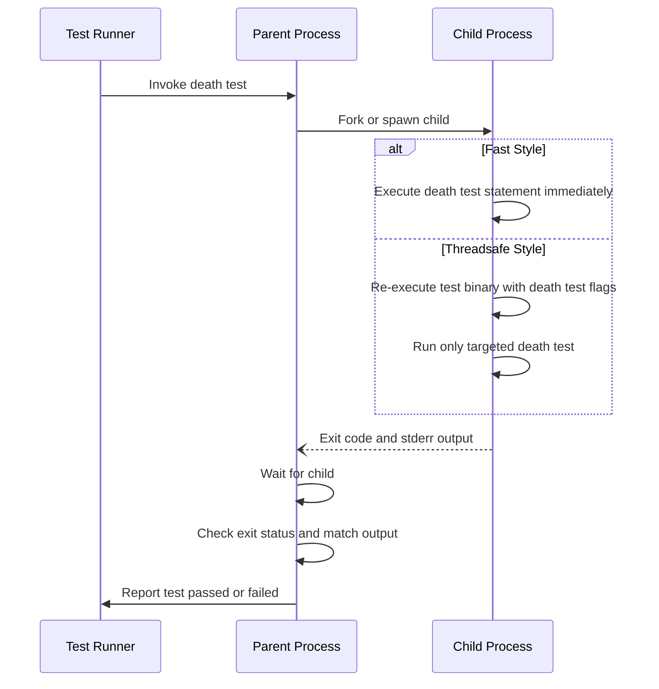

# Death Tests API

GoogleTest provides a robust API surface for writing and controlling *death tests*—tests designed to verify that code terminates or fails in specific, expected ways. This documentation guides you through writing death tests using GoogleTest macros, understanding execution styles, crafting expected output matchers, and navigating platform-specific considerations. You'll find patterns to assert process exits, verify matching output, and handle subtle platform interactions with process termination.

---

## Overview of Death Tests

Death tests ensure that a piece of code *dies*—terminates its process—under expected failure conditions, such as assertion failures or fatal errors. They are essential for validating precondition checks and error handling paths that cause abnormal program termination.

Death tests are executed by spawning a child process to isolate the tested statement, avoiding termination of the test runner process itself.

### What Death Tests Validate

1. The `statement` causes the process to terminate.
2. The exit status either:
   - Is non-zero for `ASSERT_DEATH` and `EXPECT_DEATH` macros, or
   - Matches a user-specified predicate for `ASSERT_EXIT` and `EXPECT_EXIT` macros.
3. The `stderr` output matches a expected pattern or matcher.


## Death Test Macros

GoogleTest exposes a set of macros for convenient death-test writing. They support streaming custom failure messages like other assertions.

### Basic Death Assertions

These assert that a statement causes abnormal termination with a matching error message on `stderr`:

- `ASSERT_DEATH(statement, matcher)`
- `EXPECT_DEATH(statement, matcher)`

Example:
```cpp
ASSERT_DEATH({ int n = 5; Foo(&n); }, "Error on line .* of Foo()");
EXPECT_DEATH(DoSomething(42), "My error");
```

### Debug Death Assertions

`ASSERT_DEBUG_DEATH` and `EXPECT_DEBUG_DEATH` behave like `ASSERT_DEATH` and `EXPECT_DEATH` in debug builds (`NDEBUG` not defined). In release builds, they execute the statement without checking for death.

Example:
```cpp
EXPECT_DEBUG_DEATH(SomeFunctionThatOnlyDiesInDebug(), "death");
```

### Exit Assertions

For more control over exit status, use the *exit* variants which accept a predicate over the exit status:

- `ASSERT_EXIT(statement, predicate, matcher)`
- `EXPECT_EXIT(statement, predicate, matcher)`

Where `predicate` is a callable accepting an integer exit status and returning `bool`. GoogleTest provides two handy predicates:

- `::testing::ExitedWithCode(expected_exit_code)`
- `::testing::KilledBySignal(signal_number)` (POSIX only)

Example:
```cpp
EXPECT_EXIT(NormalExit(), testing::ExitedWithCode(0), "Success");
EXPECT_EXIT(KillProcess(), testing::KilledBySignal(SIGKILL), "Unlockable");
```

### Conditional Compilation Macros

- `EXPECT_DEATH_IF_SUPPORTED` and `ASSERT_DEATH_IF_SUPPORTED` compile and run death tests where supported, otherwise generate warnings and do not enforce death.


## Matcher and Output Expectations

The `matcher` argument can be either:

- A regex pattern string (interpreted using simple syntax compatible with the platform), or
- A [gMock matcher](../gmock/matchers-reference.md) for `const std::string&`, such as `ContainsRegex`.

Bare strings are treated as regexes matching `stderr` output. Use matchers to check for rich conditions.

#### Examples

```cpp
EXPECT_DEATH(DoSomething(), "My error message");
EXPECT_DEATH(DoSomething(), ContainsRegex("Err(or|or code) \\d+"));
ASSERT_DEATH(DoSomething(), MatchesRegex("Fatal failure"));
```


## Death Test Execution Styles

GoogleTest supports two principal styles of death tests, controlled by the flag `--gtest_death_test_style` (default: "fast"):

| Style        | Description                                        | Platform Notes                   |
|--------------|----------------------------------------------------|--------------------------------|
| **"fast"**   | Immediately executes the death test statement in a child process after fork. | Default on POSIX. Windows treats as "threadsafe" internally. |
| **"threadsafe"** | Forks a child which re-executes the test binary with flags to run only that death test. Guarantees thread safety but slower. | The recommended style for multithreaded environments. |


### Choosing a Style

While "fast" offers speed, it is unsafe when multiple threads are running.
"threadsafe" style ensures correct behavior by re-executing the test binary.

Set the style using:

```cpp
GTEST_FLAG_SET(death_test_style, "threadsafe");
```

in `main()` or per-test.


## Writing Death Tests Step-by-Step

Follow this pattern for constructing reliable death tests:

<Steps>
<Step title="Write the test statement">
Encapsulate the code expected to die in a statement or compound statement (braced block). For example:

```cpp
int n = 5;
ASSERT_DEATH({ Foo(&n); }, "Expected error message");
```
</Step>
<Step title="Choose the appropriate macro">
Use `ASSERT_DEATH` or `EXPECT_DEATH` if you expect any kind of death with a non-zero exit code.

Use `ASSERT_EXIT` or `EXPECT_EXIT` with predicate functions to verify specific exit codes or signals.
</Step>
<Step title="Define the error matcher">
Use either a regex string or a matcher to check the expected error message printed to `stderr`.

A bare string is treated as a regex matching *any* `stderr` that contains it.
</Step>
<Step title="Put death tests in test suites named *DeathTest">
Name test suites containing death tests with the suffix `DeathTest` to ensure proper ordering and warnings regarding threading issues.
</Step>
</Steps>

## Platform Caveats and Considerations

- **Fork and multithreading:** Forking in the presence of multiple threads is unsafe and can cause hangs. Use the "threadsafe" style or make sure death tests execute in single-threaded contexts.
- **Windows behavior:** Windows always runs death tests in "threadsafe" mode internally due to process spawning differences.
- **Directory changes:** Changing current working directory before a death test is supported.
- **Mocks and leaks:** If mocking frameworks are used with death tests that check specific exit codes, allow mocks to be leaked to avoid false positives on leaks.


## Core Internal Components (Advanced)

Though generally internal, these components provide flexibility for advanced users:

- **`DeathTest` Class:** Abstract base for death tests managing execution and checking exit status and output.
- **`DeathTestFactory`:** Factory interface for creating death test instances based on current style.
- **Platform-specific subclasses:** Implement child process spawning and result collection (`WindowsDeathTest`, `FuchsiaDeathTest`, `ExecDeathTest`, `NoExecDeathTest`).


## Common Pitfalls and Troubleshooting

- Avoid multiple macros on the same line; the macros cannot handle multiple expansion on one line.
- Using `return` or throwing exceptions inside the death test body results in test failures.
- Remember that side effects in death test child processes are not seen by the parent.
- Matchers must correctly correspond to the expected `stderr` output; otherwise, the death test fails.


## Example Death Tests

```cpp
// Verify that a function crashes with a message containing "error code"
ASSERT_DEATH(CallFunction(), "error code");

// Verify that a specific exit code is returned along with "Success" output
EXPECT_EXIT(NormalExit(), testing::ExitedWithCode(0), "Success");

// Example with signal-based exit on POSIX
bool IsKilledBySIGABRT(int status) {
  return testing::KilledBySignal(SIGABRT)(status);
}

ASSERT_EXIT(AbortProgram(), IsKilledBySIGABRT, "Aborted");
```


## Related Assertions

See [Assertions Reference](reference/assertions.md#death) for detailed coverage of death assertions and their usage.


## Advanced Topics and Further Reading

- [Death Tests and Threads](../advanced.md#death-tests-and-threads) explains threading caveats and best practices.
- [Regular Expression Syntax](../advanced.md#regular-expression-syntax) describes regex dialects in GoogleTest death tests.
- [Assertion Macros in Depth](reference/assertions.md) provide insight about macros like `EXPECT_DEATH`, `ASSERT_DEATH`, and related predicates.
- Platform-specific details and advanced handling are covered in the internal header `<gtest/internal/gtest-death-test-internal.h>`.


## Diagram: Death Test Execution Flow




---

For more complete examples, user guides, and details, refer to the [Assertions Reference](reference/assertions.md#death), [Advanced Topics - Death Tests](../advanced.md#death-tests), and the full source code headers in `gtest-death-test.h` and `gtest-death-test-internal.h`.


---

**Remember:** Death tests are a powerful tool to verify that your code fails safely and predictably. Use them to safeguard critical failure points and improve code robustness.
