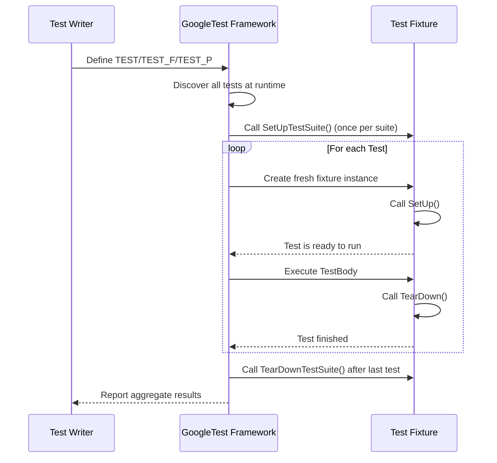

# Test Discovery & Definition

This section details the fundamental macros and classes provided by GoogleTest for defining test suites, test fixtures, and test cases. It explains how tests are automatically discovered and structured by the framework, describes the lifecycle of tests, and includes practical examples that guide how to write both standard and advanced test cases.

---

## 1. Overview of Test Definitions

GoogleTest uses a set of macros and C++ classes that enable you to write tests clearly and efficiently. The framework automatically discovers these definitions at runtime, setting up your test suites and cases according to a standardized naming and structuring convention.

### Key Concepts

- **Test Suite**: A collection of related tests, typically grouped by their subject or test fixture.
- **Test Fixture**: A class that defines the common setup and teardown steps shared among tests.
- **Test Case**: An individual test, expressed as a function or method that contains assertions verifying specific behavior.

### Test Macros

| Macro                  | Description                                             |
|------------------------|---------------------------------------------------------|
| `TEST`                 | Defines a basic standalone test.                        |
| `TEST_F`               | Defines a test within a test fixture (`TestFixture`).  |
| `TEST_P`               | Defines a value-parameterized test using a test fixture. |
| `INSTANTIATE_TEST_SUITE_P` | Instantiates a set of parameters for a parameterized test suite. |
| `TYPED_TEST_SUITE`      | Defines a typed test suite, applying a template type list. |
| `TYPED_TEST`            | Defines tests for the typed test suite.                |
| `TYPED_TEST_SUITE_P`    | Defines a type-parameterized test suite (uninstantiated). |
| `TYPED_TEST_P`          | Defines typed tests for a parameterized test suite.    |
| `REGISTER_TYPED_TEST_SUITE_P` | Registers tests for a type-parameterized test suite.   |
| `INSTANTIATE_TYPED_TEST_SUITE_P` | Instantiates a typed test suite with specific types.     |

---

## 2. Writing Basic Tests with `TEST` and `TEST_F`

### Using `TEST`

The `TEST` macro creates a simple test without shared fixture setup:

```cpp
TEST(MathTest, Addition) {
  EXPECT_EQ(2 + 2, 4);
}
```

- `MathTest` is the test suite name.
- `Addition` is the individual test case.

### Using `TEST_F`

For tests sharing setup or state, define a fixture class inheriting from `testing::Test`:

```cpp
class MyFixture : public testing::Test {
 protected:
  void SetUp() override {
    // runs before each test
  }
  void TearDown() override {
    // runs after each test
  }
  // shared resources or helpers
};

TEST_F(MyFixture, TestOne) {
  // Access shared resources here
  EXPECT_TRUE(true);
}
```

- Each test in the fixture gets a fresh instance.

---

## 3. Parameterized Tests: `TEST_P` and `INSTANTIATE_TEST_SUITE_P`

Parameterized tests allow you to run the same logic across multiple input values.

### Define a Parameterized Test Fixture

Derive from `testing::TestWithParam<T>`, where `T` is the parameter type:

```cpp
class MyParamTest : public testing::TestWithParam<int> {};
```

### Write Parameterized Test Cases

Use the `TEST_P` macro:

```cpp
TEST_P(MyParamTest, IsEven) {
  int param = GetParam();
  EXPECT_EQ(param % 2, 0);
}
```

### Instantiate the Parameterized Tests

Use `INSTANTIATE_TEST_SUITE_P` to bind values:

```cpp
INSTANTIATE_TEST_SUITE_P(
    EvenNumbers, MyParamTest,
    testing::Values(2, 4, 6, 8));
```

This will run `IsEven` with parameters 2, 4, 6, and 8.

### Parameter Generators

GoogleTest provides generators such as:
- `Range(begin, end, step=1)`
- `Values(v1, v2, ..., vN)`
- `ValuesIn(container)`
- `Bool()`
- `Combine(g1, g2, ..., gN)` (Cartesian product)

---

## 4. Typed Tests and Type-Parameterized Tests

These are useful for running the same tests across multiple types.

### Typed Tests

1. Define a templated test fixture:

```cpp
template <typename T>
class MyTypedTest : public testing::Test {
 public:
  T value_;
};
```

2. Define the types to test:

```cpp
using MyTypes = testing::Types<int, double, std::string>;
TYPED_TEST_SUITE(MyTypedTest, MyTypes);
```

3. Write tests using `TYPED_TEST`:

```cpp
TYPED_TEST(MyTypedTest, IsDefaultConstructible) {
  TypeParam default_value = this->value_;
  EXPECT_TRUE(true);
}
```

### Type-Parameterized Tests (Uninstantiated)

Similar to typed tests but allow users to instantiate them later using:

- `TYPED_TEST_SUITE_P`
- `TYPED_TEST_P`
- `REGISTER_TYPED_TEST_SUITE_P`
- `INSTANTIATE_TYPED_TEST_SUITE_P`

---

## 5. Test Lifecycle and Execution

GoogleTest handles the lifecycle of tests automatically:

1. The framework discovers all tests defined with the macros.
2. Before each test:
   - Fixture's `SetUpTestSuite()` runs once for the suite.
   - Fixture's `SetUp()` runs for each test instance.
3. The test body executes.
4. After each test:
   - Fixture's `TearDown()` runs.
   - Fixture's `TearDownTestSuite()` runs once after all tests.

Skips and failures during setup or test execution influence whether tests continue or report results.

---

## 6. Best Practices and Common Pitfalls

- **Avoid underscores (`_`) in test suite or test names** to prevent name clashes and reserved keyword conflicts.

- **Always instantiate your parameterized tests** with `INSTANTIATE_TEST_SUITE_P` or explicitly allow uninstantiated tests with `GTEST_ALLOW_UNINSTANTIATED_PARAMETERIZED_TEST`.

- **Fixture class must have a default constructor** for `TEST_F` to work.

- **Use `SetUp()` and `TearDown()` for setup and cleanup**, not constructors or destructors, especially if you need to use assertions.

- When mixing `TEST` and `TEST_F` macros, ensure they belong to different test suites to avoid errors.

- For typed tests, ensure your types meet all requirements, and properly define type lists.

- Use descriptive and valid test names to improve readability and maintainability.

---

## 7. Common Usage Examples

### Simple Test

```cpp
TEST(FooTest, BasicAssertions) {
  EXPECT_STRNE("Hello", "World");
  EXPECT_EQ(7 * 6, 42);
}
```

### Using a Test Fixture

```cpp
class MathTest : public testing::Test {
 protected:
  int value_;
  void SetUp() override { value_ = 10; }
};

TEST_F(MathTest, Add) {
  EXPECT_EQ(value_ + 5, 15);
}
```

### Value-Parameterized Test

```cpp
class DivTest : public testing::TestWithParam<std::tuple<int, int, int>> {};

TEST_P(DivTest, Division) {
  int a = std::get<0>(GetParam());
  int b = std::get<1>(GetParam());
  int expected = std::get<2>(GetParam());
  EXPECT_EQ(a / b, expected);
}

INSTANTIATE_TEST_SUITE_P(
    SimpleCases, DivTest, testing::Values(
        std::make_tuple(10, 2, 5),
        std::make_tuple(20, 4, 5),
        std::make_tuple(30, 5, 6)));
```

### Typed Test

```cpp
template <typename T>
class NumericTest : public testing::Test {
 public:
  T val = T();
};

using MyTypes = testing::Types<int, double>;
TYPED_TEST_SUITE(NumericTest, MyTypes);

TYPED_TEST(NumericTest, ZeroInitializes) {
  EXPECT_EQ(this->val, TypeParam());
}
```

---

## 8. Additional Resources

- [Testing Reference](https://github.com/google/googletest/blob/main/docs/reference/testing.md) — Detailed API for GoogleTest classes and macros.
- [Advanced GoogleTest Topics](https://github.com/google/googletest/blob/main/docs/advanced.md) — Further insights into fixtures, assertions, and complex test setups.
- [GoogleTest FAQ](https://github.com/google/googletest/blob/main/docs/faq.md) — Answers to common questions around test naming, failures, and platform support.
- [Sample Tests](https://github.com/google/googletest/blob/main/docs/samples.md) — Practical examples showcasing various GoogleTest usages.

---

## 9. Troubleshooting Tips

- **Tests not discovered?** Ensure your tests are linked into the executable and defined with proper macros.
- **Errors mixing `TEST` and `TEST_F`?** All tests in the same suite must use the same fixture class.
- **Parameterized tests appear not to run?** Confirm that the instantiation macro `INSTANTIATE_TEST_SUITE_P` is used.
- **Skips or fails on setup?** Confirm `SetUpTestSuite` and `TearDownTestSuite` are public and correctly implemented.
- **Naming issues with underscores causing errors?** Avoid underscores in test suite or case names per GoogleTest naming conventions.

---

## 10. Diagram: Test Lifecycle



---