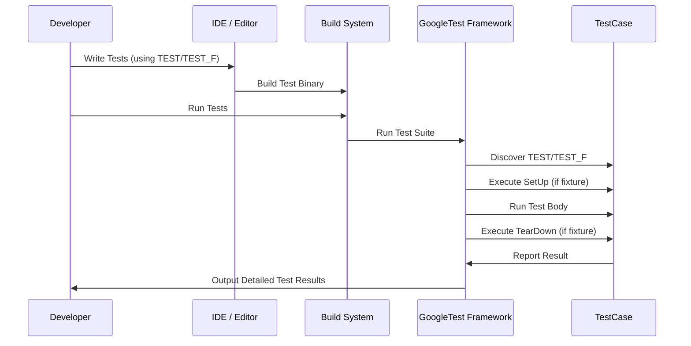

# Test Case Construction

GoogleTest's test case construction APIs and macros empower you to define, organize, and structure your tests for clarity, maintainability, and comprehensive coverage. This documentation focuses on how to create and name tests, group them logically, and manage their execution flow using fixtures and suites. By mastering these APIs, you’ll be able to write robust, scalable tests that effectively validate your code.

---

## 1. Defining Tests: The Basic Building Blocks

GoogleTest provides simple yet powerful macros to define individual tests and group related ones into suites.

### TEST Macro

Use `TEST(TestSuiteName, TestName)` to define an independent test:

```cpp
TEST(MathTest, AdditionWorks) {
  EXPECT_EQ(2 + 2, 4);
}
```

- **TestSuiteName** groups logically related tests together.
- **TestName** identifies this particular test case.

*Tip:* Choose descriptive, meaningful names reflecting what the test verifies.

### Naming Rules

- Test suite and test names must be valid C++ identifiers.
- They should be unique within a file.
- Avoid overly generic names to ease navigation and debugging.

### WHAT Happens Behind the Scenes

GoogleTest registers the test automatically in its internal registry, enabling automatic discovery and execution.

---

## 2. Using Test Fixtures: Sharing Common Setup and Teardown

When multiple tests require shared environment, use test fixtures.

### TEST_F Macro

```cpp
class MyTestFixture : public ::testing::Test {
protected:
  void SetUp() override {
    // Code here runs before each test
  }

  void TearDown() override {
    // Code here runs after each test
  }

  // Shared objects or state
  int shared_value;
};

TEST_F(MyTestFixture, HandlesPositiveInput) {
  shared_value = 42;
  EXPECT_GT(shared_value, 0);
}

TEST_F(MyTestFixture, HandlesNegativeInput) {
  shared_value = -1;
  EXPECT_LT(shared_value, 0);
}
```

- **SetUp()** and **TearDown()** manage per-test initialization and cleanup.
- Shared objects and members live inside the fixture.

*Benefit:* Avoids duplication, keeps tests clean and focused.

---

## 3. Test Suites: Organizing Tests Intuitively

A test suite is a collection of related tests grouped under a common name (via `TEST` or `TEST_F`). Suites help structure your tests logically.

**Best Practices:**

- Group tests by functionality, module, or feature.
- Keep suites focused to maintain readability.
- Use descriptive suite names matching the feature under test.

---

## 4. Typed and Parameterized Tests (Advanced)

GoogleTest lets you write tests that run over multiple types or input parameters, boosting coverage with minimal code duplication.

For details, see the separate guide: [Parameterized and Typed Tests](/api-reference/gtest-core-apis/parameterized-tests).

---

## 5. Writing Clear and Maintainable Test Logic

Effective test case construction isn’t just about macros, it's also about how you write your test code.

### Tips

- **Name tests after expected behavior**, not implementation details.
- **One logical assertion per test** increases pinpoint accuracy when tests fail.
- Use fixtures to **remove boilerplate** without obscuring test intent.
- Keep test code **small and focused**.
- Leverage **helper functions** within fixtures to clarify repetitive tasks.

---

## 6. Typical User Workflows

### Writing a Basic Test

1. Decide the module or feature to test.
2. Define a test suite with the `TEST` macro.
3. Write one or more test cases targeting different scenarios.
4. Build and run your tests; fix any failures.

### Sharing Setup via Fixtures

1. Define a fixture class inheriting from `::testing::Test`.
2. Implement `SetUp()` and `TearDown()` as needed.
3. Use the `TEST_F` macro to define tests sharing the fixture.
4. Access fixture members within tests.

---

## 7. Common Pitfalls and Troubleshooting

- **Tests not discovered or run:** Ensure your test binary links against GoogleTest and that tests use `TEST` or `TEST_F` macros properly.

- **Name collisions:** Avoid reusing test suite or test names across files.

- **Slow or bloated tests:** Refactor large suites into focused ones; share setup with fixtures.

- **State leakage between tests:** Always clean up shared state during teardown.

- **Unclear failure messages:** Name tests descriptively, and assert only one behavior per test.

If you face issues or want deeper insights into test execution and management, refer to the [Test Structure and Discovery](/guides/getting-started/test-structure-and-discovery) guide.

---

## 8. Full Example: Using TEST and TEST_F

```cpp
#include <gtest/gtest.h>

// Simple test without fixture
TEST(MathTest, Addition) {
  EXPECT_EQ(1 + 1, 2);
}

// Fixture class
class StringTest : public ::testing::Test {
 protected:
  void SetUp() override {
    text = "hello";
  }

  void TearDown() override {
    // cleanup if necessary
  }

  std::string text;
};

// Using fixture
TEST_F(StringTest, LengthIsFive) {
  EXPECT_EQ(text.length(), 5);
}

TEST_F(StringTest, ContainsH) {
  EXPECT_NE(text.find('h'), std::string::npos);
}
```

This example shows both styles of test definitions and sharing common setup.

---

## 9. Summary of Test Case APIs

| Macro    | Usage                              | Purpose                               |
| -------- | --------------------------------- | ----------------------------------- |
| `TEST`   | `TEST(SuiteName, TestName)`       | Define a simple test case            |
| `TEST_F` | `TEST_F(FixtureClass, TestName)`  | Test using shared fixture setup     |
| `SetUp`  | Fixture method                    | Prepare environment before each test |
| `TearDown`| Fixture method                   | Cleanup environment after each test  |

---

## 10. Related Documentation

For a broader perspective on test construction and execution:

- [Assertions](/api-reference/gtest-core-apis/assertions) — Verify expected behavior
- [Parameterized and Typed Tests](/api-reference/gtest-core-apis/parameterized-tests) — Writing tests that run over multiple inputs or types
- [Test Structure and Discovery](/guides/getting-started/test-structure-and-discovery) — Organization and automatic test finding
- [GoogleTest Primer](/guides/getting-started/primer) — Getting started quickly with example tests

Explore these to deepen your testing framework mastery and write better tests.

---

## 11. Practical Advice

- Always name test suites and cases clearly.
- Use fixtures where setup is shared.
- Keep tests small and independent.
- Rely on GoogleTest's automatic test discovery.
- Verify that tests clean up properly to avoid false positives in later runs.

<Check>
Arrange your tests thoughtfully. Start small, then organize with fixtures and suites for larger projects.
</Check>

---

## 12. Visual Flow: Writing and Running a Test



This flow shows the journey from writing your test to receiving detailed feedback.

---