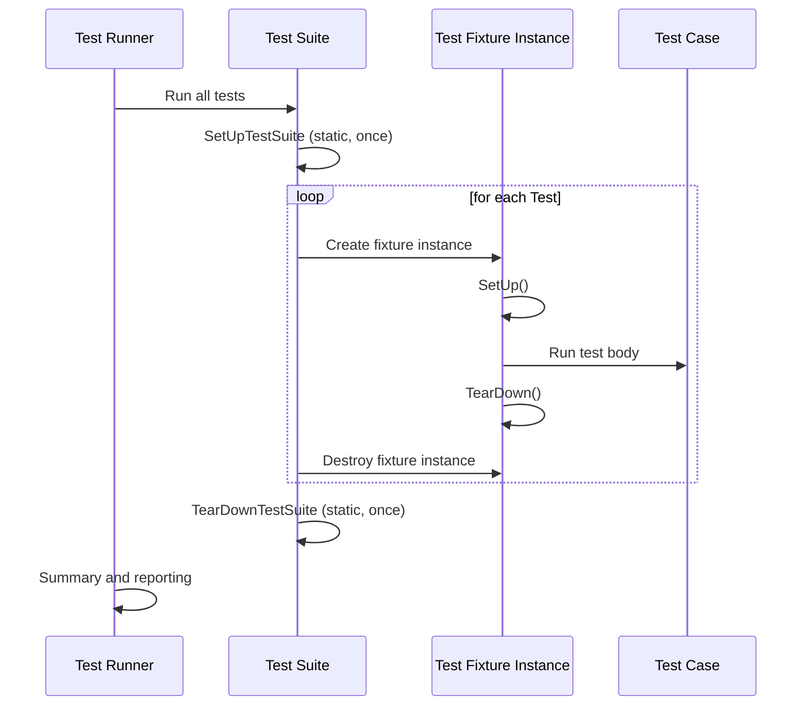

# Test Case Structure & Lifecycle

This page details how to effectively declare and organize tests in GoogleTest, how to leverage test fixtures for shared setup, and how to manage test execution flow using lifecycle hooks. You'll learn how to structure tests, create reusable fixtures, and implement setup/teardown routines at both the test-case and individual test levels. Code samples accompany the explanations to demonstrate common patterns and best practices.

---

## Overview of Test Case Structure

In GoogleTest, a **test case** (also known as a *test suite*) groups together a set of related test functions. Tests within a test case share a common name prefix and can benefit from shared setup and teardown logic.

### Defining Tests

- Use the `TEST()` macro for simple tests that do not require shared data or setup.
- Use the `TEST_F()` macro when you want to reuse common setup via *test fixtures*.

Each test is an independent function containing assertions that verify the behavior of the code under test. GoogleTest runs tests individually in an isolated manner to ensure no interdependencies.

### Organizational Benefits

Using test cases to group tests provides:

- **Logical grouping:** Reflects the structure of the code under test.
- **Maintainability:** Related tests reside in one location.
- **Shared resources:** Via test fixtures, multiple tests can share expensive-to-create resources.

## Leveraging Test Fixtures for Shared Setup and Teardown

Test fixtures allow you to define common objects and environment setup that multiple tests can use. A test fixture is a class derived from `testing::Test` that provides setup/teardown methods and member variables accessible to its tests.

### How to Define a Test Fixture

1. Declare a class that inherits from `testing::Test`.
2. Optionally override `SetUp()` to perform per-test initialization.
3. Optionally override `TearDown()` to perform per-test cleanup.
4. Use member variables to store shared state.

```cpp
class MyFixture : public testing::Test {
 protected:
  void SetUp() override {
    // Code here runs before each test
  }

  void TearDown() override {
    // Code here runs after each test
  }

  // Shared resources for tests
  Resource r_;
};

// Tests using the fixture
TEST_F(MyFixture, TestOne) {
  // Access resource
  ASSERT_TRUE(r_.IsValid());
}

TEST_F(MyFixture, TestTwo) {
  // Another test with the same setup
}
```

### Key Details

- Each test has a fresh instance of the fixture class.
- GoogleTest calls `SetUp()` and `TearDown()` for each test execution.
- Changes made to the fixture in one test do not affect others.

<Tip>
Always use `TEST_F()` when you need access to fixture members. Using `TEST()` won't compile as it lacks fixture context.
</Tip>

## Test Suite Level Setup and Tear Down

Sometimes shared setup or cleanup is expensive and should be done once per *test suite* rather than per test.

GoogleTest supports *test suite lifecycle hooks*:

- `static void SetUpTestSuite()`
- `static void TearDownTestSuite()`

Implement these as `public static` methods in your fixture class. GoogleTest calls `SetUpTestSuite()` once before the first test and `TearDownTestSuite()` after the last test.

```cpp
class MyFixture : public testing::Test {
 public:
  static void SetUpTestSuite() {
    // Run once before this test suite
    shared_resource_ = new Resource();
  }

  static void TearDownTestSuite() {
    // Run once after this test suite
    delete shared_resource_;
    shared_resource_ = nullptr;
  }

  void SetUp() override {
    // Run before each test
  }

  void TearDown() override {
    // Run after each test
  }

  static Resource* shared_resource_;
};

Resource* MyFixture::shared_resource_ = nullptr;
```

<Tip>
Because test order is not guaranteed, tests must not depend on the order they are run in or on side effects from other tests.
</Tip>

## Test Lifecycle Flow

When running tests within a test case that uses fixtures, GoogleTest follows this flow:

<Steps>
<Step title="Test Suite Initialization">
Before any tests are run:
- Call static `SetUpTestSuite()` once.
</Step>
<Step title="Test Execution Loop">
For each test:
- Create an instance of the test fixture.
- Call the fixture's instance `SetUp()`.
- Run the test body.
- Call `TearDown()`.
- Destroy the fixture instance.
</Step>
<Step title="Test Suite Teardown">
After all tests are complete:
- Call static `TearDownTestSuite()` once.
</Step>
</Steps>

This lifecycle ensures each test runs in isolation but can share expensive setup across tests.

## Controlling Test Execution Flow

GoogleTest offers several controls to influence test execution:

- **Skipping Tests**: Use `GTEST_SKIP()` inside a test or in `SetUp()` to skip tests dynamically.

- **Checking for Failures**: Use `Test::HasFatalFailure()`, `HasNonfatalFailure()`, and `HasFailure()` to detect failures during tests and conditionally control further actions.

- **Property Recording**: Use `RecordProperty()` to attach key-value metadata to tests or fixtures that will be included in XML/JSON test reports.

Example:
```cpp
TEST_F(MyFixture, Example) {
  if (::testing::Test::HasFatalFailure()) {
    GTEST_SKIP() << "Skipping due to previous fatal failure.";
  }
  // Test body
  RecordProperty("Priority", "High");
}
```

## Troubleshooting Common Pitfalls

- **Misspelled Setup/TearDown:** Always override `SetUp()` and `TearDown()` exactly (capital U). Misspelling (e.g., `Setup()`) will silently cause them not to be called.

- **Shared Resource Lifetimes:** When using static shared resources in `SetUpTestSuite()`, ensure proper initialization and destruction to avoid leaks, especially in inheritance hierarchies.

- **Test Order Dependencies:** Avoid writing tests that depend on ordering or side effects from others as GoogleTest runs tests in undefined order.

- **Thread Safety:** Setup and teardown code should be thread-safe if you use parallel test execution features.

<Warning>
Using fatal assertions (`ASSERT_*`) inside constructors or destructors is not supported and will cause compile errors; use `SetUp()`/`TearDown()` instead.
</Warning>

## Example Combined Flow

```cpp
class WidgetTest : public ::testing::Test {
 public:
  static void SetUpTestSuite() {
    shared_db_ = new DatabaseConnection();
  }

  static void TearDownTestSuite() {
    delete shared_db_;
    shared_db_ = nullptr;
  }

  void SetUp() override {
    widget_ = new Widget(shared_db_);
  }

  void TearDown() override {
    delete widget_;
  }

  static DatabaseConnection* shared_db_;
  Widget* widget_;
};

DatabaseConnection* WidgetTest::shared_db_ = nullptr;

TEST_F(WidgetTest, Initialization) {
  ASSERT_TRUE(widget_->IsInitialized());
}

TEST_F(WidgetTest, DoWork) {
  widget_->DoWork();
  EXPECT_TRUE(widget_->WorkDone());
}
```

## Summary

This page guides you through effectively structuring test cases and managing the lifecycle of tests using fixtures and lifecycle hooks. Proper use of test fixtures, setup and teardown functions, and execution flow controls leads to maintainable, reliable test suites.

---

## See Also

- [GoogleTest Primer](../overview/product-introduction-core-concepts/what-is-googletest)
- [Assertions and Expectations](./assertions-and-expectations)
- [Test Lifecycle & Execution Model](../../concepts/core-architecture/test-lifecycle-model)
- [Writing Your First Test](../../getting-started/first-test-validation/writing-your-first-test)
- [Advanced Mocking Patterns](../../guides/advanced-and-best-practices/advanced-mocking-patterns)

---

For examples and additional details, see the GoogleTest sample tests directory: [googletest/samples](https://github.com/google/googletest/blob/main/googletest/samples)


### Diagram: Test Execution Lifecycle


