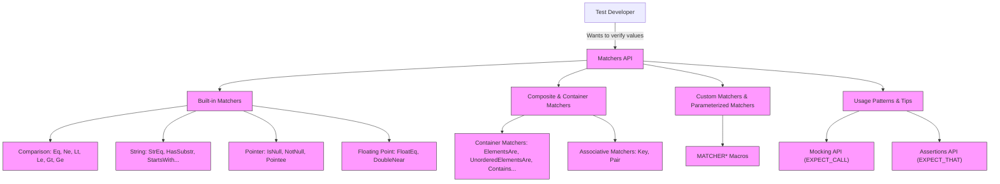

# Matchers API Reference

This reference details the core matcher constructs, syntax, and combinators provided by GoogleTest to enable expressive and flexible value verification in your tests. It covers both built-in and extensible matchers, including how to write matchers directly, combine existing ones, and apply them to various types of data including containers, pointers, and user-defined classes.

---

## 1. Introduction to Matchers

Matchers are powerful predicates that describe the expected properties of values or function arguments. When used in assertions like `EXPECT_THAT(value, matcher)`, they enable clear and maintainable tests with informative failure messages.

### What Matchers Do

- Verify that a value meets certain criteria (e.g., equality, range, pattern).
- Provide descriptive messages on failure, explaining what was expected and what was found.
- Can be composed or combined to build complex matching conditions.

### Using Matchers

Matchers are used primarily in:

- Mocking calls: specifying argument expectations  (`EXPECT_CALL(mock, Method(matcher))`).
- Assertions: verifying values  (`EXPECT_THAT(value, matcher)`).

### Example

```cpp
using ::testing::StartsWith;
EXPECT_THAT(name, StartsWith("John"));
```

This check verifies that the string `name` starts with 'John'.

---

## 2. Built-in Matchers

### Universal Matchers

- **`_` (Anything matcher)**: Matches any value of any type.

- **`A<T>()` / `An<T>()`**: Matches any value of type `T`.

### Comparison Matchers

- `Eq(value)` / implicit value match: Matches values equal to `value`.
- `Ne(value)`: Not equal to `value`.
- `Lt(value)`: Less than `value`.
- `Le(value)`: Less than or equal to `value`.
- `Gt(value)`: Greater than `value`.
- `Ge(value)`: Greater than or equal to `value`.

```cpp
EXPECT_CALL(mock, Foo(Eq(42)));
EXPECT_THAT(x, Ge(0));
```

### String Matchers

- `StrEq(s)`: String equal to `s`.
- `StrNe(s)`: Not equal to `s`.
- `StrCaseEq(s)`: Case-insensitive equality.
- `StrCaseNe(s)`: Case-insensitive inequality.
- `HasSubstr(substring)`: Contains substring.
- `StartsWith(prefix)`: Starts with prefix.
- `EndsWith(suffix)`: Ends with suffix.

All work with `std::string` and C-strings (including wide strings).

### Floating-Point Matchers

Approximately equal matches, honoring precision issues:

- `FloatEq(value)`, `NanSensitiveFloatEq(value)`, `FloatNear(value, epsilon)`
- `DoubleEq(value)`, `NanSensitiveDoubleEq(value)`, `DoubleNear(value, epsilon)`

### Pointer Matchers

- `IsNull()`: Matches null pointers (raw or smart).
- `NotNull()`: Matches non-null pointers.
- `Pointee(matcher)`: Matches pointer to a value matching `matcher`.
- `Pointer(matcher)`: Matches pointer itself against `matcher`.

---

## 3. Composite and Container Matchers

### Combining Matchers

- `AllOf(m1, m2, ...)`: Matches if all `m_i` match.
- `AnyOf(m1, m2, ...)`: Matches if any `m_i` matches.
- `Not(m)`: Matches if `m` does not match.

```cpp
EXPECT_THAT(num, AllOf(Ge(0), Le(10), Ne(5)));
```

### Container Matchers

Matchers to verify containers’ contents with various conditions:

- `ElementsAre(e1, e2, ...)`: Matches a container with elements matching in order.
- `ElementsAreArray(container_or_array)`: Matches using an external sequence.
- `UnorderedElementsAre(e1, e2, ...)`: Matches if container has these elements in any order.
- `UnorderedElementsAreArray(container_or_array)`: Like above, on a range.
- `Contains(element_matcher)`: Matches if at least one element matches.
- `Each(matcher)`: Matches if every element matches.
- `SizeIs(matcher)`: Matches if container size matches `matcher`.

Example:

```cpp
EXPECT_THAT(vec, ElementsAre(1, Gt(0), _, 4));
EXPECT_THAT(set, Contains(Ge(10)));
```

### Associative Containers

- `Key(m)`: Matches `std::pair` or equivalent where the key matches `m`.
- `Pair(m1, m2)`: Matches pair whose first and second fields match respectively.

Example:

```cpp
EXPECT_THAT(map, Contains(Pair(5, "foo")));
EXPECT_THAT(map, Contains(Key(Gt(10))));
```

---

## 4. Specialized Matchers

### Field and Property Matchers

- `Field(&Class::field, matcher)`: Matches an object whose member field matches `matcher`.
- `Property(&Class::getter, matcher)`: Matches an object whose getter method returns value matching `matcher`.

Both also accept an optional field or property name for better error messages.

Example:

```cpp
EXPECT_THAT(foo, Field(&Foo::bar, Ge(10)));
EXPECT_THAT(foo, Property(&Foo::name, StartsWith("John")));
```

### Optional and Variant Matchers

- `Optional(value_matcher)`: Matches engaged optionals with values matching.
- `VariantWith<T>(matcher)`: Matches a variant containing type `T` with value matching `matcher`.
- `AnyWith<T>(matcher)`: Matches an `any` type containing a value of type `T` with matching.

### Matchers for Tuples and Structured Bindings

- `FieldsAre(m1, m2, ...)`: Matches a tuple or aggregate with fields matching respectively.
- `Args<k1, k2, ...>(matcher)`: Matches a subset of selected argument tuple fields.

### Numeric and Predicate Matchers

- `Truly(pred)`: Wraps an arbitrary predicate function or functor.
- `Conditional(condition, m_if_true, m_if_false)`: Chooses matcher based on condition.

---

## 5. Writing Custom Matchers

You can easily define new matchers to express specialized conditions.

### Defining with Macros

- `MATCHER(name, description) { ... }`: Defines a matcher with no parameters.
- `MATCHER_P(name, param, description) { ... }`: Defines a parameterized matcher.
- `MATCHER_P2`, ..., `MATCHER_P10`: For multiple parameters.

Inside the matcher body, refer to the matched value by `arg` and to parameters by name. Return `bool` indicating success.

Example:

```cpp
MATCHER(IsEven, "") { return (arg % 2) == 0; }
EXPECT_CALL(mock, Foo(IsEven()));
```

### Detailed Error Reporting

Use the special `result_listener` to provide explanation messages that show why a match failed or succeeded.

### Custom Matcher Classes

For advanced flexibility and better compile-time error messages, implement matcher classes with:

```cpp
bool MatchAndExplain(const T& value, std::ostream* os) const;
void DescribeTo(std::ostream* os) const;
void DescribeNegationTo(std::ostream* os) const;
```

Then wrap them with a factory function returning `::testing::Matcher<T>`.

---

## 6. Matcher Usage Patterns and Tips

### Sharing Matchers

Matchers are efficiently copyable. Define a matcher once and reuse it.

### Matching Move-Only Types

Matchers support move-only types naturally since gMock 2017. Use lambdas if `Return` does not suffice.

### Matching Multiple Arguments as Tuples

Use `.With(multi_argument_matcher)` to match all arguments of a mock method as a tuple.

### Matching References

`Ref(variable)` matches arguments that are references to the same variable.

### Nested Matchers

Combine matchers for complex data structures, e.g., `Pointee(Field(...))` for a pointer to object with field constraints.

---

## 7. Troubleshooting & Common Pitfalls

- **Uninteresting Calls:** Calls to mock methods without any `EXPECT_CALL` result in warnings; use `NiceMock` to suppress or `StrictMock` to make errors.
- **Overly Strict Expectations:** Use `.RetiresOnSaturation()` to avoid sticky expectations causing unexpected failures.
- **Ambiguous Overloaded Methods:** Use `Const()` wrapper or typed matchers like `TypedEq<T>()` to disambiguate.
- **Using Actions Carefully:** Remember actions in `WillOnce()` are created once, so avoid side effects in the action expression.

---

## 8. Further Reading

- [Matchers Reference (this page)](/api-reference/gtest-core/matchers-reference)
- [Mocking Reference](docs/reference/mocking.md) for how matchers fit with mocks
- [gMock Cookbook](docs/gmock_cook_book.md) for practical recipes
- [gMock Cheat Sheet](docs/gmock_cheat_sheet.md) for quick summaries
- [Assertions Reference](docs/reference/assertions.md) for integrating matchers into tests

---

## Example Code Snippets

### Using Basic Matchers

```cpp
using ::testing::Eq;
using ::testing::HasSubstr;

EXPECT_THAT(value, Eq(42));
EXPECT_THAT(name, HasSubstr("World"));
```

### Matching Containers

```cpp
using ::testing::ElementsAre;
using ::testing::Gt;

std::vector<int> data = {1, 3, 5};
EXPECT_THAT(data, ElementsAre(1, Gt(2), 5));
```

### Custom Matcher Example

```cpp
MATCHER(IsDivisibleBy7, "") {
  if ((arg % 7) == 0) return true;
  *result_listener << "the remainder is " << (arg % 7);
  return false;
}

EXPECT_THAT(14, IsDivisibleBy7());
EXPECT_THAT(15, ::testing::Not(IsDivisibleBy7()));
```

---

## 9. Summary Mermaid Diagram (Matchers in GoogleTest)



---

## 10. Practical Tips

<AccordionGroup title="Practical Tips for Effective Use"> 
<Accordion title="Avoid Over-specification in Tests">
Do not over-specify argument matchers. Use `_` to match anything where appropriate to make tests more maintainable.
</Accordion>
<Accordion title="Use `ON_CALL` for Default Behaviors">
Set default mock behaviors with `ON_CALL` and reserve `EXPECT_CALL` for verification when calls are expected.
</Accordion>
<Accordion title="Suppress Uninteresting Call Warnings">
Use `NiceMock<T>` to suppress warnings for uninteresting calls on mock objects.
</Accordion>
<Accordion title="Combining Matchers with `AllOf` and `AnyOf`">
Compose simple matchers into complex expressions for precise control.
</Accordion>
<Accordion title="Write Custom Matchers for Reusability">
Use `MATCHER` or implement matcher interfaces for domain-specific readable matchers.
</Accordion>
<Accordion title="Test Containers with `ElementsAre*` Matchers">
Use `ElementsAre`, `UnorderedElementsAre`, and related matchers for thorough container validation.
</Accordion>
</AccordionGroup>

---

## 11. Troubleshooting Common Issues

<AccordionGroup title="Troubleshooting Matchers"> 
<Accordion title="Matcher Type Mismatches">
Use `SafeMatcherCast<T>()` to safely cast matchers to compatible types when needed.
</Accordion>
<Accordion title="Matching Overloaded Methods">
Disambiguate overloads with `Const()` wrapper or typed matchers like `TypedEq<T>()`.
</Accordion>
<Accordion title="Uninteresting Calls Warnings">
Use `NiceMock` or add default catch-all expectations with `EXPECT_CALL(...).Times(AnyNumber())`.
</Accordion>
<Accordion title="Sticky Expectations Causing Failures">
Use `.RetiresOnSaturation()` to mark expectations as inactive after being satisfied.
</Accordion>
<Accordion title="Custom Matcher Errors Not Showing Details">
Stream helpful messages in custom matchers via `result_listener` to improve failure diagnostics.
</Accordion>
</AccordionGroup>
