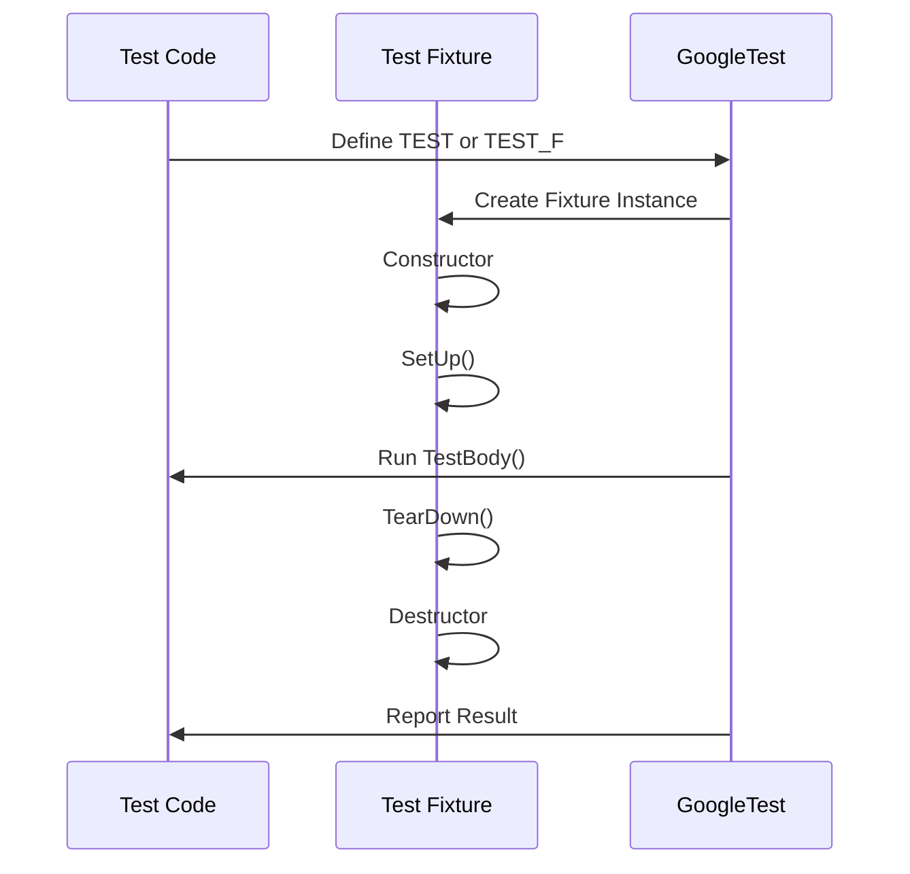

# Test Cases and Fixtures

GoogleTest provides a robust framework for defining, organizing, and executing test cases and fixtures. This documentation focuses on the core mechanisms and patterns that enable the reuse of test code, clean setup and teardown logic, and structured testing workflows.

---

## Overview of Test Cases and Fixtures

At the heart of GoogleTest's testing architecture lies the *test case* (also known as *test suite*) and *test fixture*. A test suite groups related tests, while a fixture encapsulates the common setup and cleanup required to run those tests efficiently and reliably.

- **Test Suite (Test Case)**: A named collection of individual test functions that logically group tests to improve organization, execution control, and reporting.
- **Test Fixture**: A C++ class derived from `testing::Test` that sets up shared test resources and provides a base for multiple test functions.

By combining test suites and fixtures, GoogleTest ensures tests are both isolated and maintainable.

---

## Writing Test Cases with `TEST` Macro

The simplest way to define a test case in GoogleTest is to use the `TEST` macro:

```cpp
TEST(TestSuiteName, TestName) {
  ... test statements ...
}
```

- `TestSuiteName` is the name used to logically group multiple tests.
- `TestName` is the unique name within the test suite.

GoogleTest automatically registers these tests, enabling you to run them without manual enumeration.

**Example:**

```cpp
TEST(MathTest, Addition) {
  EXPECT_EQ(2 + 2, 4);
}

TEST(MathTest, Subtraction) {
  EXPECT_EQ(5 - 3, 2);
}
```

---

## Using Test Fixtures with `TEST_F`

When multiple tests need to share the same setup or cleanup code, use a *test fixture* class. This class:

- Inherits from `testing::Test`.
- Defines `SetUp()` and `TearDown()` methods for per-test initialization and cleanup.
- Provides member variables and helper functions accessible in all tests deriving from this fixture.

Tests that use this fixture must be defined using the `TEST_F` macro:

```cpp
class MyFixture : public testing::Test {
 protected:
  void SetUp() override {
    // Code here runs before each test
  }

  void TearDown() override {
    // Code here runs after each test
  }

  int shared_value;
};

TEST_F(MyFixture, Test1) {
  shared_value = 42;
  EXPECT_EQ(shared_value, 42);
}

TEST_F(MyFixture, Test2) {
  EXPECT_NE(shared_value, 42);  // fresh fixture, shared_value is default
}
```

Each test executes with a new fresh fixture object, ensuring independence.

<Check>
Use fixtures to avoid duplicated code and maintain test isolation.
</Check>

---

## Test Fixture Lifecycle

GoogleTest supports fine-grained control over test resource lifecycles through several hooks:

| Hook                | Description                                                          |
|---------------------|----------------------------------------------------------------------|
| **Constructor**      | Called before each test; use sparingly because ASSERT macros can’t be used here. |
| **SetUp()**          | Called immediately before each test; safe to use assertions here.     |
| **Test Body**        | Contains the test code.                                              |
| **TearDown()**       | Called immediately after each test; clean up resources here.         |
| **Destructor**       | Called after TearDown(); avoid assertions here.                      |

This order ensures each test runs with a clean environment.

<Note>
Do not perform any fatal assertions in constructors or destructors—use `SetUp` and `TearDown` instead.
</Note>

---

## Sharing Resources Across Tests with `SetUpTestSuite` and `TearDownTestSuite`

For expensive resources shared by all tests in a suite, GoogleTest provides *per-test-suite* setup and teardown using static methods:

```cpp
class DatabaseTest : public testing::Test {
 protected:
  static void SetUpTestSuite() {
    // Set up resources shared across tests
    db_connection_ = new DatabaseConnection();
  }

  static void TearDownTestSuite() {
    // Clean up resources
    delete db_connection_;
    db_connection_ = nullptr;
  }

  static DatabaseConnection* db_connection_;
};

DatabaseConnection* DatabaseTest::db_connection_ = nullptr;

TEST_F(DatabaseTest, InsertTest) {
  ASSERT_TRUE(db_connection_->Insert("data"));
}

TEST_F(DatabaseTest, DeleteTest) {
  ASSERT_TRUE(db_connection_->Delete("data"));
}
```

- `SetUpTestSuite()` runs once before the first test in the suite.
- `TearDownTestSuite()` runs once after the last test in the suite.

This approach avoids redundant setup costs while preserving test isolation.

---

## Using `GTEST_SKIP()` to Skip Tests at Runtime

GoogleTest supports skipping tests dynamically based on runtime conditions using the `GTEST_SKIP()` macro. This is useful when certain prerequisites are not met.

```cpp
TEST(MyTestSuite, ConditionalTest) {
  if (!IsFeatureAvailable()) {
    GTEST_SKIP() << "Skipping test due to missing feature";
  }
  // Rest of the test
}
```

`GTEST_SKIP()` aborts the current test and reports the skip moderately in the test results.

---

## Organizing Tests Best Practices

- Group related tests logically into test suites.
- Use fixtures to share common setup and teardown logic.
- Name test suites and tests following C++ naming conventions (no underscores).
- Prefer `EXPECT_*` assertions to continue test execution after failures; however, use `ASSERT_*` when continuation is unsafe.
- Use static test suite setup/teardown only for expensive shared resources to optimize overall test time.

---

## Example: Complete Test Fixture

```cpp
class StringUtilTest : public testing::Test {
 protected:
  static void SetUpTestSuite() {
    // Expensive global setup
    dictionary_ = LoadDictionary();
  }

  static void TearDownTestSuite() {
    delete dictionary_;
    dictionary_ = nullptr;
  }

  void SetUp() override {
    // Runs before each test
    buffer_.clear();
  }

  void TearDown() override {
    // Runs after each test
  }

  static Dictionary* dictionary_;
  std::string buffer_;
};

Dictionary* StringUtilTest::dictionary_ = nullptr;

TEST_F(StringUtilTest, CapitalizationTest) {
  buffer_ = "google";
  Capitalize(&buffer_);
  EXPECT_EQ(buffer_, "Google");
}

TEST_F(StringUtilTest, DictionaryLookup) {
  EXPECT_TRUE(dictionary_->Contains("Google"));
  EXPECT_FALSE(dictionary_->Contains("googletest"));
}
```

---

## Advanced Features

### Parameterized Tests

GoogleTest also supports *value-parameterized* (`TEST_P`) and *typed* tests to avoid writing repetitive code over different input values or types. These are covered in detail in the [Advanced Guide](../advanced.md#value-parameterized-tests).

### Scoped Traces

Use `SCOPED_TRACE` to add contextual information for test failures in helper functions or loops. It helps identify the invocation context when failures occur far from the assertion.

```cpp
SCOPED_TRACE("Index = " << i);
EXPECT_EQ(array[i], expected[i]);
```

---

## Troubleshooting Common Pitfalls

- **Test fixtures not reusing data across tests?** Understand that GoogleTest creates a fresh fixture instance per test. Use static members and `SetUpTestSuite`/`TearDownTestSuite` for sharing.
- **Fatal failures in constructors?** Move such checks to `SetUp()` as constructors cannot use fatal assertions.
- **Tests skipping unexpectedly?** Check where `GTEST_SKIP()` is used.
- **Setup or teardown not called?** Verify names are correctly spelled `SetUp()`/`TearDown()` and have proper signatures.

---

## Related APIs and Macros

- `TEST()` for simple test functions
- `TEST_F()` for tests using fixtures
- `SetUp()` / `TearDown()` for per-test hooks
- `SetUpTestSuite()` / `TearDownTestSuite()` for per-suite hooks
- `GTEST_SKIP()` for skipping tests dynamically
- `SCOPED_TRACE()` for adding trace context

For more, see the [Testing Reference](./reference/testing.md).

---

## See Also

- [GoogleTest Primer](./primer.md) - For basic concepts and tutorials
- [Advanced GoogleTest Topics](./advanced.md) - For parameterized and typed tests
- [Matchers Reference](./matchers-reference.md) - For writing expressive assertions
- [Mocking Reference](./mocking.md) - For using mock objects
- [Writing Your First Test](../getting-started/first-test-experience/writing-your-first-test.md)

---

## Summary Diagram: Test Execution Lifecycle


