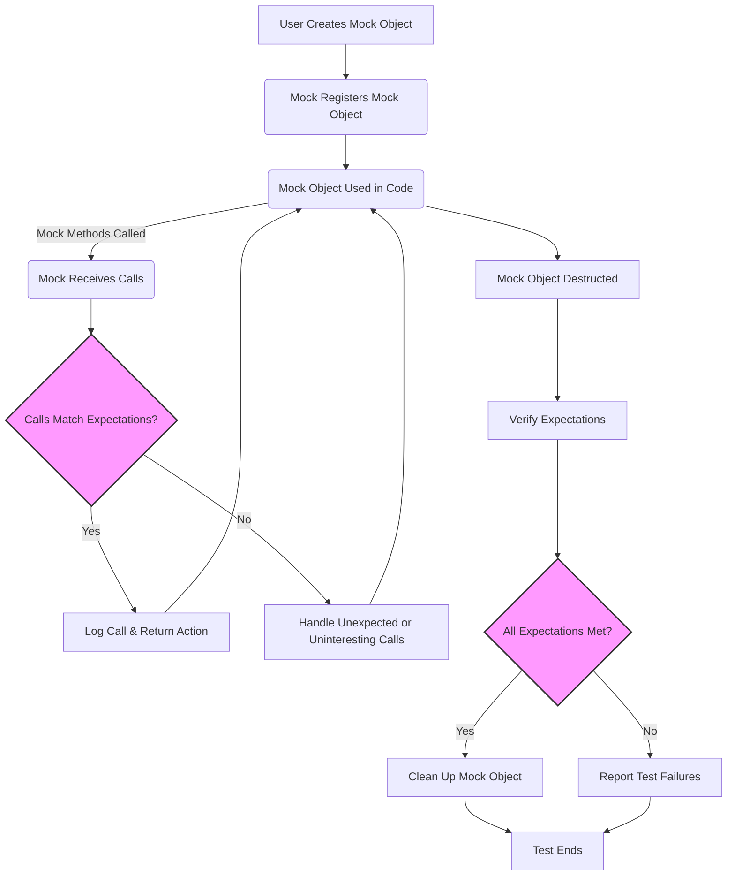

# Utility and Portability APIs

GoogleTest provides a set of essential utility and portability APIs and macros to ensure consistent behavior across platforms, support robust diagnostic logging, and offer helper functions for type traits and configuration management. This page serves as a reference for these internal and public utility components that underpin GoogleTest and GoogleMock, empowering you to write portable, maintainable, and well-instrumented tests.

---

## Overview

Testing frameworks need to abstract away differences in compilers, operating systems, and environments. The utility APIs in GoogleTest facilitate this by:

- Providing platform portability macros.
- Managing diagnostic logging with consistent formatting.
- Offering helper traits for type introspection.
- Supporting configuration utilities for fine-grained control.

This helps you focus on writing tests without worrying about platform-specific details.

---

## Portability Macros

GoogleTest includes macros to detect platform and compiler features reliably, enabling conditional compilation and platform-specific fixes. These macros handle:

- Operating system identification (e.g., Linux, Windows, macOS).
- Compiler detection (e.g., GCC, Clang, MSVC) and version checks.
- Architecture and CPU capabilities.

Use these macros to write code paths that adapt precisely to the environment.

**Example usage:**

```cpp
#if defined(GTEST_OS_LINUX) || defined(GTEST_OS_MAC)
  // Use POSIX APIs
#endif

#ifdef _MSC_VER
  // Use MSVC-specific intrinsics
#endif
```

**Tip:** Refer to `gtest-port.h` and `gtest-port-arch.h` headers for detailed macro definitions and platform detection implementation.

---

## Diagnostic Logging

Reliable, consistent logging is critical for debugging test failures and understanding test execution. GoogleTest's utility APIs include robust logging facilities that:

- Format logs with file and line information.
- Support different log severity levels (Info, Warning, Error).
- Integrate with the test framework's output.

### Key Functions

- `LogWithLocation(LogSeverity severity, const char* file, int line, const std::string& message)` logs messages annotated with source locations.

- Logging macros classify messages with verbosity levels such as `kInfoVerbosity`, `kWarningVerbosity`, and `kErrorVerbosity`.

### Usage Example

```cpp
LogWithLocation(kWarning, __FILE__, __LINE__, "Potential issue detected in test.");
```

**Best Practice:** Use warnings for recoverable issues, errors for fatal problems, and info for additional debugging details, adjusting verbosity with command-line flags.

---

## Helper Functions and Type Traits

GoogleTest provides utilities to simplify common C++ meta-programming and runtime tasks relevant to testing.

### Type Traits Support

- Helpers for compile-time checks like verifying if a type has a default constructor.
- Detection idioms to ensure types meet interface requirements for mocks and expectations.

### Functionality Highlights

- Support for safely working with incomplete types in mocks, as shown by the ability to mock methods accepting incomplete argument types when a custom printer is defined.

- Traits to detect and handle move-only types, assisting in mocking methods that accept or return `std::unique_ptr` and similar types.

---

## Mock Object Registry and Leak Detection

One critical utility responsibility is managing the lifecycle and verification status of mock objects.

### Mock Registry

A global registry tracks all mock objects and their associated mock methods. This enables:

- Automatic verification of expectations when mock objects are destroyed.
- Detection of leaked mock objects at program termination to avoid silent test successes.

### Leak Handling

You can suppress false positives on leaks when necessary via:

```cpp
Mock::AllowLeak(&mock_object);
```

---

## Verification and Clearing

GoogleTest utilities facilitate explicit verification and clearing of expectations and default actions on mocks, useful in tests with complex lifecycles.

### Functions

- `Mock::VerifyAndClearExpectations(void* mock_obj)` verifies that all expectations on a mock object have been met and clears them.

- `Mock::VerifyAndClear(void* mock_obj)` also clears default actions in addition to expectations.

Use these when a mock object might outlive your test or when you want to verify mock correctness prior to destruction.

---

## Controlling Uninteresting Calls

GoogleMock supports adjustable enforcement levels on uninteresting mock calls (methods called without specified expectations). The utility APIs underlie:

- **Allow Uninteresting Calls:** Calls accepted silently.
- **Warn Uninteresting Calls:** Calls permitted but warn the user (default behavior).
- **Fail Uninteresting Calls:** Calls treated as test errors.

These settings can be adjusted per mock object or globally using command-line flags.

Example:

```cpp
Mock::AllowUninterestingCalls(reinterpret_cast<uintptr_t>(mock_obj));
```

---

## Sequences and Expectations

Helpers managing expectation sequences and interdependencies provide users fine-grained control over call ordering.

- `Sequence` and `InSequence` utilities group expectations to enforce order.
- `Expectation` and `ExpectationSet` represent individual expectations and sets, enabling partial or total orderings.

These utilities provide the foundation for `.InSequence()`, `.After()`, and other ordering clauses.

---

## Extensibility Utilities

GoogleTest’s utility APIs also support advanced mocking features:

- Handling of overloaded function mocking with platform-safe name expansions.
- Facilities to register mock owners and manage concurrent accesses with internal thread-safe locking.

---

## Troubleshooting Tips

- Ensure your mock method names are not macro-redefined unexpectedly (e.g., by Windows headers).
- Use the logging utilities' verbosity flags (`--gmock_verbose`) to control the noise level during tests.
- Leverage the mock registry's detection of leaks and verification failures to catch unset expectations and improper mock lifetimes.

---

## Example: Using Mock Verification Utility

```cpp
TEST(MyTest, VerifyMockExpectations) {
  MockFoo foo;
  EXPECT_CALL(foo, DoSomething()).Times(1);

  // Exercise code
  foo.DoSomething();

  // Explicitly verify and clear expectations before test end
  ASSERT_TRUE(Mock::VerifyAndClearExpectations(&foo));
}
```

This ensures all `EXPECT_CALL`s are satisfied at the point of verification.

---

## Further Reading and Related Documentation

- [gMock Cookbook](https://google.github.io/googletest/gmock_cook_book.html) — Practical recipes using GoogleMock, including mock class definition and extending functionalities.
- [Mocking Reference](https://google.github.io/googletest/reference/mocking.html) — Details on `EXPECT_CALL`, `ON_CALL`, and related APIs.
- [GoogleTest Primer and Introduction](https://google.github.io/googletest/primer.html) — Getting started guides.
- [Strictness Modes (Nice, Naggy, Strict Mocks)](/api-reference/core-mocking-apis/strictness-modes) — How to control mock call strictness.

---

## Summary

This page outlines the internal and public utility APIs that form the backbone of GoogleTest’s portability, logging, diagnostic support, and mock management features. By leveraging these utilities, users can write cross-platform, reliable, and maintainable tests that gracefully handle complex mocking scenarios and lifecycle management.

---

<Info>
For detailed code examples, consult the source files `gmock-spec-builders.cc` and `gmock.h` in the [GoogleTest repository](https://github.com/google/googletest).
</Info>

---

### Mermaid diagram: Mock Object Lifecycle and Interaction


