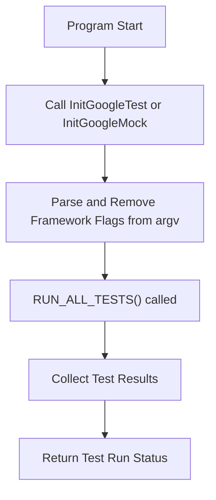

# Framework Initialization and Main Entry

GoogleTest and GoogleMock provide convenient, ready-to-use entry points for your test programs. This page explains the main entry point implementations (such as `gtest_main.cc` and `gmock_main.cc`), their initialization flows, and platform-specific handling of the `main` function. Understanding these details is essential when embedding GoogleTest or GoogleMock into custom test runners or when integrating them across diverse platforms.

---

## Overview of Main Entry Points

GoogleTest and GoogleMock offer prebuilt libraries (`gtest_main` and `gmock_main`) that contain a ready-made `main()` function. Linking your test executable against these libraries means you do not have to write your own `main` function unless you require customizations before tests run.

- **`gtest_main` library**: Provides a `main()` that initializes GoogleTest and runs all tests.
- **`gmock_main` library**: Provides a `main()` that initializes both GoogleMock and GoogleTest and runs the tests.

This separation allows users to pick the simplest entry point they need:

- If you only need GoogleTest's functionality, link with `gtest_main`.
- If you are writing mocks with GoogleMock, link with `gmock_main` for combined initialization.

Alternatively, you can write your own `main()` function and call the appropriate initialization and test running functions.

---

## Initialization Sequence Explained

Both main entry implementations handle the following sequence to bootstrap test execution:

1. **Initialize the framework's flags and environment:**
   - `testing::InitGoogleTest(&argc, argv);` for GoogleTest.
   - `testing::InitGoogleMock(&argc, argv);` for GoogleMock (which also initializes GoogleTest internally).

2. **Run all registered tests:**
   - Invokes `RUN_ALL_TESTS()` which discovers and executes all registered test cases and test suites.

3. **Return the aggregated test result status as the program's exit code:**
   - Exits with `0` if all tests pass.
   - Non-zero exit code if any test fails.


### Why Use the Provided Main Libraries?

They simplify the test program setup by:

- Handling flag parsing and removal from `argv` internally.
- Automatically linking GoogleTest and GoogleMock test registrations.
- Handling platform nuances transparently.

When you need custom setup logic before or after tests run, writing your own `main()` is recommended; otherwise, use these main libraries to get started quickly.

---

## Platform-Specific Main Handling

GoogleTest and GoogleMock accommodate several platform-specific cases to ensure smooth integration of the main entry point:

### Embedded/Arduino-like Platforms

On boards such as ESP8266, ESP32, or NRF52 (with Arduino framework), `main()` is replaced by the Arduino `setup()` and `loop()` functions:

- `setup()` calls `testing::InitGoogleTest()` or `testing::InitGoogleMock()` for initialization.
- `loop()` continuously calls `RUN_ALL_TESTS()` to execute tests.

This matches the Arduino programming model and allows GoogleTest/GoogleMock to run in these constrained environments.

### QuRT Platform

The QuRT platform lacks usable `argc`/`argv` parameters:

- The main entry point is a standard `main()` without arguments.
- Initialization is done without command-line arguments.
- Tests run normally thereafter.

### Typical Desktop and Server Platforms

For platforms like Linux, Windows, and macOS:

- `main(int argc, char** argv)` is implemented.
- Framework flags are parsed from the command line.
- Tests are executed, and results returned.

### Windows Mobile Special Case

- Uses `_tmain(int argc, TCHAR** argv)` instead of `main()` for Unicode support and platform constraints.
- GoogleMock adapts to this by defining `_tmain()` accordingly.

---

## Example Implementations

### GoogleTest `gtest_main.cc` Basic Example (simplified)

```cpp
#include "gtest/gtest.h"

int main(int argc, char **argv) {
  testing::InitGoogleTest(&argc, argv);
  return RUN_ALL_TESTS();
}
```

### GoogleMock `gmock_main.cc` Typical Example (simplified)

```cpp
#include "gmock/gmock.h"
#include "gtest/gtest.h"
#include <iostream>

int main(int argc, char** argv) {
  std::cout << "Running main() from gmock_main.cc\n";
  testing::InitGoogleMock(&argc, argv);
  return RUN_ALL_TESTS();
}
```

### Arduino-Style Example

```cpp
void setup() {
  testing::InitGoogleTest();  // Or InitGoogleMock()
}

void loop() {
  RUN_ALL_TESTS();
}
```

---

## Writing a Custom Main Function

If your test setup requires specific initialization (e.g., setting up environment variables, logging, or global state) before or after running tests, you should write your own `main()`.

Guidelines:

- Call `testing::InitGoogleTest(&argc, argv);` or `testing::InitGoogleMock(&argc, argv);` early to parse framework flags.
- Call `RUN_ALL_TESTS()` once and return its result as your process exit code.
- Do not call `RUN_ALL_TESTS()` multiple times as it may break advanced features like thread-safe death tests.

Example:

```cpp
#include <gtest/gtest.h>

int main(int argc, char **argv) {
  testing::InitGoogleTest(&argc, argv);

  // Custom setup before tests

  int result = RUN_ALL_TESTS();

  // Custom teardown or logging after tests

  return result;
}
```


---

## Common Pitfalls and Best Practices

- **Do not ignore `RUN_ALL_TESTS()` return value.** It indicates overall test success or failure and must be returned by your `main()`.
- **Call `InitGoogleTest()` / `InitGoogleMock()` exactly once, before running tests.** This ensures proper flag initialization.
- **Avoid writing multiple `main()` functions in your test binary.** They will cause linker errors.
- **For most users, link with `gtest_main` or `gmock_main` to save time.** Only write your own `main()` if customization is required.
- **Understand platform nuances if building for embedded systems or uncommon platforms.** Use the provided `main` implementations as references.

---

## Visual Flow of Test Execution Initialization



---

## Where to Find These Implementations

- `gtest_main.cc` located in the `googletest/src` directory.
- `gmock_main.cc` located in the `googlemock/src` directory.

Their source code serves as canonical examples for main entry points and can be adapted or used directly.

---

## Summary

This page demystifies how GoogleTest and GoogleMock bootstraps test execution via main entry points. It enables developers to quickly get started by linking with provided main libraries or write custom entry points for specialized needs. It outlines how platform-specific constraints are handled, especially on embedded hardware, and gives actionable recommendations to integrate and extend the framework initialization effectively.

---

## Related Documentation

- [GoogleTest Primer: Writing the main() Function](https://github.com/google/googletest/blob/main/docs/primer.md#writing-the-main-function)
- [GoogleMock Main Implementation](https://github.com/google/googletest/blob/main/googlemock/src/gmock_main.cc)
- [GoogleTest Main Implementation](https://github.com/google/googletest/blob/main/googletest/src/gtest_main.cc)
- [Getting Started: Building and Integrating GoogleTest](https://github.com/google/googletest/blob/main/guides/getting-started/building-and-integrating.md)
- [Platform Portability and Cross-Compilation](https://github.com/google/googletest/blob/main/concepts/extensibility-integration/platform-portability.md)

---

<Check>
Always link your test binaries with `gtest_main` or `gmock_main` unless you have a specialized need to customize `main()`.
</Check>

<Warning>
Do not call `RUN_ALL_TESTS()` multiple times within the same program; it leads to undefined behavior.
</Warning>

<Note>
On embedded or limited OS environments, observe the special setup in `gtest_main.cc` and `gmock_main.cc` for Arduino, ESP, and QuRT platforms.
</Note>
