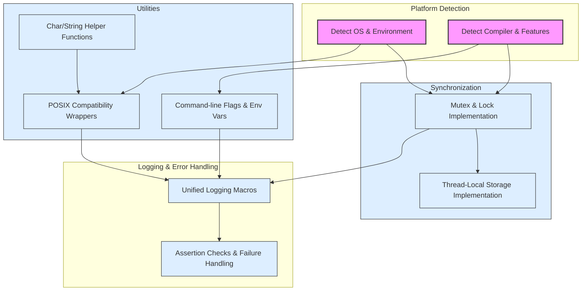

# Platform Abstractions & Portability Macros

GoogleTest relies on a carefully designed set of macros, flags, and environment detection utilities that ensure compatibility and consistent behavior across various compilers, platforms, and operating systems. This page provides a detailed overview of these portability features, empowering you to write tests that seamlessly run on Linux, Windows, macOS, and many other supported environments.

---

## Purpose and Scope

Platform abstraction is a critical foundation of GoogleTest's portability. The macros and utilities described here allow GoogleTest to detect environment properties such as operating system type, compiler capabilities, threading support, and features like exception handling or RTTI availability. They also provide wrappers around platform-specific APIs to unify usage transparently for the user.

This documentation covers environment detection macros, compiler workarounds, threading and synchronization abstractions, and utility helpers relevant to platform compatibility.

---

## Key Environment-Detection Macros

GoogleTest automatically detects the underlying platform and sets corresponding macros to `1` or `0`. This detection drives conditional compilation and enables platform-appropriate implementations.

### Operating System Macros

GoogleTest defines exactly one platform macro depending on the detected environment. Some of the common platform macros include:

| Macro                      | Platform Description                     |
|----------------------------|-----------------------------------------|
| `GTEST_OS_LINUX`            | Linux-based systems                      |
| `GTEST_OS_WINDOWS`          | Any Windows platform (desktop, Mobile)  |
| `GTEST_OS_WINDOWS_DESKTOP`  | Windows Desktop                         |
| `GTEST_OS_WINDOWS_MINGW`    | MinGW environment on Windows             |
| `GTEST_OS_MAC`              | Apple macOS                             |
| `GTEST_OS_IOS`              | Apple iOS                              |
| `GTEST_OS_CYGWIN`           | Cygwin environment                      |
| `GTEST_OS_FREEBSD`          | FreeBSD OS                             |
| `GTEST_OS_SOLARIS`          | Solaris OS                            |
| `GTEST_OS_ANDROID`          | Android (subset of Linux)             |

These macros are mutually exclusive and set during compilation to precisely identify the current platform.

### Compiler Feature Detection

GoogleTest inspects compiler-defined macros or uses compiler intrinsics to detect support for:

- C++ language standard (C++17 or higher required)
- Exception handling support (`GTEST_HAS_EXCEPTIONS`)
- Run-Time Type Information (RTTI) support (`GTEST_HAS_RTTI`)
- Structured Exception Handling (SEH) on Windows (`GTEST_HAS_SEH`)

If an unsupported compiler or configuration is detected, GoogleTest triggers a compile-time error.

---

## Threading and Synchronization Macros

GoogleTest is thread-safe where the platform allows. It conditionally compiles synchronization primitives based on availability.

| Macro                       | Description                                   |
|-----------------------------|-----------------------------------------------|
| `GTEST_IS_THREADSAFE`       | `1` if the platform supports threads and mutexes (e.g., POSIX, Windows).
| `GTEST_HAS_PTHREAD`          | Whether pthreads is available on the platform.
| `GTEST_HAS_MUTEX_AND_THREAD_LOCAL_` | Indicates if GoogleTest uses its own mutex and thread-local implementations.

### Thread and Mutex Implementations

- On POSIX platforms (Linux, macOS, *BSD), pthreads is the preferred threading API.
- On Windows, native synchronization primitives like `CRITICAL_SECTION` are used.
- When threading is unsupported or disabled, dummy mutex and thread-local classes provide no-op implementations.

This abstraction allows test developers to use GoogleTest's thread-safe features without dealing with platform-specific details.

---

## Utility Macros for Compatibility

### Safe Casting and Downcasting

GoogleTest provides utility templates such as `ImplicitCast_` for safe, compile-time checked upcasting and `CheckedDowncastToActualType` that verifies correctness at runtime when RTTI is enabled.

### String and Character Helpers

To unify behavior across platforms:

- Character classification functions like `IsAlpha`, `IsSpace`, `IsDigit` wrap standard C functions but cast internally to `unsigned char` to avoid undefined behavior.
- Case-insensitive string comparisons use `StrCaseCmp` on POSIX and `_stricmp` on Windows.

### POSIX Compatibility Layer

GoogleTest's internal `posix` namespace provides wrappers around common file and I/O functions:

- `FOpen()`, `FReopen()`, `FDOpen()`, `FClose()` abstract platform differences, including Windows Unicode path support.
- `Stat()`, `RmDir()`, and `IsDir()` provide file system status checks.
- `IsATTY()` wraps terminal detection safely.

These utilities simplify file and stream handling for tests while keeping the code portable.

---

## Flag and Environment Variable Macros

GoogleTest and GoogleMock manage command-line flags with consistent naming. Macros include:

- `GTEST_FLAG(name)` and `GMOCK_FLAG(name)` to access flags.
- Conditional integration with Abseil's flag library if available, otherwise fallback to global variables.

As a user, referencing flags uniformly ensures compatibility with different build and runtime environments.

---

## Error Handling and Logging

GoogleTest defines logging macros `GTEST_LOG_()` and `GTEST_CHECK_()` which provide platform-independent logging and assertions. They print messages to `stderr` with file and line information and abort execution on fatal errors.

Their implementation respects platform-specific behaviors, including disabling warnings on MSVC and supporting structured exception handling where available.

---

## Example Usage in Tests (Conceptual)

Although these macros are internal, understanding their roles helps you troubleshoot platform-related issues and to appreciate how GoogleTest maintains portability.

```cpp
#include <gtest/gtest.h>

// Your test code can rely on stable behavior regardless of platform.
// For example, it can expect thread-safe assertions on POSIX or Windows.

TEST(ExampleTest, Simple) {
  // Internally, GoogleTest uses platform detection macros to select
  // synchronization and logging implementations behind the scenes.
  ASSERT_TRUE(true);
}
```

---

## Best Practices & Tips

- Avoid defining platform macros yourself; rely on GoogleTest's detection.
- Use GoogleTest's public API macros and functions; internal macros (ending with `_`) are subject to change.
- For advanced usage or toggling threading support, define `GTEST_HAS_PTHREAD` or `GTEST_IS_THREADSAFE` carefully.
- When debugging platform-specific issues, refer to macros like `GTEST_OS_WINDOWS` or `GTEST_HAS_EXCEPTIONS` to understand what features are enabled.

---

## Troubleshooting Common Issues

| Problem                                                                 | Resolution/Tip                                                                                        |
|-------------------------------------------------------------------------|----------------------------------------------------------------------------------------------------|
| Tests fail to compile due to unsupported compiler or insufficient C++ version | Ensure your compiler supports C++17 or higher; GoogleTest requires this minimum.                   |
| Linking errors due to missing pthreads on Linux                         | Verify that `pthread` library is linked; GoogleTest expects pthreads on POSIX unless overridden.   |
| Assertion macros cause warnings on MSVC                                 | GoogleTest disables specific compiler warnings internally; ensure using supported MSVC version.   |
| Thread-local storage not working on target platform                     | Confirm `GTEST_IS_THREADSAFE` macro; build environment may need adjustment or a custom port.       |
| Inconsistent behavior on Windows path handling                         | Use GoogleTest POSIX wrappers like `FOpen` to handle Unicode paths correctly on Windows.           |

For detailed troubleshooting, consult the [Common Setup Issues](getting-started/first-steps-validation/common-setup-issues) guide.

---

## Visual Diagram of Platform Abstractions



---

## Additional Resources

- [Platform Abstraction and Portability Concepts](concepts/platform-scalability/platform-abstraction)
- [Supported Platforms & Compatibility](overview/integrations/supported-platforms)
- [Common Setup Issues and Troubleshooting](getting-started/first-steps-validation/common-setup-issues)
- [GoogleTest Primer](docs/primer.md)

---

## Summary

This foundational layer of GoogleTest powers unmatched compatibility and functionality across diverse environments. Understanding these macros equips you to customize, troubleshoot, or extend GoogleTest effectively while writing robust, portable C++ tests.

---

_For source reference and contribution info, see_ [`googletest/include/gtest/internal/gtest-port.h`](https://github.com/google/googletest/blob/main/googletest/include/gtest/internal/gtest-port.h) _and related platform-specific headers._

---

*End of Platform Abstractions & Portability Macros Reference.*