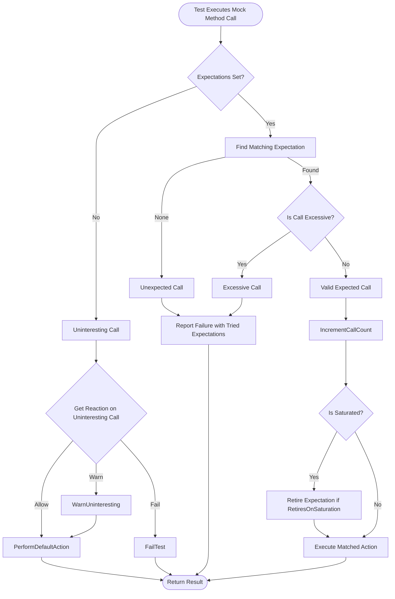

# Error Handling and Status Codes

GoogleTest and GoogleMock provide robust mechanisms to report, manage, and interpret errors, test assertion failures, expectation violations, and framework-level problems. This documentation explains the types of errors you encounter during testing, how failure messages are structured, and ways you can capture or extend status reporting and logging.

Understanding error handling is essential to rapidly identify issues in your code and tests, improve your debugging experience, and write reliable, clear, and maintainable tests.

---

## 1. Understanding Test Failures and Expectation Violations

When using GoogleTest, assertion failures indicate that your code did not meet the expected conditions within a test. GoogleMock advances this by enabling mock objects to verify expected function calls, argument matching, and call sequences. Failure to meet these expectations results in detailed error messages and status codes.

### Types of Failures

- **Assertion Failures**: Failures triggered by assertion macros such as `EXPECT_EQ` or `ASSERT_TRUE`. Nonfatal failures (e.g., `EXPECT_`) allow tests to continue, while fatal failures (e.g., `ASSERT_`) abort the current function.
- **Expectation Violations**: Occur when mock methods are called unexpectedly, too few times, too often, or out of the defined sequence.
- **Framework Errors**: Indicate internal inconsistencies or unrecoverable states within the testing framework.

### Failure Messages and Diagnostics

GoogleTest and GoogleMock output failure messages that provide:

- **Location information**: Source file and line number of the failed expectation.
- **Function call details**: Actual arguments and expected matchers.
- **Call counts**: Expected vs actual invocation counts with state indicators like "unsatisfied and active", "saturated", or "over-saturated".
- **Prerequisite status**: Whether dependent expectations are satisfied.
- **Stack traces (if enabled)**: Helps trace the source of the failure in the call stack (enabled by `--gmock_verbose=info`).

Example failure snippet:

```text
Unexpected mock function call - returning default value.
    Function call: DoB(1, 0)
          Returns: false
Google Mock tried the following 1 expectation, but it didn't match:

FILE.cc: EXPECT_CALL(foo, DoB(0, _))...
  Expected arg #0: is equal to 0
           Actual: 1
         Expected: to be called once
           Actual: never called - unsatisfied and active
```

This format clearly informs you which mock method was called incorrectly, why it failed, and where to locate the relevant code.

---

## 2. Mock Behavior Modes and Error Reporting

GoogleMock allows you to control how uninteresting calls and unexpected calls are handled through three mock object behaviors:

| Behavior      | Description                                   | Default Behavior         |
|---------------|-----------------------------------------------|-------------------------|
| **NaggyMock** | Prints warnings on uninteresting calls but does not fail tests. | Default for mocks       |
| **NiceMock**  | Suppresses warnings on uninteresting calls, allowing silent continuing. | Optional wrapper usage  |
| **StrictMock**| Treats uninteresting calls as errors and fails tests upon them. | Optional wrapper usage  |

You choose these by declaring mock objects as `NiceMock<T>`, `NaggyMock<T>`, or `StrictMock<T>`. This controls the verbosity and strictness of failure messages relating to calls that do not have expectations (`EXPECT_CALL`).

```cpp
using ::testing::StrictMock;
StrictMock<MockFoo> mock_foo;
EXPECT_CALL(mock_foo, DoSomething());
mock_foo.OtherMethod();  // This will fail due to uninteresting call
```

Adjust verbosity at runtime using the `--gmock_verbose` flag:

- `info` - Show all informational messages, warnings, and errors, including call traces.
- `warning` - Show warnings and errors (default).
- `error` - Only show errors.

---

## 3. Expectation Clauses and Status Codes

Expectations are specified with `EXPECT_CALL`, supplemented by clauses that govern how calls to mock methods are matched and handled.

- `.Times(cardinality)`: How many times a call is expected (e.g., `Exactly(1)`, `AtLeast(2)`).
- `.WillOnce(action)` / `.WillRepeatedly(action)`: Define the behavior on calls.
- `.InSequence(seq1, seq2, ...)` and `.After(expect1, expect2, ...)`: Specify call ordering requirements.
- `.RetiresOnSaturation()`: Expectation retires once saturated.

Failure modes reported include
- **Too few calls**: Actual call count less than expected. 
- **Too many calls**: Calls exceed expected count.
- **Unexpected calls**: Calls that do not match any expectation.
- **Unsatisfied prerequisites**: Calls invoked before required calls.

The framework's failure messages explicitly describe these states to help you correct test logic or production code errors.

---

## 4. Uninteresting, Unexpected, and Excessive Calls

Understanding these call types improves test clarity and reduces noise.

| Call Type      | Description                                                                                     | Example Scenario                                           |
|----------------|-------------------------------------------------------------------------------------------------|------------------------------------------------------------|
| **Uninteresting** | Method called on a mock without any matching `EXPECT_CALL`. Allowed by default; warns in NaggyMock. | Mock method called unexpectedly but no constraint set.    |
| **Unexpected** | Method called that does not match any existing `EXPECT_CALL` due to argument mismatch or order. | `EXPECT_CALL` exists but arguments differ from call.       |
| **Excessive**  | Method called more times than allowed by `Times()` clause or inferred cardinality.               | Calling a method too frequently.                            |

Uninteresting calls can be suppressed with `NiceMock`. Unexpected and excessive calls always cause test failures.

---

## 5. Handling Uninteresting Calls: Customizing Behavior

If uninteresting calls are distracting or undesirable, GoogleMock gives API calls to configure their treatment on a per-mock-object basis.

```cpp
// Usage:
Mock::AllowUninterestingCalls(reinterpret_cast<uintptr_t>(&mock_obj));
Mock::WarnUninterestingCalls(reinterpret_cast<uintptr_t>(&mock_obj));
Mock::FailUninterestingCalls(reinterpret_cast<uintptr_t>(&mock_obj));
```

These methods respectively allow, warn, or fail on uninteresting calls, overriding the default behavior controlled by mock wrappers or the global flag `--gmock_verbose`.

Alternately, the recommended practice is to prefer **`NiceMock` or `StrictMock` wrappers** for full control.

---

## 6. Capturing and Extending Logging

The GoogleMock framework outputs messages related to mock calls, expectation violations, and warnings during test execution. This output can be controlled and extended:

- **Flags**:
  - `--gmock_verbose` : Adjust verbosity level (info, warning, error).
  - `--gtest_stack_trace_depth` : Controls depth of printed stack traces.

- **Best practices for interpreting logs:**
  - Look for **file and line information** in messages.
  - Identify the **function call and expected matcher details** to localize failures.
  - Use **stack traces** to debug call sites especially for unexpected or uninteresting calls.

- **Extensions:**
  - Override default actions or handlers in your mock class using `ON_CALL` and `EXPECT_CALL` with `.WillByDefault()` and `.WillOnce()` to customize logging or error reporting.
  - Implement custom actions (lambdas or function objects) to add side effects such as detailed logs.

---

## 7. Troubleshooting Common Failure Scenarios

### Unexpected Mock Calls

If a mock receives a call that matches no expectation, you typically receive a failure message detailing:

- The call that was made.
- The set of expectations tried (including argument matchers and call counts).
- Whether each expectation was retired, unsatisfied, or mismatched.

#### How to fix

- Verify your `EXPECT_CALL`s cover the calls with correct argument matchers.
- Use catch-all `EXPECT_CALL(mock, Method(_)).Times(AnyNumber())` carefully to suppress uninteresting call warnings if intended.
- Use `--gmock_verbose=info` to get detailed traces of mock invocations.

### Excessive Calls

If a method is called more than the specified `Times()`, the unexpected calls will use the default action (if any) or return default values, but failures are generated.

Use `.RetiresOnSaturation()` on expected calls to automatically retire expectations once saturated, enabling a more flexible call count.

### Uninteresting Calls

Uninteresting calls to mocks without an `EXPECT_CALL` cause warnings (NaggyMock mode). They do not fail tests but may indicate missing expectations. Use `NiceMock` to suppress such warnings.

### Leak Warnings

GoogleMock tracks mock object usage to warn if mocks are leaked (i.e., never deleted). Leaked mocks' expectations aren't verified, leading to silent bugs.

Use `testing::Mock::AllowLeak(mock_object)` to suppress these warnings when intentional.

---

## 8. Best Practices Summary

- Use `EXPECT_CALL` only for calls you want to verify strictly. Use `ON_CALL` for defining default behavior.
- Prefer `NiceMock` for mocks unless you want strict enforcement of uninteresting calls.
- Use `.RetiresOnSaturation()` to gracefully handle repeated calls.
- Use `--gmock_verbose=info` during test debugging for detailed call traces and diagnostics.
- Analyze failure messages carefully: they include actual/expected call counts, argument match status, and prerequisite requirements.
- Avoid suppressing warnings by adding indiscriminate `EXPECT_CALL`s; use `NiceMock` or explicit expectations only where necessary.
- Regularly verify and clear mock expectations in tests where mocks live longer using `Mock::VerifyAndClearExpectations(&mock)`, especially for heap allocated mocks.

---

## 9. Example: Diagnosing an Unexpected Call

```cpp
using ::testing::_;  // wildcard matcher
using ::testing::Return;

class MockFoo {
 public:
  MOCK_METHOD(int, DoSomething, (int value));
};

TEST(FooTest, HandlesUnexpectedCalls) {
  MockFoo mock;

  // Expect DoSomething to be called with zero.
  EXPECT_CALL(mock, DoSomething(0)).WillOnce(Return(5));

  int result = mock.DoSomething(1);  // Unexpected call
  EXPECT_EQ(result, 0);  // Returns default int value
}
```

When running this test, the output will highlight that the call with argument `1` is unexpected and explain the matching expectations. It informs you that the actual call did not match the only expectation expecting `0`.


## 10. Related Links and References

- [Assertions Reference](https://github.com/google/googletest/blob/main/docs/reference/assertions.md): For understanding assertion failures
- [Mocking Reference](https://github.com/google/googletest/blob/main/docs/reference/mocking.md): Detailed API for mocks, expectations, sequences
- [gMock Cookbook](https://github.com/google/googletest/blob/main/docs/gmock_cook_book.md): Recipes and best practices using GoogleMock
- [Advanced Testing Patterns: Death Tests and Error Handling](../guides/advanced_testing_patterns/death_tests_error_handling.md): For process exit tests
- [Using GoogleMock](../guides/core_testing_workflows/using_googlemock.md): Intro to mocks

---

For a deeper dive and practical guidance, consult the [Mocking API Reference](../api-reference/mocking-api/setting-expectations-actions.md) and the [gMock Verbosity Flag documentation](https://github.com/google/googletest/blob/main/docs/gmock_cook_book.md#controlling-how-much-information-gmock-prints).

---

## Mermaid Diagram: Call Matching and Failure Reporting Flow


