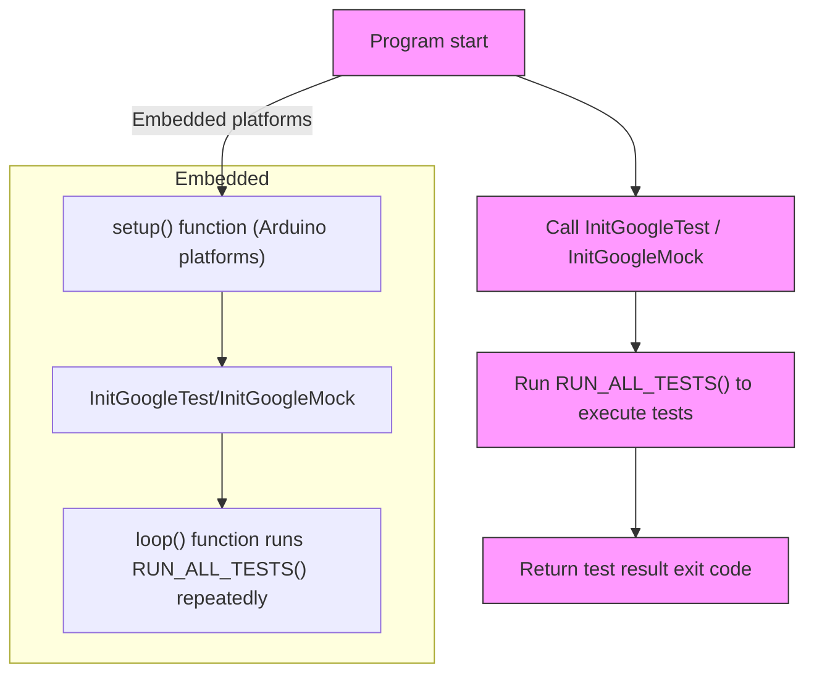

# Main Functions and Initialization

This page explains the initialization process and the main entry points for test execution in GoogleTest and GoogleMock, including platform-specific adaptations such as Arduino support. It demonstrates how to properly set up your test environment to run your C++ tests, and offers integration examples for various platforms and test runners.

---

## Overview

Starting your testing process requires proper initialization of GoogleTest or GoogleMock, followed by running all registered tests in your program. This involves calling initialization functions and executing the test runner entry point, usually via a main function.

The framework provides both default main functions and ways for you to define your own custom entry points. This flexibility allows you to integrate GoogleTest seamlessly with other code, build systems, platforms, and test runners.

## Why is Initialization Important?

Initialization parses and configures test-related command-line flags, sets up internal test registries, and prepares the framework to discover and run your defined tests. Without proper initialization, tests will not run correctly — or at all.

Linking to default provided *main* implementations can save you time, but writing a custom *main* function can be necessary for special integration needs.

---

## Using the Default Main Functions

GoogleTest and GoogleMock provide compiled libraries that include a default main function:

- **`gtest_main`** supplies a basic `main()` suitable for most scenarios
- **`gmock_main`** supports GoogleMock, automatically calling the initialization for both GoogleMock and GoogleTest

### How to Use Default Main

When linking your test executable, simply link against `gtest_main` or `gmock_main` instead of `gtest` or `gmock`. Your test binary will then have a ready-made entry point with recommended initialization.


### What the Default `main` Does

It performs the following workflow:

1. Calls `testing::InitGoogleTest(&argc, argv);` or `testing::InitGoogleMock(&argc, argv);` as appropriate
2. Runs all tests by invoking `RUN_ALL_TESTS();`
3. Returns the test run result code to the host environment

---

## Writing Your Own `main()` Function

You might want to write a custom main function if:

- You want to perform setup or teardown before or after test execution
- You want to integrate GoogleTest into a larger application with its own entry
- You need to handle platform-specific entry points differently

### Recommended Custom Boilerplate

```cpp
#include <gtest/gtest.h>

int main(int argc, char **argv) {
  testing::InitGoogleTest(&argc, argv);
  return RUN_ALL_TESTS();
}
```

This minimal example ensures:

- Command-line flags are parsed
- All registered tests are executed
- Proper exit code returns to indicate success or failure


### Important Details

- The `InitGoogleTest()` call processes known flags and removes them, allowing for clean argument handling.
- Always return the value of `RUN_ALL_TESTS()`. This is crucial for CI systems and test pipelines relying on exit codes.
- Call `RUN_ALL_TESTS()` exactly once. Multiple calls may cause unpredictable errors.

---

## GoogleMock Initialization and Main Function

GoogleMock builds upon GoogleTest and introduces `InitGoogleMock()` which initializes both GoogleMock and GoogleTest components.

Example main with GoogleMock:

```cpp
#include <gmock/gmock.h>

int main(int argc, char **argv) {
  testing::InitGoogleMock(&argc, argv);
  return RUN_ALL_TESTS();
}
```

Alternatively, link to the `gmock_main` library to use the default main function.

---

## Platform-Specific Entry Points

### Arduino and Embedded Platforms

On certain embedded platforms such as ESP8266, ESP32, and NRF52 with Arduino:

- The application uses `setup()` and `loop()` functions instead of `main()`.
- GoogleTest and GoogleMock provide initialization in `setup()` and execute tests repeatedly in `loop()`.

Example for Arduino-like platforms:

```cpp
void setup() {
  testing::InitGoogleTest();
}

void loop() {
  RUN_ALL_TESTS();
}
```

For GoogleMock on these platforms:

```cpp
void setup() {
  testing::InitGoogleMock();
}

void loop() {
  RUN_ALL_TESTS();
}
```

This design matches embedded programming paradigms and ensures tests run within the constraints of the platform.

### QuRT Platform

On Qualcomm QuRT, `main()` exists but `argc` and `argv` are unavailable. The initialization is done without arguments accordingly.

---

## Integration Examples with Build Systems and Test Runners

GoogleTest integrates well with common C++ build systems and test runners.

### CMake Integration

- Link your test executable against `gtest_main` or `gmock_main` targets.
- CMake configurations automatically provide proper entry points.

### Bazel Integration

- Bazel rules for GoogleTest automatically compile with default main provided.
- Custom entry points are supported when necessary.

### Continuous Integration Pipelines

- Rely on the exit code returned from `RUN_ALL_TESTS()`. Ensure your pipeline fails builds if tests fail.
- Use command-line flags parsed during `InitGoogleTest()` to filter tests, change output formats (e.g., XML), or enable advanced behaviors.

Refer to the [Running and Configuring Tests Guide](../../guides/writing-tests/running-and-configuring-tests.md) for detailed usage of command-line flags and CI integration.

---

## Troubleshooting Initialization and Main Execution Issues

### Common Issues

- **Tests Not Running:** Ensure you link against the correct main library or define your own main properly.
- **Command-line Flags Ignored:** Verify that `InitGoogleTest()` is called before `RUN_ALL_TESTS()`.
- **Exit Code Always Zero:** Always return the result of `RUN_ALL_TESTS()` from `main()`.

<Tip>
If you encounter linker errors related to duplicate `main`, check your link libraries to avoid linking both `gtest_main` and your own main function.
</Tip>

<Tip>
For embedded platforms, ensure your environment supports the Arduino `setup()`/`loop()` patterns as GoogleTest adapts accordingly.
</Tip>

---

## Summary

This page outlined how to properly initialize and run tests with GoogleTest and GoogleMock, focusing on main entry points and platform integrations. Using provided default mains via libraries simplifies setup, but writing a custom main is straightforward and necessary in advanced use cases. Special platform adaptations and build system integrations are supported to make testing seamless.

---

## Additional Resources

- [GoogleTest Primer](../../overview/getting-started-with-googletest/what-is-googletest.md) — Learn the basics of GoogleTest, including test writing and execution.
- [GoogleTest Advanced Guide](../../overview/core-architecture-and-concepts/system-architecture-overview.md) — Understand the system architecture underlying test execution.
- [Running and Configuring Tests](../../guides/writing-tests/running-and-configuring-tests.md) — Learn test execution customization.
- [Mocking Framework Reference](../../api-reference/mocking-framework/mock-methods.md) — Integration with mocking initialization.

For the source code of default main entry points:

- [`googletest/src/gtest_main.cc`](https://github.com/google/googletest/blob/main/googletest/src/gtest_main.cc)
- [`googlemock/src/gmock_main.cc`](https://github.com/google/googletest/blob/main/googlemock/src/gmock_main.cc)

---

## Example: Custom `main` with Additional Setup

```cpp
#include <gtest/gtest.h>
#include <iostream>

int main(int argc, char **argv) {
  std::cout << "Starting tests with custom setup..." << std::endl;
  testing::InitGoogleTest(&argc, argv);

  int result = RUN_ALL_TESTS();

  std::cout << "Tests finished with result code: " << result << std::endl;
  return result;
}
```

This example demonstrates adding custom output around the test execution while still using the recommended initialization and execution sequence.

---

## Workflow Diagram



This chart highlights the main execution flow for normal and embedded platforms.
