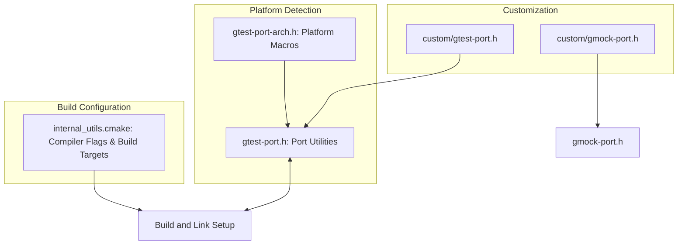

# Portability and Configuration

This reference page provides essential information for ensuring GoogleTest and GoogleMock operate seamlessly across diverse platforms and compiler environments. It covers cross-platform configuration options, platform-detecting macros, internal utilities, configuration switches, and the use of custom port headers to tailor compatibility with operating systems and compilers.

---

## Cross-Platform Compatibility Overview

GoogleTest and GoogleMock are designed for portability across many operating systems and compilers by detecting environment capabilities at compile time and adapting accordingly. This section explains how portability is achieved and what user control is available.

### Platform and Feature Detection Macros

GoogleTest uses a comprehensive set of macros to automatically detect the compilation environment. These macros define environment characteristics such as:

- Operating system (e.g., Linux, Windows, Mac OS X, Android)
- Compiler features (e.g., RTTI, exceptions support)
- Library availability (e.g., pthreads support)

These macros are always defined to either 1 or 0 by GoogleTest internally and are never left undefined. They should never be redefined manually except with the intention of overriding automatic detection for special cases.

Some notable macros include:

| Macro                        | Description                                                               |
|------------------------------|---------------------------------------------------------------------------|
| `GTEST_OS_WINDOWS`            | Defined 1 if compiling on Windows platforms                               |
| `GTEST_OS_LINUX`              | Defined 1 if compiling on Linux                                            |
| `GTEST_HAS_EXCEPTIONS`        | Defined 1 if exceptions are enabled                                       |
| `GTEST_HAS_RTTI`              | Defined 1 if RTTI (Run-Time Type Information) is enabled                  |
| `GTEST_HAS_PTHREAD`           | Defined 1 if pthreads are available                                       |
| `GTEST_HAS_DEATH_TEST`        | Defined 1 if death tests are supported (requires filesystem availability) |

Understanding these macros allows users to write conditionally portable tests or debugging aids that can adapt behavior at compile time.

### User Overrides for Configuration

Users may occasionally want to override automatic detection, for example, to force disable exceptions or pthread usage if the environment is unusual. This is done by passing macro defines to the compiler, such as:

```cpp
-DGTEST_HAS_PTHREAD=0
-DGTEST_HAS_EXCEPTIONS=1
```

This ensures flexibility for integrating GoogleTest in constrained or customized build environments.

---

## Platform Macros and Internal Utilities

### Platform-Detecting Macros

The core platform macros are defined in the header `gtest/internal/gtest-port-arch.h`. The macros precisely identify the target platform, including fine distinctions such as Windows flavors (desktop, mobile, Windows Phone, WinRT), different Unix variants (FreeBSD, NetBSD, DragonFlyBSD, Solaris), and embedded targets.

These macros allow conditional compilation of platform-specific code and optimizations.

### Internal Portability Utilities

The header `gtest/internal/gtest-port.h` contains a rich collection of utilities:

- **Threading primitives:** `Mutex`, `MutexLock`, `ThreadLocal` abstractions that map to native pthreads or Windows APIs.
- **File system helpers:** Cross-platform wrappers for file and directory operations.
- **Character and string utilities:** Safe wrappers for character classification that handle signed/unsigned char conversions correctly.
- **Stream redirection:** Facilities for capturing stdout and stderr streams, essential for tests involving output verification.
- **Command-line flag parsing and environment variable utilities:** Consistent flag and environment variable management for configuration.

These utilities are carefully designed to abstract away platform differences and provide safe, consistent interfaces.

### Custom Port Header Integration

For extreme customization or platform support, users can inject their own configuration by defining a custom header:

- For GoogleTest: `gtest/internal/custom/gtest-port.h`
- For GoogleMock: `gmock/internal/custom/gmock-port.h`

Users can override macros, redefine logging or threading primitives, or customize environment detection by defining these headers. This capability enables integration with exotic compilers or embedded platforms.

### Compiler and Linker Configuration Helpers

The `googletest/cmake/internal_utils.cmake` file provides CMake functions and macros to:

- Adjust compiler flags for different compilers (MSVC, Clang, GCC, Intel, SunPro, etc.)
- Configure whether to build static or shared libraries (DLLs)
- Manage pthread presence and enable strong multithreading support
- Setup install targets and output directories

This ensures builds are optimized and compatible with the target system’s compiler toolchain.

---

## Key Configuration Switches

### Threading Support

GoogleTest detects pthread availability by default but can be overridden. Multi-thread safety is guaranteed if pthreads or Windows mutex features are enabled.

```cmake
-DGTEST_HAS_PTHREAD=1  # Force pthread support on
-DGTEST_HAS_PTHREAD=0  # Force pthread support off
```

### Exception Support

GoogleTest respects compiler flags disabling exceptions and adapts behavior accordingly.

### RTTI Support

Run-Time Type Information support is detected automatically and can be overridden if necessary.

### Shared vs Static Runtime Linking (MS Visual C++)

When building with MSVC, it is critical to synchronize whether the CRT is statically or dynamically linked between GoogleTest and user code. GoogleTest provides a CMake option `gtest_force_shared_crt` to force shared CRT linkage.

Misalignment leads to linker or runtime errors.

### Flag Definitions and Management

GoogleMock and GoogleTest provide consistent flag macros to declare, define, and access flags in a unified manner, using either Abseil's flag library or their own implementations depending on build configuration.

---

## Practical Use Cases

### Ensuring Platform Compatibility

GoogleTest automatically configures itself based on platform macros and compiler capabilities, allowing you to write tests without worrying about OS or compiler differences.

### Customizing Behavior for Unusual Environments

If you need to port GoogleTest to an emerging or embedded platform, use the custom port headers and override platform macros or utilities as needed.

### Configuring Build Options

Adjust the CMake configuration to tweak compiler flags, threading options, or static/shared linkage through variables and functions exposed in `internal_utils.cmake`.

### Working with Flags

Use provided macros to declare and manage runtime flags in your tests or mock framework, ensuring integration with GoogleMock's command-line interface.

---

## Troubleshooting

### Common Pitfalls

- **Incorrect compiler flag for CRT linkage on MSVC:** Ensure the `gtest_force_shared_crt` is synchronized with your project.

- **Threading misconfiguration:** On some platforms, missing pthread link flags cause link errors or runtime issues.

- **Macro conflicts:** Avoid redefining platform detection macros incorrectly.

- **Custom port header misuse:** Ensure custom headers only redefine required macros and functions without breaking assumptions.

### How to Check Thread Safety

After including `gtest/gtest.h`, verify the macro `GTEST_IS_THREADSAFE` is defined and set to 1. If not, multi-threaded tests may not be safe.

### Adjusting for Embedded Platforms

Use macros like `GTEST_HAS_FILE_SYSTEM` or `GTEST_HAS_STREAM_REDIRECTION` to disable features that don’t apply or cause build failures.

---

## Example: Overriding Platform Detection to Disable Exceptions

```cpp
// Force disable exception support even if the compiler has exceptions enabled.
#define GTEST_HAS_EXCEPTIONS 0
#include <gtest/gtest.h>

TEST(ExceptionDisabledTest, BehavesAsExpected) {
  // Your tests here can rely on exceptions being disabled.
}
```

---

## Summary Diagram: GoogleTest Porting Layers



---

## References and Further Reading

- [Supported Platforms](https://github.com/google/oss-policies-info/blob/main/foundational-cxx-support-matrix.md)
- `gtest/internal/gtest-port.h` — Core portability macros and utilities
- `googlemock/include/gmock/internal/gmock-port.h` — GoogleMock portability support
- `googletest/cmake/internal_utils.cmake` — Compiler and linker flag configuration
- [Customization Points - gtest-port.h](googletest/include/gtest/internal/custom/README.md)
- [Customization Points - gmock-port.h](googlemock/include/gmock/internal/custom/README.md)

---

For comprehensive integration and configuration, consult the [Configuring Your Project guide](/getting-started/project-setup-first-run/configuring-project) and the [System Requirements documentation](/getting-started/prerequisites-installation/system-requirements).

This page is part of the Integration and Advanced Topics section of the GoogleTest documentation.

---

_This concludes the Portability and Configuration reference._
