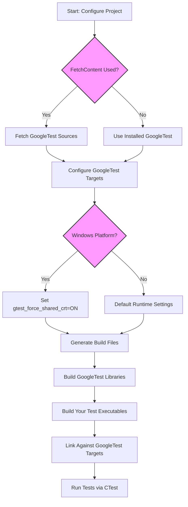

# Build System Integration with GoogleTest and GoogleMock

This documentation details how to integrate GoogleTest and GoogleMock with build systems, specifically focusing on CMake and Bazel. It covers public configuration APIs, package setup, environment-based options, and provides practical guidance for embedding GoogleTest/GoogleMock seamlessly into your C++ projects.

---

## 1. Overview

GoogleTest and GoogleMock provide flexible integration options for modern C++ projects using popular build systems. This page guides you through setup strategies, configuration options, and best practices to ensure your testing framework builds and runs correctly alongside your code. Whether building GoogleTest as a standalone project or incorporating it into an existing build, the provided CMake targets and Bazel BUILD rules are designed to maximize compatibility and simplicity.

---

## 2. Integration with CMake

### 2.1. Standalone or Subproject Build

You can build GoogleTest either as a standalone CMake project or embed it into your project via `add_subdirectory()`. The repository provides clear CMake scripts to generate native build files across platforms.

#### Typical Standalone Setup
1. Clone the repository at a specific release tag or branch:

```bash
 git clone https://github.com/google/googletest.git -b v1.17.0
 cd googletest
 mkdir build
 cd build
```

2. Generate build files (default builds both GoogleTest and GoogleMock):

```bash
 cmake ..
```

To build only GoogleTest (excluding GoogleMock):

```bash
 cmake .. -DBUILD_GMOCK=OFF
```

3. On Unix-like systems, build with:

```bash
 make
 sudo make install
```

4. On Windows, open the generated `gtest.sln` in Visual Studio and build.

5. On macOS with Xcode installed, open the generated `.xcodeproj`.

#### Embedding GoogleTest into Your Existing CMake Project
Instead of installing GoogleTest globally, integrate its source directly into your build to share the same compiler and linker settings, preventing mismatches (useful especially on Windows).

Example in your `CMakeLists.txt`:

```cmake
 include(FetchContent)
 FetchContent_Declare(
   googletest
   URL https://github.com/google/googletest/archive/5376968f6948923e2411081fd9372e71a59d8e77.zip
 )

 set(gtest_force_shared_crt ON CACHE BOOL "" FORCE) # Use dynamic runtime on Windows if needed
 FetchContent_MakeAvailable(googletest)

 add_executable(example example.cpp)
 target_link_libraries(example gtest_main)
 add_test(NAME example_test COMMAND example)
```

> Note: This requires CMake 3.14+ due to the use of `FetchContent_MakeAvailable()`.

### 2.2. Build Options and Variables

| Option                   | Description                                                                                       | Default |
|--------------------------|-------------------------------------------------------------------------------------------------|---------|
| `BUILD_GMOCK`            | Build the GoogleMock subproject along with GoogleTest.                                           | ON      |
| `INSTALL_GTEST`          | Enables installation of GoogleTest libraries and headers.                                        | ON      |
| `gtest_force_shared_crt` | On Windows, forces GoogleTest to use dynamic CRT to match the main project and avoid linker errors.| OFF    |
| `gtest_build_tests`      | Build GoogleTest's own tests (mostly for internal validation).                                   | OFF     |
| `gtest_build_samples`    | Build sample programs demonstrating GoogleTest usage.                                           | OFF     |
| `gtest_disable_pthreads` | Disable use of pthreads in GoogleTest (useful if pthreads are unavailable).                      | OFF     |
| `gtest_hide_internal_symbols` | Hide internal symbols in shared libraries (for cleaner symbol exports).                      | OFF     |

### 2.3. Important Compiler and Linker Configuration

GoogleTest's CMake scripts automatically:

- Detect and configure pthread usage if available and enabled.
- Adjust compiler flags for strict warnings and consistent environment.
- Handle static vs dynamic runtime linkage (especially MSVC's `/MD` vs `/MT` options).

You can customize options by overriding these variables or by modifying your cache on configure.

### 2.4. Available Targets

- `gtest`: The core GoogleTest library.
- `gtest_main`: Provides a main() function you can link against to get test executable with default entry point.
- `gmock`: The GoogleMock library, usually requires `gtest`.
- `gmock_main`: GoogleMock plus a main() function.

Link these targets as needed in your test executables.

### 2.5. Packaging and Installation

When `INSTALL_GTEST` is ON, running `make install` or corresponding command installs:

- Headers at `${CMAKE_INSTALL_INCLUDEDIR}` (e.g., `/usr/local/include`)
- Static or shared libraries at `${CMAKE_INSTALL_LIBDIR}` (e.g., `/usr/local/lib`)
- pkg-config files for easier integration

This allows other projects to use `find_package(GTest CONFIG REQUIRED)` to locate GoogleTest.

---

## 3. Integration with Bazel

### 3.1. Setup in Bazel Workspace

Add the GoogleTest dependency in your `MODULE.bazel` or `WORKSPACE` file using Bazel Central Registry or a fixed repository link for versioning.

### 3.2. BUILD Rules

GoogleTest provides Bazel BUILD files defining libraries and tests:

- `gtest`: Core test library.
- `gtest_main`: Library providing a main function.

You can depend on these targets from your Bazel test binaries.

Example test target in Bazel:

```bazel
cc_test(
    name = "my_test",
    srcs = ["my_test.cc"],
    deps = ["@com_google_googletest//:gtest_main"],
)
```

### 3.3. Platform and Compiler Differences

The Bazel rules handle platform-specific flags and dependencies automatically, including linking pthreads on Linux, special handling for QNX, Windows, and FreeBSD.

Customization hints:

- Use Bazel `select()` statements to manage platform-specific compile and link flags.
- The Bazel rules set defines such as `GTEST_HAS_ABSL=1` when dependencies are available.

---

## 4. Environment and Compiler Considerations

### 4.1. C++ Standard Version

GoogleTest requires at least C++17 support. Ensure your project sets the C++ standard accordingly, either globally or specifically for GoogleTest targets.

In CMake:

```cmake
 set(CMAKE_CXX_STANDARD 17)
 set(CMAKE_CXX_STANDARD_REQUIRED ON)
```

### 4.2. Multithreading Support

GoogleTest detects pthread availability automatically where supported, but you can override detection manually:

- Define `GTEST_HAS_PTHREAD=1` or `GTEST_HAS_PTHREAD=0` as a compiler define if detection is inaccurate.

CMake macros embed these flags automatically based on platform and options.

### 4.3. Shared Libraries (DLL) Support

To build GoogleTest as a shared library:

- Define `-DGTEST_CREATE_SHARED_LIBRARY=1` during compilation.
- Link test executables with `-DGTEST_LINKED_AS_SHARED_LIBRARY=1`.

The CMake option `BUILD_SHARED_LIBS` controls shared/static linkage globally.

### 4.4. Visual Studio Runtime Mismatch Handling

By default, Visual Studio projects use dynamic CRT while GoogleTest uses static CRT — leading to LNK2038 errors. Fix it by enabling `gtest_force_shared_crt` option in CMake:

```cmake
 set(gtest_force_shared_crt ON CACHE BOOL "" FORCE)
```

---

## 5. Package Configuration Files

GoogleTest and GoogleMock provide pkg-config-compatible files generated during install:

- `gtest.pc`
- `gtest_main.pc`
- `gmock.pc`
- `gmock_main.pc`

These files include compiler flags and libraries needed to build against GoogleTest and GoogleMock easily.

Example excerpt from `gtest_main.pc`:

```
Name: gtest_main
Description: GoogleTest (with main() function)
Version: 1.xx.xx
URL: https://github.com/google/googletest
Requires: gtest = 1.xx.xx
Libs: -L${libdir} -lgtest_main @CMAKE_THREAD_LIBS_INIT@
Cflags: -I${includedir} @GTEST_HAS_PTHREAD_MACRO@
```

---

## 6. Troubleshooting & Best Practices

- **Missing main symbol on linking?** Link with `gtest_main` or `gmock_main`.
- **Runtime library mismatch error on Windows?** Enable `gtest_force_shared_crt` option.
- **Build errors related to pthreads?** Verify thread support and set `gtest_disable_pthreads` or define `GTEST_HAS_PTHREAD` manually.
- **Version mismatches?** Keep your GoogleTest submodule or vendor copy updated regularly.
- **Using GoogleTest and GoogleMock together?** Build with `BUILD_GMOCK=ON`, and link tests against `gmock_main` for mock support with main function included.

---

## 7. Recommended CMake Integration Flow

<Steps>
<Step title="Add FetchContent for GoogleTest">
Include `FetchContent` and declare GoogleTest dependency in your project's `CMakeLists.txt`.
</Step>
<Step title="Set Windows-specific Options">
Enable `gtest_force_shared_crt` on Windows to avoid runtime conflicts.
</Step>
<Step title="Fetch and Make Available">
Call `FetchContent_MakeAvailable(googletest)` to download and configure.
</Step>
<Step title="Link Test Targets">
Link your test executables against `gtest_main` or `gmock_main` for convenience.
</Step>
<Step title="Add Tests to CTest">
Register your tests with CTest using `add_test` to enable test execution via CMake.
</Step>
</Steps>

---

## 8. Additional Resources

- [GoogleTest GitHub Repository](https://github.com/google/googletest)
- [GoogleMock Documentation](https://github.com/google/googletest/tree/main/googlemock)
- [CMake Documentation](https://cmake.org/documentation/)
- [Bazel Build Encyclopedia](https://docs.bazel.build/versions/master/be/overview.html)

---

## Mermaid Diagram: CMake Build Workflow




---

## Example Basic CMakeLists.txt Embedding GoogleTest

```cmake
cmake_minimum_required(VERSION 3.14)
project(MyProject CXX)

# Require C++17
set(CMAKE_CXX_STANDARD 17)
set(CMAKE_CXX_STANDARD_REQUIRED ON)

# Include FetchContent module
include(FetchContent)

FetchContent_Declare(
  googletest
  URL https://github.com/google/googletest/archive/release-1.17.0.zip
)

# Force shared CRT on Windows to avoid MSVC runtime conflicts
set(gtest_force_shared_crt ON CACHE BOOL "" FORCE)

# Fetch and configure GoogleTest
FetchContent_MakeAvailable(googletest)

# Your test executable
add_executable(my_tests test_main.cpp test_example.cpp)

# Link against gtest_main
target_link_libraries(my_tests gtest_main)

# Register test with CTest
add_test(NAME MyTests COMMAND my_tests)
```

---

## Glossary

- **gtest**: GoogleTest core testing library.
- **gtest_main**: gtest plus a main() function for a quick test binary.
- **gmock**: GoogleMock's mocking library.
- **gmock_main**: gmock plus a main() function.
- **FetchContent**: CMake module to fetch external content at configure time.

---

This page empowers you to configure and integrate GoogleTest and GoogleMock efficiently using modern build systems, unlocking your C++ projects’ testing potential.
