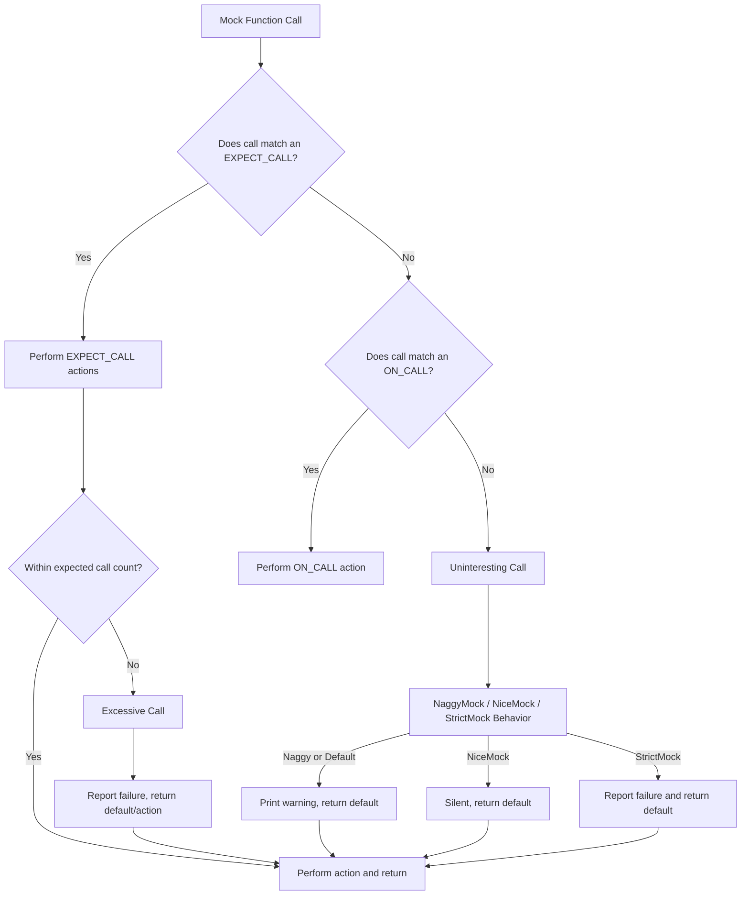

# Error Handling & Status Codes

GoogleTest and GoogleMock provide comprehensive diagnostics and error messages that guide you through the lifecycle of test execution and mocking. This documentation details the various error conditions, warnings, failures, and internal status codes you may encounter while using the APIs, alongside practical troubleshooting tips to help you resolve them quickly.

---

## Overview of Error Handling

At its core, GoogleTest and GoogleMock are designed to provide immediate, informative feedback when tests or mock expectations fail or behave unexpectedly. They classify events broadly into:

- **Uninteresting calls**: Calls to mock methods without expectations, triggering warnings or failures depending on mock strictness.
- **Unexpected calls**: Calls on mocks with expectations but with arguments that don't match any expectation, always treated as errors.
- **Excessive calls**: Calls that exceed the expected number, also treated as errors.
- **Verification failures**: When expectations on mocks are not met by the end of test execution.

### Severity Levels

GoogleMock supports configurable verbosity levels influencing the amount and detail of diagnostic output:

| Verbosity Level | Behavior                                        |
|-----------------|------------------------------------------------|
| `info`          | Logs info, warnings, and errors with stack traces. Ideal during debugging.
| `warning`       | Logs warnings and errors, suppresses stack traces in warnings. Default setting.
| `error`         | Logs **only** errors, no warnings or info messages.

Set the verbosity via the `--gmock_verbose=<level>` command-line flag or programmatically.

---

## Common Error and Warning Messages

### 1. Uninteresting Mock Function Calls

When a mock method is called without any corresponding `EXPECT_CALL`, GoogleMock treats this as an *uninteresting call*.

- **Default mock behavior**: Prints a warning message with details and stack trace (unless suppressed).
- **With `NiceMock` wrappers**: Suppresses warnings.
- **With `NaggyMock` wrappers or default mock**: Prints warnings.
- **With `StrictMock` wrappers**: Treats as test failures.

**Example warning message:**

```
GMOCK WARNING:
Uninteresting mock function call - returning default value.
    Function call: Foo(42)
          Returns: 0
Stack trace:
... (stack frames follow)
```

**Tip:** If you want to silence such warnings for specific calls, use `EXPECT_CALL(...).Times(AnyNumber())` to explicitly allow them.

### 2. Unexpected Mock Function Calls

These occur when a method has expectations, but the call arguments do not match any declared expectation.

- Always treated as errors (non-fatal failures).
- GoogleMock prints detailed diagnostics showing arguments, expected matches, and call counts.

**Example failure message excerpts:**

```
Unexpected mock function call - returning default value.
    Function call: Bar(5)
          Returns: 0
Google Mock tried the following 1 expectation, but it didn't match:
  Expected arg #0: is equal to 3
           Actual: 5
         Expected: to be called once
           Actual: called once - saturated and active
```

**Tip:** Run tests with `--gmock_verbose=info` to get a full trace of expectations and function calls which can clarify mismatches.

### 3. Excessive Calls

Calls exceeding the expected number (e.g., calling a mock method more times than `Times(n)`) trigger errors.

- The call still executes, returning default or configured actions.
- Diagnostic output includes detailed usage stats and call counts.

**Example:**

```
Mock function "Baz" called more times than expected - returning directly.
    Function call: Baz(7)
         Expected: to be called twice
           Actual: called 3 times - over-saturated and active
```

### 4. Unsatisfied Expectations

At the end of a test (or when explicitly invoked), GoogleMock verifies that all `EXPECT_CALL` statements were satisfied.

- Failures occur if expected calls did not happen or were insufficient.
- Messages provide expected and actual call counts.

**Example:**

```
Actual function "DoSomething" call count doesn't match EXPECT_CALL(MyMock, DoSomething)...
         Expected: to be called at least twice
           Actual: called once - unsatisfied and active
```

---

## Diagnostic Messages and Their Interpretation

GoogleMock produces diagnostic messages that include:

- **Function call descriptions** with argument values.
- **Return values** for non-void mock functions.
- **Expected vs actual call counts and parameter matching results.**
- **Sequences and prerequisites information** when calls violate ordering constraints.
- **Retirement status** when expectations are no longer active.

### Messages for Void vs Non-Void Functions

- For **void-returning functions**, messages note "returning directly" as there is no return value.
- For **functions returning values**, messages also print the returned value for context.

### Handling of Retired Expectations

Expectations marked with `.RetiresOnSaturation()` become inactive once saturated. Calling methods matching retired expectations triggers warnings/errors noting the retirement state, helping locate mismatches due to ordering or cardinality.

### Unsatisfied Prerequisites

GoogleMock reports when a call can't happen because prerequisite expectations in a sequence are not yet satisfied, aiding debugging of complex order constraints.

---

## Managing Mock Object Lifecycle and Verification

GoogleMock automatically verifies expectations when mock objects are destructed. However, you can manually verify and clear expectations:

```cpp
// Returns true if verification succeeded
bool success = ::testing::Mock::VerifyAndClearExpectations(&mock_object);

// Verifies and clears expectations and default actions
bool success_all = ::testing::Mock::VerifyAndClear(&mock_object);
```

**Tip:** Use `VerifyAndClearExpectations` to force verification early, especially when ownership or lifetime of mocks is unclear.

Use caution: do not set new expectations after verifying and clearing a mock, as this leads to undefined behavior.

---

## Controlling Mock Strictness

GoogleMock provides three wrapper types to control diagnostic behavior for uninteresting calls:

| Wrapper Type  | Behavior on Uninteresting Calls                                         |
|---------------|-----------------------------------------------------------------------|
| `NiceMock<T>` | Suppresses warnings; calls proceed silently.                          |
| `NaggyMock<T>`| Default; warnings printed on uninteresting calls.                     |
| `StrictMock<T>`| Treats uninteresting calls as test failures (errors).                |

Usage example:

```cpp
using ::testing::NiceMock;

NiceMock<MockFoo> nice_mock;
EXPECT_CALL(nice_mock, DoThis());
nice_mock.DoThis();  // Allowed
// Other uninteresting calls produce no warnings.
```

**Caveats:**

- Only works for mock methods declared directly in the mock class.
- May behave unexpectedly if destructor is not virtual.

---

## Default Actions and ON_CALL Behavior

By default, gMock methods with a return type provide a built-in default action:

- For pointers and primitive types, returns zero/null.
- For container or class types with default constructors, returns default-constructed object.

You can override default behavior using `ON_CALL()`:

```cpp
ON_CALL(mock_object, Method(_))
    .WillByDefault(Return(custom_value));
```

This does not set expectations but specifies actions taken on matching calls without explicit expectations.

**Note:** Even with `ON_CALL`, if you do not expect a call with `EXPECT_CALL`, an unexpected call warning or error can be triggered.

---

## Troubleshooting Tips

### Investigating Unmet Expectations

- Run tests with `--gmock_verbose=info` to get detailed call and expectation trace.
- Confirm that argument matchers and sequences are correctly specified.

### Dealing with Unexpected Calls

- Use wildcard matchers (`_`) for catch-all expectations.
- Use `Times(AnyNumber())` to allow calls freely.

### Suppressing Unwanted Warnings

- Wrap mocks with `NiceMock` to suppress uninteresting call warnings.
- Use explicit expectations with wide cardinalities to accept calls.

### Handling Non-Default-Constructible Return Types

- Must provide explicit return actions, as gMock cannot default-construct such objects.
- Otherwise, expect runtime exceptions or death test failures.

### Mock Object Leak Detection

- Enabled by default.
- Use `Mock::AllowLeak(&mock_obj);` to suppress erroneous leak reports for intentional leaks.

---

## Code Examples

### Example: Handling Uninteresting Calls

```cpp
using ::testing::NiceMock;
using ::testing::_;

class MockFoo {
 public:
  MOCK_METHOD(void, DoThis, ());
};

TEST(ExampleTest, NiceMockAllowsUninterestingCalls) {
  NiceMock<MockFoo> nice_mock;
  EXPECT_CALL(nice_mock, DoThis());

  nice_mock.DoThis();   // Expected call.
  nice_mock.DoThis();   // Uninteresting call, no warning.
}
```

### Example: Unexpected Call Failure

```cpp
using ::testing::Return;
using ::testing::_;

class MockBar {
 public:
  MOCK_METHOD(int, Compute, (int x), ());
};

TEST(UnexpectedCallTest, UnexpectedCallProducesError) {
  MockBar bar;
  EXPECT_CALL(bar, Compute(5)).WillOnce(Return(10));

  bar.Compute(5);    // Ok.

  // Unexpected call; argument doesn't match expectation.
  EXPECT_NONFATAL_FAILURE(bar.Compute(3), "Unexpected mock function call");
}
```

### Example: Using StrictMock

```cpp
using ::testing::StrictMock;

StrictMock<MockFoo> strict_mock;
EXPECT_CALL(strict_mock, DoThis());

strict_mock.DoThis();    // Allowed.
strict_mock.AnotherCall();  // Fails test: unexpected uninteresting call.
```

---

## Summary Diagram: Mock Call Handling Flow



---

## Additional Resources

- [gMock Mock Object Basics](./mock-object-basics) – Defining and using mocks.
- [Expectations & Call Ordering](./expectations) – Setting expectations, sequences, and order controls.
- [Matchers Reference](./matchers) – Argument matching details.
- [Actions Reference](./actions) – Specifying mock method behaviors.
- [gMock Cheat Sheet](./gmock_cheat_sheet) – Quick reference for mock usage.
- [Troubleshooting Installation & Build Problems](../../getting-started/support-and-troubleshooting/troubleshooting-setup) – Solving common setup issues.

---

## Summary

Effective error handling and clear diagnostics are vital for maintaining test reliability and smooth mocking integration. Understanding how GoogleTest and GoogleMock detect, signal, and explain failures — from uninteresting calls to expectation violations — empowers you to write robust tests and resolve issues faster. Using provided wrappers for mock strictness, default action customization, and explicit verification allows tight control over test validation and messaging.

---