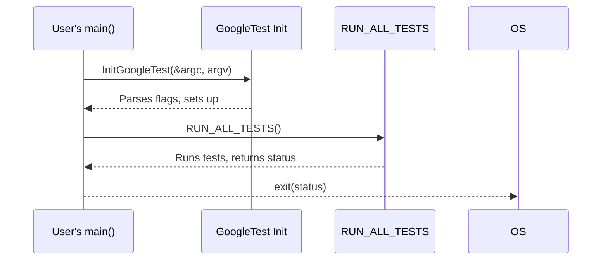

# Test Runner Entry and Initialization

GoogleTest provides well-defined entry points and initialization procedures designed to bootstrap and launch test execution across multiple platforms. This page explains the main entry points for GoogleTest and GoogleMock executables, focusing on the `gtest_main` and `gmock_main` libraries that provide default `main()` implementations. It also covers essential initialization and setup steps users must perform to ensure their tests run smoothly.

---

## Overview

When you build a test executable with GoogleTest or GoogleMock, the typical flow begins at a main entry point that initializes the testing framework and runs all tests. To streamline this process, GoogleTest offers two primary helper libraries:

- `gtest_main`: provides a default `main()` function for standard GoogleTest-only tests.
- `gmock_main`: provides a default `main()` function for tests utilizing GoogleMock alongside GoogleTest.

These libraries remove the need to write boilerplate main functions and handle the initial setup required to parse command-line flags and prepare the testing environment.

## Main Entry Points Provided by GoogleTest

### gtest_main

The `gtest_main` library contains a standard `main()` function with the following responsibilities:

1. **Initialization:** Calls `testing::InitGoogleTest()` which parses test-related command-line flags and configures the test environment accordingly.
2. **Test Execution:** Invokes `RUN_ALL_TESTS()`, which discovers all registered tests and runs them.
3. **Result Reporting:** Returns `0` if all tests succeed; returns `1` if any test fails.

This provides a single, simple entry point to execute all your tests with no extra user code required.

**Typical usage example:**

```cpp
#include <gtest/gtest.h>

int main(int argc, char** argv) {
  testing::InitGoogleTest(&argc, argv);
  return RUN_ALL_TESTS();
}
```

Users can avoid writing the above by linking with `gtest_main`.

### gmock_main

For tests that use GoogleMock, the `gmock_main` library provides a custom `main()` function. It performs all the initialization done by `gtest_main` plus GoogleMock's setup, specifically:

- Calls `testing::InitGoogleMock()`, which internally invokes `InitGoogleTest()`.
- Executes all tests via `RUN_ALL_TESTS()`.

This abstracts away the complexity from the user and ensures correct initialization of the combined testing and mocking framework.

**Typical usage example:**

You link your test executable with `gmock_main` instead of `gtest_main`, and no user-written `main()` is necessary.

From the library perspective, `gmock_main.pc.in` defines metadata:

```
Name: gmock_main
Description: GoogleMock (with main() function)
Version: @PROJECT_VERSION@
URL: https://github.com/google/googletest
Requires: gmock = @PROJECT_VERSION@
Libs: -L${libdir} -lgmock_main @CMAKE_THREAD_LIBS_INIT@
Cflags: -I${includedir} @GTEST_HAS_PTHREAD_MACRO@
```

## Platform-Specific Entrypoints

GoogleTest supports a variety of platforms, including desktop OSes (Linux, Windows, macOS), embedded systems, and Arduino-like platforms. The entry point setup varies accordingly:

- **Standard platforms:** The entry point is the normal `main(int argc, char** argv)`. It calls `testing::InitGoogleTest()` or `testing::InitGoogleMock()` followed by `RUN_ALL_TESTS()`.

- **Arduino and embedded systems (ESP8266, ESP32, NRF52):**
  - Program entry points are managed by the platform via `setup()` and `loop()` functions.
  - `setup()` calls `InitGoogleTest()` or `InitGoogleMock()`.
  - `loop()` repeatedly calls `RUN_ALL_TESTS()`.

- **QuRT:** Supports a parameterless main for test initialization and execution.

### Example snippet for embedded platforms (from `gmock_main.cc`):

```cpp
void setup() {
  testing::InitGoogleMock();
}
void loop() {
  RUN_ALL_TESTS();
}
```

## Initializing GoogleTest and GoogleMock

Before running any tests, the framework must be initialized to correctly parse test runner flags and configure internal state.

- Use `testing::InitGoogleTest(int* argc, char** argv)` for GoogleTest-only projects.
- Use `testing::InitGoogleMock(int* argc, char** argv)` for GoogleMock-enabled projects (calls the above internally).

Both parse command-line arguments recognized by GoogleTest/GoogleMock, removing them from `argv` and decrementing `argc`.

### Notes:

- The `InitGoogleTest()` call must precede any other GoogleTest calls.
- On Windows, a wide-character overload `InitGoogleTest(int* argc, wchar_t** argv)` is provided.
- For platforms lacking command line arguments, there's an argument-less version.

### Example in user-written `main`:

```cpp
int main(int argc, char** argv) {
  testing::InitGoogleMock(&argc, argv); // Initializes both GoogleTest and GoogleMock
  return RUN_ALL_TESTS();
}
```

Even if you link with `gmock_main`, this is handled internally.

## Building Your Tests with gtest_main or gmock_main

To avoid writing a `main()` function manually, you can link your test executables with `gtest_main` or `gmock_main` libraries:

- **gtest_main:** suitable if you only need GoogleTest.
- **gmock_main:** includes GoogleMock support and initializes GoogleTest accordingly.

This accelerates writing and running tests since the default `main()` is correctly set up for you.

**Tip:** When compiling and linking with CMake, ensure you link to the appropriate targets:

```cmake
add_executable(my_test my_test.cc)
target_link_libraries(my_test gmock_main)  # If using GoogleMock
# or
target_link_libraries(my_test gtest_main)  # If using only GoogleTest
```

## Custom Main Function

You can write your own `main()` to perform custom setup or initialization, but it must:

1. Call either `testing::InitGoogleTest()` or `testing::InitGoogleMock()` before running tests.
2. Call `RUN_ALL_TESTS()` to discover and execute all tests.
3. Return the result of `RUN_ALL_TESTS()` for proper error reporting.

Here's a minimal custom main example:

```cpp
int main(int argc, char** argv) {
  testing::InitGoogleTest(&argc, argv);

  // Custom code here

  return RUN_ALL_TESTS();
}
```

## Summary of Initialization Flow



When linking with `gtest_main` or `gmock_main`, UserMain is provided internally.

## Troubleshooting Common Entry and Initialization Issues

- **Missing main linker error:** This usually means you are not linking with `gtest_main` or `gmock_main` and have not provided your own `main()`.
  - Solution: Link with one of those libraries or write your own main that calls `InitGoogleTest()` and `RUN_ALL_TESTS()`.

- **Tests not running:** Ensure `InitGoogleTest()` is called before `RUN_ALL_TESTS()`.

- **Flags not recognized:** Make sure the flags come through `argc` and `argv` and that `InitGoogleTest()` is called with them.

- **Multiple main functions defined:** Check that you do not link both `gtest_main` and `gmock_main` or provide your own `main()`.

## Additional Resources

- [GoogleTest User's Guide](primer.md) covers writing tests and running them with the default main.
- [Testing Reference](testing.md) for more details on test macros, fixture usage, and execution.
- [Advanced GoogleTest Topics](advanced.md) for customized test initialization and advanced usage patterns.

---

For full control over test execution, writing your own main is supported, but linking with `gtest_main` or `gmock_main` is the recommended way to get started quickly.

By understanding these entry points and initialization steps, you'll master bootstrapping robust and portable test executables across diverse environments.
