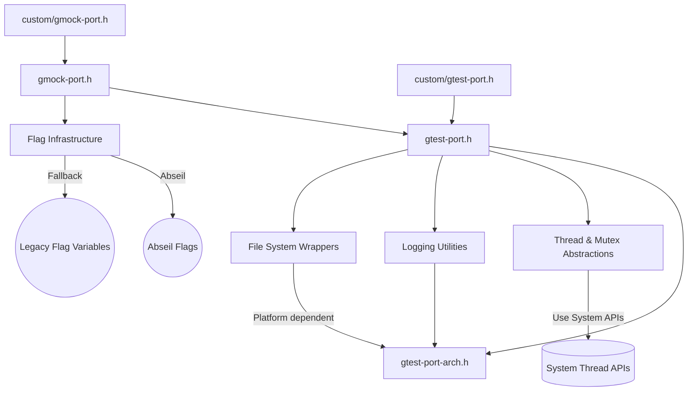

# Platform and Portability APIs

GoogleTest and GoogleMock are designed to work seamlessly across a wide variety of compilers, platforms, and runtime environments. This page documents the utility macros, platform detection routines, and porting support APIs that enable this portability. It also outlines integration touchpoints for adapting GoogleTest and GoogleMock to custom platforms and toolchains, ensuring consistent behavior and integration across environments.

---

## 1. Purpose and Scope

This documentation focuses exclusively on the platform and portability layers that underlie GoogleTest and GoogleMock. It covers:

- Utility macros for environment detection and feature toggling
- Platform accommodation routines
- Porting infrastructure to assist with adapting GoogleTest/GoogleMock to new or custom toolchains
- Interfaces for user-supplied configurations and overrides

> **Note:** This page does not cover test writing, mock definitions, or core API usage, but rather the foundational platform integration that makes these features uniformly available.

---

## 2. Environment and Platform Detection

### 2.1 Platform Macros

GoogleTest and GoogleMock define a comprehensive set of macros indicating the target platform, such as `GTEST_OS_LINUX`, `GTEST_OS_WINDOWS`, `GTEST_OS_MAC`, and many others including detailed variants (e.g., `GTEST_OS_WINDOWS_DESKTOP`). These macros are central to adapting behavior based on the compilation environment.

> These macros are automatically detected during compilation and always evaluate to either 1 when true or are undefined otherwise.

### 2.2 Feature Detection Macros

- **Exception support:** `GTEST_HAS_EXCEPTIONS` detects whether exception handling is enabled in the compilation environment.
- **Thread support:** `GTEST_HAS_PTHREAD` determines if pthreads is available, impacting thread-safety features.
- **RTTI enablement:** `GTEST_HAS_RTTI` indicates runtime type information availability.
- **Stream redirection:** `GTEST_HAS_STREAM_REDIRECTION` indicates whether standard output/error capturing is supported.

These macros help GoogleTest decide which internal implementations and optimizations it can safely use.

---

## 3. Portability Layers and Utilities

At the core of platform adaptation are several foundational headers that provide low-level type definitions, utility functions, and macro controls.

### 3.1 `gtest-port.h`

This is the primary portability header for GoogleTest that:

- Defines environment detection macros
- Encapsulates system dependencies like file operations, threading primitives, synchronization constructs, and logging helpers
- Provides wrappers for platform-specific system calls (`posix::Stat`, `posix::ChDir`, etc.)
- Implements thread-local storage mechanisms and mutexes adapted for each platform

### 3.2 `gmock-port.h`

GoogleMock extends portability support in this header, which:

- Includes `gtest-port.h` to leverage its core utilities
- Adds GoogleMock-specific compatibility checks including minimum compiler versions (e.g., MSVC 2015+ requirement)
- Defines flag macros and command-line flag infrastructure for GoogleMock, including Abseil flags integration when available

### 3.3 Customization Injection Points

Both GoogleTest and GoogleMock include a `custom` directory intended for user-defined platform overrides or extensions. For example, user code can define macros such as:

- `GTEST_CUSTOM_TEMPDIR_FUNCTION_` to override the temporary directory path
- `GTEST_OS_STACK_TRACE_GETTER_` to customize stack trace fetching
- Various flag-related macros in GoogleMock’s `gmock-port.h`

This flexible design allows blending GoogleTest and GoogleMock into specialized or embedded environments.

---

## 4. Flag Management and Integration

GoogleMock provides macros for declaring, defining, getting, and setting command-line flags that control runtime behavior.

#### Example Flag Macros (from `gmock-port.h`):

```cpp
#define GMOCK_DEFINE_bool_(name, default_val, doc) /* define a bool flag */
#define GMOCK_DECLARE_bool_(name)                   /* declare a bool flag */
#define GMOCK_FLAG_GET(name)                        /* retrieve flag value */
#define GMOCK_FLAG_SET(name, value)                 /* set flag value */
```

When compiled with Abseil (`GTEST_HAS_ABSL`), these macros hook into Abseil’s flag system for consistency and enhanced functionality. If Abseil is not used, a fallback implementation declares and defines variables with appropriate linkage.

---

## 5. Thread Safety and Synchronization

GoogleTest and GoogleMock detect the availability of threading primitives within the environment and adjust themselves accordingly.

- When threading is supported (via pthreads, Windows primitives, etc.), full implementations of `Mutex`, `MutexLock`, and `ThreadLocal` are enabled to provide proper synchronization.
- In single-threaded or unsupported environments, dummy implementations disable all locking and thread-local storage, allowing GoogleTest to compile but sacrificing thread safety.

Users can check for `GTEST_IS_THREADSAFE` to determine if thread-safe execution is enabled.

---

## 6. File System and Environment Utilities

- The portability layer abstracts file system operations for cross-platform compatibility.
- Functions like `posix::Stat`, `posix::RmDir`, and `posix::IsDir` provide platform-adapted implementations.
- Environment variable retrieval is encapsulated with fallbacks for embedded platforms lacking environment support.
- Platform-specific path separators (`/` vs `\`) are handled via macros such as `GTEST_PATH_SEP_`.

---

## 7. Integration and Extensibility Considerations

### 7.1 Adapting to New Platforms or Toolchains

Developers porting GoogleTest/GoogleMock to new or custom platforms should:

- Use and extend the macros in `gtest-port-arch.h` that identify the platform.
- Augment or override `gtest-port.h` and `gmock-port.h` via the `custom` directory to define platform- or compiler-specific behavior.
- Ensure threading primitives and synchronization utilities are functional or suitably stubbed.
- Provide implementations for required system calls and environment hooks.

### 7.2 Flag and Logging Overriding

Custom platform configurations can redefine logging mechanisms, threading support macros, or command-line flag interaction to conform with host environment constraints.

---

## 8. Practical Example: Customizing a Flag

Suppose you want to add a new GoogleMock bool flag to enable verbose logging. You would:

```cpp
// In your custom gmock-port.h or directly in user code before linking.
GMOCK_DEFINE_bool_(verbose_logging, false, "Enables verbose logging.");

// Accessing the flag value
if (GMOCK_FLAG_GET(verbose_logging)) {
  // Enable detailed logs
}

// Setting the flag at runtime
GMOCK_FLAG_SET(verbose_logging, true);
```

When using Abseil, this flag integrates smoothly with the command-line flag parser.

---

## 9. Troubleshooting Common Porting Issues

- **Flags not recognized:** Ensure macro prefixes match and flags are declared before use.
- **Threading crashes on unsupported platforms:** Confirm `GTEST_HAS_PTHREAD` (or equivalent) is set correctly; disable threading if necessary.
- **Missing system calls:** Stub or implement required file and environment functions.
- **Compilation errors due to macros:** Verify custom platform macro definitions do not conflict with GoogleTest defaults.

Refer to the `custom` directory and platform-specific headers for example adaptations.

---

## 10. Diagram: Platform and Portability API Relationships



---

## 11. References and Further Reading

- [GoogleTest Portability Header (`gtest-port.h`)](https://github.com/google/googletest/blob/main/googletest/include/gtest/internal/gtest-port.h)
- [GoogleMock Portability Header (`gmock-port.h`)](https://github.com/google/googletest/blob/main/googlemock/include/gmock/internal/gmock-port.h)
- [Platform Detection and Architecture (`gtest-port-arch.h`)](https://github.com/google/googletest/blob/main/googletest/include/gtest/internal/gtest-port-arch.h)
- [Customization Points Directory](https://github.com/google/googletest/tree/main/googletest/include/gtest/internal/custom)
- [Abseil Flags](https://abseil.io/docs/cpp/guides/flags)

---

## 12. Summary

By understanding and leveraging the Platform and Portability APIs, you ensure that your GoogleTest and GoogleMock usage is robust and compatible across diverse compilation and runtime environments. Customization through designated injection points allows seamless adaptation to unique platforms or constraints without impacting core framework functionality.

---

