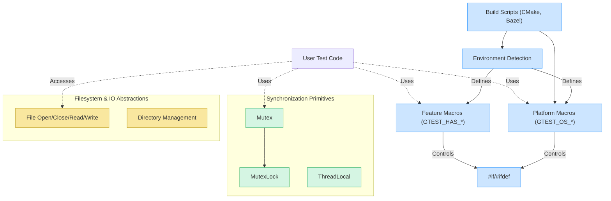

# Platform & Portability API

GoogleTest provides a comprehensive platform and portability layer designed to abstract system-dependent details, enabling seamless, consistent cross-platform test execution. This API documents the platform abstractions and configuration macros that empower you to integrate GoogleTest with various operating systems, toolchains, and runtime environments reliably.

---

## Introduction

Testing across multiple platforms introduces challenges such as differing OS behaviors, threading models, filesystem capabilities, and compiler features. The Platform & Portability API in GoogleTest addresses these by defining environment-describing macros, platform-indicating macros, feature detection, synchronization primitives, and configuration points. This mechanism ensures that your tests and the framework itself behave correctly and efficiently on supported platforms without requiring platform-specific code changes.

## Key Objectives of the Portability API

- **Uniform Environment Description:** Automatically detect and expose the environment properties to let tests adapt conditionally.
- **Thread Safety and Synchronization:** Provide abstractions for mutexes, thread-local storage, and threading utilities across diverse threading models.
- **Filesystem and IO Abstractions:** Enable portable handling of files, directories, and streams.
- **Compiler and Feature Detection:** Detect support for exceptions, RTTI, regular expressions, and C++ language features.
- **Custom Configuration Points:** Allow overrides to customize platform-specific behavior via macros.

## Environment-Describing Macros

These macros enable GoogleTest to identify critical environment features. They are automatically defined but can be overridden if auto-detection is incorrect for your platform.

| Macro                          | Meaning                                                                      |
|-------------------------------|------------------------------------------------------------------------------|
| `GTEST_HAS_EXCEPTIONS`         | Whether C++ exceptions are enabled.                                          |
| `GTEST_HAS_PTHREAD`            | Availability of POSIX pthread library.                                       |
| `GTEST_HAS_RTTI`               | Availability of RTTI (`typeid` and `dynamic_cast`).                          |
| `GTEST_HAS_STD_WSTRING`        | Availability of `std::wstring`.                                              |
| `GTEST_HAS_FILE_SYSTEM`        | Whether a file system is accessible.                                         |
| `GTEST_HAS_STREAM_REDIRECTION` | Support for redirecting stdout/stderr streams (required for death tests).    |
| `GTEST_HAS_DEATH_TEST`         | Support for testing crashing/death behavior in tests.                       |
| `GTEST_IS_THREADSAFE`          | Indicates GoogleTest is compiled with thread safety support enabled.         |

### Customizing Environment Macros

If your platform isn't detected correctly or requires special handling, you can define or override these macros at compile time. For example:

```shell
-DGTEST_HAS_PTHREAD=0
```

## Platform-Indicating Macros

GoogleTest automatically defines read-only macros identifying the target platform. They help conditionally compile platform-specific code or test features:

| Macro                  | Platform Description                   |
|-------------------------|-------------------------------------|
| `GTEST_OS_WINDOWS`      | Windows (including variants)          |
| `GTEST_OS_LINUX`        | Linux kernels                        |
| `GTEST_OS_MAC`          | Mac OS X                            |
| `GTEST_OS_IOS`          | iOS devices                        |
| `GTEST_OS_CYGWIN`       | Cygwin                              |
| `GTEST_OS_FREEBSD`      | FreeBSD                             |
| ...                     | (Full list includes Unix flavors)  |

Use these macros to enable platform-specific paths or workarounds in your tests or extensions.

## Feature-Detection Macros

GoogleTest detects support for language and library features, including:

- `GTEST_HAS_TYPED_TEST`, `GTEST_HAS_TYPED_TEST_P` for typed tests
- `GTEST_HAS_CLONE` whether Linux's `clone()` syscall is available (important for fork-based tests)
- `GTEST_USES_RE2`, `GTEST_USES_POSIX_RE` indicating regex implementation in use

This allows the framework and tests to adapt to the capabilities of the platform and toolchain.

## Synchronization Primitives for Thread Safety

GoogleTest provides portable implementations for synchronization constructs:

| Component       | Description                                  |
|-----------------|----------------------------------------------|
| `Mutex`         | A cross-platform mutex abstraction.          |
| `MutexLock`     | RAII style mutex locker/unlocker.            |
| `ThreadLocal<T>`| Thread-local storage template for any type T.|
| `Notification`  | A synchronization primitive to notify and wait across threads (internal usage). |

These are implemented using native threading mechanisms: Windows critical sections, POSIX pthread mutexes, or stub implementations if threading is not supported.

### Using Mutex and ThreadLocal

```cpp
// Create a static mutex
GTEST_DECLARE_STATIC_MUTEX_(g_mutex);
GTEST_DEFINE_STATIC_MUTEX_(g_mutex);

// Locking/unlocking mutex
{ 
  testing::internal::MutexLock lock(&g_mutex);
  // critical section
}

// Thread local example
static testing::internal::ThreadLocal<int> thread_local_counter(0);
void IncrementCounter() {
  thread_local_counter.set(thread_local_counter.get() + 1);
}
```

### Thread Safety Macro

Use the macro `GTEST_IS_THREADSAFE` to check if GoogleTest is compiled with threading support for adapting test code accordingly.

## Filesystem and IO Abstractions

GoogleTest wraps platform-specific file and directory functions into the `testing::internal::posix` namespace to provide:

- Opening, closing, reading, and writing files
- Checking file descriptors and paths
- Directory management

These wrappers normalize Windows and POSIX differences:

```cpp
// Open a file
FILE* file = testing::internal::posix::FOpen("path/to/file.txt", "r");

// Check if a file descriptor refers to terminal
bool is_tty = testing::internal::posix::IsATTY(fileno(stdin));
```

## Customization Points via Macros

GoogleTest also exposes several macros for you to customize its internals at compile time:

| Macro                            | Purpose/Behavior                                                      |
|---------------------------------|----------------------------------------------------------------------|
| `GTEST_API_`                    | Symbol visibility and export specifier for GoogleTest API symbols.
| `GTEST_LOG_(severity)`           | Logging macro that can be replaced with your own logging.
| `GTEST_CHECK_(condition)`       | Checks conditions and aborts on failure; customizable assertion point.
| `GTEST_HAS_PTHREAD`              | Force enabling or disabling pthread-based threading.
| `GTEST_DEFAULT_DEATH_TEST_STYLE` | Choose death test strategy, e.g., "fast" or "threadsafe".

Override these in your build system or config headers for special environments.

## Example: Conditionally Compiling Code Using Platform Macros

```cpp
#if GTEST_OS_WINDOWS
// Windows-specific code
#elif GTEST_OS_LINUX
// Linux-specific code
#else
// Fallback or unsupported platform
#endif
```

## Using GoogleTest in Multithreaded Environments

GoogleTest’s threading abstractions enable safe usage in multi-threaded test programs. To compile and use GoogleTest with pthreads on Linux or with native Windows threading, ensure that:

- You compile with pthread support (`-DGTEST_HAS_PTHREAD=1`) if needed.
- Your linker links pthread (`-pthread`) on POSIX.

Using GoogleTest in environments without threading will disable thread-safety features but still allow single-threaded tests.

## Integration with Build Systems

When adding GoogleTest to your project, platform portability and threading support are automatically handled by its build scripts (CMake, Bazel). For example, the [Bazel BUILD file](https://github.com/google/googletest/blob/main/BUILD.bazel) contains platform config_settings to manage dependencies and compile options per OS.

Example snippet showing OS-specific Bazel configs:

```bazel
config_setting(
    name = "windows",
    constraint_values = ["@platforms//os:windows"],
)

cc_library(
    name = "gtest",
    copts = select({
        ":windows": [],
        "//conditions:default": ["-pthread"],
    }),
    linkopts = select({
        ":windows": [],
        "//conditions:default": ["-pthread"],
    }),
    ...
)
```

## Practical Tips & Best Practices

- **Verify platform macros**: Use the defined `GTEST_OS_*` macros to write portable conditional code.
- **Thread safety**: Use `Mutex` and `ThreadLocal` classes from GoogleTest’s internal API to write thread-safe tests.
- **Tweak feature flags**: Override `GTEST_HAS_*` macros if auto-detection fails in your environment.
- **Avoid direct use**: The `internal` namespace components are primarily for GoogleTest native implementation. Use them judiciously for extending or integrating GoogleTest.
- **Keep macros consistency**: Avoid defining platform macros yourself unless necessary; rely on GoogleTest’s mechanism.

## Troubleshooting Common Portability Issues

<AccordionGroup title="Common Pitfalls & Fixes">
<Accordion title="Test fails to compile on a new platform">
Check if GoogleTest’s platform macros correctly detect the environment. Define or override compile flags like `-DGTEST_OS_<PLATFORM>=1` or disable features like pthreads with `-DGTEST_HAS_PTHREAD=0`.
</Accordion>
<Accordion title="Threading deadlocks or crashes">
Ensure you properly use `Mutex` and `MutexLock` to guard shared resources. Confirm your build uses the correct threading model and link options.
</Accordion>
<Accordion title="Death tests do not run correctly">
Confirm the platform supports stream redirection and death tests (`GTEST_HAS_DEATH_TEST==1`). Ensure file system access is enabled and death test style is compatible with your platform.
</Accordion>
</AccordionGroup>

---

## Overview Diagram of Platform & Portability Layer



---

## Related Configuration Macros

GoogleTest also offers customization points documented in internal customization headers, for users who want to provide custom implementations of particular functionality (`gtest/internal/custom/gtest-port.h`). Examples include:

- Custom stack trace collectors
- Override for temporary directory retrieval
- Customized logging macros

These are advanced customization points requiring a deep understanding of GoogleTest internals.

## References & Further Reading

- [Platform macros and configuration details](https://github.com/google/googletest/blob/main/googletest/include/gtest/internal/gtest-port.h)
- [Build system integration (CMake, Bazel)](https://github.com/google/googletest/blob/main/README.md)
- [Thread safety and synchronization primitives implementation](https://github.com/google/googletest/blob/main/googletest/include/gtest/internal/gtest-port.h)
- [Supported platforms and foundational C++ support policy](https://github.com/google/oss-policies-info/blob/main/foundational-cxx-support-matrix.md)

---

This Platform & Portability API documentation equips C++ developers and test framework integrators with the knowledge to write portable, thread-safe, and robust tests that reliably execute across diverse target systems and toolchains.