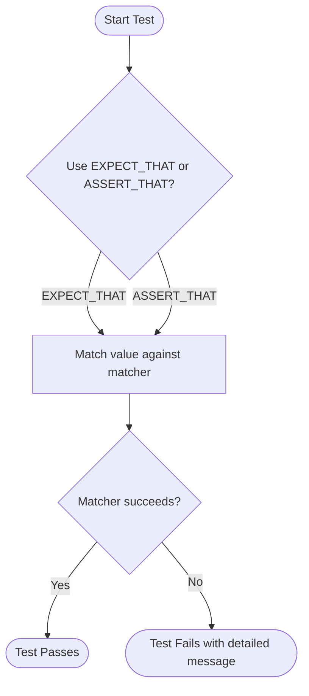

# Core Matchers Reference

GoogleTest provides a rich set of built-in matchers that empower you to write clear, expressive, and intent-revealing assertions in your C++ tests. This reference catalogs these matchers, explaining their purposes, usage, and how they integrate with GoogleTest’s assertion macros.

---

## 1. Introduction to Matchers

Matchers in GoogleTest serve as predicates that verify whether a value satisfies certain conditions. They are first-class citizens in the testing framework, enabling you to validate complex criteria beyond simple equality.

### 1.1. Polymorphic Matcher Design

Matchers are polymorphic by design — a single matcher can adapt to different types depending on the context. The compiler infers the type a matcher applies to at the point of use, allowing the same matcher to work seamlessly for compatible types.

### 1.2. Using Matchers

Matchers are used primarily with the `EXPECT_THAT()` and `ASSERT_THAT()` macros:

```cpp
EXPECT_THAT(value, matcher);
ASSERT_THAT(value, matcher);
```

This yields readable assertions such as:

```cpp
EXPECT_THAT(name, StartsWith("John"));
EXPECT_THAT(numbers, Contains(42));
```

### 1.3. Extending Matchers

GoogleTest allows defining custom matchers to suit your specific verification needs (see [Writing New Matchers Quickly](../gmock_cook_book.md#NewMatchers)). Additionally, you can compose matchers to build complex conditions.

---

## 2. General Comparison Matchers

These matchers cover equality and relational checks with natural, readable syntax.

| Matcher      | Description                                                                   | Example                                               |
|--------------|-------------------------------------------------------------------------------|-------------------------------------------------------|
| `Eq()`       | Matches if the argument is equal to the given value.                         | `EXPECT_THAT(x, Eq(42));`                             |
| `Ne()`       | Matches if the argument is not equal to the given value.                     | `EXPECT_THAT(x, Ne(0));`                              |
| `Lt()`       | Matches if the argument is less than the given value.                        | `EXPECT_THAT(x, Lt(100));`                            |
| `Le()`       | Matches if the argument is less than or equal to the given value.            | `EXPECT_THAT(x, Le(10));`                             |
| `Gt()`       | Matches if the argument is greater than the given value.                     | `EXPECT_THAT(x, Gt(5));`                              |
| `Ge()`       | Matches if the argument is greater than or equal to the given value.         | `EXPECT_THAT(x, Ge(0));`                              |

### 2.1. Approximate Floating-Point Equality

GoogleTest provides matchers for approximate floating-point comparisons with control over tolerance.

- `FloatEq()` and `DoubleEq()` for ULP-based approximate equality
- `FloatNear()` and `DoubleNear()` for absolute error based comparison

Example:

```cpp
EXPECT_THAT(pi, DoubleNear(3.14159, 0.0001));
```

### 2.2. Special Matchers

- `_` (underscore): matches anything
- `IsNull()`: matches `nullptr` for raw or smart pointers
- `NotNull()`: matches non-null pointers
- `IsNan()`: matches NaN floating values

Example:

```cpp
EXPECT_THAT(ptr, NotNull());
EXPECT_THAT(value, _);
```

---

## 3. Container Matchers

Matchers specially designed for STL-like containers and native arrays to validate contents and structure.

| Matcher                | Description                                                      | Example                                                       |
|------------------------|------------------------------------------------------------------|---------------------------------------------------------------|
| `ElementsAre(...)`       | Matches a container with elements matching the sequence of given matchers, in order | `EXPECT_THAT(v, ElementsAre(1, 2, 3));`                      |
| `UnorderedElementsAre(...)` | Matches a container with elements that match the given matchers in any order        | `EXPECT_THAT(set, UnorderedElementsAre(2, 1, 3));`           |
| `Contains(m)`           | Matches a container containing an element matching `m`                 | `EXPECT_THAT(vec, Contains(Gt(10)));`                        |
| `Each(m)`               | Matches containers where every element matches `m`                      | `EXPECT_THAT(vec, Each(Le(100)));`                           |
| `SizeIs(m)`             | Matches containers with a size satisfying matcher `m`                  | `EXPECT_THAT(vec, SizeIs(Ge(5)));`                           |
| `WhenSorted(m)`          | Matches if the container, when sorted, matches matcher `m`             | `EXPECT_THAT(vec, WhenSorted(ElementsAre(1, 2, 3, 4)));`      |
| `Pointwise(matcher, container)` | Matches containers whose elements individually match paired matchers     | `EXPECT_THAT(vec, Pointwise(Eq(), std::vector<int>{1,2,3}));` |

### 3.1. Using Container Matchers

They can be used naturally with `EXPECT_THAT`:

```cpp
std::vector<int> v = {10, 20, 30};
EXPECT_THAT(v, ElementsAre(10, 20, 30));
EXPECT_THAT(v, Contains(Gt(15)));
EXPECT_THAT(v, Each(Lt(100)));
```

### 3.2. Mix Matchers

You can combine matchers for expressive assertions such as:

```cpp
EXPECT_THAT(map, Contains(Pair(Eq("key"), Ge(5))));
```

---

## 4. Composite Matchers

Composite matchers combine other matchers logically for advanced assertions.

| Matcher            | Description                                           | Example                                                      |
|--------------------|-------------------------------------------------------|--------------------------------------------------------------|
| `AllOf(...)`       | Matches if all of the given matchers match             | `EXPECT_THAT(x, AllOf(Gt(0), Lt(10)));`                      |
| `AnyOf(...)`       | Matches if any of the given matchers match             | `EXPECT_THAT(x, AnyOf(Eq(0), Eq(10)));`                      |
| `Not(m)`           | Matches if the inner matcher does not match            | `EXPECT_THAT(x, Not(Eq(5)));`                                |
| `Conditional(cond, m1, m2)` | Matches `m1` if `cond` is true, otherwise `m2`        | `EXPECT_THAT(x, Conditional(flag, Eq(1), Eq(0)));`           |

### 4.1. Tuple Matchers

Matchers that decompose composite types like tuples and pairs:

- `Field(&Class::member, matcher)` matches an object whose member matches given matcher
- `Property(&Class::method, matcher)` matches an object whose method return value matches given matcher
- `Pair(matcher1, matcher2)` matches a `std::pair` whose elements match the given matchers
- `Key(matcher)` matches a pair whose first element matches matcher

Example:

```cpp
EXPECT_THAT(my_obj, Field(&MyClass::value, Ge(10)));
EXPECT_THAT(my_map, Contains(Key(Eq("key"))));
EXPECT_THAT(my_pair, Pair(Eq(1), Eq(2)));
```

---

## 5. Using Matchers with Assertions

- Use `EXPECT_THAT(value, matcher);` or `ASSERT_THAT(value, matcher);` to assert that `value` satisfies the matcher.
- Failure messages from matchers provide detailed explanations to aid diagnosis.
- Matchers can be saved into variables and reused:

```cpp
auto positive = Gt(0);
EXPECT_THAT(x, positive);
EXPECT_THAT(y, positive);
```

---

## 6. Writing Custom Matchers

When built-in matchers don't suffice, define your own matcher using `MATCHER()` or by implementing the matcher interface. For fast creation, use the `MATCHER` macros, for example:

```cpp
MATCHER(IsEven, "") {
  return (arg % 2) == 0;
}

EXPECT_THAT(value, IsEven());
```

For parameterized custom matchers, use `MATCHER_P()`, `MATCHER_P2()`, etc.

See the [gMock Cookbook](../gmock_cook_book.md#NewMatchers) for detailed guidance.

---

## 7. Practical Tips

- Use `_` when you want to match any argument value for a particular parameter.
- To match containers' elements flexibly, mix `ElementsAre`, `UnorderedElementsAre`, `Contains`, and `Each` as needed.
- Combine matchers like `AllOf` to specify multiple constraints on a single value.
- Use `Not()` carefully to express negations.
- Leverage `Field` and `Property` to assert on complex nested objects.

---

## 8. Troubleshooting Common Matcher Issues

- **Ambiguous matcher resolutions:** When mocking overloaded methods, explicitly cast or use type-constrained matchers to clarify intent.
- **Commas in types:** Surround return or parameter types with extra parentheses in `MOCK_METHOD` macros when types contain commas.
- **Matcher purity:** Your custom matchers must be pure, without side effects, because gMock may call them multiple times or out of sequence.
- **Uninteresting calls warnings:** If you see warnings about uninteresting calls, consider using `NiceMock` or defining more explicit `EXPECT_CALL`s.

---

## 9. Summary

This catalog provides a complete set of tools to define precise, robust test conditions. Combining GoogleTest's rich matcher library with your custom matchers will help you write tests that document intent clearly and fail with helpful diagnostics.

---

## 10. Additional Resources

- [Matchers Reference](reference/matchers.md) for built-in and custom matcher details
- [gMock Cookbook](gmock_cook_book.md#NewMatchers) for recipes on writing new matchers
- [Using Assertions Effectively](guides/core-workflows/using-assertions.md) for applying matchers in tests
- [GoogleTest Primer](docs/primer.md) for an introduction to testing and assertions

---

## Mermaid Diagram: Matcher Usage Flow


