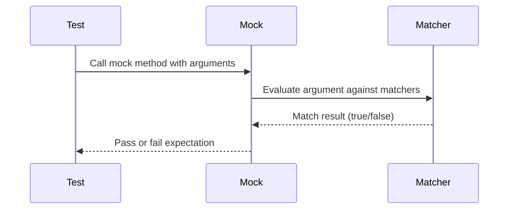

# Argument Matchers

This documentation provides a comprehensive reference to the built-in argument matchers available in GoogleMock (gMock). Argument matchers allow you to specify, with precision and flexibility, the expected values or properties of the arguments passed to mock methods. Matchers enable robust, flexible tests that can verify method call parameters without requiring exact matches, thus supporting resilient and expressive test cases.

---

## What Are Argument Matchers?

Argument matchers describe the criteria that mock method arguments should meet when these methods are called during tests. Instead of strictly requiring exact values, matchers can express properties, ranges, or complex predicates about the argument values. This flexibility reduces brittleness in tests and improves their readability and intent.

Using matchers, you can specify expectations such as:

- The argument equals a specific value.
- The argument falls within a numeric range.
- The argument is non-null.
- A complex property or predicate holds on the argument.

Matchers are used inside `EXPECT_CALL` or `ON_CALL` macros to define expectations or behaviors for mock methods.


## Using Built-in Matchers

GoogleMock provides many built-in matchers for common scenarios. Below are key categories and examples.

### Wildcard Matcher: `_`
Matches any argument of any type.

```cpp
EXPECT_CALL(mock_object, Foo(_));  // Matches any argument.
```

### Equality Matchers
- `Eq(value)` — Matches if argument equals `value` using `operator==`.
- You can also use a literal value directly (e.g., `100` is equivalent to `Eq(100)`).

```cpp
EXPECT_CALL(turtle, Forward(100));  // Matches Forward called with 100.
EXPECT_CALL(turtle, Forward(Eq(100)));
```

### Relational Matchers
Matchers for numeric comparisons:
- `Lt(value)` — less than
- `Le(value)` — less or equal
- `Gt(value)` — greater than
- `Ge(value)` — greater or equal
- `Ne(value)` — not equal

Example:

```cpp
EXPECT_CALL(turtle, Forward(Ge(100)));  // Forward called with argument >= 100.
```

### Logical Matcher Combinators
Compose multiple matchers for more complex conditions:

- `AllOf(m1, m2, ...)` — matches if all component matchers match.
- `AnyOf(m1, m2, ...)` — matches if any one component matcher matches.
- `Not(m)` — matches if the matcher does not match.

Example:

```cpp
EXPECT_CALL(foo, Bar(AllOf(Gt(5), Ne(10))));
```

### Matches Anything Predicate: `IsNull()` and `NotNull()`
- `IsNull()` — matches a `nullptr` pointer.
- `NotNull()` — matches any non-null pointer.

Example:

```cpp
EXPECT_CALL(foo, SetPointer(NotNull()));
```

### String Matchers
For string arguments, these matchers are polymorphic and support raw strings, `std::string`, and compatible string types.

- `StrEq("text")` — exact string equality.
- `StrNe("text")` — not equal.
- `StrCaseEq("text")` — case-insensitive equality.
- `StrCaseNe("text")` — case-insensitive inequality.
- `StartsWith("prefix")` — string starts with the given prefix.
- `EndsWith("suffix")` — string ends with the given suffix.
- `HasSubstr("substring")` — string contains the substring.

Example:

```cpp
EXPECT_CALL(mock, Print(StartsWith("Error")));
```

### Container Matchers
Matchers to validate STL containers and sequences.

- `ElementsAre(e1, e2, ...)` — matches elements of a container in order.
- `UnorderedElementsAre(e1, e2, ...)` — matches elements ignoring order.
- `Contains(matcher)` — expects at least one element matching `matcher`.
- `Each(matcher)` — all elements match `matcher`.
- `SizeIs(matcher)` — container size matches `matcher` or a specific number.
- `Pointwise(tuple_matcher, rhs_container)` — matches elements pairwise.

Example:

```cpp
EXPECT_CALL(mock, ProcessVector(ElementsAre(1, Ge(5), _)));
EXPECT_THAT(my_vector, Contains(Gt(10)));
```

### Pointer and Reference Matchers
- `Pointee(matcher)` — matches a pointer whose pointed-to value matches.

Example:

```cpp
EXPECT_CALL(mock, Foo(Pointee(Eq(42))));
```

- `Ref(variable)` — matches an argument that is a reference to the specified variable.

Example:

```cpp
EXPECT_CALL(mock, Foo(Ref(my_var)));
```

### Member Access Matchers
Useful to match specific members or properties of complex objects.

- `Field(&Class::member, matcher)` — matches the given member variable.
- `Property(&Class::getter_method, matcher)` — matches the return value of a property getter.

Example:

```cpp
EXPECT_CALL(mock, Foo(Field(&MyStruct::count, Ge(5))));
EXPECT_CALL(mock, Foo(Property(&MyClass::GetName, StartsWith("John"))));
```


## Writing Expectations with Matchers

Matchers are used in `EXPECT_CALL` and `ON_CALL` to specify which calls the mock method should accept or behave on. For example:

```cpp
using ::testing::_;  // Wildcard matcher
using ::testing::Gt; // Greater than matcher
using ::testing::StartsWith;

EXPECT_CALL(turtle, Forward(Gt(0)))  // Forward with positive argument
    .Times(AtLeast(1));
EXPECT_CALL(printer, Print(StartsWith("Error")));
EXPECT_CALL(database, Query(_, Eq(true))); // First argument anything, second true
```

You can also omit the parameter list for methods without overloads to indicate "any arguments":

```cpp
EXPECT_CALL(logger, Log);  // Log must be called with any arguments
```

## Defining Custom Matchers

In addition to built-in matchers, gMock allows the creation of custom matchers for specialized conditions.

### Simple Custom Matcher
Using the `MATCHER` macro, you can define a simple predicate matcher:

```cpp
MATCHER(IsEven, "") {
  return (arg % 2) == 0;
}

EXPECT_CALL(mock, Bar(IsEven()));
```

You can enhance custom matchers by providing detailed failure messages and descriptive text.

### Parameterized Matchers
Use `MATCHER_P`, `MATCHER_P2`, ..., `MATCHER_P10` to define matchers with parameters.

Example:

```cpp
MATCHER_P(IsDivisibleBy, divisor, "") {
  return (arg % divisor) == 0;
}

EXPECT_CALL(foo, Bar(IsDivisibleBy(3)));
```

### Advanced Matcher Implementation
You can also implement matcher interfaces directly for full control, including polymorphic matchers that work for various argument types.

Refer to the [gMock Cookbook](https://google.github.io/googletest/gmock_cook_book.html#WritingNewMatchers) for detailed recipes.

## Best Practices for Matchers

- Use the least strict matcher that expresses the intent to keep tests maintainable.
- Combine matchers with `AllOf`, `AnyOf`, and `Not` to express complex expectations.
- When matching complex objects, prefer `Field` and `Property` to focus on relevant parts.
- Avoid matchers with side effects; must be pure functions.

## Troubleshooting Matchers

- If your matcher doesn't seem to match as expected, increase verbosity using `--gmock_verbose=info` to trace matcher evaluations.
- When matching pointers or references, ensure the matcher and argument types are compatible.
- For overloaded methods, use type disambiguation techniques (see [SelectOverload](https://google.github.io/googletest/gmock_cook_book.html#SelectOverload)).


## Summary

Argument matchers are essential tools in gMock that enable flexible, expressive test expectations on mock method arguments. They range from simple wildcards and equality checks to complex combinatorial, container, pointer, and custom matchers.

By mastering argument matchers, you elevate your tests to be both robust and readable.

---

## See Also

- [Using Matchers for Flexible Verification](../guides/core-testing-workflows/using-matchers.md)
- [gMock Cookbook Matchers Section](https://google.github.io/googletest/gmock_cook_book.html#UsingMatchers)
- [Matchers Reference](./matchers.md)
- [Mocking Basics](../guides/core-testing-workflows/mocking-basics.md)
- [Mock Object Definition](../api-reference/mocking-api/mock-object-definition.md)
- [Expectations and Cardinalities](../api-reference/mocking-api/expectations-cardinalities.md)

---

## Reference Links

- [`EXPECT_CALL()`](../api-reference/mocking-api/expectations-cardinalities.md#EXPECT_CALL) – How to set expectations with matchers
- [`ON_CALL()`](../api-reference/mocking-api/expectations-cardinalities.md#ON_CALL) – Setting default actions with matchers
- [`MATCHER()`, `MATCHER_P()`](https://google.github.io/googletest/gmock_cook_book.html#WritingNewMatchers) – Defining custom matchers

---

## Code Example

```cpp
#include <gmock/gmock.h>
using ::testing::_;
using ::testing::Gt;
using ::testing::StartsWith;
using ::testing::Field;

class MockTurtle {
 public:
  MOCK_METHOD(void, Forward, (int distance), ());
  MOCK_METHOD(void, GoTo, (int x, int y), ());
  MOCK_METHOD(void, Draw, (const std::string& shape), ());
  struct Point {
    int x;
    int y;
  };

  MOCK_METHOD(void, MoveToPoint, (const Point& p), ());
};

MATCHER_P(IsAt, expected_position, "checks if the position matches") {
  return arg.x == expected_position.x && arg.y == expected_position.y;
}

// Usage in test:
TEST(PaintTest, UsesForwardWithLargeDistance) {
  MockTurtle turtle;

  EXPECT_CALL(turtle, Forward(Gt(50)));  // Forward must be called with > 50
  EXPECT_CALL(turtle, Draw(StartsWith("Circle")));

  MockTurtle::Point origin = {0, 0};
  EXPECT_CALL(turtle, MoveToPoint(IsAt(origin)));

  // ... code exercising turtle ...
}
```

---

{/* 
Mermaid diagram illustrating matcher flow (simple depiction):


*/}