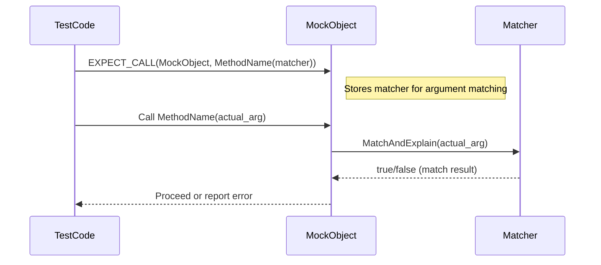

# Built-in Matchers Overview

This page catalogs the built-in argument and value matchers provided by GoogleMock, supporting a wide array of use cases such as equality checking, containment, predicates, and custom conditions. These matchers form the foundation for expressing precise expectations on function arguments in mock objects, enabling expressive and maintainable tests.

---

## Introduction to Matchers

Matchers allow you to specify constraints on the arguments passed to mock methods or verify values in assertions. GoogleMock comes with a rich set of matchers ranging from simple equality to complex compositions and container matchers. Use these directly with `EXPECT_CALL` to define expectations or with `EXPECT_THAT` and related assertions to verify values.

All matchers are objects that can be used in place of argument specifications wherever gMock expects matchers. Many are polymorphic, meaning they can adapt to the type of the argument being matched.

---

## Basic Matchers

### Wildcard Matcher `_`

- Matches any argument of any type.

```cpp
EXPECT_CALL(mock_obj, MethodName(_));
```

### Equality Matchers

- `Eq(value)` / `Ne(value)`: Check for equality/inequality.
- `TypedEq<T>(value)`: Equality with explicit type to resolve overloads.

You can also simply pass a value instead of `Eq(value)` where a matcher is expected.

```cpp
EXPECT_CALL(mock_obj, Foo(Eq(5)));  // value equal to 5
EXPECT_CALL(mock_obj, Foo(5));      // shorthand, same effect
EXPECT_CALL(mock_obj, Foo(Not(5))); // value not equal to 5
```

### Relational Matchers

- `Lt(value)`, `Le(value)`, `Gt(value)`, `Ge(value)`: Less than, less or equal, greater than, greater or equal comparisons.

```cpp
EXPECT_CALL(mock_obj, SetLevel(Gt(0)));  // argument > 0
```

### String Matchers

- `StrEq(string)`: Equal strings
- `StrNe(string)`: Not equal strings
- `StrCaseEq(string)`: Equal strings ignoring case
- `StrCaseNe(string)`: Not equal strings ignoring case
- `HasSubstr(substring)`: Contains substring
- `StartsWith(prefix)`: String starts with prefix
- `EndsWith(suffix)`: String ends with suffix

```cpp
EXPECT_CALL(mock_obj, Print(StrEq("hello")));
EXPECT_THAT(name, StartsWith("Mr."));
```

### Null Pointer Matchers

- `IsNull()`: Matches null pointer (raw or smart).
- `NotNull()`: Matches non-null pointer.

```cpp
EXPECT_CALL(mock_obj, Foo(IsNull()));
EXPECT_CALL(mock_obj, Foo(NotNull()));
```

---

## Composite Matchers

### Logical Combinators

- `AllOf(m1, m2, ...)`: Matches if all sub-matchers match.
- `AnyOf(m1, m2, ...)`: Matches if any sub-matcher matches.
- `Not(m)`: Matches if `m` does not match.

```cpp
EXPECT_CALL(mock_obj, Compute(AllOf(Gt(5), Ne(10))));
```

### Tuple and Args Matchers

- `Args<k1, ..., kn>(matcher)`: Matches selected argument positions as a tuple.
- `AllArgs(matcher)`: Matches all arguments as a single tuple (alias).

Helps when you want to match on relationships between several arguments.

```cpp
EXPECT_CALL(mock_obj, Foo(_, _)).With(Args<0,1>(Lt()));  // first < second
```

### Container Matchers

Matchers for STL-like containers and arrays.

- `ElementsAre(e1, e2, ...)`: Matches container with elements exactly matching the given matchers in order.
- `UnorderedElementsAre(e1, e2, ...)`: Matches container with elements exactly matching the given elements in any order.
- `ElementsAreArray(container_or_array)`: Like `ElementsAre` but takes another container or array.
- `UnorderedElementsAreArray(container_or_array)`: Like `UnorderedElementsAre` but for arrays or containers.
- `Contains(matcher)`: Container contains at least one element that matches.
- `Each(matcher)`: All elements match.
- `IsEmpty()`: Matches empty container.
- `SizeIs(matcher)`: Container size matches matcher's condition.
- `BeginEndDistanceIs(matcher)`: Distance between iterators matches matcher.

```cpp
EXPECT_THAT(vec, ElementsAre(1, Gt(0), _, 5));
EXPECT_THAT(vec, UnorderedElementsAre(5, 3, 1));
EXPECT_THAT(map, Contains(Pair(Eq("foo"), Gt(5))));
```

### Pair and Key Matchers

- `Pair(first_matcher, second_matcher)`: Matches a pair whose first and second elements match.
- `Key(matcher)`: Matches a pair whose key (first) field matches.

Useful for associative containers like `std::map`.

```cpp
EXPECT_THAT(map, Contains(Pair(Eq("alpha"), Ge(10))));
EXPECT_THAT(multimap, Contains(Key(Ge(5))));
```

### Optional and Variant Matchers

- `Optional(matcher)`: Matches an optional type with value matching matcher.
- `VariantWith<T>(matcher)`: Matches a `std::variant` if the held alternative is type `T` and matches the matcher.
- `AnyWith<T>(matcher)`: Matches an `absl::any` or `std::any` with value of type `T` that matches matcher.

### Pointer-Based Matchers

- `Pointee(matcher)`: Matches a pointer (raw or smart) pointing to a value that matches.
- `Pointer(matcher)`: Matches pointer itself with another matcher.
- `Address(matcher)`: Matches an object whose address matches matcher.

```cpp
EXPECT_CALL(mock_obj, SetPtr(Pointee(Ge(5))));
EXPECT_THAT(ptr, Pointer(IsNull()));
```

### Matcher Compositions for 2-Tuples

Matchers like `Eq()`, `Ne()`, `Lt()`, `Le()`, `Gt()`, `Ge()` when used with 2-tuples check relational operators on the tuple fields.

```cpp
EXPECT_THAT(std::make_tuple(5, 10), Lt());  // checks 5 < 10
```

### Conditional Matcher

- `Conditional(condition, m1, m2)`: Chooses matcher based on condition.

```cpp
EXPECT_THAT(val, Conditional(flag, Eq(5), Eq(10)));
```

---

## Parameterized Matchers

GoogleMock supports defining parameterized matchers (`MATCHER_P`, `MATCHER_P2`, etc.) allowing matcher behavior and descriptions to depend on parameters.

Example: 

```cpp
MATCHER_P(IsDivisibleBy, divisor, "") {
  return (arg % divisor) == 0;
}

EXPECT_CALL(mock_obj, Func(IsDivisibleBy(7)));
```

Parameterized matchers provide enhanced failure messages including parameter values.

---

## Custom Matchers

For specialized needs beyond built-in matchers, you can implement your own matcher classes or use the `MATCHER*` macros. This page does not cover custom matcher implementation in detail but references the [Custom Matchers and Actions](custom-matchers-actions.md) page for thorough guidance.

---

## Usage Tips

- Favor using matchers over raw values for expressive and resilient expectations.
- Use the wildcard matcher `_` when argument values are not important.
- Combine matchers using `AllOf`, `AnyOf`, `Not` for complex logic.
- Use container matchers to verify STL container contents smartly.
- Use `Pointee()` when verifying pointer arguments based on pointee value.
- Leverage parameterized matchers for reusable, parameter-dependent match expressions.
- When matching multiple arguments as a group, use `With()` clause or `Args<>` matcher.

---

## Example: Matching Complex Arguments

Match a mock method expecting a struct with specific field values:

```cpp
struct Foo { int a; std::string s; };
EXPECT_CALL(mock_obj, Bar(Field(&Foo::a, Eq(5))));

// For tuples:
EXPECT_CALL(mock_obj, Baz(FieldsAre(Gt(0), HasSubstr("foo"))));
```

Match a container containing certain values in any order:

```cpp
EXPECT_CALL(mock_obj, Process(Contains(42).Times(2)));
EXPECT_CALL(mock_obj, Process(UnorderedElementsAre(1, 2, 3)));
```

---

## Troubleshooting Common Pitfalls

- Always ensure that type mismatches in matchers and arguments are resolved via `SafeMatcherCast<T>()` when needed.
- When matching pointers, take null pointers into account to avoid unintended crashes.
- Avoid overspecification by only matching arguments you care about.
- Remember that matchers must be pure functions without side effects.
- Use parameterized matchers to improve diagnostics and reusability.

---

## Related Topics and Further Reading

- See [Matchers Reference](matchers.md) for the complete list and detailed descriptions of built-in matchers.
- For writing custom matchers, refer to [Custom Matchers and Actions](custom-matchers-actions.md).
- For practical usage patterns with EXPECT_CALL and ON_CALL, see [Setting Expectations](setting-expectations.md) and the [gMock Cookbook](gmock_cook_book.md).
- For assertions that integrate matchers, see [Assertions Reference](assertions.md).

---

## Diagram: Using Matchers in Mock Expectations



---